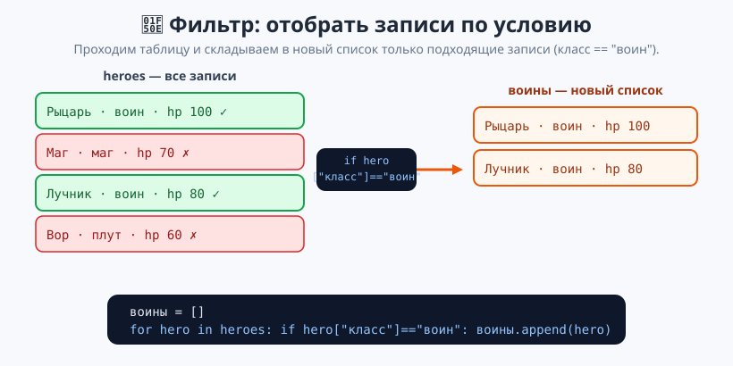
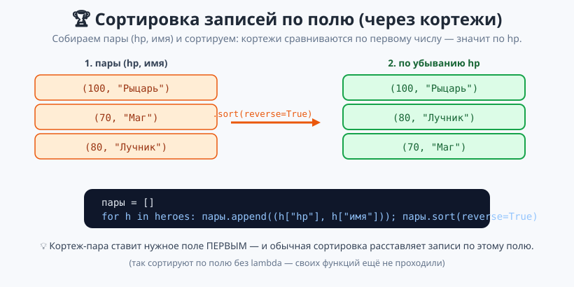

# Урок 7 — 🏆 «Мини-база данных персонажей»: список словарей 🗃️

**Модуль 4 · Коллекции · Урок 7 из 7 (финал модуля) | 2 ак.ч. (1,5 часа)**

> ⬅️ Предыдущий: [Урок 6 «Множества»](../урок-06-множества/урок.md) · [Все уроки модуля](../README.md) · [План курса](../../ПЛАН-КУРСА.md) · Следующий: Модуль 5 «Функции» ➡️

> 🔁 В начале — [разминка/повтор](повторение.md) (5 мин).
> 📌 Быстро вспомнить материал урока — [итого.md](итого.md) (шпаргалка).
> 👨‍🏫 Сценарий с хронометражом — в [преподавателю.md](преподавателю.md).
> 🖼 Что показать на проекторе — в [изображения.md](изображения.md).
> 🆘 **Пропустил урок или хочешь закрепить?** Открой [самоучитель.md](самоучитель.md) — теория + задания с подсказками.
> 🧰 Трюки и частые ошибки — в [лайфхак.md](лайфхак.md).

> 🧭 **Как читать урок.** Это **финал модуля «Коллекции»** — сегодня всё сходится вместе. Раньше данные о героях пришлось бы хранить в отдельных списках: `имена = [...]`, `hp = [...]`, `классы = [...]` — и следить, чтобы индексы совпадали. Неудобно и легко ошибиться. Правильнее: **каждый герой — это словарь-запись** (`{"имя": "Маг", "hp": 70}`), а вся таблица — **список таких словарей**. Так устроены настоящие базы данных. Соберём мини-базу персонажей: показать, найти, отфильтровать, отсортировать.

---

## 🎮 Что мы сделаем сегодня и что получим

**Задача:** хранить данные как таблицу (список словарей) и работать с ней: перебор, поиск, фильтр, итоги, сортировка по полю — в виде мини-базы персонажей.

**В итоге получится** `база_данных.py` (меню-приложение):

```
=== БАЗА ГЕРОЕВ ===
  1. Рыцарь (воин) — hp 100, ур. 5
  2. Маг (маг) — hp 70, ур. 7
Найден: {'имя': 'Маг', 'класс': 'маг', 'hp': 70, 'уровень': 7}
Больше всех hp: Рыцарь (100)
```

**Главные навыки урока:** таблица = **список словарей** · доступ `heroes[i]["поле"]` · перебор записей · поиск по полю · фильтр в новый список · итоги (сумма/среднее/чемпион) · сортировка по полю через кортежи.

> 💡 **Главная мысль урока:** **таблица данных — это список словарей.** Строку выбираем по номеру (`[i]` — список), поле в строке — по ключу (`["поле"]` — словарь).

---

## Часть 0 — Разминка: параллельные списки неудобны (5 минут)

Хранить героев тремя отдельными списками — рискованно:

```python
имена = ["Рыцарь", "Маг", "Лучник"]
hp    = [100, 70, 80]
классы = ["воин", "маг", "воин"]
# hp Мага — это hp[1]... надо помнить, что Маг под индексом 1 во ВСЕХ списках
```

Стоит вставить одного героя не туда — и данные «разъедутся». Хочется, чтобы **вся информация об одном герое лежала вместе**. Для этого — словарь-запись.

---

## Часть 1 — Запись = словарь, таблица = список словарей (16 минут)

Один герой — **словарь** со всеми его полями. Все герои — **список** таких словарей:

```python
heroes = [
    {"имя": "Рыцарь", "класс": "воин", "hp": 100, "уровень": 5},
    {"имя": "Маг",    "класс": "маг",  "hp": 70,  "уровень": 7},
    {"имя": "Лучник", "класс": "воин", "hp": 80,  "уровень": 4},
]
```

**Достаём поле в два шага:** сначала строку по номеру, потом поле по ключу.

```python
print(heroes[1])            # весь Маг: {'имя': 'Маг', ...}
print(heroes[1]["имя"])     # Маг     — [1] это список, ["имя"] это словарь
print(heroes[1]["hp"])      # 70
print(len(heroes))          # 3 — сколько записей
```

![Схема: таблица как список словарей, доступ heroes[1]["hp"]](изображения/таблица-список-словарей.svg)

> 💡 **Два шага доступа: `[номер]` потом `[ключ]`.** `heroes[1]` — выбрали строку (это работа списка). `["hp"]` — выбрали поле (это работа словаря). Список словарей объединяет оба инструмента.

**Перебор таблицы** — на каждом шаге `hero` это словарь-запись:

```python
for hero in heroes:
    print(f"{hero['имя']} ({hero['класс']}) — hp {hero['hp']}")
```

**Добавить, изменить, удалить запись:**
```python
heroes.append({"имя": "Вор", "класс": "плут", "hp": 60, "уровень": 6})  # добавить строку
heroes[0]["hp"] = heroes[0]["hp"] - 30    # изменить поле (Рыцарь получил урон)
heroes.pop(2)                              # удалить строку по номеру
```

> ✍️ **Мини-задание 1 (3 мин):** заведи список из двух книг-словарей с полями `"название"` и `"год"`. Выведи название второй книги и общее число книг. Добавь третью книгу.
> <details><summary>💡 подсказка</summary><code>books[1]["название"]</code>, <code>len(books)</code>, <code>books.append({...})</code>.</details>

---

## Часть 2 — Поиск и фильтр (16 минут)

**Поиск записи по полю** — идём по списку и сравниваем нужное поле:

```python
искомое = "Маг"
найден = None
for hero in heroes:
    if hero["имя"] == искомое:
        найден = hero
if найден is not None:
    print("Нашли:", найден["имя"], "- hp", найден["hp"])
else:
    print("Такого нет")
```

- 👀 Заводим `найден = None`, в цикле присваиваем запись, если поле совпало. В конце проверяем: нашли или нет.

**Фильтр** — собрать в НОВЫЙ список все записи, подходящие под условие:

```python
воины = []
for hero in heroes:
    if hero["класс"] == "воин":
        воины.append(hero)
print("Воинов:", len(воины))
```



> 💡 **Фильтр записей — та же схема, что фильтр чисел (Урок 2):** пустой список → перебор → условие по полю → `append`. Только теперь элементы — целые записи-словари.

> ✍️ **Мини-задание 2 (3 мин):** для списка героев собери в новый список всех, у кого `hp >= 80`, и выведи их имена.
> <details><summary>💡 подсказка</summary><code>if hero["hp"] >= 80: сильные.append(hero)</code>.</details>

---

## Часть 3 — Итоги и сортировка по полю (14 минут)

**Итоги по числовому полю** — сумма и среднее (как в Уроке 2, но берём поле):

```python
сумма = 0
for hero in heroes:
    сумма += hero["hp"]
print("Всего hp:", сумма, "| Среднее:", round(сумма / len(heroes), 1))
```

**Чемпион** — запись с наибольшим полем (перебор с запоминанием рекордсмена):

```python
чемпион = heroes[0]
for hero in heroes:
    if hero["hp"] > чемпион["hp"]:
        чемпион = hero
print("Больше всех hp:", чемпион["имя"])
```

**Сортировка по полю — через кортежи (без своих функций).** Собираем пары `(поле, имя)` и сортируем: кортежи сравниваются по первому элементу, значит — по нужному полю (кортежи из Урока 4!):

```python
пары = []
for hero in heroes:
    пары.append((hero["hp"], hero["имя"]))
пары.sort(reverse=True)          # по убыванию hp
for hp, имя in пары:
    print(f"{имя}: {hp}")
```



- 👀 Кортеж-пара ставит нужное поле **первым**, и обычная сортировка выстраивает записи по этому полю. Так сортируют по полю, пока не прошли свои функции (`def` — Модуль 5).

> ✍️ **Мини-задание 3 (3 мин):** построй рейтинг героев по уровню: собери пары `(уровень, имя)`, отсортируй по убыванию и выведи.
> <details><summary>💡 подсказка</summary><code>пары.append((hero["уровень"], hero["имя"]))</code>, затем <code>.sort(reverse=True)</code>.</details>

---

## Часть 4 — 🏆 Проект «Мини-база данных» (14 минут)

Соберём всё в приложение с меню [`материалы/база_данных.py`](материалы/база_данных.py): показать всех, найти по имени, фильтр по классу, добавить героя, чемпион по hp.

```python
while True:
    choice = input("[1] все [2] найти [3] фильтр [4] добавить [5] чемпион [6] выход: ")
    if choice == "1":
        for i, hero in enumerate(heroes, start=1):
            print(f"{i}. {hero['имя']} — hp {hero['hp']}")
    elif choice == "6":
        break
    # ...остальные команды — поиск, фильтр, добавление, чемпион
```

- 👀 Это тот же «движок меню», что в приложении «Список дел» (Урок 1), но данные — таблица записей. Внутри команд работают приёмы Частей 2–3.

Полный разбор — в [`материалы/персонажи_демо.py`](материалы/персонажи_демо.py) и [`материалы/поиск_фильтр.py`](материалы/поиск_фильтр.py).

> 🧩 **Для 5–7 классов:** создать таблицу, показать всех, найти по имени, фильтр. 🎓 **Глубже:** чемпион, среднее, сортировка по полю через кортежи, меню-приложение.

> ✍️ **Мини-задание 4 (3 мин):** добавь в таблицу нового героя через `append` словаря, затем выведи всех героев класса `"маг"`.
> <details><summary>💡 подсказка</summary><code>heroes.append({...})</code>; фильтр <code>if hero["класс"]=="маг"</code>.</details>

---

## 🐞 Разбор частых ошибок

| Симптом | Что случилось | Как починить |
|---------|---------------|--------------|
| `heroes["имя"]` → TypeError | обратился к списку по ключу | сначала строка `heroes[0]`, потом поле `["имя"]` |
| `KeyError: 'HP'` | поле с другим регистром/опечаткой | ключ пишется точно как задан (`"hp"`) |
| поиск ничего не нашёл | сравнил с не тем регистром | `"маг"` ≠ `"Маг"` |
| `найден` не проверил | использовал результат, а он `None` | проверь `if найден is not None` |
| данные «разъехались» | вёл параллельные списки | держи запись одним словарём |
| сортировка по полю не вышла | пытался `sort` список словарей | собери пары `(поле, имя)` и сортируй их |

> ⚠️ **Главное правило:** список словарей — это таблица. Строка — по номеру, поле — по ключу; поиск и фильтр — перебором с условием по полю.

---

## 🎓 Глубже

**Вложенные данные — поле может быть списком или множеством.** Например, навыки героя:
```python
hero = {"имя": "Маг", "навыки": ["огонь", "лёд"], "теги": {"маг", "атака"}}
print(hero["навыки"][0])     # огонь — список внутри словаря
hero["навыки"].append("молния")
```

**Сколько героев каждого класса — словарь-счётчик по полю** (приём из Уроков 5–6):
```python
по_классам = {}
for hero in heroes:
    к = hero["класс"]
    по_классам[к] = по_классам.get(к, 0) + 1
for класс, n in по_классам.items():
    print(класс, n)
```

Так реальные программы строят отчёты: сгруппировать записи по полю и посчитать.

---

## 🧩 Для 5–7 классов

- Таблица — это **список словарей**: `[{...}, {...}]`.
- Поле записи: `heroes[0]["имя"]` (сначала строка, потом ключ).
- Перебор: `for hero in heroes: ... hero["hp"]`.
- Поиск и фильтр — перебор с `if` по полю.
- Проект: мини-база персонажей с меню.

---

## 🏁 Итог урока и модуля (5 минут)

Финал «Коллекций» — данные как таблица:

- ✅ **Таблица = список словарей**; запись — словарь, поле — по ключу.
- ✅ Доступ `heroes[i]["поле"]`; перебор `for hero in heroes`.
- ✅ Поиск и фильтр — перебор с условием по полю; итоги — сумма/среднее/чемпион.
- ✅ Сортировка по полю — через пары-кортежи `(поле, имя)` и `sort`.
- ✅ Собрали мини-базу данных: показать, найти, отфильтровать, добавить.

> 🏆 **Модуль 4 «Коллекции» завершён!** Ты умеешь: списки (методы, срезы), кортежи, словари, множества и таблицы из словарей. Это фундамент любой программы с данными. Быстро повторить урок — в [итого.md](итого.md).

> 🎤 **Блиц:** из чего состоит таблица данных? как достать поле записи? как найти запись по имени? как отфильтровать по классу? как отсортировать по полю без своих функций?

### 🎮 Викторина-закрепление
Открой **[викторина.html](викторина.html)** — 18 вопросов + смешные и «на подумать».

➡️ **Практика урока** — **[практика.md](практика.md)**: задачи в 3 уровнях.
🆘 **Пропустил / хочешь ещё?** — [самоучитель.md](самоучитель.md) (теория + 15–20 заданий).
🧰 **Трюки и ошибки** — [лайфхак.md](лайфхак.md). 📌 **Шпаргалка** — [итого.md](итого.md).

---

## 🔗 Навигация и материалы

⬅️ **Предыдущий:** [Урок 6 «Множества»](../урок-06-множества/урок.md) · [Все уроки модуля](../README.md) · [План курса](../../ПЛАН-КУРСА.md) · **Следующий модуль:** Модуль 5 «Функции» ➡️

**🧰 Инструменты:** [Python](https://www.python.org/downloads/) · среда: [PyCharm Community](https://www.jetbrains.com/pycharm/download/) или [VS Code](https://code.visualstudio.com/).
**📄 Готовый код:** [`персонажи_демо.py`](материалы/персонажи_демо.py) · [`поиск_фильтр.py`](материалы/поиск_фильтр.py) · [`база_данных.py`](материалы/база_данных.py) (все проверены).
**⚙️ Учителю:** сценарий и частые ошибки — в [преподавателю.md](преподавателю.md).
