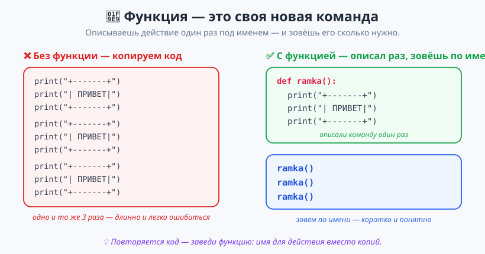
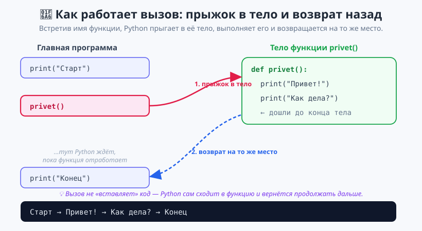
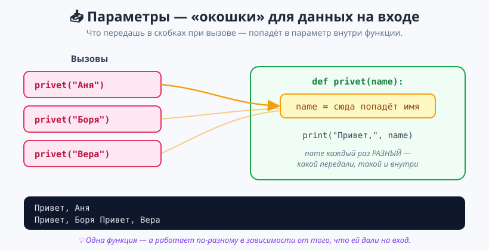

# Урок 1 — «Своя команда для черепашки»: функции `def` — придумываем своё слово в языке 🧩🐢

**Модуль 5 · Функции · Урок 1 из 5 | 2 ак.ч. (1,5 часа)**

> ⬅️ Предыдущий модуль: [Модуль 4 «Коллекции»](../../модуль-04-коллекции/README.md) · [Все уроки модуля](../README.md) · [План курса](../../ПЛАН-КУРСА.md) · Следующий: Урок 2 «`return`: Калькулятор функций» ➡️

> 🔁 В начале — [разминка/повтор](повторение.md) (5 мин).
> 📌 Быстро вспомнить материал урока — [итого.md](итого.md) (шпаргалка).
> 👨‍🏫 Сценарий с хронометражом — в [преподавателю.md](преподавателю.md).
> 🖼 Что показать на проекторе — в [изображения.md](изображения.md).
> 🆘 **Пропустил урок или хочешь закрепить?** Открой [самоучитель.md](самоучитель.md) — теория + задания с подсказками.
> 🧰 Трюки и частые ошибки — в [лайфхак.md](лайфхак.md).

> 🧭 **Как читать урок.** Весь прошлый год мы пользовались **чужими** командами: `print()`, `input()`, `len()`, `random.randint()`, `sorted()`. Кто-то когда-то их написал, дал имя — и мы просто зовём их по имени. Сегодня впервые научимся **делать свои такие команды** — они называются **функции**. Это как изобрести новое слово в языке: один раз объяснил, что оно значит, — и дальше говоришь его коротко. Сначала потренируемся на консоли (рамки, приветствия, открытки), а потом придумаем **свои команды для черепашки** и соберём из них рисунки. Про `return` (чтобы функция не просто делала, а ещё и *возвращала ответ*) — в следующем уроке; сегодня наши функции **делают действие**.

---

## 🎮 Что мы сделаем сегодня и что получим

**Задача:** научиться создавать свои функции командой `def`, вызывать их по имени и передавать им данные через параметры. А в конце — изобрести свои команды-кисти для черепашки (`hline`, `vline`, `box`) и собрать из них картинку.

**В итоге получатся** `приветствие.py`, `открытка.py` и песочница `черепашка_команды.py`:

```
+-----------+
|  ПРИВЕТ!  |
+-----------+
Между рамками
+-----------+
|  ПРИВЕТ!  |
+-----------+
```

**Главные навыки урока:** `def имя():` — **объявить** свою функцию · **тело** функции (отступ) · **вызов** `имя()` · правило «сначала объяви, потом вызывай» · **параметры** `def имя(x):` — данные на вход · несколько параметров · своя команда для черепашки.

> 💡 **Главная мысль урока:** **функция — это своё имя для куска кода.** Повторяется действие — не копируй его: опиши один раз под именем командой `def`, а потом просто зови это имя. Код становится короче, понятнее и исправляется в одном месте.

---

## Часть 1 — Зачем нужны функции: не копировать, а назвать (16 минут)

Представь: нужно три раза вывести красивую рамку с приветствием. «В лоб» — копируем код:

```python
print("+-----------+")
print("|  ПРИВЕТ!  |")
print("+-----------+")
# ... и так ещё два раза - те же три строки
```

Девять строк ради одной идеи. А если захотим поменять рамку — править придётся в трёх местах, и легко где-то ошибиться. **Повторяется код — это сигнал: пора завести функцию.**



### Команда `def` — объявляем свою функцию

```python
def ramka():
    print("+-----------+")
    print("|  ПРИВЕТ!  |")
    print("+-----------+")
```

Разберём по частям:
- **`def`** — ключевое слово от английского *define* («определить»). Говорит Python: сейчас я опишу новую команду.
- **`ramka`** — **имя** функции (придумываем сами, по-английски, как имя переменной). По нему будем её звать.
- **`()`** — скобки. Пока пустые; позже в них появятся параметры.
- **`:`** — двоеточие (как у `if` и `for`).
- **Тело функции** — строки **с отступом**. Это и есть то, что функция делает. Отступ показывает, «что внутри», — ровно как у циклов и условий.

> ⚠️ **Важно: объявить ≠ выполнить.** Когда Python видит `def ramka(): ...`, он только **запоминает** команду, но **не выполняет** её. Это как записать рецепт в книгу — блюдо ещё не приготовлено. Запустишь программу с одним только `def` — на экране будет пусто.

### Вызов — зовём команду по имени

Чтобы функция сработала, её нужно **вызвать** — написать имя со скобками:

```python
ramka()        # вот теперь рамка напечатается
```

Теперь соберём всё вместе:

```python
def ramka():
    print("+-----------+")
    print("|  ПРИВЕТ!  |")
    print("+-----------+")

print("Старт программы")
ramka()                 # вызвали - рамка напечаталась
ramka()                 # ещё раз, код не копировали
print("Между рамками")
ramka()
print("Конец программы")
```

Описали **один раз**, зовём **сколько угодно**. Захотим поменять рамку — меняем в одном месте, и обновятся все три.

> 💡 **Два разных примера — чтобы увидеть идею.** Функция годится не только для рамок. Вот функция-меню, которую удобно звать в разных местах игры:
> ```python
> def menu():
>     print("[1] Играть")
>     print("[2] Настройки")
>     print("[3] Выход")
>
> menu()                 # показали в начале
> # ... игрок поиграл ...
> menu()                 # показали снова, не переписывая три print
> ```

**✍️ Мини-задание 1.** Напиши функцию `privet()`, которая печатает две строки: `Привет!` и `Доброе утро!`. Вызови её **три раза подряд**.
<details><summary>💡 Подсказка</summary>

Объяви `def privet():`, внутри — два `print` с отступом. Потом три раза напиши `privet()` без отступа (уже вне тела).
</details>

---

## Часть 2 — Как работает вызов: прыжок в тело и возврат (16 минут)

Что именно делает Python, когда встречает `ramka()`? Он **прыгает** в тело функции, выполняет его сверху вниз, а потом **возвращается** ровно на то место, откуда прыгнул, и продолжает дальше.



```python
def privet():
    print("Привет!")
    print("Как дела?")

print("Старт")
privet()            # 1) прыгнули в тело, напечатали две строки
print("Конец")      # 2) вернулись сюда и продолжили
```

Вывод:
```
Старт
Привет!
Как дела?
Конец
```

Видишь порядок? Сначала `Старт`, потом **внутренности** функции, потом `Конец`. Вызов — это не «вставка текста», а настоящий **поход в функцию и обратно**.

### Правило: сначала объяви, потом вызывай

Python читает файл **сверху вниз**. Поэтому `def` должен стоять **выше** вызова — иначе на момент вызова Python ещё не знает такой команды:

```python
privet()            # ОШИБКА: этой команды Python пока "не видел"

def privet():
    print("Привет!")
```

```
NameError: name 'privet' is not defined
```

Лечится просто: **определение функции — вверху, вызовы — ниже.** Обычно все `def` собирают в начале файла.

> 💡 **Функция может звать другую функцию.** Главное — чтобы к моменту **вызова** обе были уже объявлены:
> ```python
> def line():
>     print("----------")
>
> def card():
>     line()                 # функция зовёт функцию!
>     print("  ГЕРОЙ  ")
>     line()
>
> card()
> ```

**✍️ Мини-задание 2.** Не запуская, предскажи, что выведет программа:
```python
def hi():
    print("1")
    print("2")

print("A")
hi()
print("B")
```
<details><summary>💡 Ответ</summary>

```
A
1
2
B
```
Сначала `A`, потом прыжок в `hi()` → `1` и `2`, потом возврат и `B`.
</details>

---

## Часть 3 — Параметры: данные на вход (20 минут)

Пока наши функции делали **всегда одно и то же**. Но настоящая сила — когда одной команде можно дать **разные данные**, и она сработает по-разному. Вспомни `print("Аня")` и `print("Боря")` — одна команда, но печатает разное, потому что мы дали ей разное **в скобках**. Сделаем так же в своей функции.

**Параметр** — это переменная в скобках после имени. При вызове в неё попадёт то, что ты передал:

```python
def privet(name):              # name - параметр (окошко для данных)
    print("Привет,", name + "!")

privet("Аня")                  # внутри name = "Аня"  -> Привет, Аня!
privet("Боря")                 # внутри name = "Боря" -> Привет, Боря!
```



То, что стоит в скобках при **вызове** (`"Аня"`), называют **аргументом**. Он «залетает» в **параметр** (`name`) и живёт внутри функции как обычная переменная.

> 💡 **Второй пример — с числом.** Параметр — не обязательно строка:
> ```python
> def kvadrat(a):
>     print(a, "в квадрате =", a * a)
>
> kvadrat(5)        # 5 в квадрате = 25
> kvadrat(9)        # 9 в квадрате = 81
> ```

**✍️ Мини-задание 3.** Напиши функцию `povtori(slovo)`, которая печатает переданное слово **3 раза в строку** (например, `povtori("ха")` → `ха ха ха`). Вызови её для двух разных слов.
<details><summary>💡 Подсказка</summary>

Строку можно размножить оператором `*`: вспомни, что делает `"ха " * 3`. Передай результат в `print`.
</details>

### Несколько параметров

Параметров может быть сколько нужно — перечисляем через запятую. При вызове аргументы расставляются **по порядку**: первый — в первый параметр, второй — во второй:

```python
def otkrytka(name, prazdnik, vozrast):
    print("Дорогой", name)
    print("Поздравляю с:", prazdnik)
    print("Тебе теперь", vozrast, "лет!")

otkrytka("Аня", "Днём рождения", 12)
```

Вывод:
```
Дорогой Аня
Поздравляю с: Днём рождения
Тебе теперь 12 лет!
```

> ⚠️ **Порядок аргументов важен!** `otkrytka("Аня", 12, "Днём рождения")` поставит `prazdnik = 12`, а `vozrast = "Днём рождения"` — получится бессмыслица. Передавай данные в том же порядке, в каком стоят параметры.

> ⚠️ **Сколько параметров — столько и аргументов.** Если функция ждёт три данных, а ты дал два (`otkrytka("Аня", 12)`), Python остановит программу:
> ```
> TypeError: otkrytka() missing 1 required positional argument: 'vozrast'
> ```

**✍️ Мини-задание 4.** Напиши функцию `summa(a, b)`, которая печатает сумму двух чисел в виде `3 + 5 = 8`. Проверь на двух разных парах чисел.
<details><summary>💡 Подсказка</summary>

Два параметра `a` и `b`. Внутри — один `print` с f-строкой: `print(f"{a} + {b} = {a + b}")`.
</details>

---

## Часть 4 — 🐢 Своя команда для черепашки (24 минуты)

Теперь самое вкусное. Откроем песочницу `материалы/черепашка_команды.py`. В ней поле 16×16 клеток и **одна готовая команда**:

```python
paint(x, y)             # закрасить клетку (x, y): x вправо 0..15, y вверх 0..15
paint(x, y, "green")    # то же, но своим цветом
```

Одной клеткой много не нарисуешь. Но мы же теперь умеем делать **свои команды**! Сочиним команду «закрасить горизонтальную линию» — `hline`:

```python
def hline(x1, x2, y):
    for x in range(x1, x2 + 1):
        paint(x, y)
```

Внутри — знакомый цикл `for` по `range`, а каждая клетка красится готовой `paint`. Теперь линия рисуется **одной командой**:

```python
hline(2, 10, 4)         # линия от x=2 до x=10 на высоте y=4
hline(2, 10, 11)        # и ещё одна сверху
```

Видишь, как удобно? Мы **спрятали** цикл внутрь функции и дали ему понятное имя. Дальше по тому же образцу легко сочинить вертикальную линию и прямоугольник:

```python
def vline(x, y1, y2):           # вертикальная линия
    for y in range(y1, y2 + 1):
        paint(x, y)

def box(x1, y1, x2, y2):        # прямоугольник целиком
    for x in range(x1, x2 + 1):
        for y in range(y1, y2 + 1):
            paint(x, y)

box(5, 5, 10, 10)               # закрашенный квадрат одной командой!
```

> 💡 **Вот зачем функции.** Без них пришлось бы каждый раз писать вложенный цикл заново. А так — придумал команду один раз, назвал понятным словом, и дальше «разговариваешь» с черепашкой своими словами: `hline`, `box`, `cross`. Это и есть «своё слово в языке».

**✍️ Мини-задание 5.** В песочнице сочини команду `vline(x, y1, y2)` (вертикальная линия) и нарисуй ею левую и правую стенки — две вертикальные линии от низа до верха поля.
<details><summary>💡 Подсказка</summary>

`vline` устроена как `hline`, но цикл идёт по `y` (`for y in range(y1, y2 + 1)`), а `x` — один и тот же. Вызови дважды с разными `x`.
</details>

Остальные задания практикума (крестик, рамка, шахматка, своя буква) — в [практика.md](практика.md).

---

## 🐞 Разбор частых ошибок

| Симптом | Что видишь / что не так | Причина и лечение |
|---|---|---|
| Запустил — пусто | Программа ничего не вывела | Функцию **объявили, но не вызвали**. Добавь `имя()` ниже. |
| `NameError: name 'privet' is not defined` | Падает на строке вызова | Вызвал **выше** определения. Перенеси все `def` вверх файла. |
| `IndentationError: expected an indented block` | Падает сразу после `def ...:` | Забыл **отступ** в теле. Строки внутри функции — с отступом (Tab / 4 пробела). |
| `TypeError: ... missing ... argument` | Падает на вызове | Передал **меньше** аргументов, чем параметров. Дай столько же, сколько в скобках у `def`. |
| `TypeError: ... takes ... but ... were given` | Падает на вызове | Передал **больше** аргументов, чем нужно. Убери лишние. |
| Перепутались данные | Печатается ерунда | Аргументы встали **не по порядку**. Передавай в порядке параметров. |
| Забыл скобки: `ramka` | Функция не сработала, вывелось `<function ...>` | Вызов — всегда **со скобками**: `ramka()`, а не `ramka`. |

> ⚠️ **Дай ученику ошибиться нарочно.** Пусть напишет вызов `privet()` *выше* `def privet():` и увидит `NameError`. Потом перенесёт `def` вверх — заработает. Так правило «сначала объяви» запоминается навсегда.

---

## 🎓 Глубже (для старших)

- **Имя функции — глагол.** По договорённости функцию называют действием: `show_menu`, `draw_box`, `ask_name`. Тогда код читается как команды: «покажи меню», «нарисуй рамку».
- **DRY — Don't Repeat Yourself** («не повторяйся»). Золотое правило программиста: один и тот же код не должен встречаться дважды. Увидел копи-паст — выноси в функцию.
- **Параметр со значением по умолчанию.** У `paint` третий параметр `color="#e11d48"` — если цвет не передать, возьмётся этот. Поэтому работает и `paint(3, 4)`, и `paint(3, 4, "green")`. Как делать такие «необязательные» параметры самому — в Уроке 3.
- **Функция пока ничего не возвращает.** Наши функции *делают* (печатают, рисуют), но не отдают результат обратно в программу. Чтобы функция посчитала и **вернула** число (как `len()` или `max()`), нужен `return` — это следующий урок.

---

## 🧩 Для 5–7 классов (помедленнее)

Функция — это как **кнопка**, которую ты сам подписал. Один раз объяснил, что она делает (`def` и тело с отступом), — и дальше просто «нажимаешь» её по имени со скобками: `ramka()`. Нажал — сработало. Нажал ещё раз — сработало снова.

Параметр — это как **заказ**: говоришь кнопке «сделай для Ани» (`privet("Аня")`), и она делает именно для Ани. Передал другое имя — сделает для него.

Начни с самого простого: функция без скобок-данных, которая печатает одну строку. Получилось вызвать два раза — ты уже сделал свою команду!

---

## 🏁 Итог урока

Сегодня мы:
- узнали, что **функция — своё имя для куска кода** (чтобы не копировать);
- объявляли функции командой **`def имя():`** с **телом по отступу**;
- **вызывали** их по имени со скобками и увидели, как Python **прыгает в тело и возвращается**;
- запомнили правило **«сначала объяви — потом вызывай»**;
- передавали данные через **параметры** (один и несколько) и поняли роль **порядка аргументов**;
- 🐢 сочинили **свои команды для черепашки** (`hline`, `vline`, `box`) и рисовали ими.

Подробная шпаргалка — в [итого.md](итого.md). Закрепить — [практика.md](практика.md).

> ➡️ **В следующем уроке** научим функцию не просто *делать*, а **возвращать ответ** командой `return` — и соберём «калькулятор функций», где каждая функция что-то вычисляет и отдаёт результат.

---

## 🎮 Викторина

Проверь себя — открой [викторина.html](викторина.html) (двойной клик). 16 вопросов с объяснениями.

---

## 🔗 Навигация и материалы

- 🔁 [повторение.md](повторение.md) · 📌 [итого.md](итого.md) · 📝 [практика.md](практика.md) · 🆘 [самоучитель.md](самоучитель.md) · 🧰 [лайфхак.md](лайфхак.md) · 👨‍🏫 [преподавателю.md](преподавателю.md) · 🖼 [изображения.md](изображения.md)
- 💻 Код: [материалы/приветствие.py](материалы/приветствие.py) · [материалы/открытка.py](материалы/открытка.py) · [материалы/черепашка_команды.py](материалы/черепашка_команды.py)
- ⬅️ [Модуль 4 «Коллекции»](../../модуль-04-коллекции/README.md) · [Все уроки модуля](../README.md) · [План курса](../../ПЛАН-КУРСА.md) · Следующий: Урок 2 «`return`: Калькулятор функций» ➡️
