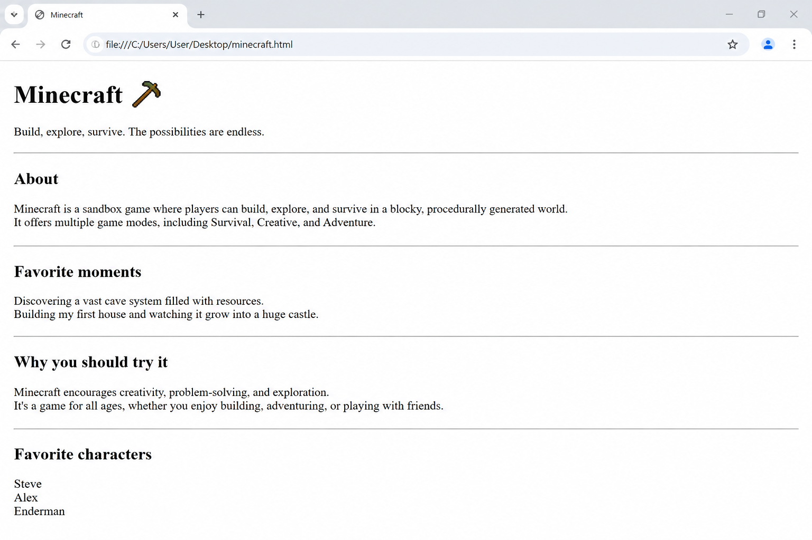

# 📝 Практика · Урок 1 «Первая страница»

**Темы:** интернет и браузер, каркас HTML (`!`), парные и непарные теги, `h1–h6` и их иерархия, `p`, `br`, `hr`, `title`, `charset`, Emmet (`!`, `+`, `*`, `{}`, `lorem`), Live Server.

> 🎯 **Как работать.** Каждую задачу делай в файле `.html` и **сразу смотри результат в браузере** через Live Server (не забывай сохранять — `Ctrl+S`). Уровни: 🟢 базовые (обязательно) · 🟡 средние (для уверенности) · 🔴 со звёздочкой (челлендж). У каждой задачи есть 💡 **подсказка** — это наводка, а не готовый код. Сначала попробуй сам, а подсказку открывай, если застрял.
>
> 📌 **Правила игры, держи под рукой:** каждый парный тег закрывай (`</...>`); одиночные ` ` и `
` закрывать не нужно; всё видимое пиши внутри `<body>`; для русских букв в `<head>` должен быть `<meta charset="UTF-8">`; `h1` на странице — один.

---

## 🟢 Уровень 1 — базовый (обязательно)

**1. Первый запуск — проверяем, что всё работает.**
Создай новый файл `index.html`, разверни в нём каркас страницы аббревиатурой Emmet `!` и открой файл в браузере через Live Server. Убедись, что браузер открылся, вкладка подписана, а сама страница пока пустая (это нормально — мы ещё ничего не написали в `body`).
> 💡 Подсказка: напечатай один символ `!` и нажми `Tab`. Чтобы запустить — правый клик прямо по коду → «Open with Live Server» (или кнопка **Go Live** в правом нижнем углу).

**2. Подписываем вкладку и язык страницы.**
В том же файле сделай две вещи: в теге `<title>` напиши «Моя первая страница» (это появится на вкладке браузера), а в теге `<html>` поменяй `lang="en"` на `lang="ru"` — так мы говорим браузеру, что страница на русском. Наведи мышь на вкладку и проверь надпись.
> 💡 Подсказка: `<title>` находится внутри `<head>`. Атрибут `lang` пишется прямо в открывающем теге `<html lang="ru">`.

**3. Главный заголовок с твоим именем.**
Внутри `<body>` добавь заголовок первого уровня `<h1>` со своим именем. Сохрани и убедись, что имя появилось на странице крупными жирными буквами.
> 💡 Подсказка: `<h1>Твоё имя</h1>` пиши между `<body>` и `</body>`. Всё, что снаружи `body`, на странице не покажется.

**4. Лесенка из шести заголовков.**
Выведи подряд все шесть уровней заголовков — `h1`, `h2`, `h3`, `h4`, `h5`, `h6` — с текстом «Уровень 1», «Уровень 2» и так до шести. Посмотри в браузере, как с каждым уровнем заголовок становится мельче. Это поможет запомнить, что `h1` — самый крупный и важный, а `h6` — самый мелкий.
> 💡 Подсказка: это шесть отдельных парных тегов, у каждого своя цифра. Ускорить можно Emmet-ом.

**5. Первый абзац о себе.**
Под своим заголовком-именем добавь абзац `
` с одним предложением о себе — например, чем ты любишь заниматься. Абзац — это обычный текст страницы.
> 💡 Подсказка: тег абзаца — `
`, текст пиши между `
` и `
`.

**6. Раздел «Обо мне» с тремя фактами.**
Добавь заголовок раздела `<h2>` с текстом «Обо мне», а под ним — три отдельных абзаца `
`, в каждом по одному факту о тебе (любимая еда, хобби, мечта). Обрати внимание: раздел — это `h2`, потому что `h1` (имя) у нас уже есть и он главнее.
> 💡 Подсказка: сначала один `<h2>`, затем три отдельных тега `
` друг под другом.

**7. Адрес в столбик через перенос строки.**
Напиши свой адрес (можно выдуманный) внутри **одного** абзаца так, чтобы улица, город и страна были на трёх разных строках. Для переноса строки внутри абзаца используй одиночный тег ` `.
> 💡 Подсказка: ` ` ставится прямо в тексте там, где нужен перенос, и закрывать его не надо: `...улица город страна...`.

**8. Разделяем разделы линией.**
Между двумя разделами своей страницы поставь горизонтальную линию-разделитель — одиночный тег `
`. Посмотри, как она аккуратно отделяет один блок от другого.
> 💡 Подсказка: `
` пиши на отдельной строке между разделами. Это одиночный тег — без `
`.

**9. Добавляем эмодзи.**
Вставь в свой заголовок или в один из абзацев эмодзи по теме (🚀, ⚽, 🎮, 🎨 — любой). Убедись, что эмодзи отображается правильно, а не «ломается» в непонятный символ.
> 💡 Подсказка: эмодзи работает, если в `<head>` есть `<meta charset="UTF-8">`. Быстро вызвать эмодзи на Windows — клавиши `Win + .` (точка).

**10. Скорость с Emmet.**
Одной аббревиатурой `h2{Мои игры}+p*3` создай заголовок раздела и три пустых абзаца под ним, а потом впиши в абзацы три любимые игры. Оцени, как быстро Emmet собрал заготовку.
> 💡 Подсказка: напечатай всю аббревиатуру целиком и нажми `Tab` — теги развернутся сразу.

---

## 🟡 Уровень 2 — средний (для уверенности)

**11. «Сломай и почини» — ловим кракозябры.**
Специально удали строку `<meta charset="UTF-8">` из `<head>` и обнови страницу — русский текст превратится в непонятные значки («кракозябры»). Теперь верни мету на место и убедись, что буквы снова читаются. Так ты запомнишь, зачем нужна кодировка, и не испугаешься этой ошибки в будущем.
> 💡 Подсказка: мета живёт внутри `<head>`. Это тренировка «увидел проблему → понял причину → починил».

**12. `title` и `h1` — это разное.**
Сделай так, чтобы на **вкладке** браузера было написано «Визитка», а на самой **странице** большими буквами — «Привет!». Это два разных тега в двух разных местах, не перепутай их.
> 💡 Подсказка: имя вкладки задаёт `<title>` (внутри `head`), а большой заголовок на странице — `<h1>` (внутри `body`).

**13. Мини-статья с двумя разделами.**
Собери небольшую «статью» на любую тему (питомец, игра, город): один заголовок `h1` — тема статьи, затем два раздела, каждый по схеме «заголовок `h2` + два абзаца `p`». Между разделами поставь линию `
`. Получится аккуратная страница с понятной структурой.
> 💡 Подсказка: чередуй `h2` и абзацы; `h1` пусть будет только один — самый главный.

**14. Стишок в столбик.**
Запиши 4 строки любимой считалки или стихотворения в **одном** абзаце так, чтобы каждая строчка была на своей линии. Между строчками поставь ` `.
> 💡 Подсказка: один тег `
`, а внутри — текст с тремя ` ` между четырьмя строками.

**15. Оглавление любимой игры.**
Сделай страницу-оглавление: `h1` с названием игры, а под ним три раздела `h2` — «Персонажи», «Оружие», «Уровни», и под каждым разделом короткий абзац-описание. Следи за иерархией: название — `h1`, разделы — `h2`.
> 💡 Подсказка: это три пары «`h2` + `p`». Ускорить можно Emmet-ом: `(h2+p)*3`.

**16. Прячем заметку в комментарии.**
Добавь в свой код HTML-комментарий с текстом-напоминанием, например «тут будет фото». Обнови страницу и убедись, что на ней комментарий не виден — он только для тебя, автора кода.
> 💡 Подсказка: комментарий пишется так: `<!-- текст заметки -->`. Браузер его не показывает.

**17. Другая тема — «Меню кафе».**
Создай **отдельный** файл `menu.html` и свёрстай в нём меню кафе: `h1` — название кафе, два раздела меню через `h2` (например, «Напитки» и «Десерты»), а под каждым — по два абзаца `p` с блюдами. Не забудь начать с каркаса `!`. Это покажет, что одними и теми же тегами можно делать совершенно разные страницы.
> 💡 Подсказка: структура та же, что у визитки, только содержание про кафе. Готовый образец — [`материалы/меню-кафе.html`](материалы/меню-кафе.html), но сначала попробуй сам.

**18. Афиша одной строкой Emmet.**
Разверни аббревиатуру `h1{Афиша}+hr+h2{Когда}+p+h2{Где}+p` и заполни получившийся каркас: в первый абзац впиши дату концерта, во второй — адрес. Посмотри, как `+` расставил теги друг за другом.
> 💡 Подсказка: набери всю строку и нажми `Tab`. Текст в пустые `p` можно вписать уже после разворота.

---

## 🔴 Уровень 3 — со звёздочкой (челлендж)

**19. Мини-сайт из трёх страниц.**
Сделай три отдельных файла: `index.html` (о себе), `hobby.html` (любимое хобби) и `dream.html` (твоя мечта). Оформи каждую в одном стиле — с заголовками и абзацами. У каждой страницы должен быть свой каркас, свой `title` и свой `h1`. (Связать их ссылками мы научимся на следующих уроках — пока это просто три отдельные страницы.)
> 💡 Подсказка: у каждого файла — свой каркас `!`. Меняются только `title` и содержимое `body`.

**20. Выделяем важные слова.**
Загляни в «Часть 10» урока, найди теги `<strong>` и `<em>` и примени их внутри абзацев своей визитки: важные слова выдели `<strong>` (станут жирными), а слова с акцентом — `<em>` (станут курсивом). Не переусердствуй — выдели 2–3 слова, а не всё подряд.
> 💡 Подсказка: `<strong>слово</strong>` — жирный по смыслу, `<em>слово</em>` — акцент. Эти теги ставят прямо внутри текста абзаца.

**21. Скелет резюме.**
Собери страницу-«резюме»: `h1` с твоим именем, а затем три раздела `h2` — «Навыки» (абзацы с тем, что умеешь), «Опыт» (что уже делал) и «Контакты» (город и почта, город и почту раздели через ` `). Разделы отдели друг от друга линиями `
`. Постарайся собрать основу через Emmet.
> 💡 Подсказка: много пар «`h2` + `p`». Скелет можно развернуть аббревиатурой `h1+(h2+p)*3`, а линии добавить потом.

**22. Загадка Emmet — сначала подумай, потом проверь.**
Не набирая в редакторе, попробуй угадать, что развернётся из аббревиатуры `h3{Пункт}*5`. Запиши свою догадку, а потом проверь в VS Code. Совпало ли? Обрати внимание, что происходит с текстом в фигурных скобках при умножении.
> 💡 Подсказка: `*5` означает «повтори 5 раз». А текст в `{}` повторяется вместе с тегом или только один раз?

---

## 🏆 Итоговая работа урока — Фан-страница «Моя любимая игра / фильм / книга»

Сделай **страницу-признание** тому, чем ты по-настоящему увлечён: любимая игра, фильм, сериал, книга, музыкальная группа или вид спорта. Расскажи о ней так, чтобы другу, который её не знает, тоже захотелось попробовать! Здесь главное — **твой текст, твоя подача и твой азарт**.

**Пример темы:** «Minecraft», «Гарри Поттер», «Человек-паук», «Brawl Stars», «Атака титанов», «Мой любимый футбольный клуб».

### 📋 Что должно быть на странице

1. **Название (заголовок `h1`)** — крупное имя твоей игры/фильма/книги, один на странице. Можно с эмодзи.
   *Например:* `<h1>Minecraft ⛏️</h1>`
2. **Слоган (`h3`)** — короткая цепляющая фраза-девиз под названием.
   *Например:* «Построй мир своей мечты — блок за блоком».
3. **Минимум 3 раздела**, каждый — заголовок `h2` + 1–2 абзаца `p`:
   - «О чём это» — коротко, что это и про что;
   - «Любимые моменты» — что тебе больше всего нравится;
   - «Почему стоит попробовать» — убеди друга.
4. **Список «героев / эпизодов / треков»** — несколько пунктов в столбик через ` ` внутри одного абзаца.
   *Например:* `
Стив Крипер Эндермен
`
5. **Разделители `
`** между разделами.

### ✅ Требования (проверь по списку)
- ✅ каркас развёрнут через `!`, есть `lang="ru"` и `<meta charset="UTF-8">`;
- ✅ свой `<title>` на вкладке (например, «Minecraft — моя любимая игра»);
- ✅ ровно **один** `h1`, дальше разделы через `h2` (не прыгай на `h3` без нужды);
- ✅ под каждым разделом — настоящий текст (1–2 абзаца), а не одно слово;
- ✅ есть хотя бы один ` ` (список в столбик) и `
` (между разделами);
- ✅ страница открывается без «кракозябр».

### 💡 Подсказки
- Каркас разделов быстро собери Emmet-ом: `(h2+p)*3` + `Tab`.
- Слоган выдели отдельным `h3` — он мельче `h2`, это нормально (иерархия!).
- Не бойся писать от души: чем живее текст, тем интереснее страница.
- Эмодзи заменяют картинки (их добавим на следующем уроке): 🎮 🎬 📚 ⚔️ ⭐.

**Как это должно выглядеть (ориентир):**

> 🖼 *Ориентир по структуре, а не точная копия. Тема и текст — твои. Если картинки пока нет — её подготовит учитель.*

**🌟 Мини-челлендж (по желанию):** добавь раздел `h2` «Мой рейтинг» и поставь оценку звёздами (⭐⭐⭐⭐☆). Придумай для страницы «титул» — например, «Игра года по моей версии».

---

> ✅ **Сделал 🟢 — база есть. Осилил 🟡 — уверенно держишь тему. Взял 🔴 — ты быстрее браузера!**
> 🆘 Застрял, и подсказки мало — открой [самоучитель.md](самоучитель.md): там те же идеи разобраны пошагово.
> 📌 Быстро вспомнить теги — [итого.md](итого.md).
