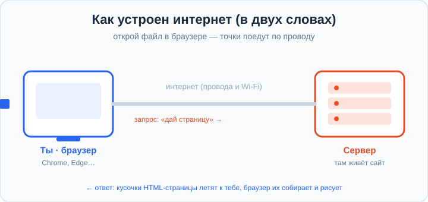
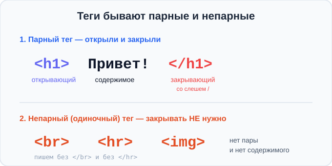
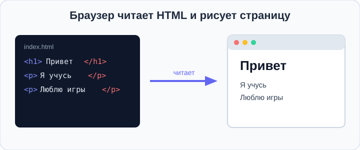
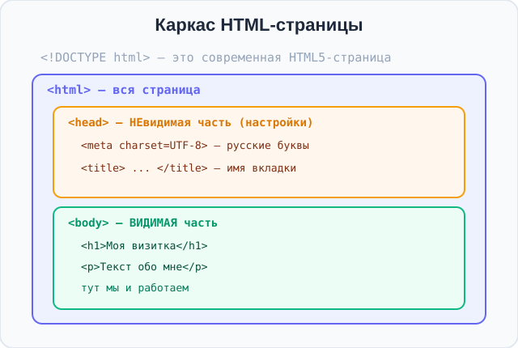
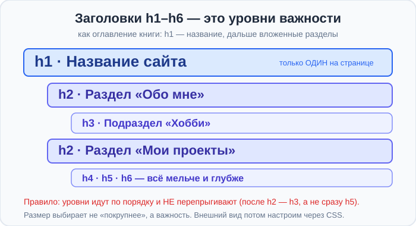
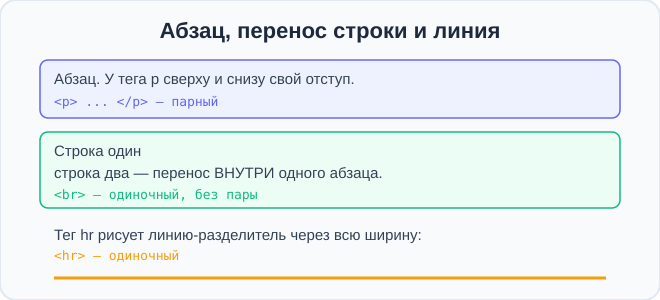

# Урок 1 — Первая страница «Визитка обо мне»: интернет, HTML, теги, Emmet 🌐📝

**Модуль 1 · Старт: HTML + первые стили · Урок 1 из 6 | 2 ак.ч. (1,5 часа)**

> ⬅️ [Все уроки модуля](../README.md) · [План курса](../../ПЛАН-КУРСА.md) · Следующий: Урок 2 «Подключаем CSS: 3 способа» ➡️

> 🔁 В начале — [разминка/повтор](повторение.md).
> 📌 Быстро вспомнить материал урока — [итого.md](итого.md) (шпаргалка).
> 👨‍🏫 Сценарий с хронометражом — в [преподавателю.md](преподавателю.md).
> 🖼 Что показать на проекторе — в [изображения.md](изображения.md).
> 🆘 **Пропустил урок или хочешь закрепить?** Открой [самоучитель.md](самоучитель.md) — теория + задания с подсказками.
> 🧰 Трюки, горячие клавиши и частые ошибки собраны в [лайфхак.md](лайфхак.md) — но самые важные мы **разбираем прямо здесь, по ходу урока** (значок 🧰).

> 🧭 **Как читать урок.** Каждый сайт, который ты открываешь — от YouTube до игрового портала — это **HTML-страница**. Сегодня мы сначала коротко разберёмся, **что такое интернет и браузер**, а потом создадим свою первую страницу — **«Визитку обо мне»** — из настоящих тегов. Каждый новый тег будем **сразу закреплять мини-заданием** ✍️ и научимся **писать код молниеносно** через **Emmet**. Раскрашивать (CSS) начнём на следующем уроке — сегодня строим «скелет».

---

## 🎮 Что мы сделаем сегодня и что получим

**Задача:** понять, как работает интернет, и создать свою первую веб-страницу — **визитку** о себе: имя, класс, любимая игра, факты, мечта.

**В итоге получится** файл `index.html`, который откроется в браузере как настоящий сайт:

```
              ГЕРА СМИРНОВ
        ───────────────────────
        Обо мне
        Люблю Minecraft, футбол и роботов.

        Три факта обо мне
        Был на Байкале.
        Умею жонглировать.
        Моя мечта — сделать свою игру.
```

**Главные навыки урока:** как устроен интернет и браузер · что такое **HTML** · **тег** (парный и непарный) · **каркас страницы** (`<!DOCTYPE>`, `html`, `head`, `body`) · заголовки `h1–h6` и их **иерархия** · абзацы `p`, перенос `br`, линия `hr` · **Emmet** (`!`, `+`, `*`, `{}`) · запуск через **Live Server**.

> 💡 **Главная мысль урока:** **браузер — это «художник», который получает из интернета твой HTML и рисует его сверху вниз по тегам.** Теги — это подписи-команды: «здесь заголовок», «здесь абзац». Ошибёшься в теге — браузер нарисует не то.

---

## Часть 1 — Интернет, браузер и сайты

Прежде чем делать сайт, поймём **куда он попадёт** и **кто его показывает**.

**Что такое интернет?** Это огромная сеть, которая соединяет **миллионы компьютеров** по всему миру проводами и Wi-Fi. По этой сети компьютеры **пересылают друг другу данные** — текст, картинки, видео.

**Что такое сервер?** Это специальный компьютер, который **всегда включён** и хранит сайты. Когда ты заходишь на сайт, твой компьютер просит у сервера: «дай мне эту страницу», а сервер присылает её обратно — маленькими кусочками-«пакетами».

**Что такое браузер?** Это программа (Chrome, Edge, Firefox), которая умеет **сходить в интернет за страницей** и **нарисовать** её тебе. Браузер — наш главный инструмент: в нём мы будем смотреть результат.



> 👀 **Открой этот файл-схему в браузере** (или посмотри на проекторе) — оранжевый «пакет» это твой **запрос** серверу, а синие пакеты — **кусочки страницы**, которые сервер присылает обратно. Браузер собирает их и рисует сайт. Всё это происходит за доли секунды!

**Зачем нам всё это?** Мы будем создавать такие страницы **сами**. Сегодня — на своём компьютере, а в конце курса **выложим сайт в интернет**, и его сможет открыть любой человек в мире по ссылке.

> 🧭 **Коротко, простыми словами:** интернет — «почта» между компьютерами; сервер — «склад», где лежат сайты; браузер — «художник», который приносит страницу и рисует её. Мы — **авторы** страниц.

> ✍️ **Мини-задание 1 (устно/в тетради):** назови, кто есть кто в цепочке, когда ты открываешь любимый сайт: где тут **браузер**, где **сервер**, а что «летает» между ними?
> <details><summary>💡 подсказка</summary>Браузер — программа у тебя (Chrome и т.п.); сервер — чужой компьютер, где хранится сайт; между ними летают данные (кусочки страницы).</details>

---

## Часть 2 — Готовим рабочее место

Чтобы писать сайты, нужны две вещи: **редактор** (где печатаем код) и **браузер** (где смотрим результат).

- **Редактор:** [VS Code](https://code.visualstudio.com/) — бесплатный, самый популярный у веб-разработчиков.
- **Браузер:** Chrome, Edge, Firefox — любой.
- **Расширение [Live Server](https://marketplace.visualstudio.com/items?itemName=ritwickdey.LiveServer):** открывает твою страницу в браузере и **сам обновляет** её при каждом сохранении. Ставится один раз: слева иконка «Extensions» (квадратики) → напечатай `Live Server` → **Install**.

**Создаём проект:**
1. Создай на компьютере папку `визитка`.
2. В VS Code: `File → Open Folder…` → выбери папку `визитка`.
3. `File → New File` → сохрани как **`index.html`** (`Ctrl+S`).

> ⚠️ **Ошибка:** сохранить как `index.txt` или `index.html.txt`. Имя должно заканчиваться **ровно на `.html`** — это «паспорт» веб-страницы. Имя **`index`** особенное: сервер показывает его первым (это «главная» страница сайта).

> 💡 **Почему `index.html`?** Когда сайт выкладывают в интернет, сервер по умолчанию отдаёт файл с именем `index`. Привыкаем к правильному имени главной страницы сразу.

---

## Часть 3 — Что такое HTML. Парные и непарные теги

**HTML** (HyperText Markup Language — «язык гипертекстовой **разметки**») — это язык, которым мы **размечаем** содержимое страницы: где заголовок, где абзац, где картинка. Браузер читает разметку и рисует страницу.

Размечаем **тегами** — командами в угловых скобках `< >`. Теги бывают двух видов:

**1. Парные** — открывающий и закрывающий (со слешем `/`). Между ними — содержимое:

```html
<h1>Привет, мир!</h1>
```

**2. Непарные (одиночные)** — состоят из одного тега, содержимого внутри нет и закрывать их не нужно:

```html
<br>    <!-- перенос строки -->
<hr>    <!-- линия-разделитель -->
   <!-- картинка (изучим на уроке 3) -->
```



- `<h1>` — **открывающий** тег: «дальше начинается заголовок».
- `Привет, мир!` — **содержимое** (то, что увидит человек).
- `</h1>` — **закрывающий** тег (со слешем): «заголовок закончился».
- `<br>`, `<hr>`, `` — **одиночные**: пара им не нужна.

Напечатай парный тег в `index.html`, сохрани (`Ctrl+S`) и запусти: **правый клик по коду → «Open with Live Server»** (или кнопка **Go Live** в правом нижнем углу VS Code).

```html
<h1>Привет, мир!</h1>
```

- 👀 **Что видишь:** открылся браузер, и в нём **крупными жирными буквами** — `Привет, мир!` 🎉 Ты сделал веб-страницу!

> 🧰 **Лайфхак (сразу применяем):** когда печатаешь `<h1>`, VS Code **сам** дописывает `</h1>`. Не удивляйся — просто пиши текст между тегами. Это экономит время и защищает от «забыл закрыть».

> ✍️ **Мини-задание 2:** поменяй текст внутри `<h1>...</h1>` на своё имя, сохрани. Ниже добавь одиночный тег `<hr>` — под именем появится линия.
> <details><summary>💡 подсказка</summary>Меняем только текст <b>между</b> тегами: <code>&lt;h1&gt;Гера&lt;/h1&gt;</code>. Затем на новой строке — просто <code>&lt;hr&gt;</code>, без закрывающего тега.</details>

> ⚠️ **Ошибка:** написать `</br>` или `<hr></hr>`. Одиночные теги закрывать **не надо** — пишем просто `<br>` и `<hr>`. И наоборот: у парного `<h1>` слеш в закрытии **обязателен** — `</h1>`.

---

## Часть 4 — Как браузер читает страницу

Браузер читает HTML **сверху вниз**, тег за тегом, и сразу рисует. Это как рецепт: делаем по шагам, по порядку.



Проверим «по порядку»: напиши два тега друг под другом.

```html
<h1>Первая строка</h1>
<h1>Вторая строка</h1>
```

- 👀 Заголовки встали **один под другим**, в том же порядке, что и в коде. Поменяй их местами в коде — поменяются и на странице.

> 💡 **Вложенность.** Теги можно класть **внутрь** других тегов, как матрёшки. Главное правило: **какой тег открыли последним — тот закрываем первым.** Правильно: `<a><b>...</b></a>`. Неправильно (теги «перехлёстываются»): `<a><b>...</a></b>`.

---

## Часть 5 — Каркас страницы + Emmet `!`

Одного `<h1>` мало. У настоящей страницы есть **каркас** — обязательные теги, которые говорят браузеру «это HTML5-страница, вот её невидимая часть, вот видимая».

Вместо того чтобы печатать каркас руками, используем **Emmet** — он встроен в VS Code и разворачивает короткие аббревиатуры в целые куски кода. Сотри всё в файле, напечатай **один восклицательный знак** и нажми **Tab** (или Enter):

```
!
```

- 👀 **Что произошло:** Emmet развернул `!` в целый каркас страницы! ✨

```html
<!DOCTYPE html>
<html lang="en">
<head>
    <meta charset="UTF-8">
    <meta name="viewport" content="width=device-width, initial-scale=1.0">
    <title>Document</title>
</head>
<body>

</body>
</html>
```

**Разберём каркас по частям:**



| Тег | Что делает |
|-----|-----------|
| `<!DOCTYPE html>` | «Это современная HTML5-страница». Пишется один раз в самом верху |
| `<html>...</html>` | Вся страница целиком. Внутри — две части: `head` и `body` |
| `<head>...</head>` | **Невидимая** часть — настройки: кодировка, название вкладки. На странице не показывается |
| `<meta charset="UTF-8">` | Кодировка — чтобы **русские буквы и эмодзи** не превратились в «кракозябры» |
| `<title>...</title>` | **Название вкладки** браузера (не путать с `h1`!) |
| `<body>...</body>` | **Видимая** часть — всё, что видит человек. Тут мы и работаем |

Первые правки каркаса:
1. Поменяй `lang="en"` на **`lang="ru"`** — «страница на русском».
2. В `<title>` напиши **`Визитка — Гера`** — это появится на вкладке браузера.
3. Внутри `<body>` напиши `<h1>Моя визитка</h1>`.

Сохрани и посмотри: на **вкладке** браузера — «Визитка — Гера», а на **странице** — заголовок «Моя визитка».

> ✍️ **Мини-задание 3:** разверни каркас через `!`, поставь `lang="ru"`, свой `<title>` и добавь в `<body>` заголовок с приветствием. Наведи мышь на вкладку браузера — там твой `title`.
> <details><summary>💡 подсказка</summary>Всё, что должно быть <b>видно</b> на странице, пиши между <code>&lt;body&gt;</code> и <code>&lt;/body&gt;</code>. <code>title</code> — только для вкладки.</details>

> ⚠️ **Частая путаница:** `<title>` ≠ `<h1>`. `title` — это **имя вкладки** (в `head`), а `h1` — **большой заголовок на странице** (в `body`). Разные вещи в разных местах.

> 🧰 **Лайфхак (сразу применяем):** пока не подключили картинки — используй **эмодзи** прямо в тексте: `<h1>Моя визитка 🚀</h1>`. Работает благодаря `charset="UTF-8"`. Ещё эмодзи можно вызвать клавишами `Win + .` (точка) на Windows.

---

## Часть 6 — Заголовки `h1`–`h6` и их иерархия

В HTML **шесть уровней заголовков** — от самого главного `h1` до самого маленького `h6`.

```html
<h1>Самый главный</h1>
<h2>Раздел</h2>
<h3>Подраздел</h3>
<h4>Ещё мельче</h4>
<h5>И ещё</h5>
<h6>Самый маленький</h6>
```

Но заголовки — это **не «размер текста»**, а **уровни важности**, как оглавление книги. Посмотри на схему:



**❗ Три важных правила (запомни):**
1. **`h1` — один на странице.** Это её «название», главная тема. Как заголовок книги — он один.
2. **Уровни идут по порядку и не перепрыгивают.** После `h2` — `h3`, а не сразу `h5`. Нельзя «прыгать через ступеньку».
3. **Выбираем уровень по смыслу, а не «покрупнее».** Нужен заголовок раздела — бери `h2`, даже если хочется, чтобы он был меньше. **Размер потом настроим через CSS** — а сейчас важна правильная структура.

**Почему это важно?** По заголовкам страницу «читают» не только люди, но и поисковики (Google) и программы для незрячих. Правильная иерархия = понятная, «умная» страница.

**Примеры на разные темы:**

```html
<!-- Меню кафе -->
<h1>Кафе «Уют»</h1>          <!-- название = h1 -->
<h2>Горячие напитки</h2>     <!-- раздел = h2 -->
<h3>Какао с маршмеллоу</h3>  <!-- пункт = h3 -->
```

```html
<!-- Игровой профиль -->
<h1>Профиль игрока</h1>
<h2>Достижения</h2>
<h2>Инвентарь</h2>
```

> ✍️ **Мини-задание 4:** сделай «оглавление» любимой игры/книги по правилам: **один** `h1` (название) и три `h2` (разделы). Например: `h1` «Minecraft», `h2` «Блоки», «Мобы», «Крафт». Не прыгай на `h3`, пока не нужен подраздел.
> <details><summary>💡 подсказка</summary>Один <code>h1</code> сверху, под ним три отдельных <code>&lt;h2&gt;...&lt;/h2&gt;</code>. Все разделы одного уровня — это <code>h2</code>.</details>

> ⚠️ **Ошибка:** ставить `h1` несколько раз «потому что покрупнее», или прыгать `h1 → h4`. Держи порядок: `h1` один, дальше `h2`, внутри — `h3`.

---

## Часть 7 — Абзацы `p`, перенос `br`, линия `hr`

Заголовки есть — добавим **текст**. Абзац — это тег **`<p>`** (от *paragraph*).

```html
<h2>Обо мне</h2>
<p>Меня зовут Гера. Я учусь в 6 классе и люблю Minecraft.</p>
<p>Ещё я играю в футбол и собираю роботов из Lego.</p>
```

- 👀 Два абзаца встали друг под другом с отступом — браузер сам отделяет абзацы пустым местом.

Теперь **два наших одиночных тега** (мы их уже видели в Части 3) в деле:

```html
<p>Первая строка<br>вторая строка сразу под ней</p>
<hr>
```

- **`<br>`** — **перенос строки** внутри абзаца (как Enter в тексте).
- **`<hr>`** — **горизонтальная линия-разделитель** через всю ширину.



> 💡 **`br` — не для отступов между блоками!** Много `<br><br><br>` подряд, чтобы «оттолкнуть» текст, — плохая привычка. `br` нужен только для переноса строки **внутри** одного абзаца (адрес, строчки стиха). Расстояние между блоками сделаем красиво через CSS.

> ✍️ **Мини-задание 5:** напиши свой адрес в три строки внутри **одного** абзаца, используя `<br>`. Ниже поставь `<hr>`, а под линией — абзац «Это мой город».
> <details><summary>💡 подсказка</summary><code>&lt;p&gt;Улица Ленина, 5&lt;br&gt;Казань&lt;br&gt;Россия&lt;/p&gt;</code>, затем <code>&lt;hr&gt;</code>, затем ещё один <code>&lt;p&gt;</code>.</details>

> 🧰 **Лайфхак (сразу применяем):** спецсимволы пишутся «именем со знаком &»: `&copy;` → ©, `&hearts;` → ♥, `&rarr;` → →. Пригодятся для подписи-копирайта в подвале страницы.

---

## Часть 8 — Emmet ускоряет: `+`, `*` и `lorem`

Мы уже видели силу Emmet на `!`. Теперь приёмы, которые экономят кучу времени. Печатаем аббревиатуру и жмём **`Tab`**.

**Плюс `+` — теги-соседи (друг за другом):**

```
h1+p+p
```
→
```html
<h1></h1>
<p></p>
<p></p>
```

**Звёздочка `*` — умножение (повтор):**

```
p*3
```
→ три пустых абзаца:
```html
<p></p>
<p></p>
<p></p>
```

**Текст в фигурных скобках `{}`** — сразу с содержимым:

```
h2{Мои факты}+p{Факт один}
```
→
```html
<h2>Мои факты</h2>
<p>Факт один</p>
```

> 🧰 **Лайфхак (сразу применяем): `lorem`.** Когда лень придумывать текст для примера — напиши `p>lorem` и нажми `Tab`: Emmet вставит готовый абзац-«рыбу» (текст-заглушку). А `lorem10` даст ровно 10 слов. Этим реально пользуются верстальщики, когда «расставляют» блоки до появления настоящего текста.

> 💡 **Как это читать.** `+` — «и рядом ещё тег», `*N` — «повтори N раз», `{текст}` — «положи внутрь текст». Дальше в курсе добавим `>` (вложенность) и `$` (нумерация) — по одному приёму за раз.

> ✍️ **Мини-задание 6:** одной аббревиатурой Emmet создай заголовок и под ним **четыре** абзаца. Подумай, как соединить `+`, `*` и `{}`.
> <details><summary>💡 подсказка</summary>Например: <code>h2{Список дел}+p*4</code> → заголовок и 4 пустых абзаца.</details>

> ⚠️ **Если Emmet не разворачивается:** проверь, что файл сохранён как `.html`, и жми `Tab` **сразу после** аббревиатуры, без пробела.

---

## Часть 9 — Собираем «Визитку обо мне» 🏆

Соединяем всё. Печатай по частям, сохраняй после каждой — Live Server обновит страницу сам.

```html
<!DOCTYPE html>
<html lang="ru">
<head>
    <meta charset="UTF-8">
    <title>Визитка — Гера</title>
</head>
<body>
    <h1>Гера Смирнов 🚀</h1>
    <hr>
    <h2>Обо мне</h2>
    <p>Я учусь в 6 «Б» классе.<br>Люблю Minecraft, футбол и роботов.</p>

    <h2>Три факта обо мне</h2>
    <p>Был на озере Байкал.</p>
    <p>Умею жонглировать тремя мячиками.</p>
    <p>Моя мечта — сделать свою компьютерную игру.</p>

    <hr>
    <h3>Спасибо, что заглянул! 👋</h3>
</body>
</html>
```

- 👀 **Что видишь:** готовая визитка с именем-заголовком, разделами, фактами и линиями-разделителями. Это **настоящая веб-страница**, которую можно показать друзьям, а скоро — выложить в интернет.

> 💡 **Разбор:** `title` дал имя вкладке; `h1` — главный заголовок (имя, один); `h2` — разделы; `p` — тексты; `br` перенёс строку внутри абзаца; `hr` отделил блоки линией. Всё выстроилось сверху вниз, как в коде.

> 🎨 **Мини-проект урока: «Не только визитка».** Сделай тем же набором тегов **другую** страницу на выбор: «Меню кафе» (h1 — название кафе, h2 — разделы меню, p — блюда) **или** «Афиша концерта» (h1 — название, h2 — дата и место, p — описание). Тот же инструмент — разные страницы! Готовый пример — [`материалы/меню-кафе.html`](материалы/меню-кафе.html).

> 🧩 **Для 5–7 классов (проще):** хватит `h1` (имя), одного `h2` «Обо мне» и двух-трёх абзацев `p`. Главное — чтобы страница открывалась в браузере и рассказывала о тебе.

---

## 🐞 Разбор частых ошибок

| Что видно в браузере | Что случилось | Как починить |
|----------------------|---------------|--------------|
| Русские буквы — «кракозябры» (Я) | нет `<meta charset="UTF-8">` | добавь мету в `head` (или разверни каркас через `!`) |
| Весь текст — один огромный заголовок | не закрыл `</h1>` — заголовок «поглотил» остальное | закрой тег: `</h1>` |
| Страница пустая, но `title` на вкладке есть | текст написан в `head`, а не в `body` | всё видимое — между `<body>` и `</body>` |
| Абзацы слиплись в одну строку | текст без тега `<p>` | оборачивай каждый абзац в `<p>...</p>` |
| Emmet не разворачивает `!` | файл не `.html` или стоит пробел после `!` | сохрани как `.html`, жми `Tab` сразу после аббревиатуры |

> ⚠️ Что-то не так? Проверь по порядку: **каждый парный тег закрыт** (`</...>`), **текст в `body`**, есть **`charset="UTF-8"`**, имя файла заканчивается на **`.html`**.

---

## 🎓 Часть 10 — Для тех, кто хочет глубже

- **Комментарии в HTML:** `<!-- это заметка, браузер её не показывает -->` — удобно «выключать» кусок кода или оставлять пометки.
- **Ещё текстовые теги:** `<strong>важное</strong>` (жирный по смыслу), `<em>акцент</em>` (курсив по смыслу), `<small>мелкий текст</small>`. Вставь `<strong>` в абзац визитки.
- **Emmet с классом:** `h1.title` → `<h1 class="title"></h1>` (классы понадобятся для CSS уже на следующем уроке).
- **Горячие клавиши VS Code:** `Alt+↑/↓` — двигать строку; `Ctrl+/` — закомментировать строку; `Ctrl+D` — выделить следующее такое же слово; `Ctrl+U` в браузере — посмотреть HTML-код любого сайта.

---

## 🏁 Итог урока

Сегодня ты понял, как работает интернет, и создал **первую веб-страницу**:

- ✅ **Интернет** — сеть компьютеров; **сервер** хранит сайты; **браузер** приносит и рисует страницу.
- ✅ **HTML** — язык разметки; браузер читает теги сверху вниз.
- ✅ **Теги** бывают **парные** (`<p>...</p>`) и **непарные** (`<br>`, `<hr>`, ``).
- ✅ **Каркас** `!` → `<!DOCTYPE>`, `html`, `head` (невидимое: `charset`, `title`), `body` (видимое).
- ✅ **Заголовки** `h1–h6` — уровни важности: `h1` один, порядок без перепрыгивания.
- ✅ **Абзацы** `p`; перенос `br`; линия `hr`.
- ✅ **Emmet** `!`, `+`, `*`, `{}`, `lorem` — пишем код быстро.
- ✅ **Live Server** — страница обновляется сама при сохранении.

> 🏆 Главное: **страница — это теги, вложенные в каркас; браузер получает их из интернета и рисует по порядку.** Быстро повторить всё — в [итого.md](итого.md).

> 🎤 **Блиц:** кто такой «сервер» и кто «браузер»? чем `title` отличается от `h1`? какие теги непарные? сколько `h1` на странице и можно ли прыгать с `h1` на `h4`? что развернёт Emmet из `h2+p*3`?

### 🎮 Викторина-закрепление
Открой **[викторина.html](викторина.html)** — вопросы по уроку + смешные и «на подумать». (С урока 2 сюда будут добавляться вопросы из прошлых тем.)

➡️ **Практика урока** — **[практика.md](практика.md)**: задачи в 3 уровнях с подсказками + итоговая работа (с картинкой-ориентиром).
🆘 **Пропустил / хочешь ещё?** — [самоучитель.md](самоучитель.md).
🧰 **Больше трюков и ошибок** — [лайфхак.md](лайфхак.md). 📌 **Шпаргалка** — [итого.md](итого.md).

---

## 🔗 Навигация и материалы

⬅️ [Все уроки модуля](../README.md) · [План курса](../../ПЛАН-КУРСА.md) · **Следующий:** Урок 2 «Подключаем CSS: 3 способа» ➡️

**🧰 Инструменты:** [VS Code](https://code.visualstudio.com/) + расширение [Live Server](https://marketplace.visualstudio.com/items?itemName=ritwickdey.LiveServer).
**📄 Пример для вдохновения:** [`материалы/меню-кафе.html`](материалы/меню-кафе.html) — другая тема теми же тегами (свою визитку собираешь сам по шагам из Части 9).
**⚙️ Учителю:** сценарий и частые ошибки — в [преподавателю.md](преподавателю.md).
