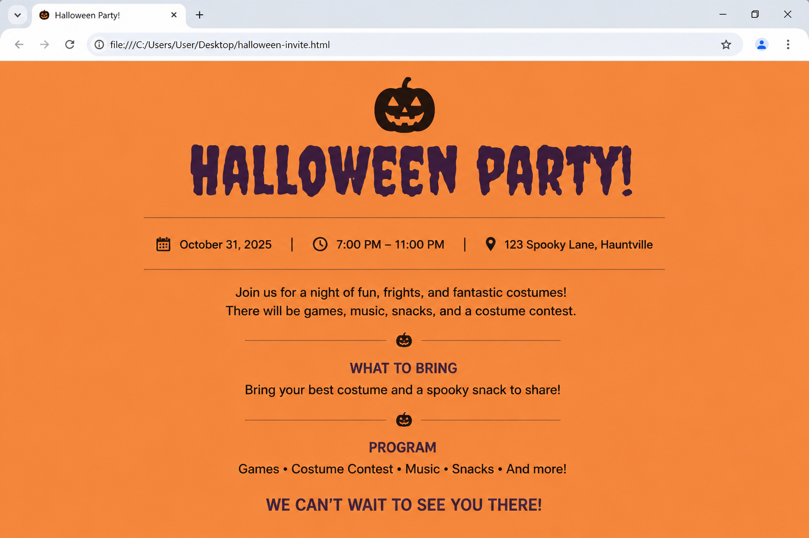

# 📝 Практика · Урок 2 «Подключаем CSS: 3 способа»

**Темы:** что такое CSS, правило `селектор { свойство: значение; }`, три способа подключения (`style`, `` пиши полное правило `h1 { color: navy; }`.

**4. Фон всей страницы.**
Задай цвет фона для всей страницы. Для этого нужно правило для селектора `body` со свойством `background-color`. Подбери светлый приятный оттенок.
> 💡 Подсказка: `body { background-color: #f0f8ff; }`. Именно `body` отвечает за фон всей страницы.

**5. Выравнивание по центру.**
Сделай так, чтобы главный заголовок `h1` стоял по центру страницы. Используй свойство `text-align`.
> 💡 Подсказка: `h1 { text-align: center; }`. Значения бывают `left`, `center`, `right`.

**6. Внешний файл `style.css`.**
Создай рядом с `index.html` отдельный файл `style.css`, перенеси в него все свои правила (без тега `<style>`!) и подключи его в `<head>` тегом `<link>`. Проверь, что страница выглядит так же, хотя стилей в HTML больше не видно.
> 💡 Подсказка: в `<head>` — `<link rel="stylesheet" href="style.css">`. В `style.css` — только правила.

**7. Разные цвета разным тегам.**
В своём `style.css` задай: заголовку `h1` — один цвет, подзаголовку `h2` — другой, абзацам `p` — третий. Посмотри, как страница «ожила».
> 💡 Подсказка: три отдельных правила — для `h1`, для `h2` и для `p`.

**8. Цвет фона одному блоку.**
Кроме фона всей страницы, задай фон **только заголовку** `h1` (например, жёлтый). Обрати внимание: фон появится лишь за буквами заголовка, а не по всей странице.
> 💡 Подсказка: `h1 { background-color: gold; }` — фон конкретного элемента.

---

## 🟡 Уровень 2 — средний (для уверенности)

**9. Тёмная тема.**
Собери страницу в «тёмной теме»: тёмный фон у `body` (например, `#1a1a2e`), светлый цвет текста у абзацев и яркий (золотой) цвет у заголовка. Такой приём часто используют на сайтах с «ночным режимом».
> 💡 Подсказка: фон — у `body`, светлый текст — у `p`, золотой заголовок — у `h1` (`gold`).

**10. Спор стилей (каскад).**
Проверь правило «силы»: в `style.css` напиши `h1 { color: green; }`, а в самом теге — `<h1 style="color: red;">`. Сначала угадай, какого цвета будет заголовок, а потом проверь в браузере. Запиши вывод.
> 💡 Подсказка: inline-стиль в теге сильнее правила из файла — победит красный.

**11. Меню кафе во внешнем CSS.**
Возьми свою страницу «Меню кафе» с прошлого урока и оформи её через отдельный `style.css`: тёплый фон, коричневые заголовки, аккуратный цвет текста, всё по центру. Стили должны быть **только** во внешнем файле.
> 💡 Подсказка: правило для `body` (фон + `text-align: center`), для `h1`/`h2` (оттенки коричневого), для `p` (цвет текста).

**12. Один селектор — два тега.**
Загляни в «Часть 9» урока и покрась `h1` и `h2` в один цвет **одним** правилом, перечислив селекторы через запятую.
> 💡 Подсказка: `h1, h2 { color: teal; }` — запятая объединяет селекторы.

**13. Три настроения — три палитры.**
Сделай три копии страницы с одинаковым HTML, но тремя разными `style.css`: «лес» (зелёные тона), «море» (сине-голубые), «закат» (оранжево-розовые). Убедись, что меняя только CSS, ты полностью меняешь вид страницы.
> 💡 Подсказка: HTML не трогай — меняются только значения `color`/`background-color` в CSS.

**14. Комментарии в CSS.**
В своём `style.css` добавь комментарии, подписывающие блоки (например, `/* шапка */`, `/* текст */`). Затем временно «выключи» одно правило, обернув его в комментарий, и посмотри, как изменится страница.
> 💡 Подсказка: комментарий в CSS — `/* ... */`. Всё внутри него браузер игнорирует.

**15. Повторяем HTML + красим.**
С нуля собери страницу «Постер фильма»: каркас через Emmet `!`, заголовок `h1` (название), пара абзацев `p` (описание), линия `
`. Затем подключи `style.css` и оформи: фон, цвет заголовка, выравнивание по центру.
> 💡 Подсказка: сначала HTML (вспомни `!`, `h1`, `p`, `hr` с урока 1), потом внешний CSS через `<link>`.

---

## 🔴 Уровень 3 — со звёздочкой (челлендж)

**16. Единый стиль для двух страниц.**
Сделай две HTML-страницы (`index.html` и `about.html`) с разным содержанием, но **подключи к обеим один и тот же** `style.css`. Убедись, что обе страницы оформлены в едином стиле. Это главная суперсила способа `<link>`.
> 💡 Подсказка: в `<head>` каждой страницы — одинаковый `<link rel="stylesheet" href="style.css">`.

**17. Наследование цвета.**
Задай `color` только для `body` и посмотри, что произойдёт с цветом заголовков и абзацев, у которых свой цвет не задан. Объясни в комментарии, почему они тоже покрасились.
> 💡 Подсказка: вложенные теги «наследуют» цвет от `body`, если у них нет своего. Это называется наследование.

**18. Мини-исследование «что сильнее».**
Поставь эксперимент: одно и то же правило для `h1` напиши и в `<style>`, и подключи в `<link>`, задав разные цвета. Определи опытным путём, какой из них победит, и запиши правило, которое ты вывел.
> 💡 Подсказка: обычно побеждает то правило, что подключено/написано ниже. Поменяй их местами и проверь.

**19. Своя тема сайта.**
Придумай тему (космос, киберпанк, конфеты, ретро) и оформи страницу-визитку целиком под неё: фон, цвета заголовков и текста, выравнивание. Стили — только во внешнем `style.css`. Постарайся, чтобы палитра выглядела цельно.
> 💡 Подсказка: выбери 2–3 основных цвета и используй их последовательно. Фон — у `body`, акценты — у заголовков.

---

## 🏆 Итоговая работа урока — «Приглашение на праздник»

Сделай **красочное приглашение** на праздник: день рождения, Хэллоуин, Новый год, вечеринку или турнир по любимой игре. Оформи его так, чтобы, увидев, сразу захотелось прийти! Всё оформление — **во внешнем `style.css`** (как на настоящем сайте).

**Пример темы:** «День рождения Ани», «Хэллоуин-вечеринка», «Новогодний утренник», «Турнир по FIFA», «Пижамная вечеринка».

### 📋 Что должно быть на странице

1. **Название события (`h1`)** — крупно и по центру.
   *Например:* `<h1>🎃 Хэллоуин-вечеринка!</h1>`
2. **Когда и где (`h2`)** — дата, время и место.
   *Например:* «Суббота, 31 октября, 18:00 — у меня дома».
3. **Детали (абзацы `p`)** — что взять с собой, дресс-код, программа вечера.
4. **Разделитель `
`** между блоками.
5. **Внешний файл `style.css`**, подключённый через `<link>`.

### ✅ Требования (проверь по списку)
- ✅ HTML: `h1` (событие), `h2` (когда/где), 2–3 абзаца `p` (детали), `hr`;
- ✅ **отдельный `style.css`** через `<link>` (не inline и не `<style>`!);
- ✅ **атмосферный фон** страницы под тему (тёмно-оранжевый для Хэллоуина, тёплый для дня рождения, снежно-голубой для Нового года);
- ✅ свои цвета для `h1` и `h2`;
- ✅ цвет текста абзацев подобран так, чтобы читался на фоне;
- ✅ всё приглашение выровнено по центру (`text-align: center` у `body`);
- ✅ палитра цельная и соответствует празднику (2–3 цвета).

### 💡 Подсказки
- Фон всей страницы — правило для `body { background-color: ...; }`.
- Подбери цвета под настроение: Хэллоуин — оранжевый + чёрный, Новый год — синий + белый + золото.
- Центрируй всё сразу: `body { text-align: center; }`.
- Подписывай блоки стилей комментариями `/* шапка */`, `/* детали */`.

**Как это должно выглядеть (ориентир):**

> 🖼 *Ориентир по стилю; тема и палитра — твои. Если картинки пока нет — её подготовит учитель.*

**🌟 Мини-челлендж (по желанию):** сделай **два** приглашения на разные праздники и подключи к ним **разные** `style.css` — сравни, как цвет полностью меняет настроение одной и той же страницы.

---

> ✅ **🟢 — база есть. 🟡 — уверенно. 🔴 — мастер стилей!**
> 🆘 Застрял — открой [самоучитель.md](самоучитель.md): там всё по шагам.
> 📌 Быстро вспомнить — [итого.md](итого.md).
