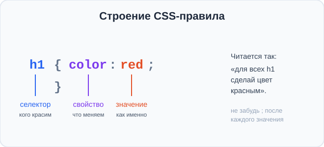
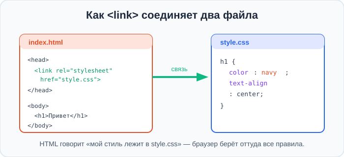
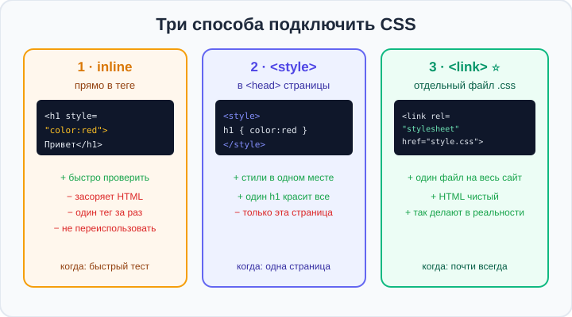
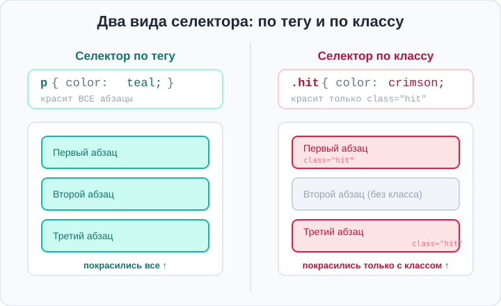

# Урок 2 — Подключаем CSS: 3 способа. Первые стили 🎨🔌

**Модуль 1 · Старт: HTML + первые стили · Урок 2 из 6 | 2 ак.ч. (1,5 часа)**

> ⬅️ [Все уроки модуля](../README.md) · [План курса](../../ПЛАН-КУРСА.md) · Предыдущий: [Урок 1 «Первая страница»](../урок-01-первая-страница/урок.md) · Следующий: Урок 3 «Картинки» ➡️

> 🔁 В начале — [разминка/повтор](повторение.md).
> 📌 Быстро вспомнить материал — [итого.md](итого.md). 👨‍🏫 Сценарий — [преподавателю.md](преподавателю.md). 🖼 Проектор — [изображения.md](изображения.md).
> 🆘 **Пропустил урок?** — [самоучитель.md](самоучитель.md). 🧰 Больше трюков — [лайфхак.md](лайфхак.md), но главные разбираем прямо в уроке (значок 🧰).

> 🧭 **Как читать урок.** На прошлом уроке мы собрали визитку — но она **чёрно-белая и скучная**. Сегодня научимся её **раскрашивать** с помощью **CSS** — языка стилей. Главное сегодня — понять **три способа подключить CSS** к странице и **чем они отличаются** (это спрашивают на любом собеседовании по вёрстке!). А ещё покрасим текст, зададим фон и выровняем заголовки.

---

## 🎮 Что мы сделаем сегодня и что получим

**Задача:** оживить страницу цветом. Разобрать **три способа подключения стилей** и превратить «скучное» меню кафе в **яркую страницу**.

**В итоге** ты будешь уметь подключать CSS **тремя способами** и красить страницу: менять **цвет текста**, **цвет фона** и **выравнивание**.

**Главные навыки урока:** что такое **CSS** · **правило** `селектор { свойство: значение; }` · **3 способа подключения** (inline `style`, `<style>`, `<link>`) и их отличия · **два вида селектора** — по **тегу** и по **классу** (`.имя`) · группировка через `,` · свойства **`color`**, **`background-color`**, **`text-align`** · какой стиль «побеждает» (каскад, кратко).

> 💡 **Главная мысль урока:** **HTML отвечает за содержание («что написано»), а CSS — за оформление («как это выглядит»).** Один и тот же HTML можно раскрасить сотней разных способов, не трогая текст.

---

## Часть 1 — Что такое CSS и зачем он нужен

**CSS** (Cascading Style Sheets — «каскадные таблицы стилей») — это язык, которым мы задаём **внешний вид** страницы: цвета, размеры, шрифты, отступы, расположение блоков.

Представь дом: **HTML** — это стены и комнаты (что есть в доме), а **CSS** — обои, краска, мебель (как он выглядит). Без CSS сайт как дом без отделки — стоит, но некрасиво.

> 🧭 **Разделение труда:** HTML — **содержание**, CSS — **оформление**. Их специально разделили: можно поменять весь дизайн сайта, не трогая ни одной буквы текста.

Открой свою визитку из прошлого урока — сейчас мы её раскрасим.

---

## Часть 2 — Как устроено правило CSS

Любой стиль в CSS — это **правило**. Оно всегда состоит из трёх частей:

```css
h1 {
    color: red;
}
```



- **Селектор** (`h1`) — **кого красим**. Здесь — все заголовки `h1` на странице.
- **Свойство** (`color`) — **что меняем**. Здесь — цвет текста.
- **Значение** (`red`) — **как именно**. Здесь — красный.
- **Фигурные скобки `{ }`** — внутри них все правила для этого селектора.
- **Двоеточие `:`** — между свойством и значением.
- **Точка с запятой `;`** — в конце каждой строки-свойства.

Читается по-человечески: «для всех `h1` сделай цвет красным».

Можно задать **несколько свойств** сразу — каждое со своей `;`:

```css
h1 {
    color: white;
    background-color: navy;
    text-align: center;
}
```

> 💡 **Точка с запятой `;` — важна.** Она разделяет свойства. Забыл её — и следующее свойство может «сломаться». Возьми в привычку ставить `;` после **каждого** значения.

> ✍️ **Мини-задание 1:** прочитай вслух, что делает это правило: `p { color: green; }`. Кого оно красит и во что?
> <details><summary>💡 подсказка</summary>Селектор <code>p</code> — все абзацы; свойство <code>color</code> — цвет текста; значение <code>green</code> — зелёный. «Все абзацы сделай зелёными».</details>

---

## Часть 3 — Способ 1: inline-стиль (атрибут `style`)

Первый способ — написать стиль **прямо в теге**, в атрибуте `style`:

```html
<h1 style="color: red;">Красный заголовок</h1>
<p style="color: gray;">Серый абзац</p>
```

- 👀 Заголовок стал красным, абзац — серым. Стиль «приклеен» к конкретному тегу.

Это называется **inline-стиль** (встроенный). Внутри кавычек пишем **только свойства** (без селектора и скобок — тег и так известен).

**Плюсы и минусы:**
- ✅ Быстро проверить одну идею («а если так?»).
- ❌ **Засоряет HTML** — код становится длинным и грязным.
- ❌ Красит **только этот один тег**. Десять абзацев — десять раз копировать.
- ❌ Стиль **нельзя переиспользовать** на другой странице.

> ✍️ **Мини-задание 2:** сделай в своей визитке заголовок `h1` синим прямо через `style`. Затем добавь второй `h1` — заметь, что его придётся красить **отдельно**.
> <details><summary>💡 подсказка</summary><code>&lt;h1 style="color: blue;"&gt;...&lt;/h1&gt;</code>. Каждый тег со своим <code>style</code>.</details>

> ⚠️ **Ошибка:** написать `<h1 style="color= red">` (знак `=` вместо `:`). Внутри `style` работает **CSS-синтаксис**: свойство и значение через **двоеточие** `:`, а не `=`.

---

## Часть 4 — Способ 2: тег `<style>` в `<head>`

Второй способ — собрать все стили **в одном месте**: в теге `<style>` внутри `<head>`.

```html
<head>
    <meta charset="UTF-8">
    <title>Визитка</title>
    <style>
        h1 {
            color: navy;
            text-align: center;
        }
        p {
            color: gray;
        }
    </style>
</head>
```

- 👀 Теперь **все** `h1` стали тёмно-синими и по центру, **все** `p` — серыми. Один селектор `h1` покрасил сразу все заголовки!

Это **внутренние стили** (internal). Здесь мы уже пишем **полные правила** — с селектором и скобками.

**Плюсы и минусы:**
- ✅ Все стили **в одном месте**, HTML чистый.
- ✅ Один селектор красит **все** такие теги сразу.
- ❌ Работает **только на этой странице**. На соседней странице стили придётся писать заново.

> ✍️ **Мини-задание 3:** убери inline-стили из задания 2 и вместо этого добавь в `<head>` тег `<style>` с правилом для `h1`. Проверь, что покрасились **оба** заголовка сразу.
> <details><summary>💡 подсказка</summary>Внутри <code>&lt;style&gt;...&lt;/style&gt;</code> пиши полное правило: <code>h1 { color: blue; }</code>.</details>

> 🧰 **Лайфхак Emmet:** внутри `<head>` напиши `style` и нажми `Tab` — Emmet сам развернёт `<style></style>`. А помнишь Emmet `!`, `+`, `*` с прошлого урока? Они по-прежнему работают.

---

## Часть 5 — Способ 3: внешний файл `.css` через `<link>` ⭐

Третий способ — **самый правильный**. Стили выносим в **отдельный файл** `style.css`, а в HTML его **подключаем** тегом `<link>`.

**Шаг 1.** Рядом с `index.html` создай файл **`style.css`** и напиши в нём правила (уже **без** `<style>` — это отдельный CSS-файл, тут только CSS):

```css
h1 {
    color: navy;
    text-align: center;
}
p {
    color: gray;
}
```

**Шаг 2.** В `<head>` HTML подключи этот файл:

```html
<head>
    <meta charset="UTF-8">
    <title>Визитка</title>
    <link rel="stylesheet" href="style.css">
</head>
```



- **`<link>`** — одиночный тег (помнишь непарные теги с урока 1?).
- **`rel="stylesheet"`** — «связь с таблицей стилей» (что это именно CSS).
- **`href="style.css"`** — **путь к файлу** (имя нашего CSS-файла).

Сохрани оба файла — страница раскрасится, хотя в HTML **ни одного стиля не видно**! Они все в `style.css`.

**Плюсы:**
- ✅ Один файл `style.css` можно подключить к **десяткам страниц** — единый стиль всего сайта.
- ✅ HTML чистый (только содержание), CSS отдельно (только оформление).
- ✅ **Так делают на всех настоящих сайтах.**

> ✍️ **Мини-задание 4:** вынеси стили из задания 3 в отдельный `style.css` и подключи его через `<link>`. Удали тег `<style>` — убедись, что всё работает и без него.
> <details><summary>💡 подсказка</summary>В <code>style.css</code> — только правила (без <code>&lt;style&gt;</code>). В <code>&lt;head&gt;</code> — <code>&lt;link rel="stylesheet" href="style.css"&gt;</code>.</details>

> ⚠️ **Ошибка:** стили не применяются → чаще всего **неправильный `href`**. Файл `style.css` должен лежать **рядом** с `index.html`, а имя в `href` — точно совпадать (учитывая большие/маленькие буквы).

> 🧰 **Лайфхак Emmet:** в `<head>` напиши `link:css` и нажми `Tab` — Emmet развернёт готовый `<link rel="stylesheet" href="style.css">`. Экономит время и защищает от опечаток в `rel`.

---

## Часть 6 — Сравниваем 3 способа. Кто «побеждает»?



| Способ | Где пишем | Плюс | Минус | Когда использовать |
|--------|-----------|------|-------|--------------------|
| **inline** `style="..."` | в самом теге | быстро проверить | грязный HTML, один тег за раз | быстрый тест, редко |
| **`<style>`** | в `<head>` | стили в одном месте | только эта страница | одна страничка |
| **`<link>`** ⭐ | отдельный `.css` | один стиль на весь сайт | — | **почти всегда** |

**А если один тег покрасили сразу несколькими способами?** Есть правило «силы»:

> 💡 **Каскад (кратко):** если стили спорят, **inline (в теге) сильнее**, чем `<style>`/`<link>`. А среди правил в файле обычно **побеждает то, что написано ниже**. Пока просто запомни: «стиль в теге перебивает стиль из файла». Подробнее — в модуле про псевдоклассы.

> ✍️ **Мини-задание 5:** в файле `style.css` напиши `h1 { color: green; }`, а в самом теге — `<h1 style="color: red;">`. Какого цвета будет заголовок? Проверь догадку.
> <details><summary>💡 подсказка</summary>Победит <b>красный</b>: inline-стиль в теге сильнее правила из файла.</details>

---

## Часть 7 — Три первых свойства: `color`, `background-color`, `text-align`

Теперь наберём «краски». Три самых нужных свойства:

**1. `color` — цвет текста:**
```css
h1 { color: crimson; }
```

**2. `background-color` — цвет фона** (у любого элемента или всей страницы через `body`):
```css
body { background-color: #f0f8ff; }   /* фон всей страницы */
h1   { background-color: gold; }       /* фон только у заголовка */
```

**3. `text-align` — выравнивание текста** (`left` / `center` / `right`):
```css
h1 { text-align: center; }
p  { text-align: right; }
```

**Соберём всё вместе — «карточка» на разные темы:**

```css
/* Тёмная тема-визитка */
body { background-color: #1a1a2e; }
h1   { color: gold; text-align: center; }
p    { color: #e0e0e0; }
```

```css
/* Летняя афиша */
body { background-color: #fff7cd; }
h1   { color: #e34f26; text-align: center; }
p    { color: #6b4f00; }
```

- 👀 Один и тот же HTML, а настроение — совсем разное. Меняем только CSS!

> ✍️ **Мини-задание 6:** задай своей странице: фон всей страницы (через `body`), цвет заголовка и выравнивание заголовка по центру. Подбери сочетание, которое тебе нравится.
> <details><summary>💡 подсказка</summary>Фон страницы — правило для <code>body</code>. Цвет и выравнивание заголовка — правило для <code>h1</code>.</details>

> 🧰 **Лайфхак: комментарии в CSS.** Заметка пишется так: `/* это комментарий */`. Браузер её игнорирует. Удобно подписывать блоки стилей или временно «выключать» правило.

---

## Часть 8 — Два вида селектора: по тегу и по классу 🏷️

До сих пор мы красили **по тегу**: пишем `p` — и красятся **все** абзацы на странице. Это удобно, когда нужно оформить всё сразу. Но что, если один абзац должен быть **особенным** — например, красным «важным» предупреждением, а остальные обычными? Селектор по тегу так не умеет: он красит **всех** одинаково.

Для этого есть **второй вид селектора — по классу**. Идея простая: **дай элементу имя** (класс) — и крась **по имени**.

**Шаг 1. В HTML** повесь на нужный тег атрибут `class` с придуманным именем:
```html
<p class="hit">Важно: урок в среду!</p>
<p>Обычный абзац.</p>
<p class="hit">И это тоже важно.</p>
```

**Шаг 2. В CSS** напиши правило для этого класса — имя **с точкой впереди**:
```css
.hit {
    color: crimson;
    font-weight: bold;
}
```

- 👀 Покраснели **только** абзацы с `class="hit"`. Средний остался обычным.



> 💡 **Главное отличие — где точка.** В **CSS** имя класса пишем **с точкой**: `.hit`. В **HTML** в атрибуте `class` — **без точки**: `class="hit"`. Частая ошибка новичка — перепутать (`class=".hit"` или `hit {}` без точки).

**Чем класс лучше тега:**
- 🎯 Красит **не всех подряд**, а только помеченные элементы — можно выделить одно, оставив остальное.
- ♻️ Один класс можно повесить на **сколько угодно** элементов (даже на **разные** теги: и на `<p>`, и на `<div>`) — и все получат один стиль.
- 📛 Имя выбираешь **сам** и по смыслу: `.hit`, `.card`, `.menu`, `.danger`. Латиницей, без пробелов (два слова — через дефис: `.big-title`).

> 🧭 **Как выбирать:** *тег* — «покрасить весь такой тип» (все ссылки, все абзацы). *Класс* — «покрасить именно эти, помеченные» (только карточки, только кнопки-«купить»). На настоящих сайтах **99% стилей пишут через классы** — скоро сам поймёшь почему.

**Бонус — группировка через запятую.** Если одно правило нужно **нескольким** селекторам сразу, перечисли их через `,`:
```css
h1, h2, .hit {
    text-align: center;   /* по центру: и h1, и h2, и всё с классом hit */
}
```

> ✍️ **Мини-задание 7:** сделай три абзаца, повесь класс `warning` на первый и третий, а в CSS покрась `.warning` в оранжевый. Проверь, что средний абзац остался чёрным.
> <details><summary>💡 подсказка</summary>HTML: <code>&lt;p class="warning"&gt;...&lt;/p&gt;</code> (без точки). CSS: <code>.warning { color: orange; }</code> (с точкой).</details>

> 🎮 **Игра-тренажёр «Селекторы»:** попробуй первые уровни игры [`../игра-селекторы/игра.html`](../игра-селекторы/игра.html) — там нужно «поймать» тарелки правильным селектором. Уровни на **тег** и **класс** тебе уже по силам! (Работает офлайн, без интернета.)

---

## Часть 9 — Мини-проект: раскрашиваем «Меню кафе» 🎨

Возьмём страницу «Меню кафе» (или свою визитку) и оформим её через **внешний CSS** — как на настоящем сайте.

**`index.html`** (фрагмент):
```html
<head>
    <meta charset="UTF-8">
    <title>Кафе «Уют»</title>
    <link rel="stylesheet" href="style.css">
</head>
<body>
    <h1>Кафе «Уют» ☕</h1>
    <h2>Горячие напитки</h2>
    <p>Какао с маршмеллоу</p>
    <p class="new">Латте с корицей — новинка!</p>
</body>
```

**`style.css`:**
```css
body {
    background-color: #fdf6ec;
    text-align: center;
}
h1 {
    color: #7b3f00;
}
h2 {
    color: #b5651d;
}
p {
    color: #4a3728;
}
.new {                    /* только абзац-«новинка» */
    color: #c0392b;
    font-weight: bold;
}
```

- 👀 Уютная тёплая страница-меню, и весь стиль — в одном файле `style.css`. Все `p` тёпло-коричневые, а **новинка** выделена красным — это сделал **класс** `.new`.

> 🎨 **Твой вариант:** сделай меню/афишу/визитку на **свою** тему и подбери свою палитру (например, «космос» — тёмный фон и белый текст; «лес» — зелёные тона). Главное — стили в отдельном `style.css`, подключённом через `<link>`.

> 🧩 **Для 5–7 классов (проще):** хватит `<style>` в `<head>` (способ 2) — фон страницы, цвет заголовка и выравнивание по центру. Внешний файл `.css` — по желанию.

---

## 🐞 Разбор частых ошибок

| Что видно | Что случилось | Как починить |
|-----------|---------------|--------------|
| стили из `.css` не работают | неверный `href` или файл не рядом | проверь имя `style.css` и путь в `href` |
| покрасился только один тег | использовал inline `style` | вынеси в `<style>`/`<link>` — селектор покрасит все |
| правило «сломалось» | забыл `;` между свойствами | ставь `;` после каждого значения |
| `color= red` не работает | внутри стиля `=` вместо `:` | свойство и значение — через `:` |
| весь текст съехал | забыл `}` — правило не закрылось | у каждой `{` своя `}` |

> ⚠️ Не красится? Проверь: файл `.css` **рядом** с HTML, правильный `href`, есть `rel="stylesheet"`, у правил закрыты `{ }` и стоят `;`.

---

## 🎓 Часть 10 — Для тех, кто хочет глубже

- **Несколько классов на одном теге:** `class="card new"` — через пробел; элемент получит стиль **и** `.card`, **и** `.new`. (Подробно разберём в уроке про цвет — карточки-палитра.)
- **Селектор по `id`:** `#header { }` красит **один** уникальный элемент с `id="header"` (id на странице неповторим). Классы гибче, id — для единственного в своём роде. Тоже скоро попробуем.
- **Свойство `background`** — короткая запись фона (позже добавим картинки и градиенты).
- **Наследование:** если задать `color` для `body`, его «унаследуют» вложенные теги, у которых цвет не задан отдельно.
- **Несколько CSS-файлов:** можно подключить два `<link>` (например, `reset.css` и `style.css`) — браузер применит оба.

---

## 🏁 Итог урока

Сегодня ты научился подключать CSS и красить страницу:

- ✅ **CSS** — оформление; **HTML** — содержание.
- ✅ **Правило:** `селектор { свойство: значение; }` — не забывай `:` и `;`.
- ✅ **3 способа:** inline `style` (быстро, но грязно) · `<style>` в `<head>` (одна страница) · `<link>` на `.css` ⭐ (весь сайт, так делают в реальности).
- ✅ **Два вида селектора:** по **тегу** (`p` — красит все) и по **классу** (`.hit` — только помеченные). В CSS класс **с точкой**, в HTML `class="hit"` — **без точки**.
- ✅ **Каскад (кратко):** стиль в теге сильнее стиля из файла.
- ✅ **Свойства:** `color`, `background-color`, `text-align`.

> 🏆 Главное: **вынеси стили в отдельный `style.css` и подключи через `<link>` — это «взрослый» способ.** Быстро повторить — в [итого.md](итого.md).

> 🎤 **Блиц:** назови 3 способа подключить CSS. Какой лучший и почему? Чем **класс** отличается от **тега** как селектор? Где ставится точка у класса — в CSS или в HTML? Что сильнее — стиль в теге или в файле?

### 🎮 Викторина-закрепление
Открой **[викторина.html](викторина.html)** — вопросы по CSS **+ повторение тегов с урока 1** + смешные и «на подумать».

➡️ **Практика урока** — **[практика.md](практика.md)**: задачи в 3 уровнях + итоговая работа.
🆘 **Пропустил / хочешь ещё?** — [самоучитель.md](самоучитель.md). 📌 **Шпаргалка** — [итого.md](итого.md).

---

## 🔗 Навигация

⬅️ [Урок 1](../урок-01-первая-страница/урок.md) · [Все уроки модуля](../README.md) · [План курса](../../ПЛАН-КУРСА.md) · **Следующий:** Урок 3 «Картинки» ➡️

**🧰 Инструменты:** [VS Code](https://code.visualstudio.com/) + [Live Server](https://marketplace.visualstudio.com/items?itemName=ritwickdey.LiveServer). **📄 Пример:** [`материалы/три-способа.html`](материалы/три-способа.html) — все 3 способа рядом.
