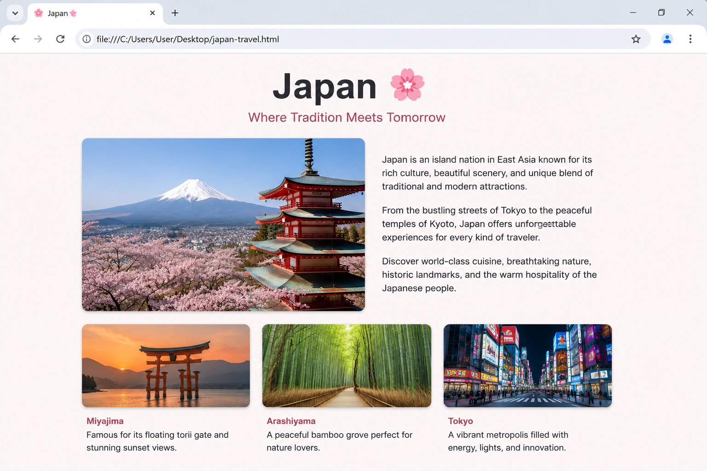

# 📝 Практика · Урок 3 «Картинки»

**Темы:** тег ``, атрибуты `src` и `alt`, размер `width`/`height` (`px` и `%`), картинка-ссылка ``, оформление `border`/`border-radius`, Emmet `>`. Плюс повторяем HTML и CSS с уроков 1–2.

> 🎯 **Как работать.** Делай в `.html`/`.css`, смотри в браузере через Live Server. Тебе понадобятся картинки — возьми свои, скачай с [unsplash.com](https://unsplash.com)/[pexels.com](https://pexels.com) или используй готовые из [`материалы/картинки/`](материалы/картинки/). Уровни: 🟢 базовые · 🟡 средние · 🔴 со звёздочкой. 💡 подсказка — наводка, а не готовый код.
>
> 📌 **Правила игры:** `` — одиночный тег; `src` — путь к файлу (имя буква-в-букву, с расширением); `alt` — обязателен; лучше задавать **только ширину**; файл должен лежать рядом с HTML (или по указанному пути).

---

## 🟢 Уровень 1 — базовый (обязательно)

**1. Первая картинка.**
Положи любую картинку в папку с `index.html` и покажи её на странице тегом `` с атрибутами `src` (имя файла) и `alt` (короткое описание). Убедись, что картинка появилась в браузере.
> 💡 Подсказка: ``. Имя в `src` должно точно совпадать с именем файла.

**2. Сила `alt`.**
Специально напиши в `src` несуществующее имя файла и посмотри, что покажет браузер вместо картинки. Затем верни правильное имя. Так ты увидишь, зачем нужен `alt`.
> 💡 Подсказка: при «битом» пути браузер покажет значок и текст из `alt` — вот его смысл.

**3. Задаём ширину.**
Сделай картинку шириной 200 пикселей. Попробуй оба способа: атрибутом `width="200"` в HTML и свойством `width: 200px;` в CSS. Убедись, что результат одинаковый.
> 💡 Подсказка: в HTML — ``, в CSS — `img { width: 200px; }`.

**4. Резиновая картинка.**
Задай картинке ширину `100%` и меняй размер окна браузера — картинка должна подстраиваться под ширину и не вылезать за края.
> 💡 Подсказка: `img { width: 100%; }`. Проценты считаются от ширины родителя.

**5. Рамка вокруг картинки.**
Добавь картинке рамку любого цвета толщиной 4 пикселя. Попробуй разные цвета и толщину.
> 💡 Подсказка: `img { border: 4px solid orange; }`. Формат: толщина, стиль (`solid`), цвет.

**6. Мягкие углы.**
Скругли углы картинки на 15 пикселей, чтобы она выглядела аккуратнее.
> 💡 Подсказка: `img { border-radius: 15px; }`.

**7. Круглая аватарка.**
Сделай из квадратной картинки круглую аватарку — как в соцсетях. Задай ширину 120px и скругление 50%.
> 💡 Подсказка: `img { width: 120px; border-radius: 50%; }`. Круг получится ровным, если картинка квадратная.

**8. Картинка-ссылка.**
Оберни картинку в ссылку `<a href="...">`, чтобы по клику открывался нужный сайт. Наведи мышь — курсор станет «рукой».
> 💡 Подсказка: ``. Emmet: `a>img`.

---

## 🟡 Уровень 2 — средний (для уверенности)

**9. Галерея через Emmet.**
Аббревиатурой Emmet `div>img*3` собери каркас галереи из трёх картинок, впиши в каждую `src` и `alt`, а через CSS задай всем одинаковую ширину и рамку.
> 💡 Подсказка: набери `div>img*3` + `Tab`. Затем `img { width: 150px; border: 3px solid teal; }`.

**10. Три аватарки в ряд.**
Сделай три круглые аватарки (можно одну и ту же картинку) с рамками **разного** цвета. Для разных цветов используй классы (`class="a1"`, `class="a2"`, `class="a3"`).
> 💡 Подсказка: у каждой картинки свой класс, в CSS — `.a1 { border-color: red; }` и т.д. Общие свойства (`border-radius: 50%`) можно задать всем `img`.

**11. Карточка игры.**
Собери карточку: заголовок `h1` (название игры), картинка-обложка (`width` ~200px, скруглённые углы), абзац `p` с описанием. Оформи через внешний `style.css`.
> 💡 Подсказка: используй `обложка-игры.svg` из материалов или свою картинку. Скругление — `border-radius: 12px;`.

**12. Порядок в проекте.**
Создай в проекте отдельную папку `images`, положи туда картинки и укажи путь `src="images/имя.jpg"`. Убедись, что всё работает — так делают в настоящих проектах.
> 💡 Подсказка: путь пишется через слеш: `src="images/кот.jpg"`.

**13. Подпись при наведении.**
Добавь картинке всплывающую подсказку, которая появляется, когда наводишь мышь. Загляни в «Часть 8» урока.
> 💡 Подсказка: атрибут `title="текст подсказки"` в теге ``.

**14. Повторяем всё вместе.**
Собери страницу «Мой питомец/герой»: `h1` (имя), картинка с рамкой, 2 абзаца `p`, линия `
`. Оформи через `style.css`: фон страницы, цвет заголовка, выравнивание по центру.
> 💡 Подсказка: соедини теги с уроков 1–3 и CSS с урока 2 (`background-color`, `color`, `text-align`).

---

## 🔴 Уровень 3 — со звёздочкой (челлендж)

**15. Галерея-ссылки.**
Сделай галерею из 4 картинок, где **каждая** картинка — ссылка на свою страницу/сайт. Собери каркас через Emmet.
> 💡 Подсказка: каждую картинку оберни в свой `<a>`. Emmet-каркас: `div>(a>img)*4`.

**16. Аватар профиля.**
Собери «шапку профиля»: круглая аватарка с толстой цветной рамкой, рядом (или под ней) имя `h2` и абзац «о себе». Подбери палитру.
> 💡 Подсказка: аватар — `width` + `border-radius: 50%` + `border`. Остальное — заголовок и абзац, оформленные CSS.

**17. Мини-исследование пропорций.**
Возьми одну картинку и создай три её копии: (1) только `width: 150px`; (2) `width: 150px; height: 150px`; (3) `width: 300px`. Сравни, какая исказилась и почему. Запиши вывод в комментарий.
> 💡 Подсказка: копия с заданными и шириной, и высотой «наугад» исказится, если картинка не квадратная. Вывод — задавать только ширину.

---

## 🏆 Итоговая работа урока — Постер «Место мечты»

Сделай **страницу-постер о месте, куда ты мечтаешь попасть**: город, страна, остров, космос или мир из любимой игры. Покажи фотографии, расскажи, чем оно классное, и дай ссылку «узнать больше» — как настоящая туристическая страничка.

**Пример темы:** «Япония», «Париж», «Мальдивы», «Марс», «Хогвартс», «Мир Genshin Impact».

### 📋 Что должно быть на странице

1. **Название места (`h1`)** — крупно, можно с эмодзи 🗺️.
   *Например:* `<h1>Япония 🗾</h1>`
2. **Главное фото места (``)** — большое, с рамкой или скруглением.
3. **Рассказ (2–3 абзаца `p`)** — чем место привлекает, что там посмотреть, почему именно оно.
4. **Ещё картинки (минимум 2 всего)** — виды, еда, достопримечательности; у каждой осмысленный `alt`.
5. **Картинка-ссылка «Узнать больше»** — ведёт на статью о месте (например, Википедия).
6. **Внешний `style.css`**: фон под настроение места, цвета, выравнивание.

### ✅ Требования (проверь по списку)
- ✅ `h1` — название места;
- ✅ **минимум 2 картинки** с осмысленным `alt` и заданным размером (`width`);
- ✅ хотя бы одна картинка оформлена — рамка `border` и/или скругление `border-radius` (круглая «марка» места — плюс);
- ✅ 2–3 абзаца `p` с живым рассказом;
- ✅ хотя бы одна **картинка-ссылка** (``) «Узнать больше»;
- ✅ стили во внешнем `style.css`: фон, цвета, выравнивание.

### 💡 Подсказки
- Нет своих фото? Возьми с [unsplash.com](https://unsplash.com)/[pexels.com](https://pexels.com) или готовые из `материалы/картинки/`.
- Чтобы картинки не «выпрыгивали» — задай им `width` (в `px` или `%`).
- Мини-галерею видов собери Emmet-ом: `div>img*3`.
- Фон подбери под место: тёплый песочный для пляжа, тёмный звёздный для космоса.

**Как это должно выглядеть (ориентир):**

> 🖼 *Ориентир по структуре; место и фото — твои. Если картинки-ориентира пока нет — её подготовит учитель.*

**🌟 Мини-челлендж (по желанию):** добавь блок «Топ-3, что попробовать» — три фото с подписями в ряд (`div>img*3`), каждое — картинка-ссылка.

---

> ✅ **🟢 — база есть. 🟡 — уверенно. 🔴 — мастер картинок!**
> 🆘 Застрял — открой [самоучитель.md](самоучитель.md).
> 📌 Быстро вспомнить — [итого.md](итого.md).
