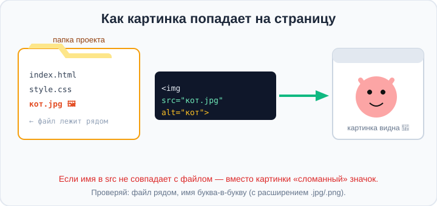
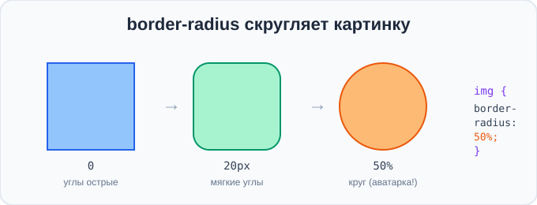

# Урок 3 — Картинки на странице: тег `` 🖼️🐱

**Модуль 1 · Старт: HTML + первые стили · Урок 3 из 6 | 2 ак.ч. (1,5 часа)**

> ⬅️ [Все уроки модуля](../README.md) · [План курса](../../ПЛАН-КУРСА.md) · Предыдущий: [Урок 2 «Подключаем CSS»](../урок-02-подключаем-css/урок.md) · Следующий: Урок 4 «Цвет» ➡️

> 🔁 В начале — [разминка/повтор](повторение.md).
> 📌 Быстро вспомнить — [итого.md](итого.md). 👨‍🏫 Сценарий — [преподавателю.md](преподавателю.md). 🖼 Проектор — [изображения.md](изображения.md).
> 🆘 **Пропустил урок?** — [самоучитель.md](самоучитель.md). 🧰 Больше трюков — [лайфхак.md](лайфхак.md), но главные разбираем прямо в уроке (значок 🧰).

> 🧭 **Как читать урок.** Наши страницы уже с цветом — но пока без картинок, а без них скучно! Сегодня добавим **изображения** тегом ``: котиков, обложки игр, аватарки. Научимся правильно указывать **путь к файлу**, задавать **размер**, делать **круглые аватарки** и **картинки-ссылки**. А ещё возьмём новый приём Emmet — `>` — чтобы быстро собирать галереи.

---

## 🎮 Что мы сделаем сегодня и что получим

**Задача:** оживить страницу картинками и собрать **мини-галерею** (котики/мемы) или **карточку игры с обложкой**.

**В итоге** ты будешь уметь вставлять картинки, задавать им размер, делать круглые аватарки и превращать картинку в ссылку.

**Главные навыки урока:** тег **``** · атрибуты **`src`** (путь к файлу) и **`alt`** (подпись) · **размер** `width`/`height` (в `px` и `%`) · **картинка-ссылка** (`<a></a>`) · CSS для картинки: **`border`**, **`border-radius`** (круглые аватарки) · **Emmet `>`** (вложенность).

> 💡 **Главная мысль урока:** **`` не хранит картинку — он показывает, ГДЕ она лежит (`src`).** Браузер идёт по этому пути, находит файл и рисует его. Ошибся в пути — картинки не будет.

---

## Часть 1 — Первая картинка: тег ``

Картинку вставляют **одиночным** тегом `` (помнишь непарные теги с урока 1? — вот один из них). У него два главных атрибута:

```html

```

- **`src`** (source — «источник») — **путь к файлу** картинки. Здесь файл `кот.jpg`.
- **`alt`** (alternative — «замена») — **текст-подпись**: он показывается, если картинка не загрузилась, и его читают программы для незрячих.



**Чтобы картинка появилась, нужен сам файл.** Положи файл картинки **в папку проекта** (рядом с `index.html`) и укажи его имя в `src`.

> 🧰 **Где взять картинки (бесплатно и легально):**
> - свои фото или рисунки;
> - бесплатные фотостоки: [unsplash.com](https://unsplash.com), [pexels.com](https://pexels.com) (скачай → положи в папку);
> - для тренировки уже есть готовые: [`материалы/картинки/кот.svg`](материалы/картинки/кот.svg) и [`обложка-игры.svg`](материалы/картинки/обложка-игры.svg).

> ✍️ **Мини-задание 1:** скачай любую картинку (или возьми `кот.svg` из материалов), положи её в папку с `index.html` и покажи на странице через ``.
> <details><summary>💡 подсказка</summary>Имя в <code>src</code> должно точно совпадать с именем файла, включая расширение (<code>.jpg</code>, <code>.png</code>, <code>.svg</code>).</details>

> ⚠️ **Ошибка №1 новичка:** на месте картинки — «сломанный» значок 🖼️❌. Значит браузер **не нашёл файл** по пути `src`. Проверь: файл лежит **рядом** с HTML, а имя совпадает **буква-в-букву** (и большие/маленькие буквы, и расширение).

---

## Часть 2 — Зачем нужен `alt`

`alt` кажется мелочью, но он важен:
1. **Картинка не загрузилась** (нет интернета, неверный путь) — вместо неё видно текст `alt`, и понятно, что там должно быть.
2. **Незрячие пользователи** слушают страницу через специальную программу — она читает `alt` вслух.
3. **Поисковики** (Google) по `alt` понимают, что на картинке.

```html

```

> 💡 **Правило:** `alt` пишем **по смыслу** — коротко описываем, что на картинке. Для украшений-«завитушек» можно оставить пустым: `alt=""`.

> ✍️ **Мини-задание 2:** специально ошибись в имени файла в `src` (например, `кот2.jpg`) и посмотри, что покажет браузер вместо картинки. Верни правильное имя.
> <details><summary>💡 подсказка</summary>При «битом» пути браузер покажет значок и текст из <code>alt</code> — вот зачем он нужен.</details>

---

## Часть 3 — Размер картинки: `width` и `height`

Картинки бывают огромные — на всю страницу. Зададим им размер. Есть два способа: **атрибутом** в HTML или **свойством** в CSS.

**В HTML — атрибут `width` (ширина в пикселях):**
```html

```

**В CSS — свойство `width`:**
```css
img { width: 200px; }
```

> 💡 **Секрет пропорций.** Если задать **только ширину** (`width`), высота подстроится сама — картинка не исказится. А вот если задать **и `width`, и `height`** «на глаз» — картинка **сплющится** или **растянется**. Поэтому чаще задают только ширину.

**Ширина в процентах `%`** — картинка подстраивается под ширину блока (вспомни `px` и `%` с урока 2, где мы говорили про размеры):
```css
img { width: 100%; }   /* картинка на всю ширину родителя */
img { width: 50%; }    /* половина ширины */
```

- 👀 `width: 100%` — удобно, чтобы картинка **не вылезала** за края и подстраивалась под экран.

> ✍️ **Мини-задание 3:** покажи одну картинку шириной `200px`, а другую — шириной `100%`. Поменяй размер окна браузера и посмотри, какая из них подстраивается.
> <details><summary>💡 подсказка</summary>Первой задай <code>width="200"</code> (или CSS <code>width:200px</code>), второй — <code>width:100%</code> в CSS.</details>

> ⚠️ **Ошибка:** задать `width="200"` **и** `height="400"` наугад — кот станет «вытянутым». Задавай **только ширину**, и пропорции сохранятся.

---

## Часть 4 — Блоки `<div>`, `<span>` и Emmet `>`: собираем галерею

Чтобы собрать галерею, познакомимся с **`<div>`** — это «коробка-контейнер», в которую складывают другие элементы, чтобы **сгруппировать** их (например, все картинки галереи). Сам по себе `<div>` ничего не рисует — он просто объединяет содержимое в один блок. Его младший брат **`<span>`** — такая же обёртка, но для **кусочка текста** внутри строки.

> 💡 **Блочные и строчные элементы — важная разница!** Заметил, что заголовки и абзацы всегда занимают **всю строку** (следующий встаёт под ними), а картинки и ссылки стоят **в ряд**, пока хватает места?
> - **блочные** (`div`, `h1`, `p`, `hr`) — каждый **с новой строки**, во всю ширину;
> - **строчные** (`img`, `span`, `a`) — стоят **в ряд** друг за другом, как слова.
>
> Именно поэтому несколько `` подряд сами выстраиваются в линию — удобно для галереи! А управлять этим поведением умеет свойство **`display`** — им мы займёмся на следующем уроке, когда будем ставить в ряд карточки-блоки.

Теперь новый приём Emmet — **`>`** (означает «внутри», вложенность). Помнишь `+` (рядом) и `*` (повтор) с урока 1? Соберём галерею — картинки внутри контейнера `div`:

```
div>img*3
```
развернётся в:
```html
<div>
    
    
    
</div>
```

- `div>img` — «внутри `div` положи `img`»;
- `*3` — «повтори три раза».

Так за секунду собирается **каркас галереи** из трёх картинок — останется вписать `src` и `alt`.

> 🧰 **Копилка Emmet растёт:** `!` (каркас), `+` (рядом), `*` (повтор), `{текст}`, а теперь **`>`** (внутрь). Скоро добавим ещё.

> ✍️ **Мини-задание 4:** аббревиатурой Emmet `div>img*4` создай каркас галереи из четырёх картинок. Впиши в них `src` и `alt`.
> <details><summary>💡 подсказка</summary>Набери <code>div>img*4</code> и нажми <code>Tab</code>. Потом заполни атрибуты.</details>

---

## Часть 5 — Картинка-ссылка

Помнишь, картинки на сайтах часто **кликабельны**? Чтобы сделать картинку ссылкой, её оборачивают в тег `<a>` (ссылку изучим подробно в следующем модуле, а пока — приём):

```html
<a href="https://ru.wikipedia.org/wiki/Кошка">
    
</a>
```

- 👀 Теперь клик по картинке ведёт на другую страницу. Наведи мышь — курсор станет «рукой».

Emmet соберёт это одной строкой: **`a>img`**.

> ✍️ **Мини-задание 5:** сделай картинку-ссылку: оберни любую картинку в `<a href="...">` со ссылкой на любимый сайт.
> <details><summary>💡 подсказка</summary>Emmet: <code>a>img</code> + <code>Tab</code>. В <code>href</code> впиши адрес сайта, в <code>img</code> — <code>src</code> и <code>alt</code>.</details>

---

## Часть 6 — Украшаем картинку через CSS: рамка и скругление

Картинки можно оформлять теми же приёмами CSS, что и текст. Два самых эффектных свойства:

**1. `border` — рамка** (толщина, стиль, цвет):
```css
img {
    border: 4px solid #f59e0b;   /* оранжевая рамка 4px */
}
```

**2. `border-radius` — скругление углов:**
```css
img { border-radius: 12px; }   /* мягкие углы */
img { border-radius: 50%; }    /* КРУГ — идеально для аватарок! */
```



- 👀 `border-radius: 50%` превращает квадратную картинку в **круглую аватарку** — как в соцсетях и играх.

**Соберём «аватарку с рамкой»:**
```css
.avatar {
    width: 120px;
    border-radius: 50%;
    border: 4px solid gold;
}
```
```html

```

> 💡 Здесь мы впервые применили **класс** (`class="avatar"` в HTML и `.avatar` в CSS), чтобы оформить **конкретную** картинку, а не все сразу. Классы подробно разберём в модуле про блоки — пока просто приём «дай имя элементу и стилизуй по имени».

> ✍️ **Мини-задание 6:** сделай круглую аватарку из своей картинки: ширина `120px`, `border-radius: 50%`, рамка любого цвета.
> <details><summary>💡 подсказка</summary>Правило: <code>img { width:120px; border-radius:50%; border:4px solid teal; }</code> — или через класс.</details>

> 🧰 **Лайфхак:** чтобы `border-radius: 50%` дал **ровный круг**, картинка должна быть **квадратной** (ширина = высота). Если фото прямоугольное — получится овал (ровно обрезать научимся позже свойством `object-fit`).

---

## Часть 7 — Мини-проект: «Галерея» или «Карточка игры» 🎨

Собери одно из двух (или оба!).

**Вариант A — Галерея котиков/мемов:**
```html
<h1>Галерея котиков 🐱</h1>
<div>
    
    
    
</div>
```
```css
img {
    width: 150px;
    border-radius: 12px;
    border: 3px solid #f59e0b;
}
```

**Вариант B — Карточка игры с обложкой:**
```html
<h1>Space Run 🚀</h1>

<p>Космическая аркада: уворачивайся от астероидов и собирай звёзды!</p>
```

- 👀 Картинки превращают «текстовую» страницу в **настоящий сайт**.

> 🎨 **Твоя тема:** сделай галерею на свой вкус — любимые игры, мемы, животные, машины, аниме. Главное — несколько `` с `alt`, заданный размер и оформление (рамка/скругление).

> 🧩 **Для 5–7 классов (проще):** хватит **одной** картинки с `alt`, заданной ширины и рамки. Круглую аватарку — по желанию.

---

## 🐞 Разбор частых ошибок

| Что видно | Что случилось | Как починить |
|-----------|---------------|--------------|
| «сломанный» значок вместо картинки | неверный `src` / файла нет рядом | проверь путь и имя буква-в-букву |
| картинка огромная, на всю страницу | не задан размер | задай `width` (в `px` или `%`) |
| кот «сплющен»/«растянут» | задал и `width`, и `height` наугад | задай **только** ширину |
| `border-radius: 50%` даёт овал | картинка не квадратная | возьми квадратную (или позже `object-fit`) |
| пустое место и текст вместо фото | сработал `alt` (файл не найден) | это подсказка — чини `src` |

> ⚠️ Нет картинки? Проверь: файл **рядом** с HTML, имя в `src` **точно** совпадает (с расширением), есть ли вообще этот файл в папке.

---

## 🎓 Часть 8 — Для тех, кто хочет глубже

- **`title`** у картинки: `` — всплывающая подсказка при наведении.
- **Папка для картинок:** обычно все изображения складывают в отдельную папку `images/` (или `img/`) и пишут путь `src="images/кот.jpg"` — так порядок в проекте.
- **Фоновая картинка** (не тег, а CSS): `body { background-image: url(fon.jpg); }` — разберём подробно в модуле про блоки.
- **Что дальше про картинки:** позже узнаем `object-fit` (ровно обрезать фото под рамку), `<figure>/<figcaption>` (картинка с подписью) и `<picture>` (разные картинки для разных экранов).

---

## 🏁 Итог урока

Сегодня страница ожила картинками:

- ✅ **``** — одиночный тег; `src` — путь к файлу, `alt` — текст-замена/подпись.
- ✅ **Размер** — `width`/`height`; задавай **только ширину**, чтобы не исказить (в `px` или `%`).
- ✅ **`width: 100%`** — картинка не вылезает за края.
- ✅ **Картинка-ссылка** — `<a></a>`.
- ✅ **CSS для картинки** — `border` (рамка), `border-radius` (`50%` = круг-аватарка).
- ✅ **Emmet `>`** — вложенность (`div>img*3`).

> 🏆 Главное: **`` показывает, где лежит картинка; браузер идёт по пути и рисует её.** Быстро повторить — в [итого.md](итого.md).

> 🎤 **Блиц:** какой тег вставляет картинку и парный ли он? зачем `src` и зачем `alt`? как сделать круглую аватарку? почему нельзя задавать `width` и `height` наугад? что развернёт Emmet из `div>img*3`?

### 🎮 Викторина-закрепление
Открой **[викторина.html](викторина.html)** — вопросы по картинкам **+ повторение уроков 1–2** + смешные и «на подумать».

➡️ **Практика урока** — **[практика.md](практика.md)**: задачи в 3 уровнях + итоговая работа.
🆘 **Пропустил / хочешь ещё?** — [самоучитель.md](самоучитель.md). 📌 **Шпаргалка** — [итого.md](итого.md).

---

## 🔗 Навигация

⬅️ [Урок 2](../урок-02-подключаем-css/урок.md) · [Все уроки модуля](../README.md) · [План курса](../../ПЛАН-КУРСА.md) · **Следующий:** Урок 4 «Цвет» ➡️

**🧰 Инструменты:** [VS Code](https://code.visualstudio.com/) + [Live Server](https://marketplace.visualstudio.com/items?itemName=ritwickdey.LiveServer). **📄 Пример механики:** [`материалы/пример-картинка.html`](материалы/пример-картинка.html) + готовые картинки в [`материалы/картинки/`](материалы/картинки/).
