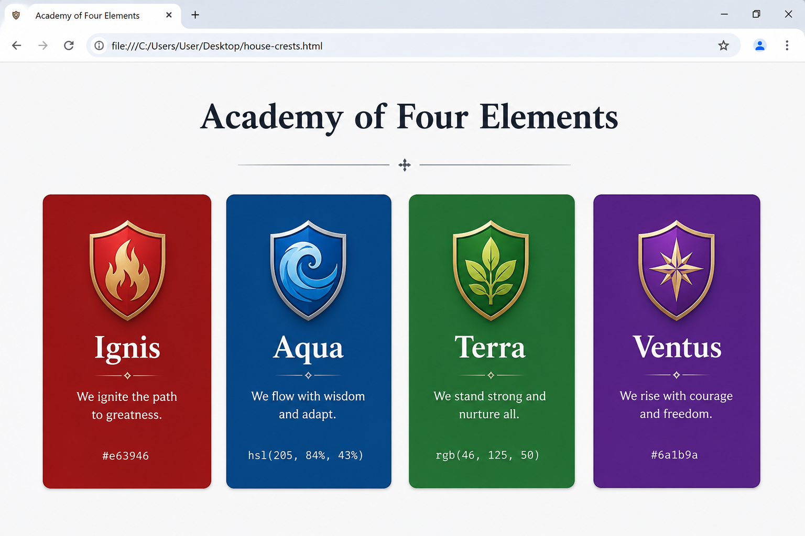

# 📝 Практика · Урок 4 «Цвет»

**Темы:** форматы цвета (имя, HEX, RGB(A), HSL(A)), прозрачность (alpha, `transparent`), `currentColor`, знакомство с `oklch`/`color-mix`. Плюс повторяем подключение CSS и картинки (уроки 2–3).

> 🎯 **Как работать.** Делай в `.html`/`.css`, смотри в браузере через Live Server. Активно пользуйся **палитрой-пипеткой VS Code** (наведись на цветной код → кликни квадратик). Уровни: 🟢 базовые · 🟡 средние · 🔴 со звёздочкой. 💡 подсказка — наводка, а не готовый код.
>
> 📌 **Правила игры:** HEX = `#` + 6 символов (`0–9`, `a–f`); RGB-каналы `0–255`; в HSL у насыщенности и светлоты обязателен `%`; прозрачность (alpha) — от `0` до `1`.

---

## 🟢 Уровень 1 — базовый (обязательно)

**1. Три места цвета.**
Сделай заголовок или блок, у которого разными цветами заданы: цвет текста, цвет фона и цвет рамки. Пока используй имена цветов (`navy`, `gold`, `tomato` и т.п.). Убедись, что все три части — разного цвета.
> 💡 Подсказка: `color` — текст, `background-color` — фон, `border: 3px solid цвет;` — рамка.

**2. Коллекция имён.**
Найди и попробуй 5 необычных именованных цветов (например, `salmon`, `khaki`, `plum`, `indigo`, `chocolate`). Сделай пять абзацев, каждый — своего цвета. Запомни те, что понравились.
> 💡 Подсказка: имена пишутся одним английским словом: `color: salmon;`.

**3. Читаем HEX.**
Не подглядывая в браузер, догадайся, какие цвета дадут коды `#000000`, `#ffffff`, `#ff0000`, `#00ff00`. Потом проверь, покрасив ими четыре блока. Совпало?
> 💡 Подсказка: `#RRGGBB` — сколько красного, зелёного, синего. Все нули — чёрный, всё `ff` — белый.

**4. Пипетка VS Code.**
Напиши `background-color: #ffffff;`, наведи курсор на код → кликни по цветному квадратику → выбери любой цвет мышкой в открывшейся палитре. Подбери так три разных фона для трёх блоков.
> 💡 Подсказка: квадратик-превью появляется слева от HEX-кода. Это встроенная пипетка.

**5. Знакомимся с RGB.**
Задай три цвета через `rgb(...)`: чистый красный, чистый зелёный, чистый синий. Вспомни: каждый канал от 0 до 255.
> 💡 Подсказка: `rgb(255,0,0)`, `rgb(0,255,0)`, `rgb(0,0,255)`.

**6. Полупрозрачный фон.**
Сделай страницу с ярким фоном (у `body`), а поверх — блок с полупрозрачным фоном через `rgba(...)` с alpha `0.4`. Посмотри, как нижний цвет «просвечивает» сквозь блок.
> 💡 Подсказка: `body { background-color: gold; }`, блок — `background-color: rgba(0,0,255,0.4);`.

**7. Знакомимся с HSL.**
Задай три цвета через `hsl(...)`: красный (тон 0), зелёный (тон 120), синий (тон 240). У всех насыщенность 100% и светлота 50%.
> 💡 Подсказка: `hsl(0,100%,50%)`, `hsl(120,100%,50%)`, `hsl(240,100%,50%)`. Не забудь `%`.

**8. Оттенки одного цвета (HSL).**
Возьми один тон (например, H=280, фиолетовый) и сделай три карточки, меняя только светлоту L: 30%, 50%, 70%. Получишь красивую гамму «от тёмного к светлому».
> 💡 Подсказка: `hsl(280,80%,30%)`, `hsl(280,80%,50%)`, `hsl(280,80%,70%)`.

---

## 🟡 Уровень 2 — средний (для уверенности)

**9. Один цвет — четыре записи.**
Возьми любой цвет (например, оранжевый) и запиши его четырьмя способами: именем, HEX, RGB и HSL. Покрась ими четыре блока и убедись, что они выглядят одинаково.
> 💡 Подсказка: оранжевый ≈ `orange` = `#ffa500` = `rgb(255,165,0)`. HSL подбери пипеткой или в палитре coolors.

**10. Плашка на картинке.**
Возьми картинку с урока 3, положи поверх неё полупрозрачную тёмную плашку (`rgba(0,0,0,0.4)`) с белым текстом — как подпись к фото. Текст должен читаться поверх картинки.
> 💡 Подсказка: блок с текстом получает `background-color: rgba(0,0,0,0.4); color: white;`.

**11. `currentColor`.**
Сделай «бейдж»: задай ему `color` (цвет текста), а рамку — через `currentColor`. Поменяй `color` и убедись, что рамка меняется вместе с текстом автоматически.
> 💡 Подсказка: `border: 2px solid currentColor;` — рамка берёт цвет из `color`.

**12. Светофор.**
Собери «светофор»: три круглых блока (`border-radius: 50%`) — красный, жёлтый, зелёный. Используй разные форматы для разных огней (один HEX, один RGB, один HSL).
> 💡 Подсказка: круглые блоки — `width`, `height` и `border-radius: 50%`. Цвета — в трёх форматах.

**13. Смешиваем краски (`color-mix`).**
Через `color-mix(in srgb, ...)` получи три оттенка: «tomato + белый» (нежный), «tomato 60% + белый», «tomato + чёрный» (тёмный). Покрась ими блоки и сравни.
> 💡 Подсказка: `background-color: color-mix(in srgb, tomato, white);` и меняй проценты/второй цвет.

**14. Повторяем: карточка с картинкой.**
Собери карточку игры/фильма (картинка + заголовок + описание) и подбери ей **гармоничную палитру** из HSL: фон карточки, цвет заголовка и текста — оттенки одного тона.
> 💡 Подсказка: возьми один H, меняй S и L для фона/текста. Стили — во внешнем `style.css`.

---

## 🔴 Уровень 3 — со звёздочкой (челлендж)

**15. Палитра-градация.**
Сделай ряд из 5 блоков одного тона HSL, где светлота L плавно растёт: 20%, 35%, 50%, 65%, 80%. Получится профессиональная «шкала» одного цвета.
> 💡 Подсказка: один H и S, меняй только L с шагом 15%.

**16. Тёмная и светлая тема.**
Собери одну страницу в двух вариантах (два `style.css` или два блока): «светлая тема» (светлый фон, тёмный текст) и «тёмная тема» (тёмный фон, светлый текст). Следи, чтобы текст везде читался.
> 💡 Подсказка: в тёмной теме фон ~`hsl(220,20%,12%)`, текст ~`hsl(0,0%,90%)`. Проверь контраст.

**17. Свой фирменный цвет.**
Придумай «бренд» (игра, канал, кафе) и один главный фирменный цвет. Построй на нём палитру: сам цвет + светлее (`color-mix` с white) + темнее (`color-mix` с black) + полупрозрачный вариант. Оформи мини-страницу этими четырьмя оттенками.
> 💡 Подсказка: базовый цвет в HEX, светлее/темнее — через `color-mix`, полупрозрачный — через `rgba`.

---

## 🏆 Итоговая работа урока — «Гербы команд / факультетов»

Придумай свой мир — школу магии, космическую лигу, киберспорт-турнир или королевство — и **4 команды (факультета)**, у каждой свой **фирменный цвет**. Собери страницу с их «гербами»-карточками, записав цвета в **разных форматах** (имя, HEX, RGB, HSL).

**Пример темы:** факультеты школы магии, гильдии в игре, команды по квиддичу, космические флоты, отряды супергероев.

### 📋 Что должно быть на странице

1. **Название мира/лиги (`h1`)** — крупно, по центру.
   *Например:* `<h1>🏰 Академия Четырёх Стихий</h1>`
2. **4 карточки-герба** — блоки (`div`) с фоном фирменного цвета, отступами и скруглением. Каждая карточка содержит:
   - **название команды** (`h2` или `h3`);
   - **девиз** (короткий абзац `p`);
   - **код её цвета** мелким моноширинным текстом (например, `#e63946`).
   *Например:* «🔥 Отряд Пламени — Никогда не сдаёмся! — hsl(6, 78%, 57%)».
3. **Внешний `style.css`** со всеми стилями.

### ✅ Требования (проверь по списку)
- ✅ `h1` — название твоего мира;
- ✅ **4 карточки** (блоки с `background-color`, `padding`, `border-radius`);
- ✅ фирменные цвета записаны **минимум в 3 форматах** (например: 1-я — именем, 2-я — HEX, 3-я — RGB, 4-я — HSL);
- ✅ хотя бы одна карточка использует **прозрачность** (`rgba`/`hsla`) или **`color-mix`**;
- ✅ на каждой карточке подписан код её цвета;
- ✅ текст читается на фоне каждого герба (следи за контрастом);
- ✅ стили во внешнем `style.css`.

### 💡 Подсказки
- Чтобы карточки-гербы встали **в ряд**, задай им `display: inline-block` и ширину (урок, Часть 7).
- Подбери 4 сочетающихся цвета готовой палитрой на [coolors.co](https://coolors.co).
- Один цвет в разных форматах поможет записать палитра-пипетка VS Code (переключай HEX/RGB/HSL кликом).
- Тёмный фон герба → светлый текст, и наоборот — так девиз будет читаться.
- Скругли карточки `border-radius`, добавь отступы `padding: 30px` — будет солиднее.

**Как это должно выглядеть (ориентир):**

> 🖼 *Ориентир по структуре; мир и цвета — твои. Если картинки-ориентира пока нет — её подготовит учитель.*

**🌟 Мини-челлендж (по желанию):** сделай пятую карточку — «Финал / Победитель», смешав два фирменных цвета через `color-mix(in srgb, цвет1, цвет2)`.

---

> ✅ **🟢 — база есть. 🟡 — уверенно. 🔴 — мастер цвета!**
> 🆘 Застрял — открой [самоучитель.md](самоучитель.md).
> 📌 Быстро вспомнить — [итого.md](итого.md).
