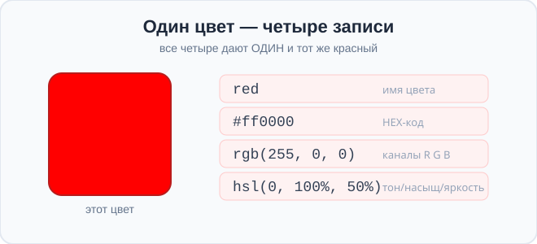
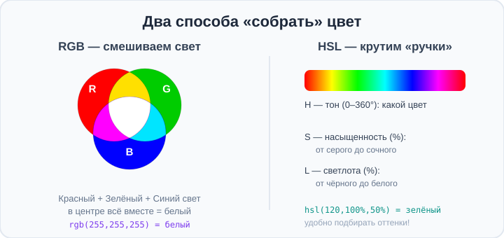
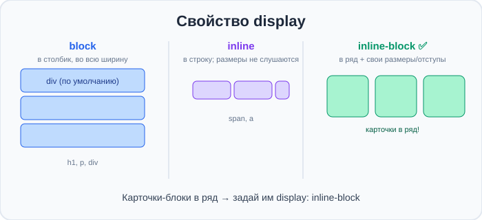

# Урок 4 — Цвет: HEX, RGB, HSL и прозрачность 🎨🌈

**Модуль 1 · Старт: HTML + первые стили · Урок 4 из 6 | 2 ак.ч. (1,5 часа)**

> ⬅️ [Все уроки модуля](../README.md) · [План курса](../../ПЛАН-КУРСА.md) · Предыдущий: [Урок 3 «Картинки»](../урок-03-картинки/урок.md) · Следующий: Урок 5 «Текст и размеры» ➡️

> 🔁 В начале — [разминка/повтор](повторение.md).
> 📌 Быстро вспомнить — [итого.md](итого.md). 👨‍🏫 Сценарий — [преподавателю.md](преподавателю.md). 🖼 Проектор — [изображения.md](изображения.md).
> 🆘 **Пропустил урок?** — [самоучитель.md](самоучитель.md). 🧰 Больше трюков — [лайфхак.md](лайфхак.md), но главные разбираем прямо в уроке (значок 🧰).

> 🧭 **Как читать урок.** Мы уже красили `red` и парой HEX-кодов. Сегодня разберёмся с цветом **по-настоящему**: узнаем **четыре способа записать любой цвет** (имя, HEX, RGB, HSL), научимся делать цвет **полупрозрачным** и заглянем в **современные** способы (`oklch`, `color-mix`), которыми уже пользуются на реальных сайтах. В конце соберём **«Палитру настроений»**.

---

## 🎮 Что мы сделаем сегодня и что получим

**Задача:** научиться задавать **любой** цвет и собрать страницу-палитру из цветных карточек.

**В итоге** ты сможешь подобрать точный цвет в любом формате и делать красивые полупрозрачные эффекты.

**Главные навыки урока:** где применяется цвет (`color`, `background-color`, `border-color`) · **4 формата**: имя, **HEX**, **RGB(A)**, **HSL(A)** · **прозрачность** (alpha, `transparent`) · `currentColor` · знакомство с 🆕 **`oklch()`** и **`color-mix()`** · блоки **`<div>`/`<span>`** и **`display`** (block/inline/inline-block) — карточки в ряд.

> 💡 **Главная мысль урока:** **один и тот же цвет можно записать по-разному — имя, HEX, RGB, HSL. Это просто разные "языки" для одного цвета.** Компьютер внутри всё равно хранит цвет как смесь красного, зелёного и синего света.

---

## Часть 1 — Где живёт цвет

Цвет в CSS задают у многих свойств. Три главных ты уже частично видел:

```css
h1 {
    color: darkblue;              /* цвет ТЕКСТА */
    background-color: lightyellow; /* цвет ФОНА */
    border: 3px solid tomato;      /* цвет РАМКИ (внутри border) */
}
```

Значение цвета везде записывается **одинаково** — и неважно, какой из четырёх форматов ты выберешь. Давай разберём все четыре.

> ✍️ **Мини-задание 1:** сделай блок (или заголовок), у которого цвет текста, фона и рамки — три разных цвета. Пока используй имена (`red`, `gold`, `navy`).
> <details><summary>💡 подсказка</summary><code>color</code>, <code>background-color</code> и <code>border</code> — три свойства с разными цветами.</details>

---

## Часть 2 — Способ 1: имена цветов

Самый простой способ — написать **английское название** цвета. Их около **140**:

```css
color: red;        color: gold;       color: teal;
color: crimson;    color: coral;      color: tomato;
color: navy;       color: orchid;     color: turquoise;
```

Есть два особых значения:
- **`transparent`** — **прозрачный** (совсем невидимый, «нет цвета»).
- **`currentColor`** — «тот же цвет, что и у текста» (`color`). Удобно, чтобы рамка совпадала с цветом текста.

```css
.badge {
    color: crimson;
    border: 2px solid currentColor;   /* рамка станет тоже crimson */
}
```

> 💡 Имена удобны для быстрого старта, но их мало и точный оттенок ими не подобрать. Для точности — форматы ниже.

> ✍️ **Мини-задание 2:** найди и попробуй 5 «необычных» имён цветов (например, `salmon`, `khaki`, `plum`, `indigo`, `chocolate`). Сделай пять абзацев разного цвета.
> <details><summary>💡 подсказка</summary>Имена пишутся в одно слово, по-английски: <code>color: salmon;</code>.</details>

---

## Часть 3 — Способ 2: HEX-код

**HEX** (шестнадцатеричный код) — самый популярный формат у дизайнеров. Выглядит так:

```css
color: #ff0000;   /* красный */
color: #00ff00;   /* зелёный */
color: #2965f1;   /* синий */
```



**Как читать `#RRGGBB`:** после `#` идут **три пары** символов — сколько **К**расного, **З**елёного, **С**инего. Каждая пара — от `00` (нет) до `ff` (максимум).

- `#ff0000` — только красный на максимум → красный.
- `#000000` — всего по нулям → **чёрный**.
- `#ffffff` — всё на максимум → **белый**.
- `#808080` — всё поровну посередине → **серый**.

**Короткая запись `#RGB`:** если в парах одинаковые символы, можно втрое короче: `#ff0000` = `#f00`, `#ffffff` = `#fff`.

> 🧰 **Лайфхак: пипетка прямо в VS Code.** Наведи курсор на любой HEX-код — появится **квадратик-превью** цвета, кликни по нему → откроется **палитра-пипетка**, выбирай цвет мышкой, код подставится сам. Больше не нужно угадывать коды!

> ✍️ **Мини-задание 3:** подбери три HEX-цвета через палитру VS Code (кликни по цветному квадратику у кода) и раскрась ими фон трёх блоков.
> <details><summary>💡 подсказка</summary>Напиши <code>background-color: #ffffff;</code>, наведись на код → кликни квадратик → выбери цвет мышкой.</details>

> ⚠️ **Ошибка:** забыть `#` (`color: ff0000;`) или написать лишние символы. HEX — это **`#` + 6 (или 3)** символов из `0–9` и `a–f`.

---

## Часть 4 — Способ 3: RGB и прозрачность RGBA

**RGB** записывает цвет как три числа — сколько **R**ed, **G**reen, **B**lue, каждое от **0 до 255**:

```css
color: rgb(255, 0, 0);      /* красный */
color: rgb(0, 0, 0);        /* чёрный */
color: rgb(255, 255, 255);  /* белый */
color: rgb(128, 128, 128);  /* серый */
```



- 👀 Как на схеме: цвет — это **смесь трёх цветных лучей света**. Все три на максимум = белый.

**RGBA** — то же самое, но с **прозрачностью** (alpha) — четвёртое число от `0` (невидимо) до `1` (непрозрачно):

```css
background-color: rgba(255, 0, 0, 0.5);   /* красный, полупрозрачный */
background-color: rgba(0, 0, 0, 0.2);     /* лёгкая тёмная плёнка */
```

- 👀 Прозрачность нужна для «стеклянных» эффектов, теней, наложений текста на картинку.

> 💡 **Современный синтаксис:** сейчас можно писать и через пробелы, а alpha — через `/`: `rgb(255 0 0 / 50%)`. Оба варианта работают. Старый (с запятыми) проще для начала.

> ✍️ **Мини-задание 4:** сделай блок с полупрозрачным цветным фоном (`rgba(...)` с alpha `0.4`) поверх страницы с фоном другого цвета — увидишь, как нижний цвет «просвечивает».
> <details><summary>💡 подсказка</summary><code>body</code> покрась в один цвет, блок — <code>background-color: rgba(0,0,255,0.4)</code>.</details>

---

## Часть 5 — Способ 4: HSL — самый удобный для подбора

**HSL** описывает цвет по-человечески — тремя «ручками»:

```css
color: hsl(0, 100%, 50%);     /* красный */
color: hsl(120, 100%, 50%);   /* зелёный */
color: hsl(240, 100%, 50%);   /* синий */
```

- **H (Hue) — тон:** какой это цвет, по кругу от `0` до `360°` (0 — красный, 120 — зелёный, 240 — синий).
- **S (Saturation) — насыщенность:** `0%` — серый, `100%` — сочный.
- **L (Lightness) — светлота:** `0%` — чёрный, `50%` — чистый цвет, `100%` — белый.

**Почему HSL любят:** легко подбирать **оттенки одного цвета** — крути только светлоту:

```css
hsl(210, 90%, 30%)   /* тёмно-синий */
hsl(210, 90%, 50%)   /* синий */
hsl(210, 90%, 70%)   /* светло-синий */
```

- 👀 Меняем только последнее число (L) — получаем готовую гамму «от тёмного к светлому». В HEX так просто не сделать!

**HSLA** — с прозрачностью, как RGBA: `hsla(210, 90%, 50%, 0.5)`.

> ✍️ **Мини-задание 5:** сделай три карточки одного тона (например, H=280 — фиолетовый), меняя только светлоту L (30%, 50%, 70%). Получишь красивую гамму.
> <details><summary>💡 подсказка</summary><code>hsl(280, 80%, 30%)</code>, <code>hsl(280, 80%, 50%)</code>, <code>hsl(280, 80%, 70%)</code>.</details>

---

## Часть 6 — Заглянем в будущее: `oklch()` и `color-mix()` 🆕

Это **современные** способы (ими **уже можно** пользоваться на реальных сайтах — их понимают все свежие браузеры). Пока просто познакомимся.

**`oklch()`** — новый формат, где цвета выглядят **ровнее** для глаза (светлота честнее, чем в HSL):
```css
color: oklch(70% 0.15 250);   /* светлота, насыщенность, тон */
```

**`color-mix()`** — **смешивает два цвета**, как краски:
```css
background-color: color-mix(in srgb, blue, white);       /* голубой (blue + white) */
background-color: color-mix(in srgb, red 70%, yellow);   /* оранжевый (больше красного) */
```

- 👀 `color-mix` удобен, чтобы получить «тот же цвет, но светлее/темнее» или смешать два фирменных цвета.

> 💡 Не нужно заучивать — просто знай, что это есть. Постепенно будем применять в проектах. Для повседневной работы пока хватит HEX и HSL.

> ✍️ **Мини-задание 6:** сделай фон блока через `color-mix(in srgb, tomato, white)` и посмотри, какой нежный оттенок получился. Поменяй проценты.
> <details><summary>💡 подсказка</summary><code>background-color: color-mix(in srgb, tomato 60%, white);</code></details>

---

## Часть 7 — Ставим блоки в ряд: свойство `display`

Сейчас соберём палитру из **карточек** — это блоки `<div>` (помнишь «коробку-контейнер» с прошлого урока?). Но есть нюанс: `<div>` — **блочный** элемент, поэтому карточки встанут **друг под другом**, в столбик. Чтобы поставить их **в ряд**, есть свойство **`display`**.

**`display` управляет тем, как элемент располагается на странице:**

```css
div { display: block; }         /* каждый с новой строки, во всю ширину (по умолчанию у div) */
div { display: inline; }        /* в строку, как слова; но ширину/высоту/отступы задать нельзя */
div { display: inline-block; }  /* В РЯД и при этом можно задать ширину/высоту/отступы ✅ */
```

- **`block`** — во всю ширину, следующий под ним (так ведут себя `div`, `p`, `h1`).
- **`inline`** — в строку, как текст (так ведут себя `span`, `a`); размеры не слушаются.
- **`inline-block`** — золотая середина: стоит **в ряд**, но остаётся «коробкой» с размерами и отступами. Именно это нужно для **карточек в ряд**!



> 💡 По-настоящему ровные ряды и колонки скоро сделаем через **Flexbox** (отдельный модуль) — там ещё удобнее. А пока `inline-block` — наш способ выстроить карточки в линию.

> ✍️ **Мини-задание 7:** сделай три блока `<div>` с фоном и текстом. Сначала посмотри — они в столбик. Потом добавь всем `display: inline-block` и задай ширину — встанут в ряд.
> <details><summary>💡 подсказка</summary><code>.box { display: inline-block; width: 150px; padding: 20px; }</code> — плюс <code>background-color</code>, чтобы видеть блоки.</details>

---

## Часть 8 — Мини-проект: «Палитра настроений» 🎨

Соберём страницу-палитру: несколько карточек в ряд, каждая своего цвета и в своём формате.

```html
<h1>Палитра настроений 🎨</h1>
<div class="card c1">Спокойствие<br>hsl(200, 60%, 55%)</div>
<div class="card c2">Энергия<br>#ff5722</div>
<div class="card c3">Природа<br>rgb(76, 175, 80)</div>
<div class="card c4">Нежность<br>color-mix(pink+white)</div>
```
```css
.card {
    display: inline-block;   /* карточки встают в ряд */
    width: 180px;
    color: white;
    padding: 40px;
    border-radius: 16px;
    text-align: center;
    font-size: 22px;
}
.c1 { background-color: hsl(200, 60%, 55%); }
.c2 { background-color: #ff5722; }
.c3 { background-color: rgb(76, 175, 80); }
.c4 { background-color: color-mix(in srgb, pink 60%, white); color: #333; }
```

- 👀 Каждая карточка — своё настроение и свой формат цвета. Красиво и наглядно.

> 🎨 **Твоя палитра:** придумай свои настроения (радость, грусть, тайна, лето…) и подбери им цвета — хотя бы по одному в каждом формате (имя, HEX, RGB, HSL).

> 🧩 **Для 5–7 классов (проще):** сделай 3 цветные карточки любыми цветами (можно все именами/HEX). Форматы RGB/HSL — по желанию.

---

## 🐞 Разбор частых ошибок

| Что видно | Что случилось | Как починить |
|-----------|---------------|--------------|
| цвет не применился | забыл `#` в HEX или опечатка | HEX = `#` + 6 символов `0–9 a–f` |
| `rgb(300, 0, 0)` не тот цвет | число больше 255 | RGB-каналы только `0–255` |
| `hsl(0, 100, 50)` не работает | забыл `%` у S и L | насыщенность и светлота — **в процентах** |
| полупрозрачность не видна | alpha = 1 или забыл 4-е число | `rgba(...., 0.5)` — alpha `0–1` |
| весь блок исчез | `color: transparent` у текста | `transparent` — прозрачный (невидимый) |

> ⚠️ Не тот цвет? Проверь формат: HEX с `#`, RGB `0–255`, HSL с `%` у S и L, alpha `0–1`.

---

## 🎓 Часть 9 — Для тех, кто хочет глубже

- **`opacity`** — прозрачность **всего элемента** (и фона, и текста, и рамки сразу): `opacity: 0.5;`. Отличается от `rgba`, где прозрачен только один цвет.
- **Переменные для цветов** (заглянем вперёд): можно завести `--main: #2965f1;` и писать `color: var(--main);` — тему меняешь в одном месте. Подробно — в модуле про современный CSS.
- **Контраст и читаемость:** тёмный текст на светлом фоне (и наоборот) читается лучше. Проверить контраст: [WebAIM Contrast Checker](https://webaim.org/resources/contrastchecker/).
- **Градиенты** (много цветов сразу) — отдельная большая тема в модуле про блоки.

---

## 🏁 Итог урока

Сегодня ты освоил цвет по-настоящему:

- ✅ Цвет задают у `color`, `background-color`, `border-color` и др.
- ✅ **4 формата:** имя (`red`), **HEX** (`#ff0000`), **RGB** (`rgb(255,0,0)`), **HSL** (`hsl(0,100%,50%)`).
- ✅ **Прозрачность:** `rgba`/`hsla` с alpha `0–1`; `transparent`; `currentColor`.
- ✅ **HSL** удобен для подбора оттенков (крути светлоту L).
- ✅ 🆕 **`oklch()`** и **`color-mix()`** — современные, уже можно.
- ✅ **`<div>`/`<span>`** — контейнеры; **`display`**: `block` (столбик) / `inline` / `inline-block` (в ряд с размерами).

> 🏆 Главное: **один цвет — разные записи; выбирай формат под задачу (HEX — быстро скопировать, HSL — подобрать оттенки).** Быстро повторить — в [итого.md](итого.md).

> 🎤 **Блиц:** как читается `#RRGGBB`? какой диапазон у RGB-каналов? что означают H, S, L? как сделать цвет полупрозрачным? что делает `color-mix`? зачем `<div>` и как поставить карточки в ряд?

### 🎮 Викторина-закрепление
Открой **[викторина.html](викторина.html)** — вопросы по цвету **+ повторение уроков 1–3** + смешные и «на подумать».

➡️ **Практика урока** — **[практика.md](практика.md)**: задачи в 3 уровнях + итоговая работа.
🆘 **Пропустил / хочешь ещё?** — [самоучитель.md](самоучитель.md). 📌 **Шпаргалка** — [итого.md](итого.md).

---

## 🔗 Навигация

⬅️ [Урок 3](../урок-03-картинки/урок.md) · [Все уроки модуля](../README.md) · [План курса](../../ПЛАН-КУРСА.md) · **Следующий:** Урок 5 «Текст и размеры» ➡️

**🧰 Инструменты:** [VS Code](https://code.visualstudio.com/) (встроенная палитра-пипетка) · палитры [coolors.co](https://coolors.co). **📄 Шпаргалка форматов:** [`материалы/цветовая-шпаргалка.html`](материалы/цветовая-шпаргалка.html).
