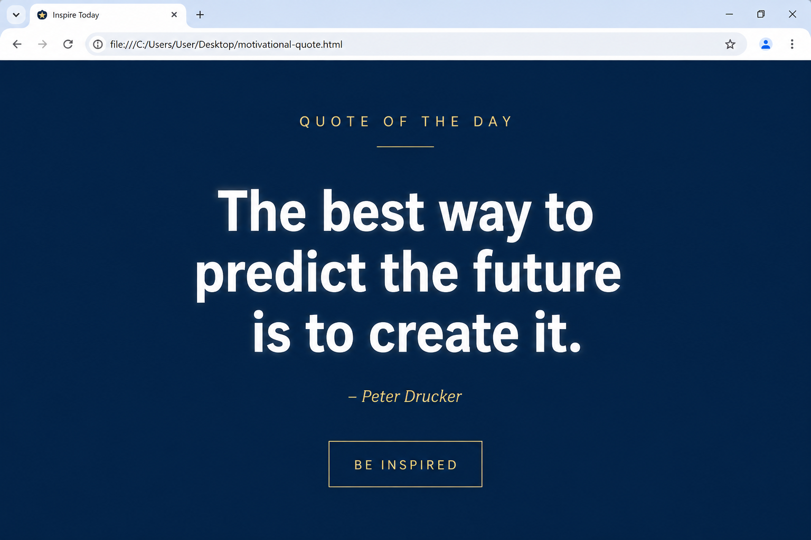

# 📝 Практика · Урок 5 «Текст и размеры»

**Темы:** `font-size`, `font-weight`, `font-style`, `text-decoration`, `text-transform`, `line-height`, `letter-spacing`, `text-shadow`, размеры `px`/`%`, `:hover`. Плюс повторяем цвет и картинки (уроки 3–4).

> 🎯 **Как работать.** Делай в `.html`/`.css`, смотри в браузере через Live Server. Уровни: 🟢 базовые · 🟡 средние · 🔴 со звёздочкой. 💡 подсказка — наводка, а не готовый код.
>
> 📌 **Правила игры:** у размеров всегда есть единица (`px`); `line-height` пишут числом без единицы (`1.6`); `text-shadow` = `X Y размытие цвет`; у `:hover` нет пробела перед `:` (`a:hover`).

---

## 🟢 Уровень 1 — базовый (обязательно)

**1. Крупный и спокойный.**
Сделай заголовок `h1` размером 50px, а основной текст `p` — 18px. Посмотри, как «кричащий» заголовок отличается от спокойного текста для чтения.
> 💡 Подсказка: `h1 { font-size: 50px; }`, `p { font-size: 18px; }`. Не забудь `px`.

**2. Толщина букв.**
Сделай три абзаца: один очень тонкий (`font-weight: 300`), один обычный (`400`), один очень жирный (`900`). Сравни, как меняется «вес» текста.
> 💡 Подсказка: `font-weight` принимает числа от 100 до 900 или слова `normal`/`bold`.

**3. Курсив-цитата.**
Оформи абзац как цитату — курсивом (`font-style: italic`). Добавь автора обычным шрифтом.
> 💡 Подсказка: `.quote { font-style: italic; }`.

**4. Заголовок КАПСОМ.**
Напиши заголовок обычными буквами, а на экране сделай его заглавными через `text-transform`. Текст менять руками нельзя!
> 💡 Подсказка: `h1 { text-transform: uppercase; }`.

**5. Старая и новая цена.**
Покажи «старую цену» зачёркнутой, а рядом новую — обычной. Это классический приём распродаж.
> 💡 Подсказка: `.old { text-decoration: line-through; }`.

**6. Дышащий текст.**
Возьми абзац из 3–4 строк и задай ему `line-height: 1.7`. Сравни с абзацем без этого свойства — где читать приятнее?
> 💡 Подсказка: `p { line-height: 1.7; }` — число без единицы.

**7. Разрядка заголовка.**
Сделай заголовку разрядку между буквами `letter-spacing: 5px` — модный приём для афиш и логотипов.
> 💡 Подсказка: `h1 { letter-spacing: 5px; }`.

**8. Первая тень.**
Добавь заголовку мягкую тень: `text-shadow: 2px 2px 4px rgba(0,0,0,0.4)`. Поиграй сдвигом и размытием.
> 💡 Подсказка: формула `X Y размытие цвет`. Цвет тени лучше полупрозрачный.

---

## 🟡 Уровень 2 — средний (для уверенности)

**9. Неоновая вывеска.**
На тёмном фоне сделай заголовок со свечением: цвет яркий (например, `#0ff`), и такая же по цвету тень без сдвига (`text-shadow: 0 0 12px #0ff`). Добавь вторую тень для усиления.
> 💡 Подсказка: тёмный `body`, `color: #0ff;`, несколько теней через запятую: `0 0 10px #0ff, 0 0 20px #0ff`.

**10. Ссылка-кнопка с `:hover`.**
Сделай ссылку без подчёркивания, а при наведении — меняющую цвет и появляющееся подчёркивание. Наведи мышь и проверь.
> 💡 Подсказка: правило `a { text-decoration: none; ... }` и `a:hover { color: ...; text-decoration: underline; }`.

**11. Живой заголовок.**
Сделай заголовок, который при наведении «раздвигается» (увеличивается `letter-spacing`) или меняет цвет.
> 💡 Подсказка: `h1:hover { letter-spacing: 8px; }` или `h1:hover { color: ...; }`.

**12. px против %.**
Сделай два блока с фоном: один шириной `250px`, другой `100%`. Сузь окно браузера и понаблюдай, какой меняется, а какой остаётся.
> 💡 Подсказка: дай блокам `background-color`, чтобы видеть границы. Меняется тот, что в `%`.

**13. Ценник товара.**
Собери ценник: название товара (`uppercase`, разрядка), старая цена (зачёркнута, серая), новая цена (крупная, жирная, яркая).
> 💡 Подсказка: комбинируй `text-transform`, `letter-spacing`, `line-through`, `font-size`, `font-weight`.

**14. Повторяем цвет + текст.**
Собери «карточку цитаты»: цветной фон, крупная цитата курсивом с `line-height`, автор мельче и другим цветом. Подбери гармоничную палитру (урок 4).
> 💡 Подсказка: фон блока — `background-color`; цитата — `font-style: italic; line-height: 1.6;`.

---

## 🔴 Уровень 3 — со звёздочкой (челлендж)

**15. Логотип текстом.**
Придумай «логотип» бренда только из текста: подбери размер, толщину, разрядку, регистр и тень так, чтобы он выглядел стильно и узнаваемо.
> 💡 Подсказка: сочетай `font-weight: 900`, `letter-spacing`, `uppercase` и лёгкую тень. Минимализм часто круче.

**16. Три уровня заголовков — три стиля.**
Сделай `h1`, `h2`, `h3` и оформи каждый по-своему (размер, цвет, тень, разрядка), но так, чтобы вместе они смотрелись как единая система.
> 💡 Подсказка: `h1` — самый крупный и яркий, `h2`/`h3` — мельче и спокойнее, но в той же гамме.

**17. Резиновый vs фиксированный баннер.**
Сделай баннер из двух блоков: верхний фиксированной ширины (`px`), нижний резиновый (`100%`). Помести внутрь текст и понаблюдай при изменении окна.
> 💡 Подсказка: верхний — `width: 600px`, нижний — `width: 100%`. Оба с фоном и текстом.

---

## 🏆 Итоговая работа урока — «Мотивационный постер»

Сделай **постер с вдохновляющей цитатой** — из тех, что вешают на стену. Вся красота здесь — в **типографике**: крупные буквы, тень, разрядка, продуманные интервалы. Выбери цитату, которая тебе действительно нравится (из фильма, игры, книги, или свою).

**Пример темы:** «Никогда не сдавайся», «Мечтай смело», девиз любимого героя, строчка из песни, твой личный слоган.

### 📋 Что должно быть на странице

1. **Постер-блок** (`div`) с цветным фоном и внутренними отступами (`padding`), всё по центру.
2. **Маленькая надпись сверху** (`p`) — тема или «ярлык» (например, «ЦИТАТА ДНЯ») с разрядкой (`letter-spacing`, `uppercase`).
3. **Сама цитата (`h1`)** — крупная (50–72px), выразительная, с тенью или свечением.
   *Например:* `<h1>Дорогу осилит идущий</h1>`
4. **Автор / источник (`p`)** — помельче, курсивом.
5. **Ссылка-кнопка** внизу (например, «Поделиться») с эффектом `:hover`.

### ✅ Требования (проверь по списку)
- ✅ постер оформлен через внешний `style.css`;
- ✅ цветной фон постера + всё выровнено по центру;
- ✅ у цитаты крупный `font-size` и **`text-shadow`** (тень или неон);
- ✅ использованы минимум **три** свойства текста из урока (`font-weight`, `font-style`, `text-transform`, `letter-spacing`, `line-height` — на выбор);
- ✅ у «ярлыка» сверху — разрядка (`letter-spacing`);
- ✅ есть элемент с реакцией на наведение (`:hover`);
- ✅ текст читается на фоне (контраст).

### 💡 Подсказки
- Для «вау» бери тёмный фон и неоновую тень того же цвета, что текст.
- Разрядка (`letter-spacing`) особенно хорошо смотрится на коротких надписях КАПСОМ.
- `line-height: 1.3–1.5` у длинной цитаты, чтобы строки не слипались.
- Кнопку оживи: `.btn:hover { color: ...; }`.

**Как это должно выглядеть (ориентир):**

> 🖼 *Ориентир по стилю; цитата, цвета и шрифты — твои. Если картинки-ориентира пока нет — её подготовит учитель.*

**🌟 Мини-челлендж (по желанию):** сделай **два** постера в разном настроении — один «энергичный» (яркий, неон, КАПС), другой «спокойный» (пастель, тонкий шрифт, большие интервалы). Сравни, как типографика передаёт настроение.

---

> ✅ **🟢 — база есть. 🟡 — уверенно. 🔴 — мастер типографики!**
> 🆘 Застрял — открой [самоучитель.md](самоучитель.md).
> 📌 Быстро вспомнить — [итого.md](итого.md).
