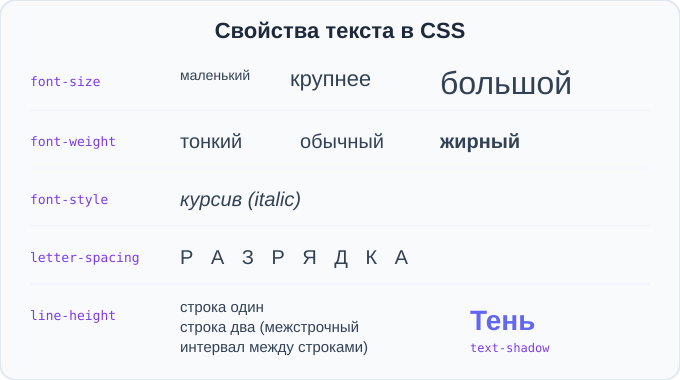
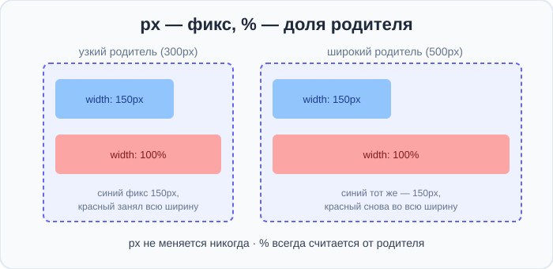

# Урок 5 — Текст и размеры: красивая типографика ✍️📏

**Модуль 1 · Старт: HTML + первые стили · Урок 5 из 6 | 2 ак.ч.**

> ⬅️ [Все уроки модуля](../README.md) · [План курса](../../ПЛАН-КУРСА.md) · Предыдущий: [Урок 4 «Цвет»](../урок-04-цвет/урок.md) · Следующий: Урок 6 «Проект-сборка» ➡️

> 🔁 В начале — [разминка/повтор](повторение.md).
> 📌 Быстро вспомнить — [итого.md](итого.md). 👨‍🏫 Сценарий — [преподавателю.md](преподавателю.md). 🖼 Проектор — [изображения.md](изображения.md).
> 🆘 **Пропустил урок?** — [самоучитель.md](самоучитель.md). 🧰 Больше трюков — [лайфхак.md](лайфхак.md), но главные разбираем прямо в уроке (значок 🧰).

> 🧭 **Как читать урок.** Цвет у нас уже есть — пора сделать **текст красивым и «звучным»**: управлять размером, толщиной, интервалами, добавить **тень** и «объём». Заодно разберёмся с **размерами блоков в `px` и `%`** (в чём разница) и впервые сделаем **интерактив** — реакцию на наведение мыши (`:hover`). В конце соберём эффектную **афишу концерта**.

---

## 🎮 Что мы сделаем сегодня и что получим

**Задача:** научиться оформлять текст как настоящий дизайнер и собрать яркую афишу.

**Главные навыки урока:** `font-size` (размер, `px`) · `font-weight` (толщина) · `font-style` (курсив) · `text-decoration` (подчёркивание) · `text-transform` (регистр) · `line-height`, `letter-spacing` (интервалы) · **`text-shadow`** (тень/свечение) · **размеры блоков** `width`/`height` в `px` и `%` · **`:hover`** (реакция на наведение) · **кнопки** (`<button>` и ссылки-кнопки).

> 💡 **Главная мысль урока:** **типографика — это половина красоты сайта.** Один и тот же текст можно сделать скучным или «звучащим», играя размером, толщиной и интервалами.

---

## Часть 1 — Размер текста: `font-size`

Размер шрифта задаёт свойство `font-size`. Пока используем **пиксели (`px`)** — как в размерах картинок с прошлых уроков.

```css
h1 { font-size: 48px; }   /* крупный заголовок */
p  { font-size: 18px; }   /* удобный для чтения текст */
small { font-size: 12px; }
```

- 👀 Чем больше число — тем крупнее буквы. Для основного текста удобно `16–20px`, для заголовков — `30–60px`.

> 🧰 **Лайфхак:** не делай основной текст мельче `14px` — станет трудно читать. А заголовок можно смело увеличить до `48–72px` для «вау».

> ✍️ **Мини-задание 1:** сделай `h1` размером `50px`, а абзац `p` — `18px`. Почувствуй разницу между «кричащим» заголовком и спокойным текстом.
> <details><summary>💡 подсказка</summary><code>h1 { font-size: 50px; }</code> и <code>p { font-size: 18px; }</code>.</details>

---

## Часть 2 — Толщина и курсив: `font-weight`, `font-style`

**`font-weight`** — толщина букв (насыщенность):

```css
h1 { font-weight: bold; }     /* жирный */
p  { font-weight: normal; }   /* обычный */
.thin { font-weight: 300; }   /* тонкий (числом от 100 до 900) */
.black { font-weight: 900; }  /* очень жирный */
```

**`font-style`** — начертание:

```css
.quote { font-style: italic; }   /* курсив (наклонный) */
```



> 💡 **По смыслу vs по виду.** Помнишь теги `<strong>` (важное) и `<em>` (акцент) с урока 1? Они делают жирный/курсив **по смыслу**. А `font-weight`/`font-style` меняют вид **любого** текста через CSS. Оба подхода нужны.

> ✍️ **Мини-задание 2:** сделай заголовок очень жирным (`900`), а один абзац — курсивом. Добавь абзац-«цитату» тонким шрифтом (`300`).
> <details><summary>💡 подсказка</summary><code>font-weight: 900;</code>, <code>font-style: italic;</code>, <code>font-weight: 300;</code>.</details>

---

## Часть 3 — Оформление: `text-decoration`, `text-transform`

**`text-decoration`** — линии у текста (подчёркивание, зачёркивание):

```css
.link  { text-decoration: underline; }     /* подчёркнуть */
.old   { text-decoration: line-through; }  /* зачеркнуть (старая цена!) */
a      { text-decoration: none; }          /* убрать подчёркивание у ссылки */
```

**`text-transform`** — регистр букв (не меняя сам текст):

```css
h1 { text-transform: uppercase; }   /* ВСЁ ЗАГЛАВНЫМИ */
.name { text-transform: capitalize; } /* Каждое Слово С Большой */
```

> 💡 `text-transform: uppercase` удобно для заголовков и кнопок — пишешь обычным текстом, а на экране КАПСОМ. Менять руками не нужно.

> ✍️ **Мини-задание 3:** сделай `h1` заглавными буквами (`uppercase`), покажи «старую цену» зачёркиванием, а рядом — новую.
> <details><summary>💡 подсказка</summary><code>text-transform: uppercase;</code> для заголовка; <code>text-decoration: line-through;</code> для старой цены.</details>

---

## Часть 4 — Расстояния: `line-height`, `letter-spacing`

**`line-height`** — расстояние между строками (межстрочный интервал). Делает текст «дышащим» и читаемым:

```css
p { line-height: 1.6; }   /* 1.6 = в 1,6 раза больше высоты строки */
```

- 👀 Без `line-height` строки лепятся друг к другу. `1.5–1.7` — золотая середина для чтения.

**`letter-spacing`** — расстояние между буквами:

```css
h1 { letter-spacing: 4px; }    /* Р А З Р Я Д К А — модно для заголовков */
.tight { letter-spacing: -1px; } /* плотнее */
```

> 💡 **`word-spacing`** — расстояние между **словами** (реже нужно): `word-spacing: 8px;`.

> ✍️ **Мини-задание 4:** сделай абзац с `line-height: 1.7` (сравни с обычным) и заголовок с разрядкой `letter-spacing: 5px`.
> <details><summary>💡 подсказка</summary><code>p { line-height: 1.7; }</code> и <code>h1 { letter-spacing: 5px; }</code>.</details>

---

## Часть 5 — Тень и свечение текста: `text-shadow` ✨

**`text-shadow`** добавляет тексту тень или свечение. Формула: `X Y размытие цвет`.

```css
h1 { text-shadow: 2px 2px 4px rgba(0,0,0,0.4); }   /* мягкая тень */
```
- `2px` — сдвиг вправо, `2px` — вниз, `4px` — размытие, дальше цвет (лучше полупрозрачный).

**Неоновое свечение** — тень того же цвета, что текст, без сдвига:

```css
.neon {
    color: #0ff;
    text-shadow: 0 0 10px #0ff, 0 0 20px #0ff;   /* можно несколько теней! */
}
```

- 👀 Несколько теней через запятую = яркое свечение. Отлично для афиш и заголовков в тёмной теме.

> ✍️ **Мини-задание 5:** сделай заголовку мягкую тень, а потом попробуй неоновое свечение на тёмном фоне. Что эффектнее для твоей темы?
> <details><summary>💡 подсказка</summary>Мягкая: <code>text-shadow: 2px 2px 4px rgba(0,0,0,.4);</code>. Неон: тёмный фон + <code>text-shadow: 0 0 12px #0ff;</code>.</details>

> 🧰 **Лайфхак:** тень читается лучше, если её цвет **полупрозрачный** (`rgba(0,0,0,0.4)`) — вспомни alpha с урока про цвет.

---

## Часть 6 — Размеры блоков: `px` и `%` (в чём разница)

Мы уже задавали ширину картинкам. Теперь про блоки и **разницу двух единиц**:

- **`px` (пиксели)** — **фиксированный** размер. `width: 300px` — всегда ровно 300 точек, что бы вокруг ни происходило.
- **`%` (проценты)** — **доля от родителя**. `width: 50%` — половина ширины того блока, внутри которого элемент лежит.



```css
.fixed { width: 300px; }   /* всегда 300px */
.fluid { width: 80%; }     /* 80% ширины родителя — «резиновый» */
```

> 💡 **Когда что.** `px` — для того, что должно быть точного размера (иконка, аватарка). `%` — для «резиновых» блоков, которые подстраиваются под экран (мы это разовьём в модуле про адаптивность). Пока запомни главное: **px не меняется, % зависит от родителя.**

> ✍️ **Мини-задание 6:** сделай два блока с фоном: один `width: 200px`, другой `width: 100%`. Сузь окно браузера — какой из них меняется?
> <details><summary>💡 подсказка</summary>Дай блокам <code>background-color</code>, чтобы видеть границы. Меняется тот, что в <code>%</code>.</details>

---

## Часть 7 — Первый интерактив: `:hover` 🖱️

До сих пор страница была «неподвижной». Добавим **реакцию на наведение мыши** — псевдокласс **`:hover`**. Пишем обычное правило, но к селектору добавляем `:hover`:

```css
a {
    color: navy;
    text-decoration: none;
}
a:hover {
    color: crimson;              /* при наведении текст краснеет */
    text-decoration: underline;  /* и появляется подчёркивание */
}
```

- 👀 Наведи мышь на ссылку — она меняется! Убери — вернулась. Это оживляет сайт.

Работает не только для ссылок:

```css
h1:hover {
    letter-spacing: 6px;   /* заголовок «раздвигается» при наведении */
}
```

> 💡 Это только **знакомство** с `:hover` — как приём. Плавность перехода (`transition`) и другие псевдоклассы разберём в отдельном модуле. Пока главное — понять: `:hover` = «когда мышь сверху».

**Кнопки.** Кнопку делают двумя способами:
- тег **`<button>`** — настоящая кнопка: `<button>Нажми меня</button>`;
- **ссылка-кнопка** — обычная `<a>`, которую оформили как кнопку (фон, отступы, скругление). Так делают для призывов «Купить», «Играть», «Подписаться».

```html
<button class="btn">Кнопка</button>
<a href="#" class="btn">Ссылка-кнопка</a>
```
```css
.btn {
    display: inline-block;   /* ссылка-кнопка ведёт себя как блок с размерами (урок 4) */
    background-color: crimson;
    color: white;
    border: none;            /* у <button> убираем стандартную серую рамку */
    padding: 12px 28px;
    border-radius: 8px;
    cursor: pointer;         /* курсор превращается в «руку» */
    text-decoration: none;   /* для ссылки-кнопки */
}
.btn:hover { background-color: darkred; }
```

> 💡 **Когда что:** `<button>` — для действия **на** странице (отправить форму, показать меню); ссылка-кнопка `<a>` — для **перехода** куда-то. Выглядят одинаково, а по смыслу разные.

> ✍️ **Мини-задание 7:** сделай (1) ссылку, которая при наведении меняет цвет и подчёркивается, и (2) кнопку-`<a>` с фоном, которая при наведении темнеет.
> <details><summary>💡 подсказка</summary>Ссылка: <code>a { ... }</code> + <code>a:hover { ... }</code>. Кнопка: класс <code>.btn</code> с фоном + <code>.btn:hover { background-color: ...; }</code>.</details>

---

## Часть 8 — Мини-проект: «Афиша концерта» 🎤

Соберём афишу, где типографика делает всю красоту.

```html
<div class="poster">
    <p class="date">15 ДЕКАБРЯ</p>
    <h1>ROCK NIGHT</h1>
    <p class="sub">Большой концерт под открытым небом</p>
    <a href="#" class="btn">Купить билет</a>
</div>
```
```css
.poster {
    background-color: #12121f;
    color: white;
    text-align: center;
    padding: 60px;
}
.date {
    letter-spacing: 8px;
    font-size: 18px;
    color: #f43f5e;
}
h1 {
    font-size: 72px;
    font-weight: 900;
    text-transform: uppercase;
    text-shadow: 0 0 20px #f43f5e;   /* неоновое свечение */
}
.sub {
    font-style: italic;
    line-height: 1.6;
    color: #cbd5e1;
}
.btn {
    text-decoration: none;
    text-transform: uppercase;
    font-weight: bold;
    letter-spacing: 2px;
    color: white;
}
.btn:hover {
    color: #f43f5e;   /* кнопка реагирует на наведение */
}
```

- 👀 Тёмный фон, неоновый заголовок КАПСОМ, разрядка у даты, курсив у подписи, реагирующая кнопка — настоящая афиша!

> 🎨 **Твоя афиша:** сделай под свою тему — рок, рэп, фестиваль, киберспорт-турнир, показ фильма. Играй размером, свечением и разрядкой.

> 🧩 **Для 5–7 классов (проще):** хватит крупного заголовка `uppercase` с тенью, даты с разрядкой и кнопки с `:hover`.

---

## 🐞 Разбор частых ошибок

| Что видно | Что случилось | Как починить |
|-----------|---------------|--------------|
| текст «слипся» по строкам | нет `line-height` | добавь `line-height: 1.6` |
| `font-size: 20` не сработал | забыл единицу | пиши с `px`: `20px` |
| ссылка всё ещё подчёркнута | не убрал у `a` | `a { text-decoration: none; }` |
| тень не видно | цвет тени слился с фоном | сделай тень контрастной/полупрозрачной |
| `:hover` не работает | ошибка в селекторе | `a:hover` — без пробела перед `:` |
| блок не «резиновый» | задал `px` вместо `%` | для «резины» — `width` в `%` |

> ⚠️ Не сработало? Проверь: единицы у размеров (`px`), точку с запятой `;`, у `:hover` нет пробела перед двоеточием.

---

## 🎓 Часть 9 — Для тех, кто хочет глубже

- **`text-align: justify`** — выравнивание по ширине (как в книге, ровные края с обеих сторон).
- **`text-indent`** — отступ красной строки: `text-indent: 30px;`.
- **Несколько теней сразу** — через запятую можно наложить и мягкую тень, и свечение.
- **Единицы `em`/`rem`** — «резиновые» размеры шрифта (относительные). Разберём в модуле про адаптивность — пока хватает `px`.
- **Красивые шрифты** (`font-family`, Google Fonts) — подключим в следующем модуле; тогда афиша заиграет ещё ярче.

---

## 🏁 Итог урока

Сегодня ты научился делать текст красивым:

- ✅ **Размер** — `font-size` (в `px`); **толщина** — `font-weight`; **курсив** — `font-style`.
- ✅ **Оформление** — `text-decoration` (подчёркивание/зачёркивание), `text-transform` (регистр).
- ✅ **Интервалы** — `line-height` (между строк), `letter-spacing` (между букв).
- ✅ **`text-shadow`** — тень и неоновое свечение.
- ✅ **`px` vs `%`**: px — фикс, % — доля родителя.
- ✅ **`:hover`** — первая реакция на наведение мыши.
- ✅ **Кнопки** — тег `<button>` и ссылка-кнопка `<a class="btn">` (оформляются одинаково).

> 🏆 Главное: **типографика делает текст «звучащим»; играй размером, толщиной, интервалами и тенью.** Быстро повторить — в [итого.md](итого.md).

> 🎤 **Блиц:** в каких единицах задаём `font-size`? чем `font-weight` отличается от `<strong>`? что делает `text-transform: uppercase`? как читается `text-shadow: 2px 2px 4px ...`? в чём разница `px` и `%`? как сделать реакцию на наведение?

### 🎮 Викторина-закрепление
Открой **[викторина.html](викторина.html)** — вопросы по тексту **+ повторение уроков 1–4** + смешные и «на подумать».

➡️ **Практика урока** — **[практика.md](практика.md)**: задачи в 3 уровнях + итоговая работа.
🆘 **Пропустил / хочешь ещё?** — [самоучитель.md](самоучитель.md). 📌 **Шпаргалка** — [итого.md](итого.md).

---

## 🔗 Навигация

⬅️ [Урок 4](../урок-04-цвет/урок.md) · [Все уроки модуля](../README.md) · [План курса](../../ПЛАН-КУРСА.md) · **Следующий:** Урок 6 «Проект-сборка» ➡️

**🧰 Инструменты:** [VS Code](https://code.visualstudio.com/) + [Live Server](https://marketplace.visualstudio.com/items?itemName=ritwickdey.LiveServer). **📄 Пример типографики:** [`материалы/типографика-демо.html`](материалы/типографика-демо.html).
