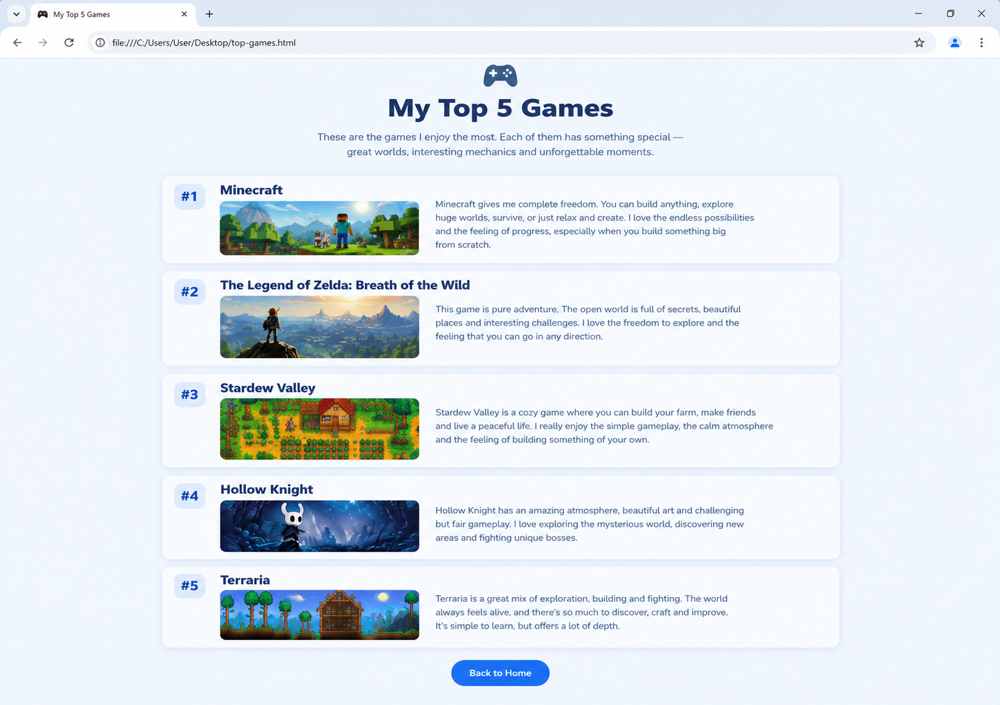

# 📝 Практика · Урок 6 «Проект-сборка модуля»

**Темы:** всё из модуля 1 вместе — теги, подключение CSS, картинки, цвет, текст, `:hover`, Emmet-турбо.

> 🎯 **Как работать.** Это финальная практика модуля — задачи закрепляют сборку, а итоговый проект показывает всё, что ты умеешь. Уровни: 🟢 базовые · 🟡 средние · 🔴 со звёздочкой. 💡 подсказка — наводка, а не готовый код.
>
> 📌 **Правила игры:** сначала структура (блоки), потом содержание, потом стиль; палитру бери в одном тоне HSL; стили — во внешнем `style.css`.

---

## 🟢 Уровень 1 — базовый (обязательно)

**1. Каркас за секунды.**
Одной аббревиатурой Emmet собери заготовку страницы: шапка, раздел и три карточки. Например `header+section+.card*3`. Убедись, что всё развернулось.
> 💡 Подсказка: набери аббревиатуру и нажми `Tab`. `.card*3` — три блока с классом card.

**2. Круглая аватарка.**
Помести на страницу фото и сделай его круглой аватаркой с белой рамкой.
> 💡 Подсказка: `width` + `border-radius: 50%` + `border: 4px solid white`.

**3. Дружная палитра.**
Задай странице фон и цвет шапки в **одном тоне** HSL (меняй только светлоту L). Убедись, что цвета сочетаются.
> 💡 Подсказка: один `H` (например 230), фон светлый (`L: 96%`), шапка тёмная (`L: 55%`).

**4. Карточка с тенью.**
Сделай блок-карточку: белый фон, скругление, внутренние отступы и лёгкая тень `box-shadow`.
> 💡 Подсказка: `box-shadow: 0 6px 16px rgba(0,0,0,0.1);` — как `text-shadow`, но для блока.

**5. Живая кнопка.**
Сделай ссылку-кнопку (фон, скругление, без подчёркивания), которая при наведении меняет цвет.
> 💡 Подсказка: `.btn { ... }` и `.btn:hover { background-color: ...; }`.

**6. Красивый заголовок.**
Оформи `h1`: крупный размер, лёгкая тень, небольшая разрядка. Слоган под ним — курсивом.
> 💡 Подсказка: `font-size`, `text-shadow`, `letter-spacing`; слоган — `font-style: italic`.

---

## 🟡 Уровень 2 — средний (для уверенности)

**7. Три карточки в ряд.**
Сделай три карточки-увлечения и поставь их в один ряд (пока через `display: inline-block`). У каждой — эмодзи, название и короткое описание.
> 💡 Подсказка: карточкам задай `display: inline-block;` и одинаковую `width`. (Ровные ряды по-настоящему — на Flexbox дальше.)

**8. Единый стиль двух страниц.**
Сделай вторую страницу (например, `hobby.html`) и подключи к ней **тот же** `style.css`. Убедись, что обе выглядят в едином стиле.
> 💡 Подсказка: одинаковый `<link rel="stylesheet" href="style.css">` в обеих.

**9. Тёмная тема страницы.**
Переделай свою страницу в тёмную тему: тёмный фон, светлый текст, акцентный яркий цвет для кнопки. Следи за читаемостью.
> 💡 Подсказка: фон `hsl(230,20%,12%)`, текст светлый, кнопка — контрастный тон.

**10. Полупрозрачная шапка на фоне.**
Сделай шапке фон-картинку (или яркий цвет), а поверх — полупрозрачный слой (`rgba`) с текстом, чтобы имя читалось.
> 💡 Подсказка: блок с текстом получает `background-color: rgba(0,0,0,0.35); color: white;`.

**11. Emmet-марафон.**
Разверни одной строкой раздел галереи из 4 карточек с заголовком и текстом: `section>h2{Галерея}+(.card>h3+p)*4`. Заполни содержимым.
> 💡 Подсказка: `>` внутрь, `()` группирует, `*4` повторяет. Нажми `Tab`.

---

## 🔴 Уровень 3 — со звёздочкой (челлендж)

**12. Своя цветовая тема через один тон.**
Построй всю страницу на **одном** тоне HSL: фон, шапка, карточки, кнопка — разные оттенки этого тона (разные L и немного S). Получится профессионально-цельный дизайн.
> 💡 Подсказка: фиксируй `H`, играй `L` (12% … 96%) и слегка `S`.

**13. Мини-сайт из трёх страниц.**
Собери три страницы (о себе, увлечения, контакты) в одном стиле с общим `style.css`. Каждая — с шапкой и своим содержимым.
> 💡 Подсказка: одинаковая структура и `<link>`; меняется только контент разделов.

---

## 🏆 Итоговая работа урока — «Мой топ-5»

Собери страницу-**рейтинг** «Мой топ-5»: любимые игры, фильмы, книги, музыкальные треки, блюда или места. Это витрина всего, что ты умеешь: структура, картинки, цвет и типографика вместе.

**Пример темы:** «Мои топ-5 игр», «Топ-5 фильмов Marvel», «5 лучших книг», «Мой плейлист месяца», «Топ-5 мест в моём городе».

### 📋 Что должно быть на странице

1. **Шапка** — крупный заголовок `h1` (например, «Мой топ-5 игр 🎮») + короткий вступительный абзац.
2. **Пять блоков-позиций** — по одному на каждый пункт топа. Каждый блок содержит:
   - **номер и название** (`h2`, например «#1 — Minecraft»);
   - **картинку** (обложка/постер) с рамкой или скруглением;
   - **абзац** — почему это в топе.
   *Например:* блок с `h2` «#1 — Minecraft», обложкой и текстом «Бесконечный простор для творчества…».
3. **Подвал** — итоговая фраза и кнопка (например, «Смотреть ещё») с `:hover`.
4. Всё оформление — во внешнем `style.css`.

### ✅ Требования (проверь по списку)
- ✅ `h1` (название топа) + вступительный абзац;
- ✅ **5 блоков-позиций**, у каждого: `h2` (номер+название), картинка с `alt` и размером, абзац-описание;
- ✅ картинки оформлены (`border`/`border-radius`);
- ✅ гармоничная палитра (один тон HSL) и читаемый текст;
- ✅ типографика: крупные заголовки, тень или разрядка, `line-height` у текста;
- ✅ хотя бы один элемент с `:hover`;
- ✅ стили во внешнем `style.css`.

### 💡 Подсказки
- Каркас пяти блоков собери Emmet-ом: `(.item>h2+img+p)*5` + `Tab`.
- Нет обложек? Возьми с [unsplash.com](https://unsplash.com) или используй эмодзи-заглушки.
- Чтобы номера топа выделялись — сделай их крупнее и ярче (`font-size`, `color`).
- Одинаково оформи все блоки (общий класс `.item`) — будет аккуратно.

**Как это должно выглядеть (ориентир):**

> 🖼 *Ориентир по структуре; тема, картинки и цвета — твои. Если картинки-ориентира пока нет — её подготовит учитель.*

**🌟 Мини-челлендж (по желанию):** сделай каждую картинку **картинкой-ссылкой** (на трейлер/статью) и добавь блоку `:hover`-эффект (например, лёгкое изменение цвета фона или тени).

---

> ✅ **🟢 — база есть. 🟡 — уверенно. 🔴 — ты собрал настоящий сайт!**
> 🆘 Застрял — открой [самоучитель.md](самоучитель.md).
> 🧩 Финал модуля — [самостоятельная работа](../самостоятельная.md).
