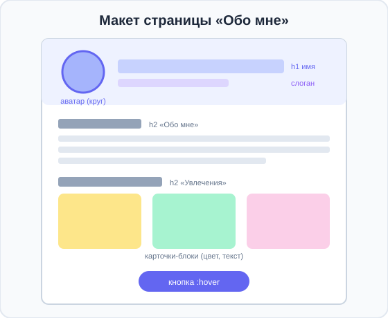

# Урок 6 — Проект «Страница обо мне»: собираем всё вместе 🏆🧩

**Модуль 1 · Старт: HTML + первые стили · Урок 6 из 6 | 2 ак.ч.**

> ⬅️ [Все уроки модуля](../README.md) · [План курса](../../ПЛАН-КУРСА.md) · Предыдущий: [Урок 5 «Текст и размеры»](../урок-05-текст-и-размеры/урок.md) · Дальше: [Самостоятельная работа модуля](../самостоятельная.md) ➡️

> 🔁 В начале — [разминка/повтор](повторение.md).
> 📌 Быстро вспомнить — [итого.md](итого.md). 👨‍🏫 Сценарий — [преподавателю.md](преподавателю.md). 🖼 Проектор — [изображения.md](изображения.md).
> 🆘 **Пропустил урок?** — [самоучитель.md](самоучитель.md). 🧰 Больше трюков — [лайфхак.md](лайфхак.md), но главные разбираем прямо в уроке (значок 🧰).

> 🧭 **Как читать урок.** Это **финал модуля**! Сегодня мы не изучаем новое, а **собираем всё, что узнали**, в одну красивую страницу — **«Обо мне»**: с аватаркой, разделами, цветами, красивым текстом и интерактивом. Заодно доведём до автоматизма **Emmet-турбо** — чтобы собирать каркас страницы за секунды.

---

## 🎮 Что мы сделаем сегодня и что получим

**Задача:** собрать **личную страницу** с фото, разделами, цветной темой, типографикой и реакцией на наведение — применив **все навыки модуля**.

**Что вспомним и применим:**
- **HTML:** каркас (`!`), `h1–h6`, `p`, `br`, `hr`, `img`, `a`, `div` с классами (уроки 1, 3).
- **CSS:** 3 способа подключения, `color`, `background-color`, `text-align` (урок 2).
- **Картинки:** ``, размеры, круглая аватарка (урок 3).
- **Цвет:** HEX/RGB/HSL, прозрачность, гармоничная палитра (урок 4).
- **Текст:** размеры, толщина, тень, интервалы, `:hover` (урок 5).
- **Emmet-турбо:** `!`, `>`, `+`, `*`, `{}`, `.class`.

> 💡 **Главная мысль урока:** **готовый сайт — это не одно свойство, а продуманное сочетание многих.** Красота рождается, когда структура, цвет и текст работают вместе.

---

## Часть 1 — Задумка и макет

Сначала подумаем, из каких **блоков** состоит страница. Не пиши код сразу — сперва план.



Наша страница — из четырёх частей:
1. **Шапка** — круглая аватарка + имя (`h1`) + слоган.
2. **Обо мне** — заголовок `h2` и пара абзацев.
3. **Мои увлечения** — три цветные карточки-блока.
4. **Кнопка** внизу с реакцией на наведение.

> 🧭 **Правило дизайнера:** сначала структура (что за блоки и в каком порядке), потом наполнение (текст, картинки), и только потом красота (цвет, шрифты). Так не запутаешься.

> ✍️ **Мини-задание 1:** нарисуй свой макет на бумаге (или опиши словами): какие блоки будут на твоей странице и в каком порядке? Можешь добавить свои разделы (например, «Мои цели», «Контакты»).

---

## Часть 2 — Каркас и содержание (HTML)

Разворачиваем каркас через `!` и наполняем блоками. Классы (`class="..."`) дадим сразу — по ним будем стилизовать.

```html
<!DOCTYPE html>
<html lang="ru">
<head>
    <meta charset="UTF-8">
    <title>Гера — обо мне</title>
    <link rel="stylesheet" href="style.css">
</head>
<body>
    <header class="hero">
        
        <h1>Гера Смирнов</h1>
        <p class="slogan">Будущий геймдизайнер 🎮</p>
    </header>

    <section class="about">
        <h2>Обо мне</h2>
        <p>Мне 12 лет, учусь в 6 классе. Люблю программировать и придумывать игры.</p>
    </section>

    <section class="hobbies">
        <h2>Мои увлечения</h2>
        <div class="card">🎮 Игры<br>Minecraft, Brawl Stars</div>
        <div class="card">⚽ Спорт<br>Футбол по выходным</div>
        <div class="card">🤖 Роботы<br>Собираю из Lego</div>
    </section>

    <a href="#" class="btn">Написать мне</a>
</body>
</html>
```

> 💡 `<header>` и `<section>` — это «умные» блоки-контейнеры (вместо обычных `div`). Подробно разберём в модуле про блоки, а пока — просто удобные «коробки» для частей страницы.

> ✍️ **Мини-задание 2:** собери каркас со своими данными: своё имя, слоган, текст «обо мне» и три свои карточки-увлечения. Пока без стилей — проверь структуру в браузере.
> <details><summary>💡 подсказка</summary>Каркас — <code>!</code>; картинку — <code>&lt;img&gt;</code>; карточки — <code>div.card</code>. Emmet: <code>.card*3</code> развернёт три карточки.</details>

---

## Часть 3 — Подключаем CSS и задаём тему

Создаём `style.css` (способ №3 с урока 2) и задаём **палитру** (урок 4). Выберем гармоничные цвета в одном тоне через HSL.

```css
body {
    background-color: hsl(230, 30%, 96%);   /* очень светлый фон */
    color: #1f2937;
    text-align: center;
    font-size: 18px;
    line-height: 1.6;
}
.hero {
    background-color: hsl(230, 60%, 55%);   /* яркая шапка */
    color: white;
    padding: 40px;
}
.about, .hobbies {
    padding: 30px;
}
```

> ✍️ **Мини-задание 3:** подключи `style.css` и задай свою палитру: фон страницы, цвет и фон шапки. Возьми один тон HSL и меняй светлоту — цвета будут «дружить».
> <details><summary>💡 подсказка</summary>Один <code>H</code> (например 230), меняй <code>L</code>: тёмная шапка / светлый фон. Не забудь <code>&lt;link&gt;</code>.</details>

---

## Часть 4 — Аватарка и карточки

Круглая аватарка (урок 3) и цветные карточки:

```css
.avatar {
    width: 120px;
    border-radius: 50%;              /* круг */
    border: 4px solid white;
}
.card {
    display: inline-block;
    background-color: white;
    color: #1f2937;
    width: 200px;
    padding: 24px;
    margin: 10px;
    border-radius: 16px;
    box-shadow: 0 6px 16px rgba(0,0,0,0.1);   /* лёгкая тень-объём */
}
```

> 💡 `box-shadow` работает как `text-shadow`, но для **блока** (тень под карточкой). Формула похожа: `X Y размытие цвет`. Подробнее — в модуле про блоки.

> ✍️ **Мини-задание 4:** сделай свою аватарку круглой с рамкой и оформи карточки (фон, скругление, тень). Подбери приятный вид.
> <details><summary>💡 подсказка</summary>Аватар — <code>border-radius: 50%</code> + <code>border</code>; карточки — <code>background-color</code>, <code>border-radius</code>, <code>box-shadow</code>.</details>

---

## Часть 5 — Красивый текст и интерактив

Добавим типографику (урок 5) и оживим кнопку через `:hover`.

```css
h1 {
    font-size: 44px;
    letter-spacing: 1px;
    text-shadow: 0 2px 8px rgba(0,0,0,0.3);
}
.slogan {
    font-style: italic;
    color: hsl(230, 80%, 90%);
}
.btn {
    display: inline-block;
    background-color: hsl(340, 80%, 55%);
    color: white;
    text-decoration: none;
    text-transform: uppercase;
    letter-spacing: 2px;
    padding: 16px 32px;
    border-radius: 30px;
    margin: 30px;
}
.btn:hover {
    background-color: hsl(340, 80%, 45%);   /* темнеет при наведении */
}
```

- 👀 Наведи на кнопку — она темнеет. Заголовок с тенью, слоган курсивом. Страница ожила!

> ✍️ **Мини-задание 5:** оформи свой заголовок (размер, тень), слоган (курсив) и кнопку с `:hover`. Проверь, что кнопка реагирует на мышь.
> <details><summary>💡 подсказка</summary>Кнопка: убери подчёркивание (<code>text-decoration: none</code>), добавь фон и <code>.btn:hover { ... }</code>.</details>

---

## Часть 6 — Emmet-турбо: собираем каркас за секунды ⚡

Финальный навык модуля — **скорость**. Соединяя приёмы Emmet, можно развернуть целый блок одной строкой. Разбери, что развернётся:

```
section.hobbies>h2{Мои увлечения}+(.card>h3+p)*3
```
→ раздел с заголовком и **тремя карточками**, в каждой — `h3` и `p`. Останется вписать текст!

**Копилка Emmet за модуль:**
| Приём | Что делает |
|-------|-----------|
| `!` | каркас страницы |
| `>` | вложенность (внутрь) |
| `+` | соседний тег (рядом) |
| `*N` | повтор N раз |
| `{текст}` | содержимое |
| `.class` / `#id` | класс / id |
| `()` | группировка |

> ✍️ **Мини-задание 6:** одной аббревиатурой Emmet собери каркас раздела с 4 карточками. Например: `.gallery>(.card>h3+p)*4`.
> <details><summary>💡 подсказка</summary>Набери аббревиатуру и нажми <code>Tab</code>. Точка <code>.name</code> = класс, скобки группируют повтор.</details>

---

## 🏁 Финальный вид и проверка

Открой страницу — у тебя должна получиться **цельная личная страница**: шапка с круглым фото, разделы, цветные карточки, красивый заголовок и живая кнопка. Это **настоящий сайт-визитка**, который не стыдно показать!

**Чек-лист готовности:**
- ✅ каркас, `charset`, `title`, подключён `style.css`;
- ✅ круглая аватарка с рамкой;
- ✅ заголовок, слоган, раздел «обо мне», карточки-увлечения;
- ✅ гармоничная палитра (один тон HSL);
- ✅ типографика: размер заголовка, тень, интервалы;
- ✅ кнопка с `:hover`.

> 🎨 **Сделай своим:** добавь свой раздел (цели, любимые цитаты, контакты), поменяй тему под себя. Это твоя страница!

> 🧩 **Для 5–7 классов (проще):** шапка с именем + фото, один раздел «обо мне» и одна кнопка с `:hover`. Карточки — по желанию.

---

## 🐞 Разбор частых ошибок

| Что видно | Что случилось | Как починить |
|-----------|---------------|--------------|
| стили не применились | забыл `<link>` или неверный `href` | проверь подключение `style.css` |
| карточки в столбик, а не в ряд | забыл `display: inline-block` | добавь его карточкам (ряды по-настоящему — на Flexbox дальше) |
| аватар — квадрат | картинка не квадратная / нет `border-radius` | квадратное фото + `border-radius: 50%` |
| цвета «не дружат» | случайные оттенки | возьми один тон HSL, меняй светлоту |
| кнопка не реагирует | нет правила `:hover` | добавь `.btn:hover { ... }` |

---

## 🎓 Часть 7 — Для тех, кто хочет глубже

- **Ровный ряд карточек** без «костылей» — это **Flexbox** (скоро отдельный модуль). Пока `inline-block` — временное решение.
- **Своя вторая страница** — сделай `hobby.html` и подключи **тот же** `style.css` — получишь мини-сайт в едином стиле (ссылки между страницами — в следующем модуле).
- **Favicon** — маленькая иконка вкладки: `<link rel="icon" href="favicon.png">`. Добавим на этапе публикации.

---

## 🏁 Итог модуля 1

Ты прошёл весь стартовый модуль и умеешь:

- ✅ **HTML:** структура, теги, картинки, ссылки.
- ✅ **CSS:** три способа подключения, селекторы, свойства.
- ✅ **Цвет:** 4 формата, прозрачность, палитры.
- ✅ **Текст:** типографика, тени, интервалы.
- ✅ **Интерактив:** `:hover`.
- ✅ **Emmet-турбо:** быстрая сборка каркаса.

> 🏆 Ты собрал **настоящую личную страницу** с нуля! Быстро повторить весь модуль — в [итого.md](итого.md).

> 🎤 **Блиц:** в каком порядке строим страницу (структура → …)? как «подружить» цвета? чем `box-shadow` похож на `text-shadow`? что развернёт `.card*3`? зачем один и тот же `style.css` на две страницы?

### 🎮 Викторина-закрепление
Открой **[викторина.html](викторина.html)** — вопросы по всему модулю (уроки 1–5) + смешные и «на подумать».

➡️ **Практика урока** — **[практика.md](практика.md)**: итоговый проект урока + задачи.
🧩 **Итог модуля:** **[самостоятельная работа модуля](../самостоятельная.md)** — законченная работа по всем темам.

---

## 🔗 Навигация

⬅️ [Урок 5](../урок-05-текст-и-размеры/урок.md) · [Все уроки модуля](../README.md) · [План курса](../../ПЛАН-КУРСА.md) · **Дальше:** [Самостоятельная работа модуля](../самостоятельная.md) ➡️

**🧰 Инструменты:** [VS Code](https://code.visualstudio.com/) + [Live Server](https://marketplace.visualstudio.com/items?itemName=ritwickdey.LiveServer). **📄 Заготовка-каркас:** [`материалы/каркас-старт.html`](материалы/каркас-старт.html) (пустой скелет с подсказками).
