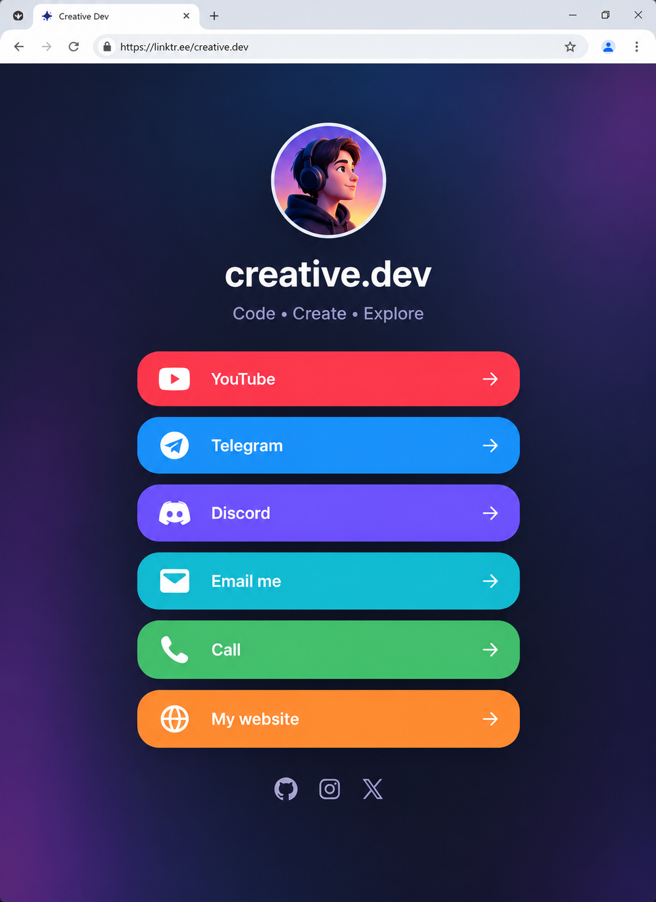

# 📝 Практика · Урок 1 «Ссылки»

**Темы:** тег `<a>` и `href`, внешние/относительные ссылки, `target="_blank"`, `mailto:`/`tel:`, якоря `#` (`id` + `href="#id"`), стили ссылок `:link/:visited/:hover/:active`, меню в `<nav>`. Плюс повторяем HTML/CSS из модуля 1.

> 🎯 **Как работать.** Делай в файлах `.html`/`.css`, смотри результат в браузере через Live Server (сохраняй — `Ctrl+S`). Уровни: 🟢 базовые · 🟡 средние · 🔴 со звёздочкой. 💡 подсказка — это наводка, а не готовый код.
>
> 📌 **Правила игры:** ссылка — `<a href="адрес">текст</a>`; внешний сайт — полный адрес `https://...`; своя страница — имя файла; якорь — `id="имя"` на разделе и `href="#имя"` в ссылке; порядок стилей — LoVe HAte (`:link → :visited → :hover → :active`).

---

## 🟢 Уровень 1 — базовый (обязательно)

**1. Первая ссылка.**
Создай страницу и добавь ссылку с текстом «Мой любимый сайт», ведущую на любой реальный сайт (например, `https://ya.ru`). Проверь, что клик открывает страницу.
> 💡 Подсказка: `<a href="https://ya.ru">Мой любимый сайт</a>`. Адрес — целиком, с `https://`.

**2. Ссылка в новой вкладке.**
Сделай так, чтобы внешняя ссылка открывалась в **новой вкладке**, не закрывая твою страницу. Добавь нужный атрибут.
> 💡 Подсказка: `target="_blank"`. Для безопасности можно добавить `rel="noopener"`.

**3. Три любимых сайта.**
Собери список из трёх ссылок на любимые сайты (игры, видео, энциклопедия). Каждая открывается в новой вкладке.
> 💡 Подсказка: три тега `<a>` с разными `href` и `target="_blank"`.

**4. Письмо и звонок.**
Добавь блок «Контакты»: ссылку-письмо на любой email и ссылку-звонок на любой номер телефона.
> 💡 Подсказка: `<a href="mailto:hi@mail.ru">Почта</a>` и `<a href="tel:+79001112233">Телефон</a>`.

**5. Убери подчёркивание.**
Оформи все ссылки: убери стандартное подчёркивание и задай свой цвет.
> 💡 Подсказка: `a { text-decoration: none; color: teal; }`.

**6. Отклик при наведении.**
Сделай так, чтобы при наведении мыши (`:hover`) ссылка меняла цвет и снова подчёркивалась.
> 💡 Подсказка: `a:hover { color: coral; text-decoration: underline; }`.

**7. Первый якорь.**
Сделай заголовок с меткой (`<h2 id="games">Игры</h2>`) и сверху — ссылку `<a href="#games">К играм</a>`. Проверь, что клик прокручивает к разделу.
> 💡 Подсказка: имя после `#` в ссылке = `id` у заголовка.

**8. Кнопка «Наверх».**
Внизу длинной страницы добавь ссылку «⬆ Наверх», которая прыгает в самый верх.
> 💡 Подсказка: `<a href="#">⬆ Наверх</a>` — просто решётка прыгает вверх страницы.

---

## 🟡 Уровень 2 — средний (для уверенности)

**9. Оглавление из якорей.**
Сделай страницу с тремя разделами (`id="about"`, `id="rules"`, `id="contacts"`) и сверху — мини-оглавление из трёх ссылок-якорей на них.
> 💡 Подсказка: три `<a href="#...">` сверху, три заголовка с совпадающими `id` ниже.

**10. Плавная прокрутка.**
Включи мягкую прокрутку к разделам вместо резкого прыжка — одной строкой CSS.
> 💡 Подсказка: `html { scroll-behavior: smooth; }`.

**11. Меню в `<nav>`.**
Оберни ссылки навигации в тег `<nav>` и оформи их как кнопки-вкладки: фон, `padding`, скругление, без подчёркивания, отклик на `:hover`.
> 💡 Подсказка: `nav a { display: inline-block; background-color: #2563eb; color: #fff; padding: 10px 18px; border-radius: 8px; text-decoration: none; }`.

**12. Кликабельный логотип.**
Оберни картинку (`` с прошлого модуля) в ссылку, ведущую на главную. Теперь клик по картинке — переход.
> 💡 Подсказка: ``.

**13. Четыре состояния.**
Задай все четыре состояния ссылки разными цветами: обычная, посещённая, наведённая, в момент клика. Проверь порядок LoVe HAte.
> 💡 Подсказка: `a:link`, `a:visited`, `a:hover`, `a:active` — именно в этом порядке.

**14. Мини-сайт из двух страниц.**
Сделай `index.html` и `about.html`, свяжи их взаимными ссылками («Обо мне» ↔ «На главную»). Подключи к обеим один `style.css`.
> 💡 Подсказка: на каждой странице ссылка на другую по имени файла; `<link>` одинаковый.

**15. Стартовая с навигацией.**
Собери страницу «Мой уголок»: меню-якоря на 3 раздела, сами разделы, одна внешняя ссылка (в новой вкладке) и кнопка «Наверх». Оформи меню кнопками.
> 💡 Подсказка: соедини задания 9, 11 и 8 в одну страницу.

---

## 🔴 Уровень 3 — со звёздочкой (челлендж)

**16. Emmet-турбо `^`.**
Разверни каркас навигации одной строкой Emmet: `nav>a*3^main>h2*3` — и убедись, что `main` встал **рядом** с `nav`, а не внутри. Наполни ссылки и разделы.
> 💡 Подсказка: `^` после `a*3` выводит из `nav` наружу.

**17. Якорь на другую страницу.**
Сделай ссылку, которая открывает `about.html` и **сразу** прокручивает к разделу `id="team"` на ней.
> 💡 Подсказка: `href="about.html#team"` — имя файла + `#` + `id`.

**18. Меню под «прилипшим» заголовком.**
Если верхнее меню перекрывает якорный заголовок, добавь разделам `scroll-margin-top`, чтобы после прыжка заголовок был виден целиком.
> 💡 Подсказка: `h2 { scroll-margin-top: 70px; }`.

**19. Ссылка-скачивание.**
Добавь ссылку, по клику на которую файл **скачивается**, а не открывается (можно указать любой файл рядом).
> 💡 Подсказка: атрибут `download`: `<a href="файл.pdf" download>Скачать</a>`.

---

## 🏆 Итоговая работа урока — «Линк-в-био: все мои ссылки»

Сделай **личную страницу-визитку со ссылками** — как «ссылка в профиле» у блогеров (linktree). Одна аккуратная страница, где собраны кнопки-ссылки на всё твоё: любимые каналы, игры, почта, телефон. Такую страницу удобно дать одним адресом вместо десяти разных.

**Пример темы:** «Ссылки Максима», «Мой линк-в-био», «Всё обо мне в одном месте», «Ссылки нашего класса/команды».

### 📋 Что должно быть на странице

1. **Аватар и имя (`h1`)** — кликабельная картинка-аватар (обёрнута в ссылку) и имя/ник по центру.
   *Например:* `` и `<h1>Максим 🎮</h1>`.
2. **5–7 кнопок-ссылок** одна под другой: минимум одна **внешняя** (в новой вкладке), одна **`mailto:`** (почта) и одна **`tel:`** (телефон).
   *Например:* «▶ Мой YouTube», «🎮 Мой Discord», «✉ Написать мне», «📞 Позвонить».
3. **Мини-навигация якорями** — сверху 2–3 якоря на разделы страницы («Обо мне», «Ссылки») ИЛИ кнопка «⬆ Наверх» внизу.
4. **Внешний `style.css`**, подключённый через `<link>`.

### ✅ Требования (проверь по списку)
- ✅ есть аватар-картинка, **обёрнутая в ссылку**;
- ✅ имя/ник в `h1` по центру;
- ✅ **5–7 кнопок-ссылок** в столбик, оформлены через CSS (фон, `padding`, `border-radius`, без подчёркивания);
- ✅ среди них есть **внешняя** (`target="_blank"`), **`mailto:`** и **`tel:`**;
- ✅ у ссылок есть отклик на `:hover` (меняется фон или цвет);
- ✅ есть **якорь** (`#`) — оглавление или кнопка «Наверх»;
- ✅ всё оформление — во **внешнем `style.css`**;
- ✅ страница выровнена по центру, палитра цельная.

### 💡 Подсказки
- Кнопку-ссылку делает `display: inline-block` (или `block` для кнопок на всю ширину) + `padding` + `border-radius` + `background-color`.
- Чтобы кнопки шли столбиком на всю ширину: `a { display: block; width: 260px; margin: 8px auto; }` (`margin: auto` центрирует блок).
- Плавная прокрутка к разделам: `html { scroll-behavior: smooth; }`.
- Подбери 2–3 фирменных цвета и держись их во всех кнопках.

**Как это должно выглядеть (ориентир):**

> 🖼 *Ориентир по стилю; ник, аватар и набор ссылок — твои. Если картинки пока нет — её подготовит учитель.*

**🌟 Мини-челлендж (по желанию):** сделай кнопки **разного цвета** под каждый сервис (красная — YouTube, синяя — Telegram, фиолетовая — Discord) и добавь эмодзи-иконку в начало каждой.

---

> ✅ **🟢 — база есть. 🟡 — уверенно. 🔴 — мастер ссылок!**
> 🆘 Застрял — открой [самоучитель.md](самоучитель.md): там всё по шагам.
> 📌 Быстро вспомнить — [итого.md](итого.md).
