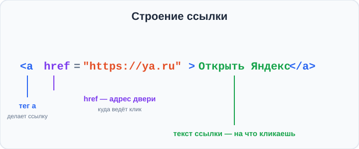
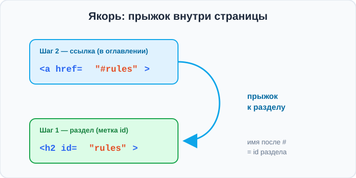

# Урок 1 — Ссылки `<a>`: соединяем страницы 🔗

**Модуль 2 · Контент и шрифты · Урок 1 из 4 | 2 ак.ч. (1,5 часа)**

> ⬅️ [Все уроки модуля](../README.md) · [План курса](../../ПЛАН-КУРСА.md) · Предыдущий: [Модуль 1 «Проект обо мне»](../../модуль-01-старт-html-css/урок-06-проект-сборка/урок.md) · Следующий: Урок 2 «Шрифты» ➡️

> 🔁 В начале — [разминка/повтор](повторение.md).
> 📌 Быстро вспомнить материал — [итого.md](итого.md). 👨‍🏫 Сценарий — [преподавателю.md](преподавателю.md). 🖼 Проектор — [изображения.md](изображения.md).
> 🆘 **Пропустил урок?** — [самоучитель.md](самоучитель.md). 🧰 Больше трюков — [лайфхак.md](лайфхак.md), но главные разбираем прямо в уроке (значок 🧰).

> 🧭 **Как читать урок.** Интернет называют **сетью** (web — «паутина») не просто так: страницы связаны между собой **ссылками**. Сегодня научимся делать самое главное действие в вебе — **клик, который куда-то ведёт**. Разберём тег `<a>`: как сослаться на другой сайт, на свою страницу, на письмо и телефон, и даже **прыгнуть в нужное место этой же страницы** (якоря). А потом красиво оформим ссылки на все их состояния.

---

## 🎮 Что мы сделаем сегодня и что получим

**Задача:** собрать **стартовую страницу с навигацией** — заголовок, меню-оглавление и несколько разделов, между которыми можно прыгать по клику.

**В итоге** ты будешь уметь делать **любые** ссылки: на внешний сайт (в новой вкладке), на свою страницу, на почту и телефон, и **внутри страницы** — к нужному разделу. А ещё — стильно их оформлять.

**Главные навыки урока:** тег **`<a>`** и атрибут **`href`** · **внешние** и **относительные** ссылки · **`target="_blank"`** (новая вкладка) · **`mailto:`** и **`tel:`** · **якоря `#`** (`id` + `href="#id"`) · стили ссылок **`:link / :visited / :hover / :active`** · Emmet **`^`** (подъём на уровень вверх).

> 💡 **Главная мысль урока:** ссылка `<a href="...">` — это **дверь**. Атрибут `href` говорит, **куда** эта дверь ведёт: на другой сайт, на твою страницу, к письму или к разделу ниже.

---

## Часть 1 — Тег `<a>` и атрибут `href`

Ссылку делает тег **`<a>`** (от *anchor* — «якорь»). Он **парный**, а куда вести — задаёт атрибут **`href`** (*hypertext reference* — «адрес ссылки»):

```html
<a href="https://ya.ru">Открыть Яндекс</a>
```

- **`<a>...</a>`** — то, что видно и на что кликают (текст ссылки).
- **`href="..."`** — адрес, **куда** ведёт клик.



По умолчанию браузер подсвечивает ссылку **синим с подчёркиванием** — чтобы её было видно. Позже мы это оформление изменим под свой вкус.

> 💡 **Ссылкой можно обернуть что угодно** — не только текст, но и картинку с прошлого модуля:
> ```html
> <a href="https://ya.ru"></a>
> ```
> Теперь клик по картинке ведёт на сайт. Так делают кликабельные логотипы.

> ✍️ **Мини-задание 1:** сделай ссылку с текстом «Мой любимый сайт», которая ведёт на любой реальный сайт (например, `https://ya.ru`). Проверь, что клик открывает страницу.
> <details><summary>💡 подсказка</summary><code>&lt;a href="https://ya.ru"&gt;Мой любимый сайт&lt;/a&gt;</code>. Адрес — целиком, с <code>https://</code>.</details>

---

## Часть 2 — Куда ведёт ссылка: внешние и свои страницы

Есть два вида адресов в `href`:

**1. Внешняя ссылка** — на **другой сайт**. Пиши **полный адрес** с `https://`:
```html
<a href="https://ru.wikipedia.org">Википедия</a>
```

**2. Относительная ссылка** — на **свою** страницу рядом. Пиши **только имя файла**:
```html
<a href="about.html">Обо мне</a>
<a href="index.html">На главную</a>
```

> 🧭 **Правило:** есть `https://` → это чужой сайт в интернете. Нет `https://`, просто имя файла → это твоя страница, лежащая **рядом**. Так несколько твоих HTML-файлов соединяются в один маленький сайт.

**Открыть в новой вкладке** — атрибут **`target="_blank"`**:
```html
<a href="https://ya.ru" target="_blank">Яндекс (в новой вкладке)</a>
```
Так обычно открывают **внешние** сайты — чтобы твоя страница не закрылась.

> 🧰 **Лайфхак безопасности:** к внешним ссылкам с `target="_blank"` добавляют `rel="noopener"` — защита от того, чтобы чужая страница «дотянулась» до твоей:
> ```html
> <a href="https://ya.ru" target="_blank" rel="noopener">Яндекс</a>
> ```
> Запоминать необязательно, но на настоящих сайтах это стандарт.

> ✍️ **Мини-задание 2:** сделай две ссылки: одну — на внешний сайт, открывающийся **в новой вкладке**, вторую — на свою страницу `about.html` (можно ещё не создавать файл — проверим позже). Заметь разницу в адресе.
> <details><summary>💡 подсказка</summary>Внешняя: <code>href="https://..." target="_blank"</code>. Своя: <code>href="about.html"</code> — только имя файла.</details>

---

## Часть 3 — Особые ссылки: письмо и звонок

Ссылка умеет не только открывать страницы. Она может **написать письмо** или **позвонить**:

```html
<a href="mailto:hi@mail.ru">Написать письмо</a>
<a href="tel:+79001234567">Позвонить</a>
```

- **`mailto:`** — по клику откроется почтовая программа с уже вписанным адресом.
- **`tel:`** — на телефоне по клику начнётся набор номера.

Так делают кнопки «Связаться» и «Позвонить» на сайтах кафе, магазинов, мастеров.

> ✍️ **Мини-задание 3:** добавь на страницу «контакты»: ссылку-письмо на любой email и ссылку-звонок на любой номер. На компьютере письмо откроется в почте, а телефон особенно заметен на смартфоне.
> <details><summary>💡 подсказка</summary><code>&lt;a href="mailto:hi@mail.ru"&gt;Почта&lt;/a&gt;</code> и <code>&lt;a href="tel:+79001112233"&gt;Телефон&lt;/a&gt;</code>.</details>

---

## Часть 4 — Якоря `#`: прыжок внутри страницы ⚓

Самое интересное: ссылка может вести **не на другой сайт, а в нужное место этой же страницы**. Это называется **якорь** (anchor). Так делают **оглавления**: клик — и ты сразу у нужного раздела.

Работает в **два шага**:

**Шаг 1.** Ставим на раздел метку — атрибут **`id`** (уникальное имя):
```html
<h2 id="rules">Правила</h2>
```

**Шаг 2.** Делаем ссылку на эту метку через **`#`** и то же имя:
```html
<a href="#rules">Перейти к правилам</a>
```

Клик — и страница **прокрутится** к заголовку «Правила». Имя после `#` в ссылке = `id` у раздела.



**Мини-оглавление** для длинной страницы выглядит так:
```html
<a href="#about">О герое</a>
<a href="#rules">Правила</a>
<a href="#contacts">Контакты</a>

<h2 id="about">О герое</h2>
<p>...</p>

<h2 id="rules">Правила</h2>
<p>...</p>

<h2 id="contacts">Контакты</h2>
<p>...</p>
```

> 🧰 **Лайфхак:** ссылка **`<a href="#">Наверх</a>`** (просто решётка) прыгает в **самый верх** страницы. Удобно для кнопки «⬆ Наверх» внизу длинной страницы. А `href="#top"` сработает, если наверху есть элемент с `id="top"`.

> 🧰 **Плавная прокрутка** одной строкой CSS — вместо резкого прыжка страница мягко «доедет» до раздела:
> ```css
> html { scroll-behavior: smooth; }
> ```

> ✍️ **Мини-задание 4:** сделай два заголовка с `id` (например, `id="games"` и `id="films"`) и сверху — два якоря-ссылки на них. Проверь: клик прокручивает к нужному разделу.
> <details><summary>💡 подсказка</summary>У раздела — <code>&lt;h2 id="games"&gt;...&lt;/h2&gt;</code>, ссылка — <code>&lt;a href="#games"&gt;К играм&lt;/a&gt;</code>. Имена совпадают.</details>

---

## Часть 5 — Оформляем ссылки: 4 состояния

У ссылки есть **4 состояния**, и каждому можно задать свой стиль — это псевдоклассы (мы уже трогали `:hover` в модуле 1):

```css
a:link    { color: #2563eb; }   /* обычная (ещё не посещённая) */
a:visited { color: #7c3aed; }   /* уже посещённая */
a:hover   { color: #dc2626; }   /* наведена мышь */
a:active  { color: #f59e0b; }   /* в момент клика */
```

Порядок важен — запоминают как **«LoVe HAte»** (link, visited, hover, active). Если перепутать, `:hover` может не сработать.

**Самое частое оформление** — убрать подчёркивание и добавить его обратно при наведении:
```css
a {
    color: #2563eb;
    text-decoration: none;   /* убрали подчёркивание */
}
a:hover {
    text-decoration: underline;   /* вернули при наведении */
    color: #dc2626;
}
```

- 👀 Ссылка выглядит аккуратно, а при наведении «отзывается» — подчёркивается и меняет цвет.

> 💡 **`text-decoration`** управляет подчёркиванием текста: `none` — убрать, `underline` — подчеркнуть, `line-through` — зачеркнуть.

> ✍️ **Мини-задание 5:** оформи ссылки на своей странице: убери подчёркивание, задай приятный цвет, а при наведении (`:hover`) поменяй цвет и верни подчёркивание.
> <details><summary>💡 подсказка</summary><code>a { text-decoration: none; color: teal; }</code> и <code>a:hover { color: coral; text-decoration: underline; }</code>.</details>

---

## Часть 6 — Ссылка-кнопка и меню навигации

Помнишь ссылку-кнопку из модуля 1? Ссылку можно превратить в **кнопку** — просто оформив её через CSS. Собираем меню сайта в теге **`<nav>`** (смысловой контейнер для навигации):

```html
<nav>
    <a href="index.html">Главная</a>
    <a href="#about">О нас</a>
    <a href="#contacts">Контакты</a>
</nav>
```

```css
nav a {
    display: inline-block;          /* чтобы работали отступы */
    background-color: #2563eb;
    color: white;
    padding: 10px 18px;
    border-radius: 8px;
    text-decoration: none;
}
nav a:hover {
    background-color: #1e40af;
}
```

- 👀 Обычные ссылки превратились в ряд аккуратных кнопок-вкладок с наведением.

> 🧭 **`nav a { ... }`** — это правило для **ссылок внутри `nav`**. Пробел между `nav` и `a` значит «`a`, которые лежат внутри `nav`». Так один стиль ловит все ссылки меню, не трогая остальные.

> ✍️ **Мини-задание 6:** собери меню из 3 ссылок в `<nav>` и оформи их как кнопки (фон, `padding`, скругление, без подчёркивания). Добавь `:hover`.
> <details><summary>💡 подсказка</summary>Оберни ссылки в <code>&lt;nav&gt;</code>, стиль — <code>nav a { display: inline-block; padding: 10px 18px; ... }</code>.</details>

---

## Часть 7 — Мини-проект: «Стартовая страница с навигацией» 🚀

Соберём страницу, где сверху — **меню-оглавление**, а ниже — разделы, к которым ведут якоря.

**`index.html`** (фрагмент):
```html
<body>
    <h1>🎮 Мой игровой уголок</h1>

    <nav>
        <a href="#games">Топ-игры</a>
        <a href="#about">Обо мне</a>
        <a href="#links">Ссылки</a>
    </nav>

    <h2 id="games">🏆 Топ-игры</h2>
    <p>Minecraft, The Legend of Zelda, Stardew Valley.</p>

    <h2 id="about">🙂 Обо мне</h2>
    <p>Играю с 8 лет, люблю кооперативы и приключения.</p>

    <h2 id="links">🔗 Ссылки</h2>
    <p><a href="https://ru.wikipedia.org" target="_blank" rel="noopener">Про игры в Википедии</a></p>

    <p><a href="#">⬆ Наверх</a></p>
</body>
```

**`style.css`:**
```css
html { scroll-behavior: smooth; }
body { background-color: #0f172a; color: #e2e8f0; text-align: center; }
h1   { color: #38bdf8; }

nav a {
    display: inline-block;
    background-color: #1e293b;
    color: #38bdf8;
    padding: 10px 18px;
    border-radius: 10px;
    text-decoration: none;
}
nav a:hover { background-color: #38bdf8; color: #0f172a; }
```

- 👀 Клик по меню плавно прокручивает к разделу, ссылка «Наверх» возвращает вверх, а внешняя ссылка открывается в новой вкладке.

> 🎨 **Твой вариант:** сделай стартовую страницу на **свою** тему (любимый спорт, музыка, сериал): меню-якоря на 3 раздела + одна внешняя ссылка + «Наверх».

> 🧩 **Для 5–7 классов (проще):** хватит меню из 3 якорей и трёх разделов с `id`. Оформление ссылок — только `color` и `text-decoration: none`.

---

## 🧰 Часть 8 — Emmet: подъём вверх `^`

Ты уже знаешь Emmet `>` (вложить), `+` (рядом), `*` (повтор). Новый символ — **`^`** — **поднимает** на уровень вверх, чтобы следующий элемент встал **не внутрь**, а рядом с родителем.

```
nav>a{Главная}+a{О нас}^footer{низ}
```
развернётся в:
```html
<nav>
    <a href="">Главная</a>
    <a href="">О нас</a>
</nav>
<footer>низ</footer>
```

Без `^` тег `footer` попал бы **внутрь** `nav`. Символ `^` «выныривает» из `nav` наружу. Два `^^` — поднимут на два уровня.

> ✍️ **Мини-задание 7:** разверни Emmet-строкой каркас: `nav>a*3^main>h1` и посмотри, что `main` встал **рядом** с `nav`, а не внутри.
> <details><summary>💡 подсказка</summary>После <code>a*3</code> символ <code>^</code> выводит из <code>nav</code>, и <code>main</code> становится соседом.</details>

---

## 🎓 Часть 9 — Для тех, кто хочет глубже

- **`title` у ссылки** — всплывающая подсказка при наведении: `<a href="..." title="Откроется в новой вкладке">`.
- **`download`** — по клику файл скачивается, а не открывается: `<a href="файл.pdf" download>Скачать</a>`.
- **Якорь на другой странице:** `href="about.html#team"` — открыть `about.html` и сразу прокрутить к `id="team"`.
- **`:focus`** — состояние, когда до ссылки дошли клавишей `Tab`. Важно для доступности — не убирай обводку совсем.
- **`scroll-margin-top`** — если верхнее меню «прилипшее», добавь разделам `scroll-margin-top: 70px;`, чтобы якорь не прятался под меню.

---

## 🏁 Итог урока

Сегодня ты научился связывать страницы и разделы ссылками:

- ✅ **`<a href="...">`** — ссылка; `href` задаёт, **куда** вести.
- ✅ **Внешняя** ссылка — полный адрес `https://...`; **своя** — имя файла; `target="_blank"` — новая вкладка.
- ✅ **`mailto:`** — письмо, **`tel:`** — звонок.
- ✅ **Якоря:** `id="имя"` на разделе + `href="#имя"` в ссылке = прыжок внутри страницы.
- ✅ **Стили ссылок:** `:link / :visited / :hover / :active` (LoVe HAte), `text-decoration: none`.
- ✅ **Emmet `^`** — подъём на уровень вверх.

> 🏆 Главное: ссылка — это **дверь**, а `href` — **адрес двери**. Быстро повторить — в [итого.md](итого.md).

> 🎤 **Блиц:** какой тег делает ссылку и какой атрибут задаёт адрес? Чем внешняя ссылка отличается от своей? Как открыть в новой вкладке? Как сделать прыжок к разделу на этой же странице? Назови 4 состояния ссылки.

### 🎮 Викторина-закрепление
Открой **[викторина.html](викторина.html)** — вопросы по ссылкам **+ повторение CSS и тегов из модуля 1** + смешные и «на подумать».

➡️ **Практика урока** — **[практика.md](практика.md)**: задачи в 3 уровнях + итоговая работа.
🆘 **Пропустил / хочешь ещё?** — [самоучитель.md](самоучитель.md). 📌 **Шпаргалка** — [итого.md](итого.md).

---

## 🔗 Навигация

⬅️ [Модуль 1](../../модуль-01-старт-html-css/README.md) · [Все уроки модуля](../README.md) · [План курса](../../ПЛАН-КУРСА.md) · **Следующий:** Урок 2 «Шрифты» ➡️

**🧰 Инструменты:** [VS Code](https://code.visualstudio.com/) + [Live Server](https://marketplace.visualstudio.com/items?itemName=ritwickdey.LiveServer). **📄 Пример:** [`материалы/стартовая.html`](материалы/стартовая.html) — стартовая страница с навигацией и якорями.
