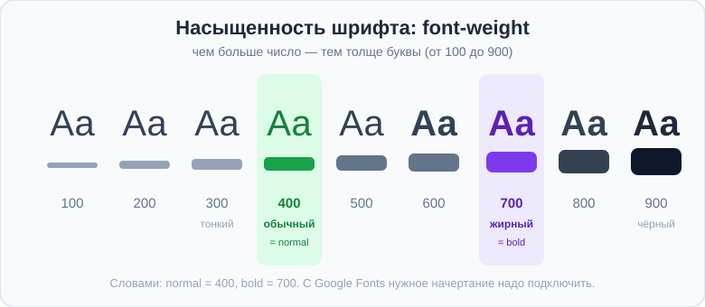
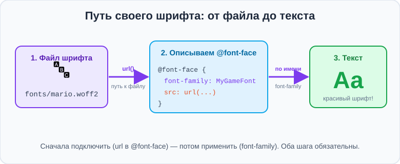

# Урок 2 — Шрифты: Google Fonts и свой шрифт ✍️🔤

**Модуль 2 · Контент и шрифты · Урок 2 из 4 | 2 ак.ч. (1,5 часа)**

> ⬅️ [Все уроки модуля](../README.md) · [План курса](../../ПЛАН-КУРСА.md) · Предыдущий: [Урок 1 «Ссылки»](../урок-01-ссылки/урок.md) · Следующий: Урок 3 «Списки» ➡️

> 🔁 В начале — [разминка/повтор](повторение.md).
> 📌 Быстро вспомнить материал — [итого.md](итого.md). 👨‍🏫 Сценарий — [преподавателю.md](преподавателю.md). 🖼 Проектор — [изображения.md](изображения.md).
> 🆘 **Пропустил урок?** — [самоучитель.md](самоучитель.md). 🧰 Больше трюков — [лайфхак.md](лайфхак.md), но главные разбираем прямо в уроке (значок 🧰).

> 🧭 **Как читать урок.** Один и тот же текст **разным шрифтом** выглядит совершенно по-разному: строгим, весёлым, дорогим, винтажным. Шрифт — это **голос** страницы. Сегодня научимся главному приёму настоящих сайтов — **подключать красивые шрифты с Google Fonts** (это делают миллионы сайтов, и это бесплатно), а потом разберём, как поставить **вообще любой свой шрифт** через `@font-face` и `url()`. Подробно поймём, что такое `url()` — эта штука встретится нам ещё много раз (картинки, иконки, фоны).

---

## 🎮 Что мы сделаем сегодня и что получим

**Задача:** оформить **типографский постер** — страницу, где главную роль играет **красивый шрифт**: крупный выразительный заголовок и аккуратный текст.

**В итоге** ты будешь уметь подключать **любой** шрифт: и готовый с Google Fonts (в пару кликов), и **свой** из файла через `@font-face`. Научишься сочетать шрифты и менять их насыщенность.

**Главные навыки урока:** свойство **`font-family`** и **стек шрифтов** (запасные) · **Google Fonts** (выбрать → `<link>` → применить) · **`font-weight`** (насыщенность) и **`font-style`** (курсив) · **`@font-face`** + **`url()`** (свой шрифт из файла) · **`font-display: swap`**.

> 💡 **Главная мысль урока:** шрифт задаётся свойством **`font-family`**, но браузер знает только **системные** шрифты. Чтобы у всех был **один красивый** шрифт, его нужно **подключить** — либо ссылкой на Google Fonts, либо своим файлом через `@font-face`.

---

## Часть 1 — `font-family` и стек шрифтов

Шрифт текста задаёт свойство **`font-family`**:

```css
body { font-family: Georgia; }
h1   { font-family: "Comic Sans MS"; }
```

- Если в названии шрифта **есть пробел** — бери его в **кавычки**: `"Comic Sans MS"`, `"Times New Roman"`.

Но есть проблема: у одного человека шрифт `Georgia` установлен, а у другого — нет. Поэтому пишут **стек шрифтов** — список «на замену», через запятую:

```css
body {
    font-family: Georgia, "Times New Roman", serif;
}
```

Браузер берёт **первый**, который есть на компьютере. Если нет ни одного — сработает **последнее слово** (`serif`) — это не название, а **семейство**:

| Семейство (в конце стека) | Какой шрифт | Настроение |
|---------------------------|-------------|-----------|
| `serif` | с засечками (как в книгах) | классика, строгость |
| `sans-serif` | без засечек (рубленый) | современность, чистота |
| `monospace` | моноширинный (как в коде) | техно, ретро-компьютер |
| `cursive` | рукописный | праздник, тепло |

> 🧭 **Правило:** в конце стека **всегда** ставь семейство (`serif`/`sans-serif`/`monospace`) — это «страховка», чтобы страница не осталась совсем без шрифта.

> ✍️ **Мини-задание 1:** задай `body` шрифт `Georgia` с запасным `serif`, а `h1` — `"Trebuchet MS"` с запасным `sans-serif`. Посмотри, как поменялось «настроение» текста.
> <details><summary>💡 подсказка</summary><code>body { font-family: Georgia, serif; }</code> и <code>h1 { font-family: "Trebuchet MS", sans-serif; }</code>.</details>

---

## Часть 2 — Google Fonts: красивый шрифт в пару кликов ⭐

Системных шрифтов мало и они скучноваты. **Google Fonts** — огромная **бесплатная** библиотека шрифтов, которую можно подключить к своему сайту. Так делают миллионы сайтов. Это **главный** способ ставить красивые шрифты.

**Шаг 1.** Зайди на **[fonts.google.com](https://fonts.google.com)**. Выбери шрифт (например, **Montserrat**, **Roboto**, **Lobster**, **Pacifico**). Нажми на него.

**Шаг 2.** Выбери начертания (**Get font** → **Get embed code**). Google даст готовый код `<link>` — скопируй его в свой `<head>`:

```html
<head>
    <meta charset="UTF-8">
    <link rel="preconnect" href="https://fonts.googleapis.com">
    <link rel="preconnect" href="https://fonts.gstatic.com" crossorigin>
    <link href="https://fonts.googleapis.com/css2?family=Montserrat&display=swap" rel="stylesheet">
</head>
```

**Шаг 3.** Теперь просто используй шрифт по имени в CSS:

```css
body { font-family: "Montserrat", sans-serif; }
```

- 👀 Готово! Весь текст стал набран красивым Montserrat — и так его увидят **все**, даже если у них этого шрифта не было.

> 🧭 **Как это работает:** `<link>` говорит браузеру «скачай шрифт Montserrat с серверов Google», а `font-family` — «набери текст этим шрифтом». Первое — **подключить**, второе — **применить**. Оба шага обязательны.

> 🧰 **Лайфхак — сочетание шрифтов.** Красиво, когда **заголовки** одним шрифтом, а **текст** — другим (но не больше 2 шрифтов на страницу!). Классические пары: выразительный заголовок + спокойный текст.
> ```css
> h1, h2 { font-family: "Lobster", cursive; }     /* яркие заголовки */
> body   { font-family: "Montserrat", sans-serif; } /* спокойный текст */
> ```

> ✍️ **Мини-задание 2:** зайди на fonts.google.com, выбери любой шрифт, подключи его через `<link>` и примени к `body`. Затем выбери второй шрифт для заголовков.
> <details><summary>💡 подсказка</summary>Скопируй `<link>` из «Get embed code» в `<head>`, потом `body { font-family: "ИмяШрифта", sans-serif; }`.</details>

---

## Часть 3 — Насыщенность и курсив: `font-weight`, `font-style`

У одного шрифта бывает несколько **начертаний** — от тонкого до жирного:

**`font-weight`** — насыщенность (толщина букв):
```css
h1    { font-weight: 700; }   /* жирный (bold) */
p     { font-weight: 400; }   /* обычный (normal) — значение по умолчанию */
.thin { font-weight: 300; }   /* тонкий */
```
Значения задают **числом** от `100` до `900` с шагом 100 — чем больше число, тем толще буквы:



- `100`–`300` — тонкие; **`400`** — обычный (**normal**, стоит по умолчанию); `500`–`600` — средние; **`700`** — жирный (**bold**); `800`–`900` — очень жирный («чёрный»).
- Вместо чисел можно писать словами: **`normal`** (= `400`) и **`bold`** (= `700`).

**`font-style`** — наклон букв. Всего два основных значения:
```css
.quote  { font-style: italic; }   /* курсив (наклонный) */
.normal { font-style: normal; }   /* обычный, прямой — значение по умолчанию */
```
- **`normal`** — прямые буквы (так стоит по умолчанию).
- **`italic`** — курсив (наклон). Им обычно выделяют цитаты, термины, подписи.

> 🧭 Если текст уже сделали курсивом, а нужно вернуть прямой — задай ему `font-style: normal;`.

> ⚠️ **Важно с Google Fonts:** если хочешь жирный `700` или курсив — их нужно **выбрать при подключении** на fonts.google.com (галочки начертаний). Если начертание не подключено, браузер «подделает» его криво.

> ✍️ **Мини-задание 3:** сделай заголовок жирным (`font-weight: 700`), одну фразу — тонкой (`300`), а цитату — курсивом (`font-style: italic`).
> <details><summary>💡 подсказка</summary><code>h1 { font-weight: 700; }</code>, <code>.thin { font-weight: 300; }</code>, <code>.quote { font-style: italic; }</code>.</details>

---

## Часть 4 — Свой шрифт: `@font-face` и `url()` 🎯

А если нужного шрифта **нет** на Google Fonts (например, ты скачал красивый шрифт для игры или бренда)? Тогда подключаем **файл шрифта** сами — правилом **`@font-face`**.

**Шаг 1.** Положи файл шрифта (например, `mario.woff2`) рядом со своим CSS, скажем в папку `fonts/`.

**Шаг 2.** В начале `style.css` **опиши** шрифт правилом `@font-face`:

```css
@font-face {
    font-family: "MyGameFont";              /* придумываем имя */
    src: url("fonts/mario.woff2");           /* путь к файлу шрифта */
}
```

**Шаг 3.** Теперь используй это имя как обычно:

```css
h1 { font-family: "MyGameFont", sans-serif; }
```



### 🔍 Разбираемся с `url()` — это важно!

**`url(...)`** — это способ в CSS **указать путь к файлу**. Внутри скобок — адрес файла, точно как в `href` у ссылки или `src` у картинки:

```css
src: url("fonts/mario.woff2");
```
- `url()` — «возьми файл по этому пути».
- `"fonts/mario.woff2"` — путь: папка `fonts`, в ней файл `mario.woff2`.

> 🧭 **Запомни `url()` — он встретится ещё много раз!** Тем же `url()` мы будем подключать **фоновые картинки** (`background-image: url("фон.jpg")`), **иконки** и другое. Везде смысл один: «файл лежит вот здесь».

**Форматы файлов шрифтов:** лучший — **`.woff2`** (самый лёгкий, быстро грузится). Бывают ещё `.woff`, `.ttf`, `.otf`. Для сайта предпочитай `.woff2`.

> ✍️ **Мини-задание 4:** объясни своими словами, что делает строка `src: url("fonts/hero.woff2");`. Что такое `url()` и что внутри скобок?
> <details><summary>💡 подсказка</summary><code>url()</code> — путь к файлу; внутри — адрес файла шрифта (папка <code>fonts</code>, файл <code>hero.woff2</code>). Это как <code>href</code> у ссылки, только для файла шрифта.</details>

---

## Часть 5 — `font-display: swap` — чтобы текст не исчезал

Пока шрифт скачивается, текст может на миг **пропасть** (пустое место). Чтобы этого не было, добавляют **`font-display: swap`** — «покажи текст сразу запасным шрифтом, а потом замени на нужный»:

```css
@font-face {
    font-family: "MyGameFont";
    src: url("fonts/mario.woff2");
    font-display: swap;   /* текст виден сразу, без «мигания» */
}
```

У Google Fonts это уже включено — помнишь `&display=swap` в конце ссылки? Это то же самое.

> ✍️ **Мини-задание 5:** добавь `font-display: swap;` в своё правило `@font-face`. Объясни соседу, зачем он нужен.
> <details><summary>💡 подсказка</summary>Он показывает текст сразу запасным шрифтом, пока грузится основной — текст не «мигает» пустотой.</details>

---

## Часть 6 — Мини-проект: «Типографский постер» 🎨

Соберём постер, где **главное — шрифт**: огромный выразительный заголовок и аккуратный текст под ним. Как афиша концерта или обложка.

**`index.html`** (фрагмент):
```html
<head>
    <meta charset="UTF-8">
    <link rel="preconnect" href="https://fonts.googleapis.com">
    <link href="https://fonts.googleapis.com/css2?family=Bebas+Neue&family=Montserrat&display=swap" rel="stylesheet">
    <link rel="stylesheet" href="style.css">
    <title>Постер</title>
</head>
<body>
    <h1>МУЗЫКА<br>БУДУЩЕГО</h1>
    <p class="sub">Фестиваль электронной музыки</p>
    <p class="date">15 июля · 19:00 · Парк «Заря»</p>
</body>
```

**`style.css`:**
```css
body {
    background-color: #0f0f23;
    color: #f5f5f5;
    text-align: center;
    font-family: "Montserrat", sans-serif;
    padding: 60px 20px;
}
h1 {
    font-family: "Bebas Neue", sans-serif;
    font-size: 90px;          /* px мы уже знаем */
    letter-spacing: 4px;
    color: #ff2e63;
    margin: 0;
    line-height: 1;
}
.sub  { font-size: 22px; font-weight: 300; letter-spacing: 6px; }
.date { color: #08d9d6; font-weight: 700; }
```

- 👀 Крупный «плакатный» заголовок Bebas Neue + спокойный Montserrat внизу — выглядит как настоящая афиша.

> 🎨 **Твой вариант:** сделай постер на **свою** тему (концерт, кинопремьера, спортивный турнир, выставка). Подбери **пару шрифтов** с Google Fonts: один — «кричащий» для заголовка, другой — спокойный для текста.

> 🧩 **Для 5–7 классов (проще):** хватит **одного** шрифта с Google Fonts на всю страницу + крупный заголовок и подзаголовок. `@font-face` — по желанию.

---

## 🎓 Часть 7 — Для тех, кто хочет глубже

- **Несколько начертаний одним `@font-face`:** можно описать `Regular` и `Bold` как один шрифт с разным `font-weight` — тогда `font-weight: bold` подхватит нужный файл.
- **`font` — короткая запись:** `font: italic 700 20px/1.5 "Montserrat", sans-serif;` (стиль, вес, размер/интерлиньяж, семейство).
- **Переменные шрифты (variable fonts):** один файл, а насыщенность плавно меняется от 100 до 900. Google Fonts многие такие.
- **Локальные системные стеки:** `font-family: system-ui, sans-serif;` — берёт «родной» шрифт системы (быстро, без загрузки).
- **Не грузи лишнее:** каждое начертание — это вес страницы. Подключай только те, что реально нужны (обычно 400 и 700).

---

## 🏁 Итог урока

Сегодня ты научился ставить на страницу **любой** шрифт:

- ✅ **`font-family`** задаёт шрифт; в конце стека — **семейство** (`serif`/`sans-serif`) как страховка.
- ✅ **Google Fonts** — подключить `<link>` + применить `font-family`. Главный способ, бесплатно.
- ✅ **`font-weight`** — насыщенность (400/700), **`font-style: italic`** — курсив.
- ✅ **`@font-face` + `url()`** — свой шрифт из файла; `url()` — это **путь к файлу** (встретится ещё не раз!).
- ✅ **`font-display: swap`** — текст не «мигает» при загрузке шрифта.

> 🏆 Главное: **шрифт нужно сначала подключить, потом применить.** Google Fonts — в пару кликов; свой файл — через `@font-face`/`url()`. Быстро повторить — в [итого.md](итого.md).

> 🎤 **Блиц:** каким свойством задают шрифт? Зачем стек с `sans-serif` в конце? Как подключить шрифт с Google Fonts (два шага)? Что делает `url()`? Зачем `font-display: swap`?

### 🎮 Викторина-закрепление
Открой **[викторина.html](викторина.html)** — вопросы по шрифтам **+ повторение ссылок и CSS** + смешные и «на подумать».

➡️ **Практика урока** — **[практика.md](практика.md)**: задачи в 3 уровнях + итоговая работа.
🆘 **Пропустил / хочешь ещё?** — [самоучитель.md](самоучитель.md). 📌 **Шпаргалка** — [итого.md](итого.md).

---

## 🔗 Навигация

⬅️ [Урок 1 «Ссылки»](../урок-01-ссылки/урок.md) · [Все уроки модуля](../README.md) · [План курса](../../ПЛАН-КУРСА.md) · **Следующий:** Урок 3 «Списки» ➡️

**🧰 Инструменты:** [VS Code](https://code.visualstudio.com/) + [Live Server](https://marketplace.visualstudio.com/items?itemName=ritwickdey.LiveServer). **🔤 Шрифты:** [Google Fonts](https://fonts.google.com). **📄 Пример:** [`материалы/постер.html`](материалы/постер.html) — типографский постер на двух Google-шрифтах.
