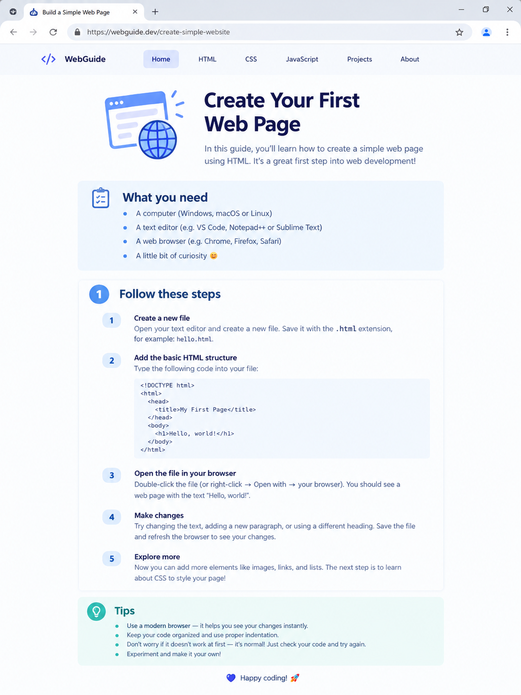

# 📝 Практика · Урок 3 «Списки»

**Темы:** `<ul>`/`<ol>`/`<li>`, `list-style-type` и `list-style: none`, вложенные списки, `<dl>`/`<dt>`/`<dd>`, меню из списка (`display: flex`), Emmet `ul>li*5`. Плюс повторяем ссылки и шрифты.

> 🎯 **Как работать.** Делай в файлах `.html`/`.css`, смотри результат в браузере через Live Server (сохраняй — `Ctrl+S`). Уровни: 🟢 базовые · 🟡 средние · 🔴 со звёздочкой. 💡 подсказка — это наводка, а не готовый код.
>
> 📌 **Правила игры:** список — контейнер (`<ul>`/`<ol>`) + пункты `<li>`; маркеры меняет `list-style-type`, убирает `list-style: none`; вложенный список кладут внутрь `<li>`; меню = список без маркеров + `display: flex`.

---

## 🟢 Уровень 1 — базовый (обязательно)

**1. Список покупок.**
Сделай маркированный список «Список покупок» из 5 пунктов. Разверни его Emmet-строкой `ul>li*5`, потом впиши товары.
> 💡 Подсказка: `<ul><li>...</li></ul>`. Emmet: `ul>li*5` + Tab.

**2. Шаги рецепта.**
Сделай нумерованный список «Как сварить макароны» из 4 шагов. Убедись, что браузер сам поставил номера 1–4.
> 💡 Подсказка: `<ol><li>...</li></ol>`. Emmet: `ol>li*4`.

**3. Автонумерация.**
В списке из задания 2 добавь новый шаг в середину. Проверь, что номера пересчитались сами.
> 💡 Подсказка: просто вставь ещё один `<li>` — `<ol>` перенумерует автоматически.

**4. Меняем маркер.**
Возьми маркированный список и попробуй на нём три вида маркеров по очереди: `square`, `circle`, затем убери маркеры совсем.
> 💡 Подсказка: `ul { list-style-type: square; }`; убрать — `ul { list-style: none; }`.

**5. Список с эмодзи.**
Убери стандартные маркеры и начни каждый пункт с эмодзи прямо в тексте (✅, 🔥, ⭐).
> 💡 Подсказка: `ul { list-style: none; }` и `<li>✅ Пункт</li>`.

**6. Буквы вместо цифр.**
Сделай нумерованный список, где вместо цифр — буквы (A, B, C).
> 💡 Подсказка: `<ol type="A">` или `ol { list-style-type: upper-alpha; }`.

**7. Мини-словарик.**
Сделай список описаний `<dl>` из 3 пар «термин → объяснение» на любую тему (игры, спорт).
> 💡 Подсказка: `<dl>`, внутри пары `<dt>термин</dt>` и `<dd>описание</dd>`.

---

## 🟡 Уровень 2 — средний (для уверенности)

**8. Вложенный список.**
Сделай список «Мой день» с пунктами «Утро», «День», «Вечер», а внутри каждого — вложенный список из 2 дел.
> 💡 Подсказка: вложенный `<ul>` ставь **внутрь** `<li>`, перед его `</li>`.

**9. Дерево категорий.**
Собери «дерево» из вложенных списков: «Фрукты» (яблоко, банан), «Овощи» (морковь, огурец) — минимум два уровня вложенности.
> 💡 Подсказка: у пункта верхнего уровня внутри — свой `<ul>` с подпунктами.

**10. Горизонтальное меню.**
Собери меню сайта из `<ul class="menu">` с тремя пунктами-ссылками. Убери маркеры и поставь пункты в ряд.
> 💡 Подсказка: `.menu { list-style: none; padding: 0; display: flex; gap: 20px; }`, внутри `<li>` — `<a>`.

**11. Меню-кнопки.**
Оформи меню из задания 10 так, чтобы пункты выглядели кнопками: фон, `padding`, скругление, отклик на `:hover` (повтор урока 1).
> 💡 Подсказка: `.menu a { display: inline-block; background: #2563eb; color: #fff; padding: 8px 16px; border-radius: 8px; text-decoration: none; }`.

**12. Топ-5 с красивым шрифтом.**
Сделай страницу «Топ-5» на свою тему нумерованным списком и подключи к ней красивый шрифт с Google Fonts (повтор урока 2).
> 💡 Подсказка: `<ol>` + `<link>` шрифта + `body { font-family: "...", sans-serif; }`.

**13. FAQ из `<dl>`.**
Сделай блок «Частые вопросы»: 3 вопроса (`<dt>`) и ответы к ним (`<dd>`). Вопросы сделай жирными через CSS.
> 💡 Подсказка: `dt { font-weight: 700; }` — вопрос выделен, ответ обычный.

---

## 🔴 Уровень 3 — со звёздочкой (челлендж)

**14. Своя картинка-маркер.**
Поставь спискам **свою картинку** вместо маркера через `list-style-image: url(...)`. Вспомни, что `url()` — это путь к файлу (как у шрифтов).
> 💡 Подсказка: `ul { list-style-image: url("звезда.png"); }` — картинка рядом с CSS.

**15. Цветной маркер через `::marker`.**
Сделай маркеры списка цветными и крупнее через псевдоэлемент `::marker`.
> 💡 Подсказка: `li::marker { color: #e11d48; font-size: 20px; }`.

**16. Двухуровневое меню.**
Собери меню, где у одного пункта при наведении есть подсписок (вложенный `<ul>`). Пока можно просто показать вложенный список под пунктом.
> 💡 Подсказка: вложенный `<ul>` внутри `<li>`; оформи его отступом и другим цветом.

---

## 🏆 Итоговая работа урока — «Гайд: как что-то сделать»

Сделай **понятную пошаговую инструкцию (гайд)** на тему, в которой ты разбираешься: как пройти уровень в игре, как собрать что-то, как приготовить блюдо, как ухаживать за питомцем, правила настольной игры. Хороший гайд — это когда по нему реально можно повторить!

**Пример темы:** «Как построить дом в Minecraft», «Как испечь печенье», «Как научиться кататься на скейте», «Правила игры «Мафия»», «Как собрать кубик Рубика».

### 📋 Что должно быть на странице

1. **Заголовок гайда (`h1`)** и короткое вступление (`p`).
2. **Список «Что понадобится» (`<ul>`)** — материалы/предметы/условия, маркированный.
3. **Пошаговая инструкция (`<ol>`)** — сами шаги по порядку, минимум 5 пунктов. Хотя бы один шаг с **вложенным** подсписком.
4. **Мини-словарик или «Советы» (`<dl>` ИЛИ `<ul>`)** — 2–3 термина с объяснением или полезных совета.
5. **Меню-навигация из списка** сверху (`<ul class="menu">` + `display: flex`) — ссылки-якоря на разделы.
6. Подключён **шрифт с Google Fonts** и внешний **`style.css`**.

### ✅ Требования (проверь по списку)
- ✅ есть **маркированный** список `<ul>` («Что понадобится»);
- ✅ есть **нумерованный** список `<ol>` (шаги, ≥5 пунктов);
- ✅ есть хотя бы один **вложенный** список (внутри `<li>`);
- ✅ есть `<dl>` (словарик) **или** список «Советы»;
- ✅ есть **меню из списка** (`list-style: none` + `display: flex`) с якорями на разделы;
- ✅ подключён шрифт с **Google Fonts**;
- ✅ всё оформление во **внешнем `style.css`**, аккуратная палитра.

### 💡 Подсказки
- Раздели страницу на разделы с `id` («Что нужно», «Шаги», «Советы») и сделай меню-якоря на них (повтор урока 1).
- Шаги — только в `<ol>`: браузер сам пронумерует, и можно менять порядок.
- Вложенный список ставь **внутрь** `<li>`, к которому он относится.
- Убери у меню маркеры и отступ: `.menu { list-style: none; padding: 0; display: flex; gap: 18px; }`.
- Заголовки — выразительным шрифтом, текст — читаемым (пара шрифтов, повтор урока 2).

**Как это должно выглядеть (ориентир):**

> 🖼 *Ориентир по стилю; тема и содержание — твои. Если картинки пока нет — её подготовит учитель.*

**🌟 Мини-челлендж (по желанию):** поставь спискам **свою картинку-маркер** через `list-style-image: url(...)` или раскрась маркеры через `li::marker`.

---

> ✅ **🟢 — база есть. 🟡 — уверенно. 🔴 — мастер списков!**
> 🆘 Застрял — открой [самоучитель.md](самоучитель.md): там всё по шагам.
> 📌 Быстро вспомнить — [итого.md](итого.md).
