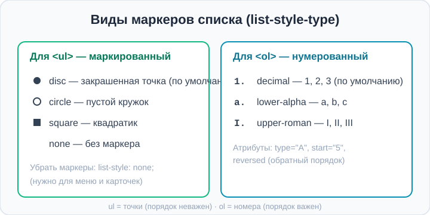

# Урок 3 — Списки: `<ul>`, `<ol>`, `<li>` и другие 📋

**Модуль 2 · Контент и шрифты · Урок 3 из 4 | 2 ак.ч. (1,5 часа)**

> ⬅️ [Все уроки модуля](../README.md) · [План курса](../../ПЛАН-КУРСА.md) · Предыдущий: [Урок 2 «Шрифты»](../урок-02-шрифты/урок.md) · Следующий: Урок 4 «Таблицы» ➡️

> 🔁 В начале — [разминка/повтор](повторение.md).
> 📌 Быстро вспомнить материал — [итого.md](итого.md). 👨‍🏫 Сценарий — [преподавателю.md](преподавателю.md). 🖼 Проектор — [изображения.md](изображения.md).
> 🆘 **Пропустил урок?** — [самоучитель.md](самоучитель.md). 🧰 Больше трюков — [лайфхак.md](лайфхак.md), но главные разбираем прямо в уроке (значок 🧰).

> 🧭 **Как читать урок.** Списки повсюду: топ-10 фильмов, список покупок, шаги рецепта, пункты меню сайта. Сегодня научимся делать **маркированные** (с точками) и **нумерованные** (по порядку) списки, менять их **маркеры**, вкладывать списки друг в друга и даже собирать из списка **горизонтальное меню сайта**. Бонус — вспомним `url()` из прошлого урока и поставим **свою картинку-маркер**.

---

## 🎮 Что мы сделаем сегодня и что получим

**Задача:** собрать страницу **«Топ-5»** (любимые игры, фильмы, книги) с красивым нумерованным списком, а ещё — меню-навигацию, собранную из списка.

**В итоге** ты будешь уметь делать любые списки, управлять их маркерами, вкладывать их друг в друга и превращать список в меню сайта.

**Главные навыки урока:** **`<ul>`** (маркированный) и **`<ol>`** (нумерованный) с пунктами **`<li>`** · свойство **`list-style-type`** (виды маркеров) · **вложенные** списки · список описаний **`<dl>`/`<dt>`/`<dd>`** · **список-меню** (`list-style: none` + горизонтально) · Emmet **`ul>li*5`**.

> 💡 **Главная мысль урока:** список — это **контейнер** (`<ul>` или `<ol>`), внутри которого лежат **пункты** `<li>`. Маркеры (точки или цифры) браузер рисует сам, а мы их настраиваем через CSS.

---

## Часть 1 — Маркированный список `<ul>`

**`<ul>`** (unordered list — «неупорядоченный список») — список с **точками-маркерами**. Каждый пункт — в теге **`<li>`** (list item):

```html
<ul>
    <li>Хлеб</li>
    <li>Молоко</li>
    <li>Сыр</li>
</ul>
```

- 👀 Три пункта, перед каждым — точка. Браузер сам расставил маркеры и отступы.

Маркированный список нужен, когда **порядок неважен** — просто перечисление (покупки, ингредиенты, качества).

> 🧰 **Лайфхак Emmet:** напиши `ul>li*3` и нажми `Tab` — Emmet развернёт `<ul>` с тремя `<li>` внутри. А `ul>li*3>a` — сразу со ссылками в пунктах (пригодится для меню). Помнишь `>` (вложить) и `*` (повторить) с прошлых уроков?

> ✍️ **Мини-задание 1:** сделай маркированный список «Что беру в поход» из 4 пунктов. Разверни его через Emmet `ul>li*4`.
> <details><summary>💡 подсказка</summary><code>&lt;ul&gt;&lt;li&gt;...&lt;/li&gt;&lt;/ul&gt;</code>. Emmet: <code>ul>li*4</code> + Tab, потом впиши текст.</details>

---

## Часть 2 — Нумерованный список `<ol>`

**`<ol>`** (ordered list — «упорядоченный список») — список с **номерами** по порядку. Пункты — те же `<li>`:

```html
<ol>
    <li>Разбей яйца в миску</li>
    <li>Взбей венчиком</li>
    <li>Вылей на сковороду</li>
</ol>
```

- 👀 Браузер сам пронумеровал пункты: 1, 2, 3. Добавишь пункт в середину — номера пересчитаются автоматически!

Нумерованный список нужен, когда **порядок важен**: шаги рецепта, инструкция, рейтинг, топ.

**Полезные атрибуты `<ol>`:**
```html
<ol type="A">      <!-- нумерация буквами: A, B, C -->
<ol start="5">     <!-- начать с пятёрки -->
<ol reversed>      <!-- обратный порядок: 3, 2, 1 -->
```

> ✍️ **Мини-задание 2:** сделай нумерованный список «Мои цели на месяц» из 3 пунктов. Потом добавь новый пункт в середину и убедись, что номера пересчитались сами.
> <details><summary>💡 подсказка</summary><code>&lt;ol&gt;&lt;li&gt;...&lt;/li&gt;&lt;/ol&gt;</code>. Emmet: <code>ol>li*3</code>.</details>

---

## Часть 3 — Меняем маркеры: `list-style-type`

Вид маркера задаёт свойство **`list-style-type`**:

```css
ul { list-style-type: square; }   /* квадратики вместо точек */
```



**Для `<ul>`** (маркированный):

| Значение | Маркер |
|----------|--------|
| `disc` | ● закрашенная точка (по умолчанию) |
| `circle` | ○ пустой кружок |
| `square` | ▪ квадратик |
| `none` | без маркера |

**Для `<ol>`** (нумерованный):

| Значение | Нумерация |
|----------|-----------|
| `decimal` | 1, 2, 3 (по умолчанию) |
| `lower-alpha` | a, b, c |
| `upper-roman` | I, II, III |

**Убрать маркеры совсем** — очень частый приём (для меню, карточек):
```css
ul { list-style: none; }   /* короткая запись — убирает маркеры */
```

> 🧰 **Лайфхак — эмодзи вместо маркера.** Убери стандартный маркер (`list-style: none`) и начни каждый пункт с эмодзи прямо в тексте: `<li>✅ Готово</li>`, `<li>🔥 Важно</li>`. Быстро и весело.

> ✍️ **Мини-задание 3:** сделай маркированный список и попробуй на нём три вида маркеров по очереди: `square`, `circle`, `none`. Выбери, какой нравится.
> <details><summary>💡 подсказка</summary><code>ul { list-style-type: square; }</code> — меняй значение и смотри результат.</details>

---

## Часть 4 — Вложенные списки

Список можно положить **внутрь пункта** другого списка — получится «дерево» с подпунктами. Вкладываем `<ul>`/`<ol>` **внутрь `<li>`**:

```html
<ul>
    <li>Фрукты
        <ul>
            <li>Яблоко</li>
            <li>Банан</li>
        </ul>
    </li>
    <li>Овощи
        <ul>
            <li>Морковь</li>
            <li>Огурец</li>
        </ul>
    </li>
</ul>
```

- 👀 Подпункты сдвинулись вправо и получили другой маркер — вложенность видна сразу.

> ⚠️ **Частая ошибка:** вложенный список ставят **между** пунктами, а не **внутрь** `<li>`. Правило: вложенный `<ul>` живёт **внутри** того `<li>`, к которому относится (перед закрывающим `</li>`).

> ✍️ **Мини-задание 4:** сделай список «Мой день» с двумя пунктами («Утро», «Вечер»), а внутри каждого — вложенный список из 2 дел.
> <details><summary>💡 подсказка</summary>Вложенный <code>&lt;ul&gt;</code> ставь <b>внутрь</b> <code>&lt;li&gt;</code>, до его <code>&lt;/li&gt;</code>.</details>

---

## Часть 5 — Список описаний `<dl>`/`<dt>`/`<dd>`

Есть особый список — **список описаний** (definition list). Он для пар «**термин → объяснение**»: словарик, FAQ, характеристики товара.

- **`<dl>`** — контейнер списка описаний.
- **`<dt>`** — термин (definition term).
- **`<dd>`** — описание (definition description).

```html
<dl>
    <dt>HTML</dt>
    <dd>язык разметки — «скелет» страницы.</dd>

    <dt>CSS</dt>
    <dd>язык стилей — оформление страницы.</dd>
</dl>
```

- 👀 Термины стоят слева, описания — с отступом под ними. Удобно для «словариков» и вопросов-ответов.

> ✍️ **Мини-задание 5:** сделай мини-словарик из 2–3 терминов на любую тему (игры, спорт, музыка) через `<dl>`/`<dt>`/`<dd>`.
> <details><summary>💡 подсказка</summary><code>&lt;dl&gt;</code> — контейнер, <code>&lt;dt&gt;</code> — слово, <code>&lt;dd&gt;</code> — его объяснение.</details>

---

## Часть 6 — Список → меню сайта 🍔

Секрет: **почти все меню сайтов сделаны из списков!** Берём `<ul>`, убираем маркеры и ставим пункты **в ряд**. Внутри пунктов — ссылки (помнишь `<a>` с урока 1?):

```html
<nav>
    <ul class="menu">
        <li><a href="#home">Главная</a></li>
        <li><a href="#about">О нас</a></li>
        <li><a href="#contacts">Контакты</a></li>
    </ul>
</nav>
```

```css
.menu {
    list-style: none;      /* убрали точки */
    padding: 0;            /* убрали левый отступ списка */
    display: flex;          /* пункты встали В РЯД */
    gap: 20px;             /* расстояние между пунктами */
}
.menu a {
    text-decoration: none;
    color: #2563eb;
    font-weight: 700;
}
.menu a:hover { color: #dc2626; }
```

- 👀 Из вертикального списка получилось аккуратное **горизонтальное меню**.

> 🧭 **`display: flex`** ставит элементы в ряд — это «магия», которую мы **подробно** разберём в отдельном модуле про Flexbox. Пока просто попробуй: `display: flex` + `gap` — и пункты выстроились горизонтально.

> ✍️ **Мини-задание 6:** собери горизонтальное меню из 3 пунктов-ссылок на основе `<ul class="menu">`. Убери маркеры и поставь пункты в ряд.
> <details><summary>💡 подсказка</summary><code>.menu { list-style: none; display: flex; gap: 20px; padding: 0; }</code>, внутри <code>&lt;li&gt;</code> — ссылки.</details>

---

## Часть 7 — Мини-проект: «Топ-5 любимых игр» 🏆

Соберём страницу-рейтинг: нумерованный список любимого + меню сверху.

**`index.html`** (фрагмент):
```html
<body>
    <nav>
        <ul class="menu">
            <li><a href="#top">Топ</a></li>
            <li><a href="#why">Почему</a></li>
        </ul>
    </nav>

    <h1 id="top">🎮 Мой топ-5 игр</h1>
    <ol class="top">
        <li>Minecraft — бесконечное творчество</li>
        <li>Zelda — огромный мир приключений</li>
        <li>Stardew Valley — уютная ферма</li>
        <li>Portal — головоломки с порталами</li>
        <li>Terraria — копай и строй</li>
    </ol>

    <h2 id="why">🤔 Почему именно они</h2>
    <ul>
        <li>✨ в них интересно возвращаться</li>
        <li>👫 можно играть с друзьями</li>
    </ul>
</body>
```

**`style.css`:**
```css
body { font-family: "Segoe UI", sans-serif; background: #f8fafc; max-width: 640px; margin: 0 auto; padding: 24px; }
.menu { list-style: none; display: flex; gap: 18px; padding: 0; }
.menu a { text-decoration: none; color: #2563eb; font-weight: 700; }
.top li { padding: 6px 0; font-size: 18px; }
```

- 👀 Аккуратный рейтинг с автонумерацией + меню-навигация из списка.

> 🎨 **Твой вариант:** сделай «Топ-5» на свою тему (фильмы, книги, футболисты, песни) + меню и мини-список «почему».

> 🧩 **Для 5–7 классов (проще):** хватит одного нумерованного списка «Топ-5» и одного маркированного «Почему». Меню — по желанию.

---

## 🎓 Часть 8 — Для тех, кто хочет глубже

- **Своя картинка-маркер через `url()`** (привет из урока про шрифты!):
  ```css
  ul { list-style-image: url("звезда.png"); }
  ```
  Тот же `url()`, что и у шрифтов, — путь к файлу-картинке маркера.
- **`::marker`** — можно стилизовать сам маркер (цвет, размер): `li::marker { color: red; font-size: 20px; }`.
- **`list-style-position: inside`** — маркер «заезжает» внутрь текстового блока (по умолчанию `outside`).
- **Короткая запись `list-style`:** `list-style: square inside;` — тип и позиция сразу.
- **Меню без `<ul>`?** Технически можно, но список — **семантически правильно**: это ведь перечень пунктов.

---

## 🏁 Итог урока

Сегодня ты научился делать любые списки:

- ✅ **`<ul>`** — маркированный (точки), **`<ol>`** — нумерованный (цифры); пункты — **`<li>`**.
- ✅ **`list-style-type`** меняет маркер (`square`, `circle`, `decimal`…), **`list-style: none`** — убирает.
- ✅ **Вложенные** списки — `<ul>`/`<ol>` внутрь `<li>`.
- ✅ **`<dl>`/`<dt>`/`<dd>`** — список «термин → описание».
- ✅ **Меню сайта делают из списка** (`list-style: none` + `display: flex`).
- ✅ **Emmet `ul>li*5`** — список в один приём.

> 🏆 Главное: список — это **контейнер** (`ul`/`ol`) с **пунктами** `<li>`. Быстро повторить — в [итого.md](итого.md).

> 🎤 **Блиц:** чем `<ul>` отличается от `<ol>`? Какой тег — пункт списка? Как убрать маркеры? Как вложить список в список? Из чего делают меню сайта?

### 🎮 Викторина-закрепление
Открой **[викторина.html](викторина.html)** — вопросы по спискам **+ повторение шрифтов, ссылок и CSS** + смешные и «на подумать».

➡️ **Практика урока** — **[практика.md](практика.md)**: задачи в 3 уровнях + итоговая работа.
🆘 **Пропустил / хочешь ещё?** — [самоучитель.md](самоучитель.md). 📌 **Шпаргалка** — [итого.md](итого.md).

---

## 🔗 Навигация

⬅️ [Урок 2 «Шрифты»](../урок-02-шрифты/урок.md) · [Все уроки модуля](../README.md) · [План курса](../../ПЛАН-КУРСА.md) · **Следующий:** Урок 4 «Таблицы» ➡️

**🧰 Инструменты:** [VS Code](https://code.visualstudio.com/) + [Live Server](https://marketplace.visualstudio.com/items?itemName=ritwickdey.LiveServer). **📄 Пример:** [`материалы/топ-5.html`](материалы/топ-5.html) — страница-рейтинг со списками и меню.
