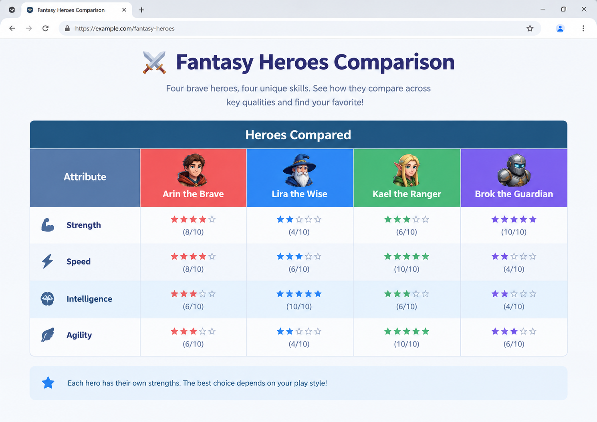

# 📝 Практика · Урок 4 «Таблицы»

**Темы:** `<table>`/`<tr>`/`<td>`/`<th>`/`<caption>`, `<thead>`/`<tbody>`, `border-collapse`, `padding`, `colspan`/`rowspan`, «зебра» через `:nth-child`, Emmet `table>tr*3>td*3`. Плюс повторяем весь модуль 2.

> 🎯 **Как работать.** Делай в файлах `.html`/`.css`, смотри результат в браузере через Live Server (сохраняй — `Ctrl+S`). Уровни: 🟢 базовые · 🟡 средние · 🔴 со звёздочкой. 💡 подсказка — это наводка, а не готовый код.
>
> 📌 **Правила игры:** таблица — `<table>` → `<tr>` (строка) → `<td>` (ячейка); заголовок — `<th>`; двойные рамки убирает `border-collapse: collapse`; объединение — `colspan`/`rowspan` (и убираем лишние `<td>`); зебра — `tbody tr:nth-child(even)`.

---

## 🟢 Уровень 1 — базовый (обязательно)

**1. Первая таблица.**
Сделай таблицу 3×2 «Товар — Цена» из трёх товаров. Разверни каркас Emmet-строкой `table>tr*3>td*2`, потом впиши данные.
> 💡 Подсказка: три `<tr>`, в каждой два `<td>` (товар и цена).

**2. Добавь шапку `<th>`.**
Добавь к таблице первую строку-шапку из заголовков `<th>`: «Товар» и «Цена». Заметь, что браузер сделал их жирными и по центру.
> 💡 Подсказка: первая `<tr>` состоит из `<th>`, а не `<td>`.

**3. Подпись `<caption>`.**
Добавь таблице название через `<caption>` (например, «🍎 Прайс-лист»). Оно должно появиться над таблицей.
> 💡 Подсказка: `<caption>` пишется сразу после открывающего `<table>`.

**4. Рамки.**
Задай рамки таблице и ячейкам. Ты увидишь двойные рамки — включи `border-collapse: collapse`, чтобы стали одинарными.
> 💡 Подсказка: `table, th, td { border: 1px solid #ccc; }` + `table { border-collapse: collapse; }`.

**5. Воздух в ячейках.**
Добавь ячейкам `padding`, чтобы текст не липнул к рамкам. Выровняй текст по левому краю.
> 💡 Подсказка: `th, td { padding: 10px 14px; text-align: left; }`.

**6. Смысловые части.**
Перестрой таблицу: заверни строку заголовков в `<thead>`, а строки с данными — в `<tbody>`.
> 💡 Подсказка: `<thead>` вокруг строки с `<th>`, `<tbody>` вокруг строк с `<td>`.

**7. Таблица 4×4 через Emmet.**
Разверни таблицу 4×4 одной строкой Emmet и заполни её любыми данными (например, клетки поля «морской бой» или календарь).
> 💡 Подсказка: `table>tr*4>td*4` + Tab.

---

## 🟡 Уровень 2 — средний (для уверенности)

**8. Объединяем по горизонтали (`colspan`).**
Сделай таблицу, где в первой строке один заголовок `<th>` растянут на все столбцы через `colspan`. Не забудь убрать лишние ячейки в этой строке.
> 💡 Подсказка: если столбца три — `<th colspan="3">Заголовок</th>`, и больше `<td>`/`<th>` в этой строке нет.

**9. Объединяем по вертикали (`rowspan`).**
Сделай таблицу, где одна ячейка объединяет две строки через `rowspan` (например, «Понедельник» на два урока подряд).
> 💡 Подсказка: `<td rowspan="2">Понедельник</td>`; в следующей строке эту ячейку уже не пишем.

**10. «Зебра».**
Сделай так, чтобы чётные строки тела таблицы были светло-серыми (полосатая таблица). Так её легче читать.
> 💡 Подсказка: `tbody tr:nth-child(even) { background-color: #f1f5f9; }`.

**11. Цветная шапка.**
Покрась шапку таблицы: тёмный фон и белый текст. Добавь ей `padding` побольше.
> 💡 Подсказка: `thead th { background-color: #2563eb; color: white; padding: 12px; }`.

**12. Подсветка строки.**
Сделай так, чтобы строка подсвечивалась при наведении мыши.
> 💡 Подсказка: `tbody tr:hover { background-color: #dbeafe; }`.

**13. Расписание на неделю.**
Собери таблицу-расписание: колонки — дни недели (`<th>` в шапке), строки — номера уроков, в ячейках — предметы. Оформи рамками, «зеброй» и цветной шапкой.
> 💡 Подсказка: шапка из `<th>` с днями; `border-collapse: collapse`; зебра по строкам.

---

## 🔴 Уровень 3 — со звёздочкой (челлендж)

**14. Таблица со строкой «Итого» (`<tfoot>`).**
Сделай таблицу расходов (что купил — сколько стоит) и добавь снизу строку «Итого» через `<tfoot>`, где вручную посчитана сумма. Выдели её жирным.
> 💡 Подсказка: `<tfoot>` после `<tbody>`; строку выдели `font-weight: 700` или своим фоном.

**15. Скруглённая таблица.**
Сделай таблице круглые углы: `border-radius` + `overflow: hidden`. Придётся немного повозиться с рамками — попробуй.
> 💡 Подсказка: `table { border-radius: 12px; overflow: hidden; }` (рамки задавай ячейкам, а не самой таблице).

**16. Сложная шапка (`rowspan` + `colspan`).**
Сделай двухуровневую шапку: сверху один заголовок на несколько столбцов (`colspan`), под ним — подзаголовки. Например: «Оценки» (colspan=2) → «Матем.» и «Информ.».
> 💡 Подсказка: две строки в `<thead>`; в первой — `<th colspan="2">`, во второй — отдельные `<th>`.

---

## 🏆 Итоговая работа урока — «Сравнение: кто круче?»

Сделай **сравнительную таблицу** двух-четырёх любимых героев, персонажей, машин, телефонов или команд — по их характеристикам. Такие таблицы помогают наглядно понять, кто в чём сильнее. Это одновременно и завершение модуля — используй здесь **всё, что прошёл**: свой шрифт, ссылки, а данные — в красивой таблице.

**Пример темы:** сравнение супергероев (сила, скорость, ум), персонажей игры, моделей телефонов, спорткаров, футбольных команд, пород собак.

### 📋 Что должно быть на странице

1. **Заголовок страницы (`h1`)** и короткое вступление (`p`).
2. **Сравнительная таблица** с:
   - **шапкой** (`<thead>` + `<th>`): в первом столбце — характеристика, дальше — колонки-участники;
   - **подписью** `<caption>`;
   - строками-характеристиками (`<tbody>`): например, сила, скорость, ловкость, «крутость»;
   - **объединённой ячейкой** (`colspan` или `rowspan`) — например, общий заголовок «⚔️ Характеристики» над колонками, или строка-категория.
3. **Оформление:** `border-collapse: collapse`, `padding`, цветная шапка, **«зебра»**, подсветка строки при наведении.
4. Подключён **шрифт с Google Fonts** и внешний **`style.css`**.

### ✅ Требования (проверь по списку)
- ✅ таблица из `<table>`/`<tr>`/`<td>`, шапка из `<th>` в `<thead>`, тело в `<tbody>`;
- ✅ есть `<caption>` (название таблицы);
- ✅ включён **`border-collapse: collapse`** и задан `padding`;
- ✅ есть хотя бы одна **объединённая ячейка** (`colspan` или `rowspan`);
- ✅ сделана **«зебра»** (`:nth-child(even)`) и **подсветка строки** (`:hover`);
- ✅ **цветная шапка** таблицы;
- ✅ подключён шрифт с **Google Fonts**;
- ✅ всё оформление во **внешнем `style.css`**.

### 💡 Подсказки
- Удобная структура: первый столбец — названия характеристик, остальные столбцы — участники сравнения.
- Значения можно показывать эмодзи-звёздами: ⭐⭐⭐⭐ или числами (1–10).
- «Зебра» по строкам характеристик очень помогает читать таблицу.
- Объединённую ячейку проще всего сделать как заголовок-«шапку над шапкой»: `<th colspan="3">⚔️ Сравнение героев</th>` первой строкой.
- Выдели «победителя» в каждой строке фоном или 🏆.

**Как это должно выглядеть (ориентир):**

> 🖼 *Ориентир по структуре; тема, участники и характеристики — твои. Если картинки пока нет — её подготовит учитель.*

**🌟 Мини-челлендж (по желанию):** добавь строку «Итог / Победитель» через `<tfoot>` и подсвети клетку победителя 🏆. Или сделай двухуровневую шапку через `rowspan`.

---

> ✅ **🟢 — база есть. 🟡 — уверенно. 🔴 — мастер таблиц!**
> 🆘 Застрял — открой [самоучитель.md](самоучитель.md): там всё по шагам.
> 📌 Быстро вспомнить — [итого.md](итого.md).
> 📦 Готов? Впереди — [самостоятельная работа модуля](../самостоятельная.md)!
