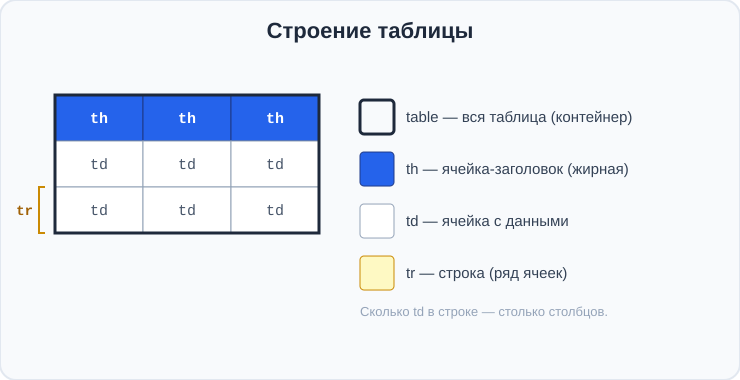
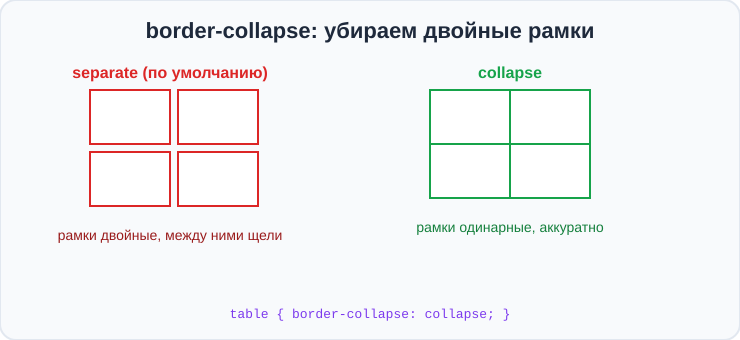
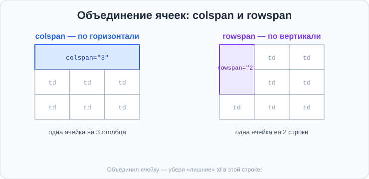

# Урок 4 — Таблицы: `<table>` и всё-всё о них 🏆📊

**Модуль 2 · Контент и шрифты · Урок 4 из 4 | 2 ак.ч. (1,5 часа)**

> ⬅️ [Все уроки модуля](../README.md) · [План курса](../../ПЛАН-КУРСА.md) · Предыдущий: [Урок 3 «Списки»](../урок-03-списки/урок.md) · Следующий: Модуль 3 «Блоки» ➡️

> 🔁 В начале — [разминка/повтор](повторение.md).
> 📌 Быстро вспомнить материал — [итого.md](итого.md). 👨‍🏫 Сценарий — [преподавателю.md](преподавателю.md). 🖼 Проектор — [изображения.md](изображения.md).
> 🆘 **Пропустил урок?** — [самоучитель.md](самоучитель.md). 🧰 Больше трюков — [лайфхак.md](лайфхак.md), но главные разбираем прямо в уроке (значок 🧰).

> 🧭 **Как читать урок.** Расписание уроков, таблица рекордов в игре, характеристики телефона, турнирная сетка — всё это **таблицы**: данные в строках и столбцах. Сегодня — **завершающий урок модуля**. Научимся строить таблицы из строк и ячеек, добавлять шапку, **объединять ячейки** (`colspan`/`rowspan`), рисовать аккуратные рамки и делать «зебру». А в конце — большой проект-таблица. 🏆

---

## 🎮 Что мы сделаем сегодня и что получим

**Задача:** собрать **красивую таблицу** — расписание или таблицу рекордов — с шапкой, рамками и «зеброй».

**В итоге** ты будешь уметь строить любые таблицы: с заголовками, объединёнными ячейками и стильным оформлением.

**Главные навыки урока:** **`<table>`**, строки **`<tr>`**, ячейки **`<td>`**, заголовки **`<th>`**, подпись **`<caption>`** · смысловые части **`<thead>`/`<tbody>`** · **`colspan`/`rowspan`** (объединение) · **`border-collapse`** и рамки · «зебра» через **`:nth-child`** · Emmet **`table>tr*3>td*3`**.

> 💡 **Главная мысль урока:** таблица строится **по строкам**. Сначала строка `<tr>`, внутри неё — ячейки `<td>` (или заголовки `<th>`). Сколько `<td>` в строке — столько столбцов.

---

## Часть 1 — Первая таблица: `<table>`, `<tr>`, `<td>`

Таблицу собирают из трёх тегов:
- **`<table>`** — вся таблица (контейнер).
- **`<tr>`** (table row) — одна **строка**.
- **`<td>`** (table data) — одна **ячейка** внутри строки.

```html
<table>
    <tr>
        <td>Яблоко</td>
        <td>50 руб</td>
    </tr>
    <tr>
        <td>Банан</td>
        <td>40 руб</td>
    </tr>
</table>
```

- 👀 Получилось 2 строки по 2 ячейки — таблица 2×2. **Сколько `<td>` в строке — столько столбцов.**



> ⚠️ Без CSS таблица выглядит «голой» (без рамок) — это нормально, рамки добавим в Части 4.

> 🧰 **Лайфхак Emmet:** напиши `table>tr*3>td*3` и нажми `Tab` — Emmet развернёт таблицу **3×3** (3 строки по 3 ячейки) за одну секунду! Помнишь `>` (вложить) и `*` (повторить)?

> ✍️ **Мини-задание 1:** сделай таблицу 3×2 «Товар — Цена» из трёх товаров. Разверни каркас через Emmet `table>tr*3>td*2`.
> <details><summary>💡 подсказка</summary>Три <code>&lt;tr&gt;</code>, в каждой по два <code>&lt;td&gt;</code>. Первый — товар, второй — цена.</details>

---

## Часть 2 — Заголовки `<th>` и подпись `<caption>`

Первая строка обычно — **шапка** с названиями столбцов. Для ячеек-заголовков есть особый тег **`<th>`** (table header): браузер делает их **жирными и по центру**.

**`<caption>`** — подпись/название всей таблицы (пишется сразу после `<table>`).

```html
<table>
    <caption>🍎 Прайс-лист</caption>
    <tr>
        <th>Товар</th>
        <th>Цена</th>
    </tr>
    <tr>
        <td>Яблоко</td>
        <td>50 руб</td>
    </tr>
</table>
```

- 👀 «Товар» и «Цена» стали жирными заголовками, а сверху появилась подпись таблицы.

> 💡 **`<th>` — это не только красиво, но и правильно** (семантика): браузеры и программы для незрячих понимают, что это заголовок столбца.

> ✍️ **Мини-задание 2:** добавь к таблице из задания 1 шапку из `<th>` («Товар», «Цена») и подпись `<caption>` с названием.
> <details><summary>💡 подсказка</summary>Первая строка — из <code>&lt;th&gt;</code>; <code>&lt;caption&gt;</code> — сразу после <code>&lt;table&gt;</code>.</details>

---

## Часть 3 — Смысловые части: `<thead>` и `<tbody>`

У «взрослой» таблицы шапку и тело разделяют смысловыми тегами:
- **`<thead>`** — «шапка» таблицы (строка с заголовками).
- **`<tbody>`** — «тело» таблицы (строки с данными).

```html
<table>
    <caption>Расписание</caption>
    <thead>
        <tr>
            <th>День</th>
            <th>Урок</th>
        </tr>
    </thead>
    <tbody>
        <tr>
            <td>Понедельник</td>
            <td>Математика</td>
        </tr>
        <tr>
            <td>Вторник</td>
            <td>Информатика</td>
        </tr>
    </tbody>
</table>
```

- 👀 Внешне почти без изменений, но теперь таблица **правильно устроена**: отдельно шапка, отдельно данные. Это удобно и для стилей, и для смысла.

> 🧭 Есть ещё `<tfoot>` — «подвал» таблицы (например, строка «Итого»). Пригодится для таблиц с суммой.

> ✍️ **Мини-задание 3:** перестрой свою таблицу: заверни строку заголовков в `<thead>`, а строки с данными — в `<tbody>`.
> <details><summary>💡 подсказка</summary><code>&lt;thead&gt;</code> — вокруг строки с <code>&lt;th&gt;</code>, <code>&lt;tbody&gt;</code> — вокруг строк с <code>&lt;td&gt;</code>.</details>

---

## Часть 4 — Рамки и `border-collapse`

Сделаем таблицу видимой — добавим **рамки**. Рамку задают ячейкам (`th`, `td`) и/или всей таблице:

```css
table, th, td {
    border: 1px solid #cbd5e1;
}
```

- 👀 Появились рамки… но **двойные**! У каждой ячейки своя рамка, и они удваиваются. Чинит это одно свойство:

```css
table {
    border-collapse: collapse;   /* схлопнуть двойные рамки в одну */
}
```

- 👀 Теперь рамки аккуратные, одинарные. **`border-collapse: collapse`** — обязательный приём для любой таблицы.

**Воздух в ячейках** — чтобы текст не липнул к рамкам, добавь `padding`:
```css
th, td {
    padding: 10px 14px;
    text-align: left;
}
```



> ✍️ **Мини-задание 4:** добавь таблице рамки, включи `border-collapse: collapse` и задай ячейкам `padding`. Сравни, как было и как стало.
> <details><summary>💡 подсказка</summary><code>table, th, td { border: 1px solid #ccc; }</code> + <code>table { border-collapse: collapse; }</code> + <code>th, td { padding: 10px; }</code>.</details>

---

## Часть 5 — Объединение ячеек: `colspan` и `rowspan`

Иногда одна ячейка должна занять **несколько столбцов или строк** (например, общий заголовок над двумя колонками). Для этого есть два атрибута:

- **`colspan="2"`** — ячейка растянется на **2 столбца** (по горизонтали).
- **`rowspan="2"`** — ячейка растянется на **2 строки** (по вертикали).

```html
<table>
    <tr>
        <th colspan="2">🏆 Результаты матча</th>   <!-- один заголовок на 2 столбца -->
    </tr>
    <tr>
        <td>Наша команда</td>
        <td>3</td>
    </tr>
    <tr>
        <td>Соперники</td>
        <td>1</td>
    </tr>
</table>
```



> ⚠️ **Важное правило:** если ячейка растянулась через `colspan="2"`, то в этой строке **соседнюю ячейку убирают** (место уже занято). Иначе таблица «съедет». Считай: сколько столбцов заняла объединённая ячейка — столько обычных `<td>` в строке не пишем.

> ✍️ **Мини-задание 5:** сделай таблицу, где в первой строке один заголовок `<th>` растянут на все столбцы через `colspan`. Проверь, что таблица не «поехала».
> <details><summary>💡 подсказка</summary>Если столбца два — <code>&lt;th colspan="2"&gt;Заголовок&lt;/th&gt;</code>, и больше в этой строке ячеек не добавляй.</details>

---

## Часть 6 — Красивая таблица: «зебра» и наведение

Сделаем таблицу читаемой и стильной. Главный приём — **«зебра»** (чередование цвета строк) через псевдокласс **`:nth-child`**:

```css
tbody tr:nth-child(even) {
    background-color: #f1f5f9;   /* каждая ЧЁТНАЯ строка — светло-серая */
}
tbody tr:hover {
    background-color: #dbeafe;   /* строка подсвечивается при наведении */
}
```

- **`:nth-child(even)`** — чётные строки (2, 4, 6…), **`:nth-child(odd)`** — нечётные.
- 👀 Полосатая таблица читается легче — глаз не «теряет» строку.

**Оформим шапку** — выделим её цветом:
```css
thead th {
    background-color: #2563eb;
    color: white;
    padding: 12px;
}
```

- 👀 Синяя шапка + полосатое тело + подсветка при наведении = таблица как на настоящем сайте!

> 🧰 **Лайфхак:** `:nth-child` — мощная штука, ею можно ловить «каждый 3-й», «каждый 2-й начиная с первого» и т.д. Системно разберём в модуле про псевдоклассы. Пока запомни `even` (чётные) и `odd` (нечётные).

> ✍️ **Мини-задание 6:** сделай своей таблице «зебру» (`:nth-child(even)`), покрась шапку и добавь подсветку строки при наведении.
> <details><summary>💡 подсказка</summary><code>tbody tr:nth-child(even) { background-color: #f1f5f9; }</code>, <code>thead th { background-color: #2563eb; color: white; }</code>.</details>

---

## Часть 7 — 🏆 Проект: «Таблица рекордов / Расписание»

Соберём завершающий проект модуля — красивую таблицу с шапкой, «зеброй» и объединённой ячейкой.

**`index.html`** (фрагмент):
```html
<table class="scores">
    <caption>🏆 Таблица рекордов</caption>
    <thead>
        <tr>
            <th>Место</th>
            <th>Игрок</th>
            <th>Очки</th>
        </tr>
    </thead>
    <tbody>
        <tr><td>🥇 1</td><td>Максим</td><td>980</td></tr>
        <tr><td>🥈 2</td><td>Аня</td><td>870</td></tr>
        <tr><td>🥉 3</td><td>Игорь</td><td>815</td></tr>
    </tbody>
</table>
```

**`style.css`:**
```css
.scores {
    border-collapse: collapse;
    width: 100%;
    font-family: "Segoe UI", sans-serif;
}
.scores caption { font-size: 22px; font-weight: 700; margin-bottom: 12px; }
.scores th, .scores td { border: 1px solid #cbd5e1; padding: 12px 16px; text-align: left; }
.scores thead th { background-color: #2563eb; color: white; }
.scores tbody tr:nth-child(even) { background-color: #f1f5f9; }
.scores tbody tr:hover { background-color: #dbeafe; }
```

- 👀 Готовая таблица рекордов — с синей шапкой, полосатыми строками и подсветкой. Красиво и понятно!

> 🎨 **Твой вариант:** сделай таблицу на **свою** тему: расписание на неделю, характеристики любимого гаджета/машины, таблица чемпионата, сравнение персонажей. Добавь шапку, «зебру» и хотя бы одну объединённую ячейку (`colspan`).

> 🧩 **Для 5–7 классов (проще):** таблица 4×3 с шапкой `<th>`, рамками (`border-collapse: collapse`) и `padding`. «Зебра» и `colspan` — по желанию.

---

## 🎓 Часть 8 — Для тех, кто хочет глубже

- **`rowspan` для «сложных» шапок:** можно объединять и по вертикали, делая многоуровневые заголовки.
- **`<tfoot>`** — подвал таблицы: строка «Итого», сумма (пишется после `<tbody>`, но браузер покажет внизу).
- **Скругление таблицы:** `border-radius` + `overflow: hidden` у таблицы — углы станут круглыми.
- **`scope` у `<th>`:** `<th scope="col">`/`<th scope="row">` — подсказка для незрячих, к чему относится заголовок.
- **Адаптивные таблицы:** на телефоне широкую таблицу оборачивают в блок с `overflow-x: auto` — она прокручивается вбок. Подробно — в модуле про адаптивность.
- **Таблицы — только для данных!** Раньше на них верстали целые страницы — так делать **нельзя**. Для расположения блоков есть Flexbox и Grid (скоро). Таблица — исключительно для **табличных данных**.

---

## 🏁 Итог урока

Сегодня ты научился строить таблицы — и завершил модуль! 🎉

- ✅ **`<table>` → `<tr>` (строка) → `<td>` (ячейка)**; сколько `<td>` в строке — столько столбцов.
- ✅ **`<th>`** — жирный заголовок, **`<caption>`** — подпись таблицы.
- ✅ **`<thead>`/`<tbody>`** — смысловые части (шапка / тело).
- ✅ **`border-collapse: collapse`** убирает двойные рамки; `padding` — воздух в ячейках.
- ✅ **`colspan`/`rowspan`** объединяют ячейки (и убираем «лишние» `<td>`).
- ✅ **«Зебра»** через `:nth-child(even)` + подсветка `:hover`.

> 🏆 Главное: таблица строится **по строкам**, а `border-collapse: collapse` + `padding` + «зебра» превращают её в красивую. Быстро повторить — в [итого.md](итого.md).

> 🎤 **Блиц:** из каких тегов строится таблица? Чем `<th>` отличается от `<td>`? Что делает `border-collapse: collapse`? Как объединить две ячейки по горизонтали? Как сделать «зебру»?

### 🎮 Викторина-закрепление
Открой **[викторина.html](викторина.html)** — вопросы по таблицам **+ повторение всего модуля 2 (ссылки, шрифты, списки)** + смешные и «на подумать».

➡️ **Практика урока** — **[практика.md](практика.md)**: задачи в 3 уровнях + итоговая работа.
📦 **А затем — [самостоятельная работа модуля](../самостоятельная.md)!**
🆘 **Пропустил / хочешь ещё?** — [самоучитель.md](самоучитель.md). 📌 **Шпаргалка** — [итого.md](итого.md).

---

## 🔗 Навигация

⬅️ [Урок 3 «Списки»](../урок-03-списки/урок.md) · [Все уроки модуля](../README.md) · [План курса](../../ПЛАН-КУРСА.md) · **Следующий:** Модуль 3 «Блоки» ➡️

**🧰 Инструменты:** [VS Code](https://code.visualstudio.com/) + [Live Server](https://marketplace.visualstudio.com/items?itemName=ritwickdey.LiveServer). **Все ссылки курса** — в [🧰 Полезные сервисы](../../ПОЛЕЗНЫЕ-СЕРВИСЫ.md). **📄 Пример:** [`материалы/таблица-рекордов.html`](материалы/таблица-рекордов.html) — готовая таблица с зеброй и объединением.
