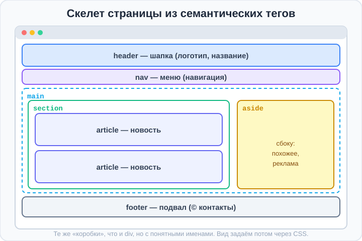

# Урок 1 — Семантика: смысловой скелет страницы 🧱🏷️

**Модуль 3 · Блочная модель и красивые блоки · Урок 1 из 5 | 2 ак.ч. (1,5 часа)**

> ⬅️ [Все уроки модуля](../README.md) · [План курса](../../ПЛАН-КУРСА.md) · Предыдущий: [Модуль 2 «Таблицы»](../../модуль-02-контент-и-шрифты/урок-04-таблицы/урок.md) · Следующий: Урок 2 «Блочная модель» ➡️

> 🔁 В начале — [разминка/повтор](повторение.md).
> 📌 Быстро вспомнить материал — [итого.md](итого.md). 👨‍🏫 Сценарий — [преподавателю.md](преподавателю.md). 🖼 Проектор — [изображения.md](изображения.md).
> 🆘 **Пропустил урок?** — [самоучитель.md](самоучитель.md). 🧰 Больше трюков — [лайфхак.md](лайфхак.md), но главные разбираем прямо в уроке (значок 🧰).

> 🧭 **Как читать урок.** Мы начинаем большой модуль про **блоки** — из них строят любой сайт. Но прежде чем делать красивые карточки, научимся собирать **правильный скелет страницы**. Раньше всё делали из безымянных `<div>` — и получалась «каша». Сегодня узнаем **семантические теги** (`header`, `nav`, `main`, `footer` и другие) — это те же коробки, но **с табличкой-названием**: сразу понятно, где шапка, где меню, где главное. Так строят все настоящие сайты.

---

## 🎮 Что мы сделаем сегодня и что получим

**Задача:** собрать **скелет страницы новостей** — с шапкой, меню, главной областью, боковой колонкой и подвалом, используя правильные смысловые теги.

**В итоге** ты будешь строить страницы не из «кучи `div`», а из понятных смысловых блоков — как профессионал.

**Главные навыки урока:** зачем нужна **семантика** · теги **`header`**, **`nav`**, **`main`**, **`section`**, **`article`**, **`aside`**, **`footer`** · **`<figure>`/`<figcaption>`** (картинка с подписью) · повтор **`<div>`/`<span>`** и **`display`** · Emmet **`.`** (классы).

> 💡 **Главная мысль урока:** семантические теги — это `<div>` с **понятным именем**. Для браузера они почти как обычные блоки, но **людям, поисковикам и программам для незрячих** сразу ясно, что где. Правильный скелет = основа хорошего сайта.

---

## Часть 1 — Проблема «супа из `div`»

Вспомни `<div>` из модуля 1 — это **блок-коробка** без всякого смысла, просто «прямоугольник-контейнер». Можно построить всю страницу на одних `div`:

```html
<div class="header">...</div>
<div class="menu">...</div>
<div class="content">...</div>
<div class="footer">...</div>
```

Работать будет, но это **«суп из `div`»**: чтобы понять, где что, приходится читать классы. А браузер, поисковик Google и программа для незрячих вообще не понимают, что `div.header` — это шапка.

**Решение — семантические теги.** Вместо безымянных `<div>` берём теги с **говорящими именами**:

```html
<header>...</header>
<nav>...</nav>
<main>...</main>
<footer>...</footer>
```

- 👀 Выглядит на странице **так же**, но теперь код **читается как оглавление**: шапка, навигация, главное, подвал.

> 🧭 **Важно:** семантические теги ведут себя как `<div>` (они **блочные**, каждый с новой строки). Разница — **в смысле**, а не во внешнем виде. Внешний вид зададим сами через CSS.

> ✍️ **Мини-задание 1:** посмотри на код `<div class="header">Мой сайт</div>` и перепиши его семантически.
> <details><summary>💡 подсказка</summary><code>&lt;header&gt;Мой сайт&lt;/header&gt;</code> — тег сам говорит, что это шапка.</details>

---

## Часть 2 — Четыре главных тега: `header`, `nav`, `main`, `footer`

Это «каркас» почти любой страницы:

- **`<header>`** — **шапка** (логотип, название сайта, иногда меню). Вверху страницы.
- **`<nav>`** — **навигация** (меню со ссылками). Мы уже делали меню из списка в модуле 2 — вот его дом!
- **`<main>`** — **главное содержимое** страницы (то, ради чего пришли). На странице `<main>` **один**.
- **`<footer>`** — **подвал** (контакты, копирайт, ссылки внизу).

```html
<body>
    <header>
        <h1>🗞 Новости дня</h1>
    </header>

    <nav>
        <a href="#">Главная</a>
        <a href="#">Спорт</a>
        <a href="#">Наука</a>
    </nav>

    <main>
        <h2>Главная новость</h2>
        <p>Сегодня произошло...</p>
    </main>

    <footer>
        <p>© 2026 Мой новостной сайт</p>
    </footer>
</body>
```

- 👀 Скелет страницы готов и **читается сам по себе**.



> 🧰 **Лайфхак Emmet — классы через `.`:** пиши `header.top` + `Tab` → `<header class="top"></header>`. Точка в Emmet = класс. А `nav.menu>a*3` сразу сделает меню с тремя ссылками в `<nav class="menu">`. Классы понадобятся дальше для стилей.

> ✍️ **Мини-задание 2:** собери каркас страницы из `header` (с `h1`), `nav` (3 ссылки), `main` (заголовок + абзац) и `footer` (копирайт).
> <details><summary>💡 подсказка</summary>Emmet: <code>header>h1^nav>a*3^main>h2+p^footer>p</code> — вспомни <code>^</code> (подъём) из модуля 2.</details>

---

## Часть 3 — `section` и `article`: делим главное на части

Внутри `<main>` содержимое делят на **разделы**:

- **`<section>`** — **смысловой раздел** страницы (обычно со своим заголовком). Например: «Спорт», «Наука», «Погода».
- **`<article>`** — **самостоятельная единица**, которую можно «вырезать» и она останется целой: новость, пост в блоге, карточка товара, комментарий.

```html
<main>
    <section>
        <h2>🏀 Спорт</h2>

        <article>
            <h3>Наша команда победила!</h3>
            <p>Вчера в финале...</p>
        </article>

        <article>
            <h3>Новый рекорд по бегу</h3>
            <p>Спортсмен пробежал...</p>
        </article>
    </section>
</main>
```

- 👀 Раздел «Спорт» (`section`) содержит две отдельные новости (`article`). Каждую новость можно скопировать целиком — она самодостаточна.

> 🧭 **Как отличить:** `<article>` — то, что **имеет смысл само по себе** (новость, пост). `<section>` — **группа** таких вещей или тематический кусок страницы. Если сомневаешься — спроси: «это можно опубликовать отдельно?» Да → `article`.

> ✍️ **Мини-задание 3:** внутри `<main>` сделай `<section>` с заголовком темы и двумя `<article>` — двумя новостями (заголовок + абзац в каждой).
> <details><summary>💡 подсказка</summary><code>&lt;section&gt;&lt;h2&gt;Тема&lt;/h2&gt; &lt;article&gt;...&lt;/article&gt; &lt;article&gt;...&lt;/article&gt;&lt;/section&gt;</code>.</details>

---

## Часть 4 — `aside`: боковая колонка

**`<aside>`** — **дополнительный блок «сбоку»**: то, что связано с темой, но не главное. Реклама, «похожие статьи», список тегов, «а вы знали?».

```html
<main>
    <article>
        <h2>Главная статья</h2>
        <p>Основной текст...</p>
    </article>

    <aside>
        <h3>📌 Читайте также</h3>
        <ul>
            <li><a href="#">Другая новость</a></li>
            <li><a href="#">Ещё одна</a></li>
        </ul>
    </aside>
</main>
```

- 👀 Пока `aside` стоит под статьёй (блоки идут в столбик). Позже, с **Flexbox**, поставим его **сбоку** — получится настоящая двухколоночная страница.

> ✍️ **Мини-задание 4:** добавь на страницу `<aside>` с заголовком «Читайте также» и списком из 2–3 ссылок.
> <details><summary>💡 подсказка</summary><code>&lt;aside&gt;&lt;h3&gt;Читайте также&lt;/h3&gt;&lt;ul&gt;...&lt;/ul&gt;&lt;/aside&gt;</code>. Список ссылок — как в модуле 2.</details>

---

## Часть 5 — `<figure>` и `<figcaption>`: картинка с подписью

Часто картинке нужна **подпись** (кто на фото, откуда). Для этого есть пара тегов:

- **`<figure>`** — «иллюстрация» (обёртка для картинки/схемы).
- **`<figcaption>`** — **подпись** к ней.

```html
<figure>
    
    <figcaption>Финальный матч на стадионе «Заря»</figcaption>
</figure>
```

- 👀 Картинка и подпись теперь **связаны смыслом** — браузер понимает, что текст относится к изображению.

> 💡 `<figure>` подходит не только для фото, но и для схем, графиков, примеров кода — всего, к чему нужна подпись.

> ✍️ **Мини-задание 5:** оберни картинку из своей новости в `<figure>` и добавь `<figcaption>` с подписью.
> <details><summary>💡 подсказка</summary>Внутри <code>&lt;figure&gt;</code> — сначала <code>&lt;img&gt;</code>, потом <code>&lt;figcaption&gt;подпись&lt;/figcaption&gt;</code>.</details>

---

## Часть 6 — Повторяем: `div`/`span` и `display`

Семантические теги закрывают «главные» блоки. Но для **мелких кусочков без особого смысла** по-прежнему нужны:

- **`<div>`** — блочная коробка «ни о чём» (обёртка-контейнер, когда подходящего смыслового тега нет).
- **`<span>`** — строчная обёртка для **части текста** (выделить слово, покрасить кусочек).

Вспомним `display` (из модуля 1):
```css
div  { display: block; }          /* блочный: в столбик, во всю ширину */
span { display: inline; }         /* строчный: в строку, как слово */
.tag { display: inline-block; }   /* в ряд + можно задать размеры */
```

**Важно:** все семантические теги (`header`, `section`, `article`…) — **блочные**, как `<div>`. Ведут себя одинаково, отличаются только смыслом.

```html
<p>Цена: <span class="price">1990 ₽</span> — <span class="sale">скидка!</span></p>
```
```css
.price { font-weight: 700; }
.sale  { color: crimson; }
```

- 👀 `<span>` выделил кусочки текста внутри абзаца, не разрывая строку.

> 🧭 **Правило выбора тега:** есть подходящий смысловой тег (`header`, `nav`, `article`…) — бери его. Нет — бери `<div>` (блок) или `<span>` (кусочек текста).

> ✍️ **Мини-задание 6:** в абзаце выдели `<span>`-ом цену и сделай её жирной через класс.
> <details><summary>💡 подсказка</summary><code>&lt;span class="price"&gt;1990 ₽&lt;/span&gt;</code> + <code>.price { font-weight: 700; }</code>.</details>

---

## Часть 7 — Мини-проект: «Скелет страницы новостей» 🗞

Соберём полноценный смысловой каркас и слегка подсветим блоки цветом, чтобы увидеть структуру.

**`index.html`:**
```html
<body>
    <header>
        <h1>🗞 Новости дня</h1>
    </header>

    <nav class="menu">
        <a href="#">Главная</a>
        <a href="#">Спорт</a>
        <a href="#">Наука</a>
    </nav>

    <main>
        <section>
            <h2>Главные новости</h2>

            <article>
                <figure>
                    
                    <figcaption>Фото с места события</figcaption>
                </figure>
                <h3>Учёные нашли новую планету</h3>
                <p>Сегодня астрономы сообщили...</p>
            </article>

            <article>
                <h3>Наша команда — чемпион!</h3>
                <p>В финале турнира...</p>
            </article>
        </section>

        <aside>
            <h3>📌 Читайте также</h3>
            <ul>
                <li><a href="#">Погода на выходные</a></li>
                <li><a href="#">Топ-5 фильмов недели</a></li>
            </ul>
        </aside>
    </main>

    <footer>
        <p>© 2026 Мой новостной сайт · Сделано на уроке</p>
    </footer>
</body>
```

**`style.css`** (пока просто подсветим области):
```css
body { font-family: "Segoe UI", sans-serif; }
header, nav, main, section, article, aside, footer {
    border: 2px solid #cbd5e1;   /* видим границы блоков */
    padding: 12px;
    margin: 8px 0;
}
header { background: #dbeafe; }
nav    { background: #ede9fe; }
aside  { background: #fef9c3; }
footer { background: #f1f5f9; text-align: center; }
.menu a { margin-right: 14px; }
```

- 👀 Каждый блок подсвечен — видно скелет страницы. В следующих уроках научимся делать это **красиво** (отступы, тени, колонки).

> 🎨 **Твой вариант:** собери скелет страницы на свою тему (игровой портал, блог, спортивный сайт): `header`, `nav`, `main` с `section`/`article`, `aside`, `footer`.

> 🧩 **Для 5–7 классов (проще):** хватит `header`, `nav`, `main` (с двумя `article`) и `footer`. `section`/`aside`/`figure` — по желанию.

---

## 🎓 Часть 8 — Для тех, кто хочет глубже

- **`<time>`** — семантическая дата/время: `<time datetime="2026-08-25">25 августа</time>`.
- **`<mark>`** — выделение маркером (как жёлтым фломастером): `<mark>важное</mark>`.
- **`<address>`** — контактные данные (в `footer`).
- **Несколько `header`/`footer`:** у `article` может быть свой маленький `header` (заголовок + автор) и `footer` (теги). Главное — `<main>` на странице один.
- **Зачем это всё:** поисковики лучше понимают страницу (SEO), незрячие пользователи с экранными дикторами могут «перепрыгивать» по разделам, код читается в разы легче.

---

## 🏁 Итог урока

Сегодня ты научился строить **правильный скелет** страницы:

- ✅ **Семантические теги** — это `<div>` со смыслом; выглядят так же, но код понятен людям и программам.
- ✅ **Каркас:** `header` (шапка), `nav` (меню), `main` (главное, один на странице), `footer` (подвал).
- ✅ **`section`** — раздел, **`article`** — самостоятельная единица (новость/пост).
- ✅ **`aside`** — блок «сбоку» (похожее, реклама).
- ✅ **`<figure>`/`<figcaption>`** — картинка с подписью.
- ✅ **`<div>`/`<span>`** — для кусочков без смыслового тега; семантические теги — блочные.

> 🏆 Главное: **сначала правильный смысловой скелет, потом красота.** Есть подходящий тег — бери его вместо `div`. Быстро повторить — в [итого.md](итого.md).

> 🎤 **Блиц:** зачем нужна семантика? Назови 4 главных тега каркаса. Чем `section` отличается от `article`? Что такое `aside`? Как подписать картинку?

### 🎮 Викторина-закрепление
Открой **[викторина.html](викторина.html)** — вопросы по семантике **+ повторение модулей 1–2** + смешные и «на подумать».

➡️ **Практика урока** — **[практика.md](практика.md)**: задачи в 3 уровнях + итоговая работа.
🆘 **Пропустил / хочешь ещё?** — [самоучитель.md](самоучитель.md). 📌 **Шпаргалка** — [итого.md](итого.md).

---

## 🔗 Навигация

⬅️ [Модуль 2](../../модуль-02-контент-и-шрифты/README.md) · [Все уроки модуля](../README.md) · [План курса](../../ПЛАН-КУРСА.md) · **Следующий:** Урок 2 «Блочная модель» ➡️

**🧰 Инструменты:** [VS Code](https://code.visualstudio.com/) + [Live Server](https://marketplace.visualstudio.com/items?itemName=ritwickdey.LiveServer). **Все ссылки курса** — в [🧰 Полезные сервисы](../../ПОЛЕЗНЫЕ-СЕРВИСЫ.md). **📄 Пример:** [`материалы/скелет-новостей.html`](материалы/скелет-новостей.html) — семантический каркас страницы.
