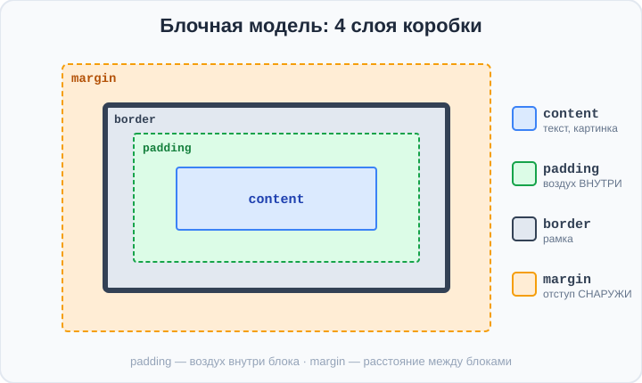
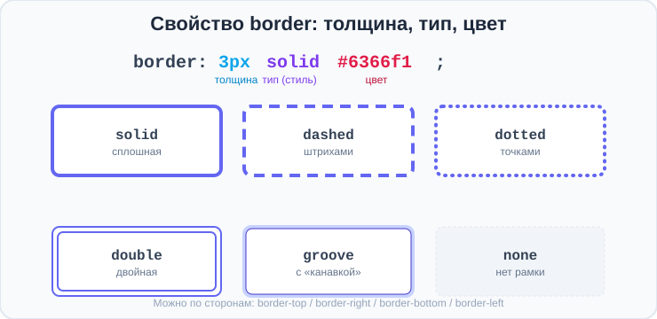
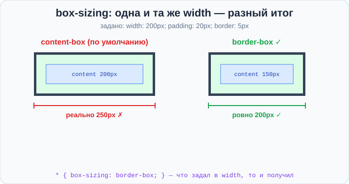

# Урок 2 — Блочная модель: padding, margin, border 📦

**Модуль 3 · Блочная модель и красивые блоки · Урок 2 из 5 | 2 ак.ч. (1,5 часа)**

> ⬅️ [Все уроки модуля](../README.md) · [План курса](../../ПЛАН-КУРСА.md) · Предыдущий: [Урок 1 «Семантика»](../урок-01-семантика/урок.md) · Следующий: Урок 3 «Границы и скругления» ➡️

> 🔁 В начале — [разминка/повтор](повторение.md).
> 📌 Быстро вспомнить материал — [итого.md](итого.md). 👨‍🏫 Сценарий — [преподавателю.md](преподавателю.md). 🖼 Проектор — [изображения.md](изображения.md).
> 🆘 **Пропустил урок?** — [самоучитель.md](самоучитель.md). 🧰 Больше трюков — [лайфхак.md](лайфхак.md), но главные разбираем прямо в уроке (значок 🧰).

> 🧭 **Как читать урок.** Скелет страницы у нас есть. Теперь — **самая важная тема всего CSS**: **блочная модель**. Каждый элемент на странице — это **прямоугольник** («коробка») с внутренними и внешними отступами и рамкой. Поймёшь блочную модель — научишься управлять **расстояниями** между всем на странице, а значит — делать аккуратные карточки, кнопки, отступы. Это фундамент, на котором стоит вся вёрстка.

---

## 🎮 Что мы сделаем сегодня и что получим

**Задача:** собрать красивую **карточку товара** с правильными отступами внутри и снаружи.

**В итоге** ты научишься управлять расстояниями: «воздухом» внутри блока, промежутками между блоками и размерами — и перестанешь бороться с «слипшимися» элементами.

**Главные навыки урока:** **блочная модель** (content · padding · border · margin) · **`padding`** (внутренний отступ) · **`margin`** (внешний отступ) · центрирование **`margin: auto`** · **`box-sizing: border-box`** (обязательно!) · **схлопывание** отступов · **DevTools**-инспектор.

> 💡 **Главная мысль урока:** каждый блок — это **4 слоя**: содержимое (content), внутренний отступ (**padding**), рамка (**border**) и внешний отступ (**margin**). `padding` — «воздух» **внутри** блока, `margin` — расстояние **снаружи**, между блоками.

---

## Часть 1 — Каждый элемент — это коробка 📦

Открой DevTools (F12) на любом сайте и наведись на элемент — увидишь, что он состоит из **вложенных прямоугольников**. Это и есть **блочная модель** — 4 слоя от центра наружу:



1. **content** — само содержимое (текст, картинка);
2. **`padding`** — **внутренний** отступ: «воздух» между содержимым и рамкой;
3. **`border`** — **рамка** вокруг;
4. **`margin`** — **внешний** отступ: расстояние до соседних блоков.

Запомни разницу: **`padding` — внутри** (отодвигает содержимое от края блока), **`margin` — снаружи** (отодвигает сам блок от соседей).

> 🧭 Аналогия: блок — это **картина**. content — сам рисунок, `padding` — **паспарту** (белые поля внутри рамки), `border` — **рама**, `margin` — расстояние до **соседних картин** на стене.

> ✍️ **Мини-задание 1:** объясни своими словами разницу между `padding` и `margin`. Что «воздух внутри», а что «расстояние снаружи»?
> <details><summary>💡 подсказка</summary><code>padding</code> — внутри блока (между содержимым и рамкой), <code>margin</code> — снаружи (между блоками).</details>

---

## Часть 2 — `padding`: воздух внутри блока

**`padding`** добавляет пространство **внутри** блока, между содержимым и краем. Без него текст «липнет» к рамке:

```css
.box {
    background: #dbeafe;
    padding: 20px;          /* воздух со всех сторон */
}
```

Можно задавать по сторонам:
```css
padding: 20px;                 /* все 4 стороны */
padding: 10px 20px;            /* верх-низ 10, лево-право 20 */
padding: 10px 20px 30px 40px;  /* верх, право, низ, лево (по часовой) */
padding-top: 15px;             /* только сверху */
```

- 👀 Чем больше `padding`, тем «просторнее» внутри блока. Для кнопок и карточек это главный приём «дать воздуха».

> 🧰 **Лайфхак — порядок сторон:** `верх → право → низ → лево` (по часовой стрелке, начиная сверху). Мнемоника: **T**op **R**ight **B**ottom **L**eft — «ТРБЛ», как «трабл» 🙂. Две величины — это «верх-низ / лево-право».

> ✍️ **Мини-задание 2:** сделай блок с фоном и текстом. Сначала без `padding` (текст липнет к краю), потом добавь `padding: 20px` — почувствуй разницу.
> <details><summary>💡 подсказка</summary><code>.box { background: #e0e7ff; padding: 20px; }</code></details>

---

## Часть 3 — `margin`: расстояние между блоками

**`margin`** добавляет пространство **снаружи** блока — отодвигает его от соседей и краёв страницы:

```css
.card {
    margin: 20px;              /* отступ со всех сторон */
    margin-bottom: 40px;       /* только снизу (расстояние до следующего) */
}
```

Синтаксис сторон — **такой же**, как у `padding` (1, 2 или 4 значения).

**Суперприём — центрирование блока по горизонтали:**
```css
.card {
    width: 300px;
    margin: 0 auto;           /* auto по бокам = блок по центру */
}
```

- 👀 `margin: 0 auto` (0 сверху-снизу, `auto` слева-справа) **центрирует блок** заданной ширины. Так центрируют карточки и контейнеры на реальных сайтах!

> 💡 **`margin: auto` работает только у блока с заданной `width`.** Без ширины блок занимает всё, и центрировать нечего.

> ✍️ **Мини-задание 3:** сделай блок шириной `300px` и центрируй его на странице через `margin: 0 auto`. Добавь `margin-bottom`, чтобы под ним был отступ.
> <details><summary>💡 подсказка</summary><code>.card { width: 300px; margin: 0 auto 30px; }</code> — последнее значение — отступ снизу.</details>

---

## Часть 4 — `border`: рамка (часть коробки)

**`border`** — рамка между `padding` и `margin`. Записывают три значения сразу: **толщина**, **тип** (стиль) и **цвет**:

```css
.card {
    border: 3px solid #6366f1;   /* толщина · тип · цвет */
}
```

**Тип рамки** (второе значение) бывает разным:



```css
border: 3px solid  #6366f1;   /* сплошная (самая частая) */
border: 3px dashed #6366f1;   /* штрихами (пунктир) */
border: 3px dotted #6366f1;   /* точками */
border: 3px double #6366f1;   /* двойная линия */
border: none;                  /* рамки нет */
```

**Рамку можно задать только с одной стороны** — своими свойствами по сторонам:
```css
border-top: 2px solid #ccc;      /* только сверху */
border-bottom: 4px dashed red;   /* только снизу (пунктиром) */
```

- 👀 Пунктирная `dashed`-рамка снизу — как раз то, чем отделяют «отрывной корешок» билета (пригодится в итоговой работе!).

Важно понять: рамка **занимает место** и входит в размер блока (об этом — следующая часть). А **скругление углов** (`border-radius`) и особый брат рамки — **`outline`** — разберём на следующем уроке.

> ✍️ **Мини-задание 4:** сделай три блока с разными типами рамки: `solid`, `dashed`, `dotted`. Потом одному блоку задай рамку только снизу через `border-bottom`.
> <details><summary>💡 подсказка</summary><code>border: 3px dashed #6366f1;</code> · для одной стороны — <code>border-bottom: 3px dotted #6366f1;</code></details>

---

## Часть 5 — `box-sizing: border-box` — обязательный приём ⭐

Вот главная «засада» новичков. Зададим блоку ширину и padding:
```css
.box {
    width: 200px;
    padding: 20px;
    border: 5px solid black;
}
```

Сколько места займёт блок по ширине? Кажется, 200px. Но **по умолчанию** браузер считает так: `width` — это только **content**, а `padding` и `border` **добавляются сверху**:

`200 (content) + 20+20 (padding) + 5+5 (border) = 250px` — блок **шире**, чем ты задал! Из-за этого «ломается» вёрстка.

**Решение — одно свойство:**
```css
* {
    box-sizing: border-box;
}
```

Теперь `width: 200px` — это **вся ширина блока вместе с padding и border**. Что задал — то и получил. 



> 🏆 **Правило профи:** в самом начале `style.css` пиши:
> ```css
> * {
>     box-sizing: border-box;
>     margin: 0;
>     padding: 0;
> }
> ```
> Это «сброс»: `border-box` для всех блоков + убираем стандартные отступы браузера. Так делают на **всех** современных сайтах. Дальше добавляешь отступы уже осознанно.

> ✍️ **Мини-задание 5:** сделай блок `width: 200px; padding: 20px; border: 5px solid`. Измерь его в DevTools **без** `border-box` и **с** ним. Убедись, что с `border-box` ширина ровно 200px.
> <details><summary>💡 подсказка</summary>Добавь <code>box-sizing: border-box;</code> блоку и сравни ширину в инспекторе.</details>

---

## Часть 6 — Схлопывание вертикальных отступов

Ещё одна «странность»: если у двух блоков друг над другом есть вертикальные `margin`, они **не складываются**, а «схлопываются» — берётся **больший** из двух.

```css
.a { margin-bottom: 30px; }
.b { margin-top: 20px; }
/* расстояние между ними будет 30px (больший), а НЕ 50px! */
```

- 👀 Это называется **схлопывание отступов** (margin collapse). Работает только по **вертикали** (верх-низ), у соседних блоков.

> 💡 Не пугайся, если между блоками отступ «меньше ожидаемого» — скорее всего, сработало схлопывание. Часто это даже удобно. Если мешает — используй `padding` у родителя или отступ только с одной стороны.

> ✍️ **Мини-задание 6:** сделай два блока: у верхнего `margin-bottom: 40px`, у нижнего `margin-top: 20px`. Замерь расстояние между ними в DevTools — там будет 40, а не 60.
> <details><summary>💡 подсказка</summary>Берётся больший из двух вертикальных отступов — 40px.</details>

---

## Часть 7 — DevTools: видим коробку вживую 🔎

**DevTools** (F12 в браузере) — твой лучший друг для блочной модели:

1. Нажми **F12** → вкладка **Elements** (Элементы).
2. Наведись на элемент — он подсветится на странице **тремя цветами**: content (синий), `padding` (зелёный), `margin` (оранжевый).
3. Справа внизу — **схема блочной модели** с числами: сколько padding, border, margin с каждой стороны.
4. Можно **менять значения прямо там** и сразу видеть результат (в файл не сохранится — только для проверки).

> 🧭 Привыкай проверять отступы в DevTools — так ты **видишь**, что происходит, а не гадаешь. Это главный инструмент верстальщика.

> ✍️ **Мини-задание 7:** открой DevTools на своей карточке, наведись на неё и найди на схеме блочной модели значения `padding` и `margin`.
> <details><summary>💡 подсказка</summary>F12 → Elements → навести на блок → внизу справа цветная схема content/padding/border/margin.</details>

---

## Часть 8 — Мини-проект: «Карточка товара» 🛍

Соберём аккуратную карточку товара — с внутренним воздухом, рамкой и центрированием.

**`index.html`:**
```html
<div class="card">
    
    <h3>Кроссовки NEON</h3>
    <p class="price">4 990 ₽</p>
    <a href="#" class="btn">В корзину</a>
</div>
```

**`style.css`:**
```css
* { box-sizing: border-box; margin: 0; padding: 0; }

body {
    font-family: "Segoe UI", sans-serif;
    background: #f1f5f9;
    padding: 40px;
}

.card {
    width: 260px;
    margin: 0 auto;              /* карточка по центру */
    background: white;
    border: 1px solid #e2e8f0;
    padding: 20px;              /* воздух внутри */
    text-align: center;
}
.card img {
    width: 100%;
    margin-bottom: 14px;
}
.card h3 { margin-bottom: 8px; }
.price {
    color: #16a34a;
    font-weight: 700;
    margin-bottom: 16px;
}
.btn {
    display: inline-block;
    background: #6366f1;
    color: white;
    padding: 12px 24px;         /* padding делает кнопку «объёмной» */
    text-decoration: none;
    border-radius: 8px;
}
.btn:hover { background: #4f46e5; }
```

- 👀 Аккуратная карточка: содержимое не липнет к краям (`padding`), карточка по центру (`margin: 0 auto`), кнопка «дышит» за счёт `padding`.

> 🎨 **Твой вариант:** сделай карточку на свою тему (гаджет, книга, игра, блюдо). Поиграй с `padding` (внутренний воздух) и `margin` (расстояние). Картинку можно сделать в ИИ ([🧰 сервисы](../../ПОЛЕЗНЫЕ-СЕРВИСЫ.md)).

> 🧩 **Для 5–7 классов (проще):** хватит блока с `padding`, рамкой и центрированием `margin: 0 auto`. Кнопку и картинку — по желанию.

---

## 🎓 Часть 9 — Для тех, кто хочет глубже

- **`min-width` / `max-width`:** ограничить блок снизу/сверху. `max-width: 100%` не даёт картинке вылезти за контейнер.
- **`height` и почему его редко задают:** высоту блока обычно определяет содержимое; жёсткий `height` может «обрезать» текст. Чаще управляют `padding`.
- **Отрицательный `margin`:** можно «наезжать» блоками друг на друга (`margin-top: -20px`). Приём для наложений.
- **`margin: auto` и по вертикали** работает во Flexbox (скоро) — там можно центрировать и вертикально.
- **Единый «reset»:** многие подключают готовый `reset.css` / `normalize.css`, чтобы убрать различия между браузерами.

---

## 🏁 Итог урока

Сегодня ты освоил фундамент вёрстки — блочную модель:

- ✅ Каждый элемент — **коробка**: content · `padding` · `border` · `margin`.
- ✅ **`padding`** — воздух **внутри**, **`margin`** — расстояние **снаружи**.
- ✅ Стороны: 1 значение (все), 2 (верх-низ / лево-право), 4 (T-R-B-L по часовой).
- ✅ **`margin: 0 auto`** центрирует блок (с заданной `width`).
- ✅ **`box-sizing: border-box`** — обязательно: `width` включает padding и border.
- ✅ Вертикальные `margin` **схлопываются** (берётся больший).
- ✅ **DevTools (F12)** показывает коробку вживую.

> 🏆 Главное: **`box-sizing: border-box` в начале файла + понимание padding/margin = конец мучениям с отступами.** Быстро повторить — в [итого.md](итого.md).

> 🎤 **Блиц:** назови 4 слоя блочной модели. Чем `padding` отличается от `margin`? Что делает `box-sizing: border-box`? Как центрировать блок? Что такое схлопывание отступов?

### 🎮 Викторина-закрепление
Открой **[викторина.html](викторина.html)** — вопросы по блочной модели **+ повторение семантики и модулей 1–2** + смешные и «на подумать».

➡️ **Практика урока** — **[практика.md](практика.md)**: задачи в 3 уровнях + итоговая работа.
🆘 **Пропустил / хочешь ещё?** — [самоучитель.md](самоучитель.md). 📌 **Шпаргалка** — [итого.md](итого.md).

---

## 🔗 Навигация

⬅️ [Урок 1 «Семантика»](../урок-01-семантика/урок.md) · [Все уроки модуля](../README.md) · [План курса](../../ПЛАН-КУРСА.md) · **Следующий:** Урок 3 «Границы и скругления» ➡️

**🧰 Инструменты:** [VS Code](https://code.visualstudio.com/) + [Live Server](https://marketplace.visualstudio.com/items?itemName=ritwickdey.LiveServer). **Все ссылки курса** — в [🧰 Полезные сервисы](../../ПОЛЕЗНЫЕ-СЕРВИСЫ.md). **📄 Пример:** [`материалы/карточка-товара.html`](материалы/карточка-товара.html) — карточка с разбором отступов.
