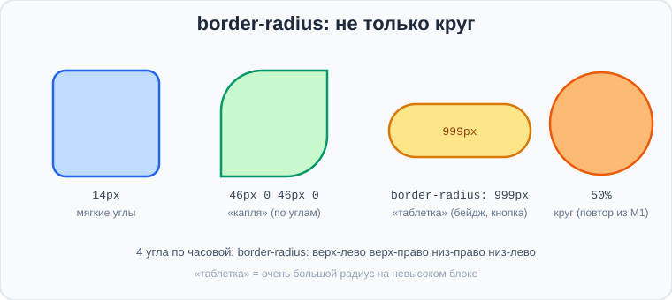
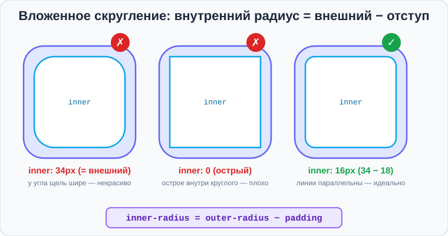
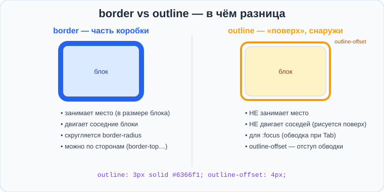

# Урок 3 — Скругления и `outline` 🟢⭕

**Модуль 3 · Блочная модель и красивые блоки · Урок 3 из 5 | 2 ак.ч. (1,5 часа)**

> ⬅️ [Все уроки модуля](../README.md) · [План курса](../../ПЛАН-КУРСА.md) · Предыдущий: [Урок 2 «Блочная модель»](../урок-02-блочная-модель/урок.md) · Следующий: Урок 4 «Картинки в блоках, тени и фоны» ➡️

> 🔁 В начале — [разминка/повтор](повторение.md).
> 📌 Быстро вспомнить материал — [итого.md](итого.md). 👨‍🏫 Сценарий — [преподавателю.md](преподавателю.md). 🖼 Проектор — [изображения.md](изображения.md).
> 🆘 **Пропустил урок?** — [самоучитель.md](самоучитель.md). 🧰 Больше трюков — [лайфхак.md](лайфхак.md), но главные разбираем прямо в уроке (значок 🧰).

> 🧭 **Как читать урок.** `border` и `border-radius: 50%` (круглые аватарки) мы уже трогали. Сегодня **углубим скругление** (оказывается, оно не только про круги: «таблетки», «капли», разные углы) и разберём важное правило — **как скруглять вложенные блоки**, чтобы углы совпадали. А ещё познакомимся с **`outline`** — «братом» рамки, который ведёт себя совсем иначе, и поймём, **чем `border` отличается от `outline`**.

---

## 🎮 Что мы сделаем сегодня и что получим

**Задача:** сделать набор **бейджей и «таблеток»** (теги, статусы, кнопки) с разным скруглением и аккуратной обводкой.

**В итоге** ты будешь делать любые скруглённые формы, правильно скруглять вложенные блоки и понимать разницу между `border` и `outline`.

**Главные навыки урока:** углубляем **`border-radius`** (px, 4 угла, «таблетка» `999px`, «капля») · **вложенное скругление** (`inner = outer − padding`) · 🆕 **`outline`** и **`outline-offset`** · **`border` vs `outline`** (в чём разница) · псевдокласс **`:focus`** и доступность.

> 💡 **Главная мысль урока:** `border-radius` умеет куда больше, чем круг, а `outline` — это **не то же самое, что `border`**: он рисуется **снаружи** и **не занимает место**, поэтому идеален для обводки при выборе (`:focus`).

---

## Часть 1 — Быстрый повтор: `border`

С прошлого урока помним: рамка — это **толщина · тип · цвет**, и типов много:

```css
border: 3px solid  #6366f1;   /* сплошная */
border: 3px dashed #6366f1;   /* штрихами */
border: 3px dotted #6366f1;   /* точками */
border-bottom: 2px solid #ccc; /* только снизу */
```

Это фундамент — сегодня мы строим на нём. Освежил в памяти? Идём дальше — к скруглению.

> ✍️ **Мини-задание 1:** быстро сделай три блока с рамками `solid`, `dashed`, `dotted` — просто чтобы вспомнить.
> <details><summary>💡 подсказка</summary><code>border: 3px dashed #6366f1;</code> — меняй тип.</details>

---

## Часть 2 — `border-radius` глубже: не только круг

`border-radius` скругляет углы. Мы делали `50%` (круг) — но у него куда больше возможностей:



**1. Скругление в пикселях** — мягкие углы у карточек и кнопок:
```css
.card { border-radius: 14px; }
```

**2. Каждый угол отдельно** (4 значения — по часовой: верх-лево, верх-право, низ-право, низ-лево):
```css
.leaf { border-radius: 40px 0 40px 0; }   /* «капля»/лист: 2 угла круглые, 2 острые */
```

**3. «Таблетка» (pill)** — очень большой радиус на невысоком блоке делает края полукруглыми. Так выглядят теги, статусы, «пилюли»:
```css
.pill { border-radius: 999px; padding: 6px 16px; }
```

**4. Круг** (повтор): `border-radius: 50%` на квадрате — уже знаем.

> 🧰 **Лайфхак — «таблетка».** Не подбирай радиус вручную: поставь заведомо больше высоты блока (`999px`), и края сами станут идеально полукруглыми при любой высоте. Классика для бейджей и кнопок-«пилюль».

> ✍️ **Мини-задание 2:** сделай три формы: карточку с `border-radius: 16px`, «таблетку» (`999px`) и «каплю» (`30px 0 30px 0`). Посмотри, как меняется форма.
> <details><summary>💡 подсказка</summary><code>.pill { border-radius: 999px; padding: 6px 16px; }</code>, <code>.leaf { border-radius: 30px 0 30px 0; }</code>.</details>

---

## Часть 3 — Вложенное скругление: как считать 🎯

Частая ситуация: **скруглённая карточка**, а внутри — **скруглённая картинка или кнопка**. Если задать им одинаковый радиус, углы будут выглядеть **неровно**. Есть точное правило.



**Правило:** чтобы линии углов шли **параллельно** (красиво), внутренний радиус считают так:

> **внутренний радиус = внешний радиус − отступ (padding)**

Пример: у карточки `border-radius: 24px` и `padding: 8px`. Тогда у внутреннего блока радиус должен быть `24 − 8 = 16px`:

```css
.card {
    border-radius: 24px;
    padding: 8px;
}
.card img {
    border-radius: 16px;    /* 24 − 8 = 16 → углы параллельны */
    width: 100%;
}
```

- ❌ Если внутренний = внешнему (`24px`) — у угла образуется лишняя щель, смотрится небрежно.
- ❌ Если внутренний острый (`0`) — острые углы внутри круглых тоже выглядят плохо.
- ✅ `внешний − padding` — линии параллельны, как надо.

> 💡 Запомни это правило — оно отличает «сделано на глаз» от «сделано аккуратно». Дизайнеры называют это **концентричными углами**.

> ✍️ **Мини-задание 3:** сделай карточку `border-radius: 20px; padding: 10px;` с картинкой внутри. Посчитай и задай картинке правильный радиус.
> <details><summary>💡 подсказка</summary>20 − 10 = 10 → <code>.card img { border-radius: 10px; }</code>.</details>

---

## Часть 4 — `outline`: брат рамки, но другой 🆕

**`outline`** — это **обводка**, похожая на `border`, но с важными отличиями:

```css
.box {
    outline: 3px solid #6366f1;
}
```



**Чем `outline` отличается от `border`:**

| | `border` | `outline` |
|---|----------|-----------|
| Занимает место? | **Да** (входит в размер блока) | **Нет** (рисуется поверх) |
| Двигает соседей? | Да | **Нет** |
| По сторонам? | Да (`border-top`…) | Нет (только вся сразу) |
| Скругляется `border-radius`? | Да | Частично (в новых браузерах) |
| Для чего | рамки, оформление | **обводка выбора (`:focus`)** |

Главное: **`outline` не занимает место** — добавил его, и соседние блоки **не сдвинулись** (в отличие от `border`, который «толкает» всё вокруг). Поэтому `outline` идеален, чтобы **подсветить выбранный элемент**, ничего не сломав.

**`outline-offset`** — отодвигает обводку от блока (зазор):
```css
.box {
    outline: 3px solid #6366f1;
    outline-offset: 4px;      /* обводка на 4px в стороне от блока */
}
```

> ✍️ **Мини-задание 4:** сделай два блока рядом. Одному добавь `border: 6px solid`, другому — `outline: 6px solid`. Заметь: с `border` блок «раздвинул» соседей, а с `outline` — нет.
> <details><summary>💡 подсказка</summary>Сравни, сдвинулись ли соседние блоки. <code>outline</code> не занимает место.</details>

---

## Часть 5 — `:focus` и доступность ♿

Куда `outline` нужен по-настоящему — это **`:focus`**: состояние, когда до элемента дошли **клавишей `Tab`** (без мыши). Браузер сам рисует обводку у кнопок и ссылок в фокусе — это помогает людям, которые пользуются клавиатурой.

```css
.btn:focus {
    outline: 3px solid #6366f1;
    outline-offset: 3px;
}
```

> ⚠️ **Важное правило доступности:** **не убирай обводку фокуса совсем** (`outline: none`) — иначе человек с клавиатурой не увидит, где он находится. Если стандартная обводка некрасивая — **замени** её на свою (как выше), но не удаляй.

> ✍️ **Мини-задание 5:** сделай кнопку-ссылку и задай ей красивый `:focus` с `outline`. Проверь: нажимай `Tab` на странице — обводка появится без мыши.
> <details><summary>💡 подсказка</summary><code>.btn:focus { outline: 3px solid #6366f1; outline-offset: 3px; }</code></details>

---

## Часть 6 — Мини-проект: «Бейджи и таблетки» 🏷

Соберём набор скруглённых элементов — теги, статусы, кнопки-пилюли.

**`index.html`:**
```html
<div class="tags">
    <span class="pill">#вёрстка</span>
    <span class="pill">#дизайн</span>
    <span class="pill green">✓ онлайн</span>
    <span class="pill red">● занят</span>
</div>

<a href="#" class="btn">Подписаться</a>
```

**`style.css`:**
```css
* { box-sizing: border-box; margin: 0; padding: 0; }
body { font-family: "Segoe UI", sans-serif; padding: 40px; }

.tags { margin-bottom: 20px; }

.pill {
    display: inline-block;
    border-radius: 999px;       /* «таблетка» */
    padding: 6px 14px;
    background: #e0e7ff;
    color: #4338ca;
    font-size: 14px;
    margin: 4px;
}
.pill.green { background: #dcfce7; color: #15803d; }
.pill.red   { background: #fee2e2; color: #b91c1c; }

.btn {
    display: inline-block;
    border-radius: 12px;        /* мягкие углы */
    padding: 12px 24px;
    background: #6366f1;
    color: white;
    text-decoration: none;
    border: none;
}
.btn:focus {
    outline: 3px solid #a5b4fc;  /* аккуратная обводка выбора */
    outline-offset: 3px;
}
```

- 👀 Теги-«таблетки» с полукруглыми краями, цветные статусы, кнопка с мягкими углами и красивым фокусом.

> 🎨 **Твой вариант:** сделай свой набор тегов/статусов на тему (игры, соцсеть, магазин): разные цвета, формы (таблетки и мягкие углы), кнопка с `:focus`.

> 🧩 **Для 5–7 классов (проще):** хватит трёх «таблеток» разных цветов и одной кнопки со скруглением. `outline`/`:focus` — по желанию.

---

## 🎓 Часть 7 — Для тех, кто хочет глубже

- **Эллиптические углы:** `border-radius: 40px / 20px;` — разный радиус по горизонтали и вертикали (углы-«эллипсы»).
- **«Клякса»/blob:** восемь значений `border-radius: 30% 70% 70% 30% / 30% 30% 70% 70%;` дают органичную форму (генераторы: «blob maker»).
- **`outline` не скругляется в старых браузерах** — если нужна скруглённая обводка везде, иногда используют `box-shadow` с распространением (тень разберём на следующем уроке).
- **`:focus-visible`** — «умный» фокус: обводка показывается при `Tab`, но не при клике мышью. Современный приём для аккуратного UX.
- **`border-radius` в процентах** тянется за размером блока, в `px` — фиксированный.

---

## 🏁 Итог урока

Сегодня ты прокачал формы и обводку:

- ✅ **`border-radius`** — не только круг: `px` (мягкие углы), 4 угла отдельно, `999px` («таблетка»), «капля».
- ✅ **Вложенное скругление:** внутренний радиус = **внешний − padding** (концентричные углы).
- ✅ **`outline`** — обводка, которая **не занимает место** и не двигает соседей (в отличие от `border`).
- ✅ **`outline-offset`** — зазор между обводкой и блоком.
- ✅ **`:focus`** + `outline` — обводка выбора; **не убирай её совсем** (доступность).

> 🏆 Главное: **`border` — часть коробки (занимает место), `outline` — рисуется поверх (место не занимает).** А вложенные углы считай `внешний − padding`. Быстро повторить — в [итого.md](итого.md).

> 🎤 **Блиц:** как сделать «таблетку»? Как посчитать радиус вложенного блока? Чем `outline` отличается от `border`? Что делает `outline-offset`? Почему нельзя убирать обводку `:focus`?

### 🎮 Викторина-закрепление
Открой **[викторина.html](викторина.html)** — вопросы по скруглению и `outline` **+ повторение блочной модели и модулей 1–2** + смешные и «на подумать».

➡️ **Практика урока** — **[практика.md](практика.md)**: задачи в 3 уровнях + итоговая работа.
🆘 **Пропустил / хочешь ещё?** — [самоучитель.md](самоучитель.md). 📌 **Шпаргалка** — [итого.md](итого.md).

---

## 🔗 Навигация

⬅️ [Урок 2 «Блочная модель»](../урок-02-блочная-модель/урок.md) · [Все уроки модуля](../README.md) · [План курса](../../ПЛАН-КУРСА.md) · **Следующий:** Урок 4 «Картинки в блоках, тени и фоны» ➡️

**🧰 Инструменты:** [VS Code](https://code.visualstudio.com/) + [Live Server](https://marketplace.visualstudio.com/items?itemName=ritwickdey.LiveServer). **Все ссылки курса** — в [🧰 Полезные сервисы](../../ПОЛЕЗНЫЕ-СЕРВИСЫ.md). **📄 Пример:** [`материалы/бейджи-таблетки.html`](материалы/бейджи-таблетки.html) — набор форм и обводок.
