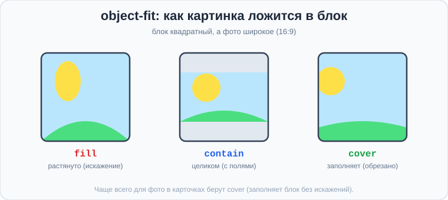
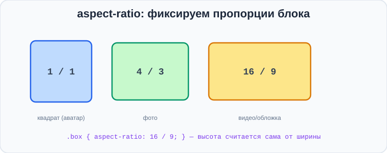
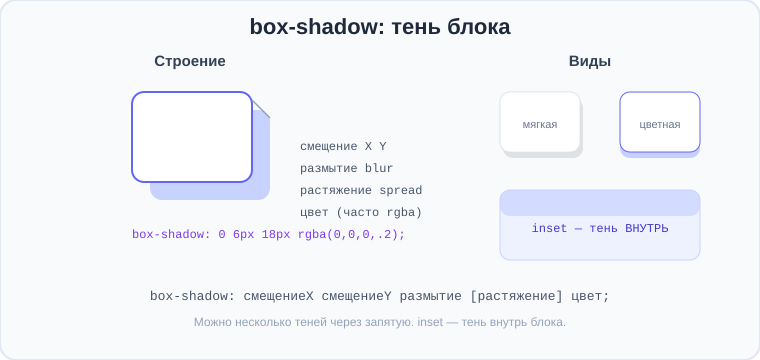
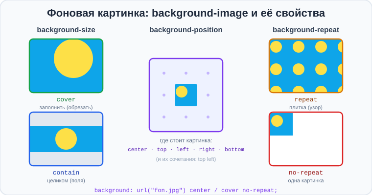

# Урок 4 — Картинки в блоках, тени и фоны 🖼️🌫️

**Модуль 3 · Блочная модель и красивые блоки · Урок 4 из 5 | 2 ак.ч. (1,5 часа)**

> ⬅️ [Все уроки модуля](../README.md) · [План курса](../../ПЛАН-КУРСА.md) · Предыдущий: [Урок 3 «Скругления и outline»](../урок-03-границы-скругления/урок.md) · Следующий: Урок 5 «Градиенты и карточки» ➡️

> 🔁 В начале — [разминка/повтор](повторение.md).
> 📌 Быстро вспомнить материал — [итого.md](итого.md). 👨‍🏫 Сценарий — [преподавателю.md](преподавателю.md). 🖼 Проектор — [изображения.md](изображения.md).
> 🆘 **Пропустил урок?** — [самоучитель.md](самоучитель.md). 🧰 Больше трюков — [лайфхак.md](лайфхак.md), но главные разбираем прямо в уроке (значок 🧰).

> 🧭 **Как читать урок.** Карточки почти всегда с **картинкой-обложкой** — и тут начинается боль новичка: фото разного размера «ломают» карточки. Сегодня научимся **аккуратно вписывать картинки в блоки** (`object-fit`, `aspect-ratio`), делать **объём тенями** (`box-shadow`) и ставить **фоновые картинки** (`background-image`). После этого урока твои карточки станут выглядеть **как в настоящем магазине или соцсети**.

---

## 🎮 Что мы сделаем сегодня и что получим

**Задача:** сделать **объёмные карточки с обложкой** — с ровной картинкой, мягкой тенью и красивым фоном.

**В итоге** ты будешь вписывать любые фото в блоки без искажений, добавлять тени для объёма и ставить фоновые изображения.

**Главные навыки урока:** **`object-fit`** (cover/contain/fill) и `object-position` · 🆕 **`aspect-ratio`** (фиксируем пропорции) · **`<picture>`** (адаптивные картинки) · **`box-shadow`** (тени, несколько, `inset`) · **`background`/`background-image`** (`url()`, size/position/repeat) · **`background-clip`**.

> 💡 **Главная мысль урока:** есть **два способа** показать картинку: тег **``** (картинка — это содержание) и **`background-image`** (картинка — это фон блока). Для обоих важно **правильно вписать** фото в блок, чтобы оно не растянулось и не «поехало».

---

## Часть 1 — `object-fit`: вписываем фото в блок

Проблема: у карточек одинаковый размер обложки (например, `280×180`), а фотографии — **разной формы**. Если задать `` фиксированные `width`/`height`, фото **растянется** и станет уродливым.

Решение — **`object-fit`**: он говорит, **как** картинке лечь в заданный блок.

```css
.cover {
    width: 280px;
    height: 180px;
    object-fit: cover;   /* заполнить блок, лишнее обрезать — без искажений */
}
```



| Значение | Что делает |
|----------|-----------|
| `fill` | растягивает под блок (по умолчанию) — **искажает** ❌ |
| `contain` | вписывает **целиком**, остаются пустые поля |
| `cover` ⭐ | **заполняет** блок, лишнее аккуратно обрезает — без искажений |

**`cover`** — то, что нужно в 90% случаев для обложек. А куда «смотреть» при обрезке, уточняет `object-position`:
```css
.cover { object-fit: cover; object-position: top; }   /* показывать верх фото */
```

> ✍️ **Мини-задание 1:** возьми любое (неквадратное) фото, задай ему `width: 280px; height: 180px` и сравни `object-fit: fill` и `object-fit: cover`. Почувствуй разницу.
> <details><summary>💡 подсказка</summary><code>img { width:280px; height:180px; object-fit: cover; }</code> — фото заполнит блок без растяжения.</details>

---

## Часть 2 — `aspect-ratio`: фиксируем пропорции 🆕

Иногда нужно, чтобы блок **сам держал пропорцию** (например, обложка всегда 16:9), а высота считалась автоматически от ширины. Для этого — свойство **`aspect-ratio`**:

```css
.cover {
    width: 100%;
    aspect-ratio: 16 / 9;   /* высота посчитается сама */
    object-fit: cover;
}
```



- `aspect-ratio: 1 / 1` — квадрат (аватарки, посты).
- `aspect-ratio: 16 / 9` — видео, обложки.
- `aspect-ratio: 4 / 3` — фото.

👀 Теперь при любой ширине карточки обложка сохранит форму — ряд карточек будет ровным.

> 🧰 **Лайфхак:** `aspect-ratio` + `object-fit: cover` — «золотая пара» для обложек. Блок держит пропорцию, а фото красиво заполняет его без искажений.

> ✍️ **Мини-задание 2:** сделай блок `width: 100%` (в узком контейнере) с `aspect-ratio: 16 / 9` и картинкой внутри (`object-fit: cover`). Меняй ширину окна — пропорция сохраняется.
> <details><summary>💡 подсказка</summary><code>.cover { aspect-ratio: 16/9; object-fit: cover; width: 100%; }</code>.</details>

### 🤔 Когда хватает `width`/`height`, а когда нужен `aspect-ratio`

Резонный вопрос: зачем `aspect-ratio`, если можно просто задать `width` и `height`? Ответ — в том, **фиксированный** блок или **резиновый**:

- ✅ **Размеры известны заранее → хватает `width` + `height`.** Например, аватар всегда `100×100`:
  ```css
  .avatar { width: 100px; height: 100px; }   /* пропорция задана двумя числами */
  ```
- ⚠️ **Ширина «резиновая» (в `%`) → высоту в пикселях задать нельзя.** Если обложка `width: 100%`, её ширина всё время разная (зависит от экрана). Какую высоту поставить? Любое число `height: 200px` **сломает пропорцию** на других ширинах — картинка будет то «сплюснутой», то «вытянутой». Вот тут и нужен **`aspect-ratio`**: он сам считает высоту от текущей ширины.
  ```css
  .cover { width: 100%; aspect-ratio: 16 / 9; }   /* высота всегда «правильная» */
  ```

> 🧭 **Правило:** знаешь **обе** стороны в пикселях — задавай `width` + `height`. Ширина **резиновая** (`%`, растягивается) — задавай `width` + **`aspect-ratio`** (высота посчитается сама и пропорция не «поедет»).

### 🛠 Делаем вместе: адаптивная видео-рамка 16:9

Классический случай, где `aspect-ratio` незаменим, — **рамка под видео** (плеер YouTube, трейлер). Видео должно быть строго `16:9` и занимать всю ширину блока на любом экране. Высоту в пикселях тут **не задать** — она зависит от ширины. Решение:

```html
<div class="video">🎬 здесь будет видео 16:9</div>
```
```css
.video {
    width: 100%;              /* резиновая ширина — на весь контейнер */
    aspect-ratio: 16 / 9;     /* высота считается сама → всегда 16:9 */
    background: #0f172a;
    color: #fff;
    display: flex;            /* просто чтобы текст был по центру (рецепт) */
    align-items: center;
    justify-content: center;
    border-radius: 12px;
}
```

- 👀 Сужай и расширяй окно — рамка **остаётся ровно 16:9**, без чёрных полос и искажений. Попробуй убрать `aspect-ratio` и задать `height: 200px` — на широком экране рамка станет «неправильной». Это и есть момент «ага!»: иногда двух чисел мало.

> 🎨 **Твой вставь-эксперимент:** сделай так же квадратную плитку `aspect-ratio: 1/1` с `width: 100%` (для будущей галереи) — она всегда останется квадратом.

---

## Часть 3 — `<picture>`: разные картинки для разных экранов

Иногда для телефона и для компьютера нужны **разные** изображения (на узком экране — обрезанная/вертикальная версия, на широком — широкая). Тег **`<picture>`** сам показывает **подходящую** картинку под текущую ширину экрана:

```html
<picture>
    <source media="(max-width: 600px)"  srcset="foto-mobile.jpg">   <!-- ① экран ≤ 600px (телефон) -->
    <source media="(max-width: 900px)"  srcset="foto-tablet.jpg">   <!-- ② экран ≤ 900px (планшет) -->
                            <!-- ③ всё, что шире (компьютер) + запасной -->
</picture>
```

**Как браузер выбирает** (сверху вниз, берёт ПЕРВОЕ подходящее):
- экран **до 600px** → `foto-mobile.jpg` (сработало условие ①);
- экран **601–900px** → `foto-tablet.jpg` (① не подошло, сработало ②);
- экран **шире 900px** → ни одно `media` не подошло → показывается **``** (`foto-desktop.jpg`).

> 🧭 **Так и выводится картинка «при другой ширине»:** каждое `<source media="...">` отвечает за свой диапазон, а **``** внутри — за все **остальные** (широкие) экраны и одновременно «запасной вариант». Хочешь больше вариантов — добавляй ещё `<source>`. `` **обязателен всегда** — это и картинка для широких экранов, и место для `alt`.

> 💡 Пока просто познакомься: подробно `<picture>` и `@media` разберём в модуле про адаптивность. Главное — идея: «одна картинка, но разные файлы под разную ширину».

> ✍️ **Мини-задание 3:** оберни картинку в `<picture>` с **двумя** `<source>` (на `600px` и `900px`) и `` внутри (файлы можно любые). Сузь окно и посмотри в DevTools, какой файл подгрузился на разной ширине.
> <details><summary>💡 подсказка</summary>Два <code>&lt;source media="(max-width: ...)"&gt;</code> сверху вниз + обязательный <code>&lt;img&gt;</code> для широких экранов.</details>

---

## Часть 4 — `box-shadow`: объём через тень

**`box-shadow`** добавляет блоку тень — и он «приподнимается» над страницей. Это главный приём, чтобы карточки выглядели объёмными.

```css
.card {
    box-shadow: 0 6px 18px rgba(0, 0, 0, 0.15);
}
```



Значения по порядку: **смещение-X · смещение-Y · размытие (blur) · [растяжение (spread)] · цвет**.

```css
box-shadow: 0 6px 18px rgba(0,0,0,.15);        /* мягкая тень снизу */
box-shadow: 0 0 20px 4px rgba(99,102,241,.5);  /* цветное «свечение» */
box-shadow: inset 0 2px 6px rgba(0,0,0,.2);    /* inset — тень ВНУТРЬ */
```

- **`rgba(...)`** для цвета тени (вспомни прозрачность из модуля 1) — тень должна быть **полупрозрачной**, тогда она выглядит естественно.
- **`inset`** — тень внутрь (вдавленный эффект).
- **Несколько теней** через запятую: `box-shadow: 0 2px 4px rgba(0,0,0,.1), 0 8px 24px rgba(0,0,0,.1);`.

> 🧰 **Лайфхак — тень при наведении.** Добавь `transition` и увеличь тень на `:hover` — карточка будет «подниматься»:
> ```css
> .card { box-shadow: 0 4px 12px rgba(0,0,0,.1); transition: 0.2s; }
> .card:hover { box-shadow: 0 12px 28px rgba(0,0,0,.2); transform: translateY(-4px); }
> ```

> ✍️ **Мини-задание 4:** сделай карточку с мягкой тенью `0 6px 18px rgba(0,0,0,.15)`, а при наведении усиль тень. Почувствуй, как карточка «оживает».
> <details><summary>💡 подсказка</summary>Тень в <code>.card</code>, усиленная — в <code>.card:hover</code>; добавь <code>transition: 0.2s;</code>.</details>

---

## Часть 5 — `background-image`: картинка как фон

Кроме ``, картинку можно поставить **фоном блока** — свойством `background-image` с уже знакомым **`url()`** (привет из модуля 2!):

```css
.hero {
    background-image: url("fon.jpg");
    background-size: cover;       /* заполнить блок (как object-fit: cover) */
    background-position: center;  /* центрировать */
    background-repeat: no-repeat; /* не повторять */
    height: 300px;
}
```



- **`background-size`**: `cover` (заполнить, обрезать) / `contain` (вписать целиком, останутся поля) — как у `object-fit`.
- **`background-position`**: `center` / `top` / `right bottom` — **какую часть** фона показывать (куда «прижать» картинку).
- **`background-repeat`**: `no-repeat` (одна картинка) / `repeat` (замостить плиткой-узором).

**Короткая запись `background`** — всё сразу:
```css
.hero { background: url("fon.jpg") center / cover no-repeat; }
```

**Текст поверх фото** (плашка для читаемости — из модуля 1):
```css
.hero { position: relative; }
.hero h1 { color: white; }          /* можно добавить тёмную плашку rgba поверх фото */
```

> 🧭 **`` или `background-image`?** Если картинка — **содержание** (фото товара, аватар) → `` (с `alt`). Если картинка — **украшение/фон** (баннер, паттерн) → `background-image`.

> ✍️ **Мини-задание 5:** сделай блок-баннер `height: 300px` с фоновой картинкой (`background-size: cover; background-position: center`) и белым заголовком поверх.
> <details><summary>💡 подсказка</summary><code>.hero { background: url("...") center / cover no-repeat; height: 300px; }</code>.</details>

---

## Часть 6 — `background-clip`: до куда красить фон

**`background-clip`** говорит, **до какой границы** рисовать фон/картинку:

```css
.box {
    background-clip: padding-box;   /* фон не заходит под рамку */
}
```

- `border-box` (по умолчанию) — фон под рамку тоже.
- `padding-box` — фон до рамки (не под неё).
- `content-box` — только под содержимым.
- `text` — фон **виден только сквозь буквы** (для «градиентного текста» — сделаем на следующем уроке! 🎨).

> 💡 Пока запомни, что `background-clip: text` умеет «красить текст картинкой/градиентом» — это будет наш эффектный трюк в уроке про градиенты.

> ✍️ **Мини-задание 6:** сделай блок с рамкой `dashed` и полупрозрачным фоном; переключи `background-clip` между `border-box` и `padding-box` — заметь, заходит ли фон под рамку.
> <details><summary>💡 подсказка</summary>Задай <code>border: 6px dashed</code> и <code>background-color: rgba(...)</code>, потом меняй <code>background-clip</code>.</details>

---

## Часть 7 — Мини-проект: «Объёмные карточки с обложкой» 🛍

Соберём ряд карточек с ровными обложками, тенью и наведением.

**`index.html`:**
```html
<article class="card">
    
    <div class="body">
        <h3>Космический раннер</h3>
        <p>Беги, прыгай, собирай звёзды!</p>
        <span class="pill">Аркада</span>
    </div>
</article>
```

**`style.css`:**
```css
* { box-sizing: border-box; }
.card {
    width: 260px;
    border-radius: 16px;
    overflow: hidden;                         /* обрезать обложку по углам карточки */
    box-shadow: 0 6px 18px rgba(0,0,0,.12);
    transition: 0.2s;
    background: #fff;
}
.card:hover { box-shadow: 0 14px 30px rgba(0,0,0,.2); transform: translateY(-4px); }

.cover {
    width: 100%;
    aspect-ratio: 16 / 9;      /* ровная обложка */
    object-fit: cover;          /* фото без искажений */
    display: block;
}
.body { padding: 14px; }
.pill { display: inline-block; border-radius: 999px; padding: 4px 12px; background: #e0e7ff; color: #4338ca; font-size: 13px; }
```

- 👀 Обложки ровные (любое фото ложится красиво), карточка с мягкой тенью и «подпрыгивает» при наведении. `overflow: hidden` обрезает обложку по скруглённым углам — вспомни вложенное скругление из прошлого урока!

> 🎨 **Твой вариант:** сделай 3 карточки на свою тему (игры, фильмы, товары, рецепты) с обложками, тенями и `:hover`. Фото можно сгенерировать ИИ ([🧰 сервисы](../../ПОЛЕЗНЫЕ-СЕРВИСЫ.md)).

> 🧩 **Для 5–7 классов (проще):** одна карточка: картинка (`object-fit: cover`), заголовок, текст и мягкая тень. `aspect-ratio`/`:hover` — по желанию.

---

## 🎓 Часть 8 — Для тех, кто хочет глубже

- **Тёмная плашка на фото** для читаемого текста: наложи полупрозрачный слой через второй фон-градиент или отдельный блок с `rgba`.
- **Несколько фонов** сразу: `background: url(узор.png), url(фон.jpg);` (первый — сверху).
- **`background-attachment: fixed`** — фон «прилипает», текст скроллится поверх (эффект параллакса).
- **`filter`** для картинок: `filter: grayscale(1)` (ч/б), `blur(4px)`, `brightness(1.2)`.
- **`object-position`** тонко настраивает, какую часть фото показать при `cover`.
- **Оптимизация:** тяжёлые фото тормозят сайт — сжимай их ([squoosh.app](https://squoosh.app)) и бери `.webp`.

---

## 🏁 Итог урока

Сегодня твои блоки стали «настоящими»:

- ✅ **`object-fit: cover`** вписывает фото в блок **без искажений** (лишнее обрезается).
- ✅ **`aspect-ratio`** держит пропорцию блока (`16/9`, `1/1`) — ряды ровные.
- ✅ **`<picture>`** — разные картинки под разные экраны (пока знакомство).
- ✅ **`box-shadow`** даёт объём: `X Y blur [spread] цвет` (полупрозрачный), `inset` — внутрь.
- ✅ **`background-image: url(...)`** + `background-size: cover` / `position` / `repeat` — картинка-фон.
- ✅ **`background-clip`** — до куда красить фон (в т.ч. `text` — для градиентного текста дальше).

> 🏆 Главное: `` + `object-fit: cover` (или `background: ... cover`) — и любое фото ложится красиво; `box-shadow` с `rgba` даёт объём. Быстро повторить — в [итого.md](итого.md).

> 🎤 **Блиц:** зачем `object-fit: cover`? Что делает `aspect-ratio`? Из чего состоит `box-shadow`? Чем `` отличается от `background-image`? Что делает `background-size: cover`?

### 🎮 Викторина-закрепление
Открой **[викторина.html](викторина.html)** — вопросы по картинкам, теням и фонам **+ повторение модуля** + смешные и «на подумать».

➡️ **Практика урока** — **[практика.md](практика.md)**: задачи в 3 уровнях + итоговая работа.
🆘 **Пропустил / хочешь ещё?** — [самоучитель.md](самоучитель.md). 📌 **Шпаргалка** — [итого.md](итого.md).

---

## 🔗 Навигация

⬅️ [Урок 3 «Скругления и outline»](../урок-03-границы-скругления/урок.md) · [Все уроки модуля](../README.md) · [План курса](../../ПЛАН-КУРСА.md) · **Следующий:** Урок 5 «Градиенты и карточки» 🏆 ➡️

**🧰 Инструменты:** [VS Code](https://code.visualstudio.com/) + [Live Server](https://marketplace.visualstudio.com/items?itemName=ritwickdey.LiveServer). **Все ссылки курса** — в [🧰 Полезные сервисы](../../ПОЛЕЗНЫЕ-СЕРВИСЫ.md). **📄 Пример:** [`материалы/карточки-обложки.html`](материалы/карточки-обложки.html) — объёмные карточки с обложками.
