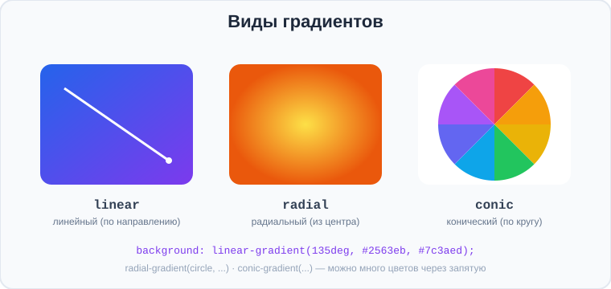

# Урок 5 — 🏆 Градиенты и красивые карточки 🌈✨

**Модуль 3 · Блочная модель и красивые блоки · Урок 5 из 5 | 2 ак.ч. (1,5 часа)**

> ⬅️ [Все уроки модуля](../README.md) · [План курса](../../ПЛАН-КУРСА.md) · Предыдущий: [Урок 4 «Картинки, тени, фоны»](../урок-04-картинки-тени-фоны/урок.md) · Следующий: Модуль 4 «Flexbox» ➡️

> 🔁 В начале — [разминка/повтор](повторение.md).
> 📌 Быстро вспомнить материал — [итого.md](итого.md). 👨‍🏫 Сценарий — [преподавателю.md](преподавателю.md). 🖼 Проектор — [изображения.md](изображения.md).
> 🆘 **Пропустил урок?** — [самоучитель.md](самоучитель.md). 🧰 Больше трюков — [лайфхак.md](лайфхак.md), но главные разбираем прямо в уроке (значок 🧰).

> 🧭 **Как читать урок.** Финал модуля — самое красивое! 🎉 Градиенты (плавные переходы цвета) — любимый приём современного веба: модные фоны, «неоновые» кнопки, стеклянные карточки. Мы обещали эту тему ещё в уроке про цвет — и вот она. Разберём три вида градиентов, научимся **красить текст градиентом**, делать **градиентную рамку** и модный эффект **«матового стекла»** (glassmorphism). После этого урока твои работы будет не отличить от дизайнерских.

---

## 🎮 Что мы сделаем сегодня и что получим

**Задача:** собрать **набор «неоновых» и «стеклянных» карточек** с градиентами — как на топовых сайтах 2026.

**В итоге** ты будешь делать градиентные фоны, кнопки, текст и рамки, а также эффект матового стекла.

**Главные навыки урока:** **`linear-gradient`** · **`radial-gradient`** · **`conic-gradient`** · 🎨 **градиент к тексту** (`background-clip: text`) · **градиентная рамка** · **стекломорфизм** (`backdrop-filter`).

> 💡 **Главная мысль урока:** градиент — это **картинка-фон, нарисованная кодом** (плавный переход цветов). Поэтому он живёт в `background` и работает везде, где работает `background-image`: у блоков, кнопок, текста и рамок.

---

## Часть 1 — `linear-gradient`: линейный переход

**`linear-gradient`** — плавный переход цвета по прямой. Это **фон**, поэтому пишется в `background`:

```css
.box { background: linear-gradient(to right, #2563eb, #7c3aed); }
```



- **Направление:** `to right` (вправо), `to bottom` (вниз), `135deg` (по диагонали в градусах).
- **Цвета** через запятую — можно **сколько угодно**:
```css
background: linear-gradient(90deg, #f97316, #ec4899, #8b5cf6);
```
- **Точки остановки (%):** можно задать, где цвет «стоит»:
```css
background: linear-gradient(#22c55e 0%, #22c55e 50%, #16a34a 50%);  /* резкая граница */
```

> 🧰 **Лайфхак — генератор.** Не подбирай градиент вручную: на **[cssgradient.io](https://cssgradient.io/)** крутишь цвета мышкой и копируешь готовый CSS. Все ссылки — в [🧰 Полезные сервисы](../../ПОЛЕЗНЫЕ-СЕРВИСЫ.md).

> ✍️ **Мини-задание 1:** сделай блок с диагональным градиентом из 3 цветов (`135deg`). Подбери свои цвета или возьми с cssgradient.io.
> <details><summary>💡 подсказка</summary><code>background: linear-gradient(135deg, #f97316, #ec4899, #8b5cf6);</code></details>

---

## Часть 2 — `radial-gradient`: из центра

**`radial-gradient`** расходится **кругом от центра** — как свет от лампы или блик:

```css
.box { background: radial-gradient(circle, #fde047, #ea580c); }
```

- `circle` — круглый, `ellipse` — овальный (по умолчанию).
- Можно задать центр: `radial-gradient(circle at top left, ...)`.

- 👀 Радиальный градиент хорош для «свечения», подсветки кнопок, фоновых бликов.

> ✍️ **Мини-задание 2:** сделай блок с радиальным градиентом (`circle`) — «солнце» или «блик». Попробуй сдвинуть центр (`at top`).
> <details><summary>💡 подсказка</summary><code>background: radial-gradient(circle at top, #fde047, #ea580c);</code></details>

---

## Часть 3 — `conic-gradient`: по кругу

**`conic-gradient`** крутит цвета **по кругу** (как стрелка часов). Из него делают цветовые круги, диаграммы-«пироги», радужные обводки:

```css
.box { background: conic-gradient(#ef4444, #eab308, #22c55e, #0ea5e9, #a855f7, #ef4444); }
```

- Часто на круглом блоке (`border-radius: 50%`) — получается «радужный диск».
- 👀 Это тот самый эффект «крутящегося градиента» у модных кнопок и аватарок.

> ✍️ **Мини-задание 3:** сделай круглый блок (`border-radius: 50%`) с `conic-gradient` из нескольких цветов — получится радужный диск.
> <details><summary>💡 подсказка</summary><code>.disc { width:120px; height:120px; border-radius:50%; background: conic-gradient(red, orange, yellow, green, blue, violet, red); }</code></details>

---

## Часть 4 — 🎨 Градиент к тексту (фишка!)

Один из самых эффектных трюков: **буквы, закрашенные градиентом**. Секрет — `background-clip: text` (мы про него говорили в прошлом уроке!): фон рисуется **только сквозь буквы**, а сам текст делаем прозрачным.

```css
.gradient-text {
    background: linear-gradient(90deg, #6366f1, #ec4899);
    background-clip: text;
    -webkit-background-clip: text;    /* для Safari/Chrome */
    color: transparent;               /* сам текст прозрачный — виден фон */
    font-weight: 800;
    font-size: 48px;
}
```

- 👀 Заголовок переливается градиентом — как на промо-сайтах и обложках.

> 🧭 **Как это работает:** ① кладём градиент в `background`; ② `background-clip: text` обрезает фон по форме букв; ③ `color: transparent` делает сам текст невидимым — и сквозь буквы виден градиент.

> ✍️ **Мини-задание 4:** сделай крупный заголовок с градиентной заливкой текста.
> <details><summary>💡 подсказка</summary>Нужны 4 строки: <code>background</code> (градиент), <code>background-clip: text</code>, <code>-webkit-background-clip: text</code>, <code>color: transparent</code>.</details>

---

## Часть 5 — Градиентная рамка

Обычный `border` не умеет градиент. Но есть приём: **градиент как фон**, а «дырку» внутри делаем цветом фона. Проще всего — через `background` с двумя слоями:

```css
.grad-border {
    border: 3px solid transparent;
    border-radius: 16px;
    background:
        linear-gradient(#fff, #fff) padding-box,                 /* внутренний фон */
        linear-gradient(135deg, #6366f1, #ec4899) border-box;    /* градиент под рамкой */
}
```

- 👀 Рамка переливается градиентом, а внутри — чистый фон. Вот где пригодился **`background-clip`/`padding-box`/`border-box`** из прошлого урока!

> 💡 Не пугайся записи — это готовый рецепт. Скопируй и меняй цвета градиента. Понимание придёт с практикой.

> ✍️ **Мини-задание 5:** сделай карточку с градиентной рамкой по рецепту выше. Поменяй цвета градиента на свои.
> <details><summary>💡 подсказка</summary>Ключевое: <code>border: 3px solid transparent</code> + два фона (`padding-box` и `border-box`).</details>

---

## Часть 6 — Стекломорфизм: эффект матового стекла 🧊

Модный эффект «матового стекла» (glassmorphism): полупрозрачная карточка **размывает** то, что под ней. Делается свойством **`backdrop-filter: blur()`**:

```css
.glass {
    background: rgba(255, 255, 255, 0.15);   /* полупрозрачный фон */
    backdrop-filter: blur(12px);              /* размывает фон ПОД карточкой */
    border: 1px solid rgba(255, 255, 255, 0.3);
    border-radius: 16px;
    box-shadow: 0 8px 32px rgba(0, 0, 0, 0.2);
}
```

- 👀 Работает **только поверх пёстрого фона** (градиент, фото) — иначе размывать нечего. Положи стеклянную карточку на градиентный фон — увидишь эффект.

> ⚠️ **Фолбэк:** если браузер старый и не поддержит `backdrop-filter`, карточка просто останется полупрозрачной (`rgba`) — тоже красиво. Поэтому фон-`rgba` задаём **всегда**, а `backdrop-filter` — как «улучшение».

> ✍️ **Мини-задание 6:** сделай градиентный фон страницы и положи на него «стеклянную» карточку (`rgba` + `backdrop-filter: blur`).
> <details><summary>💡 подсказка</summary>Фон у <code>body</code> — градиент; у карточки — <code>background: rgba(255,255,255,.15); backdrop-filter: blur(12px);</code>.</details>

---

## Часть 7 — 🏆 Мини-проект: «Неоновые и стеклянные карточки»

Соберём эффектный блок — то, ради чего был весь модуль.

**`index.html`:**
```html
<section class="hero">
    <h1 class="title">CYBER<br>CARDS</h1>

    <article class="glass">
        <h3>💎 Premium</h3>
        <p>Все возможности без ограничений.</p>
        <a href="#" class="btn">Выбрать</a>
    </article>
</section>
```

**`style.css`:**
```css
* { box-sizing: border-box; margin: 0; padding: 0; }
.hero {
    min-height: 100vh;
    background: linear-gradient(135deg, #6d28d9, #db2777, #f59e0b);
    display: flex; flex-direction: column;      /* рабочий рецепт, подробно — в Flexbox */
    align-items: center; justify-content: center; gap: 30px;
    font-family: "Segoe UI", sans-serif;
    padding: 20px;
}
/* градиентный текст */
.title {
    font-size: 64px; font-weight: 800; text-align: center; line-height: 1;
    background: linear-gradient(90deg, #a5f3fc, #fff);
    background-clip: text; -webkit-background-clip: text; color: transparent;
}
/* стеклянная карточка */
.glass {
    width: 280px; padding: 28px; border-radius: 20px; text-align: center;
    background: rgba(255,255,255,.15);
    backdrop-filter: blur(12px);
    border: 1px solid rgba(255,255,255,.35);
    box-shadow: 0 8px 32px rgba(0,0,0,.25);
    color: #fff;
}
.glass h3 { margin-bottom: 8px; }
.glass p  { opacity: .9; margin-bottom: 18px; font-size: 14px; }
/* неоновая кнопка */
.btn {
    display: inline-block; padding: 12px 28px; border-radius: 999px;
    text-decoration: none; color: #fff; font-weight: 700;
    background: linear-gradient(90deg, #6366f1, #ec4899);
    box-shadow: 0 0 20px rgba(236,72,153,.6);      /* неоновое свечение */
    transition: .2s;
}
.btn:hover { box-shadow: 0 0 30px rgba(236,72,153,.9); transform: translateY(-2px); }
.btn:focus { outline: 3px solid #fff; outline-offset: 3px; }   /* доступный фокус */
```

- 👀 Градиентный фон, переливающийся заголовок, матовое стекло и неоновая кнопка со свечением. Настоящий современный дизайн!

> 🎨 **Твой вариант:** собери свою «неоновую» секцию (тариф, промо, профиль) с градиентным текстом, стеклянной карточкой и неоновой кнопкой на свою тему.

> 🧩 **Для 5–7 классов (проще):** хватит градиентного фона, градиентного заголовка и одной кнопки с градиентом. Стекло/`conic` — по желанию.

---

## 🎓 Часть 8 — Для тех, кто хочет глубже

- **Анимированный градиент:** большой `background-size: 200%` + сдвиг `background-position` в `@keyframes` — фон «переливается» (анимацию разберём в отдельном модуле).
- **`conic-gradient` для диаграмм:** `conic-gradient(#22c55e 0 70%, #e5e7eb 0)` — простой «пирог» прогресса.
- **Повторяющиеся градиенты:** `repeating-linear-gradient(...)` — полоски, узоры.
- **`filter: drop-shadow`** для теней сложной формы (не только прямоугольной).
- **Все эти свойства — Baseline** (работают во всех свежих браузерах); для `backdrop-filter` держи фон-`rgba` как фолбэк.

---

## 🏁 Итог урока и модуля 🎉

Ты прошёл весь модуль блоков и научился делать **современный визуал**:

- ✅ **`linear-gradient`** (направление + много цветов), **`radial-gradient`** (из центра), **`conic-gradient`** (по кругу).
- ✅ 🎨 **Градиент к тексту:** `background-clip: text` + `color: transparent`.
- ✅ **Градиентная рамка** (два фона: `padding-box` + `border-box`).
- ✅ **Стекломорфизм:** `rgba` + `backdrop-filter: blur()` (с фолбэком).
- ✅ Соединил всё из модуля: скругления, тени, фоны, `:hover`, `:focus`.

> 🏆 Главное: градиент — это **фон, нарисованный кодом**; он работает у блоков, кнопок, текста и рамок. Быстро повторить — в [итого.md](итого.md).

> 🎤 **Блиц:** назови 3 вида градиентов. Как покрасить текст градиентом? Что делает `backdrop-filter`? Почему у стекла всегда задают фон `rgba`? Где брать готовые градиенты?

### 🎮 Викторина-закрепление
Открой **[викторина.html](викторина.html)** — вопросы по градиентам и стеклу **+ повторение всего модуля 3** + смешные и «на подумать».

➡️ **Практика урока** — **[практика.md](практика.md)**: задачи в 3 уровнях + итоговая работа.
📦 **А затем — [самостоятельная работа модуля](../самостоятельная.md)!**
🆘 **Пропустил / хочешь ещё?** — [самоучитель.md](самоучитель.md). 📌 **Шпаргалка** — [итого.md](итого.md).

---

## 🔗 Навигация

⬅️ [Урок 4 «Картинки, тени, фоны»](../урок-04-картинки-тени-фоны/урок.md) · [Все уроки модуля](../README.md) · [План курса](../../ПЛАН-КУРСА.md) · **Следующий:** Модуль 4 «Flexbox» ➡️

**🧰 Инструменты:** [VS Code](https://code.visualstudio.com/) + [Live Server](https://marketplace.visualstudio.com/items?itemName=ritwickdey.LiveServer). **🌈 Генератор градиентов:** [cssgradient.io](https://cssgradient.io/). **Все ссылки курса** — в [🧰 Полезные сервисы](../../ПОЛЕЗНЫЕ-СЕРВИСЫ.md). **📄 Пример:** [`материалы/неоновые-карточки.html`](материалы/неоновые-карточки.html) — градиенты, стекло, неон.
