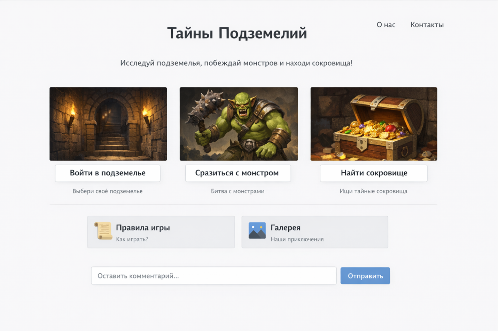

<h1>Урок 27. Контрольная точка №3 - «Прокачка персонажа (Skill Tree UI)»</h1>

<h2>🚀 ЭТАП 0 — ДИЗАЙН В Figma (ОБЯЗАТЕЛЬНО)</h2>
<p>Перед тем как писать код, ты должен создать дизайн страницы.</p>
<hr>
<h3>🎯 Что нужно нарисовать</h3>
<p>В Figma нужно сделать макет страницы:</p>
<ol>
<li>
    <b>Header</b>
    <ul>
        <li>название игры</li>
        <li>меню</li>
    </ul>
</li>
<li>
    <b>Карточка персонажа</b>
    <ul>
        <li>аватар</li>
        <li>имя</li>
        <li>уровень</li>
        <li>кнопка</li>
    </ul>
</li>
<li>
    <b>Дерево навыков</b>
    <ul>
        <li>сетка навыков (как в игре)</li>
        <li>карточки навыков</li>
    </ul>
</li>    
<li><b>Footer</b></li>
</ol>
<br>
<h3>📐 Требования к дизайну</h3>
<ul>
<li>Использовать Auto Layout (аналог flex)</li>
<li>Сделать сетку (Grid)</li>
<li>
    Использовать:
    <ul>
        <li>цвета</li>
        <li>отступы</li>
        <li>шрифты</li>
        <li>тени</li>
    </ul>
</li>
</ul>
<br>
<h4>📱 Обязательно сделать 2 версии:</h4>
<ol>
    <li>💻 Десктоп (широкий экран)</li>
    <li>📱 Мобильная версия</li>
</ol>
<br>
<strong>⚠️ Важно</strong>
<p><b>❌ Нельзя сразу писать код</b></p>
<p><b>✅ Сначала дизайн → потом верстка</b></p>
<br>
<h2>🧱 ЭТАП 1 — HTML структура</h2>
<p>Карточка персонажа:</p>
<ul>
    <li>картинка</li>
    <li>имя</li>
    <li>уровень</li>
    <li>описание</li>
    <li>кнопка "Upgrade"</li>
</ul>

> Необходимо использовать display: flex;

<p><b>Подсказка:</b></p>

```css
.character {
    display: flex;
    flex-direction: column;
    align-items: center;
}
```

<p>📌 Свойства:</p>
<ul>
    <li><b>display: flex</b> — включает гибкую раскладку</li>
    <li><b>flex-direction: column</b> — элементы сверху вниз</li>
    <li><b>align-items: center</b> — выравнивание по центру</li>
</ul>

<br>
<h2>🧩 Часть 2: Дерево навыков (Grid)</h2>
<p>Навыки должны выглядеть как дерево / сетка</p>
<p>Например:</p>
<ul>
    <li>3 ряда</li>
    <li>в каждом ряду 3 навыка</li>
</ul>
<br>

<p>🔥 Использовать GRID</p>

```css
.skills {
    display: grid;
    grid-template-columns: repeat(3, 1fr);
    gap: 20px;
}
```

<p>📌 Свойства:</p>
<ul>
    <li><b>display: grid</b> — включает сетку</li>
    <li><b>grid-template-columns</b> — задаёт колонки</li>
    <li><b>repeat(3, 1fr)</b> — 3 равные колонки</li>
    <li><b>fr</b> — доля свободного пространства</li> 
    <li><b>gap</b> — расстояние между элементами</li>
</ul> 
<br>

<h2>🧩 Карточка навыка (Flex внутри Grid)</h2>
<p>Каждый навык:</p>
<ul>
    <li>иконка</li>
    <li>название</li>
    <li>описание</li>
    <li>кнопка</li>
</ul>

```css
.skill {
    display: flex;
    flex-direction: column;
    justify-content: space-between;
}
```

<p>📌 Свойства:</p>
<ul>
    <li><b>justify-content</b> — распределяет элементы по вертикали</li>
    <li><b>space-between</b> - равномерно растягивает</li>
</ul> 
<br>

<h2>⚡ Часть 3: Интерактив</h2>
<p>Добавить:</p>

```css
.skill:hover {
    transform: scale(1.05);
    cursor: pointer;
}
```

<p>📌 Свойства:</p>
<ul>
    <li><b>:hover</b> — эффект при наведении</li>
    <li><b>transform: scale()</b> — увеличение</li>
    <li><b>cursor: pointer</b> — курсор как кнопка</li>
</ul> 
<br>

<h2>📱 Часть 4: Адаптив (@media)</h2>
<p>На телефоне:</p>
<ul>
    <li>персонаж сверху</li>
    <li>навыки в 1 колонку</li>
</ul>

```css
@media (max-width: 768px) {
    .layout {
        display: flex;
        flex-direction: column;
    }

    .skills {
        grid-template-columns: 1fr;
    }
}
```

<p>📌 Свойства:</p>
<ul>
    <li><b>@media</b> — стили для разных экранов</li>
    <li><b>max-width</b> — правило работает на маленьких экранах</li>
</ul> 
<br>

<h2>📦 Часть 5: Container Query (ВАЖНО)</h2>
<p>Карточки должны меняться в зависимости от ширины контейнера</p>

<ol>
<li>
    Включаем контейнер

```css
.skills {
    container-type: inline-size;
    container-name: block;
}
```

<p>📌 Свойства:</p>
<ul>
    <li><b>container-type</b> — делает элемент контейнером</li>
    <li><b>container-name</b> – задает имя блоку</li>
</ul>
</li>
<br>
<li>
    Меняем карточку

```css
@container block (max-width: 500px) {
    .skill {
        flex-direction: row;
    }
}
```

> @container — реагирует на размер блока, а не экрана
</li>
</ol>
<br>

<h2>🎨 Часть 6: Дизайн (обязательно)</h2>
<p>Использовать:</p>
<ul>
    <li>border-radius</li>
    <li>box-shadow</li>
    <li>background-color</li>
    <li>hover эффекты</li>
</ul>
<br>

<h2>⭐ Дополнительные задания</h2>
<ul>
    <li>сделать разные типы навыков (цвета)</li>
    <li>заблокированные навыки (серые)</li>
    <li>соединить навыки линиями (через ::before)</li>
    <li>сделать разные уровни</li>
</ul>