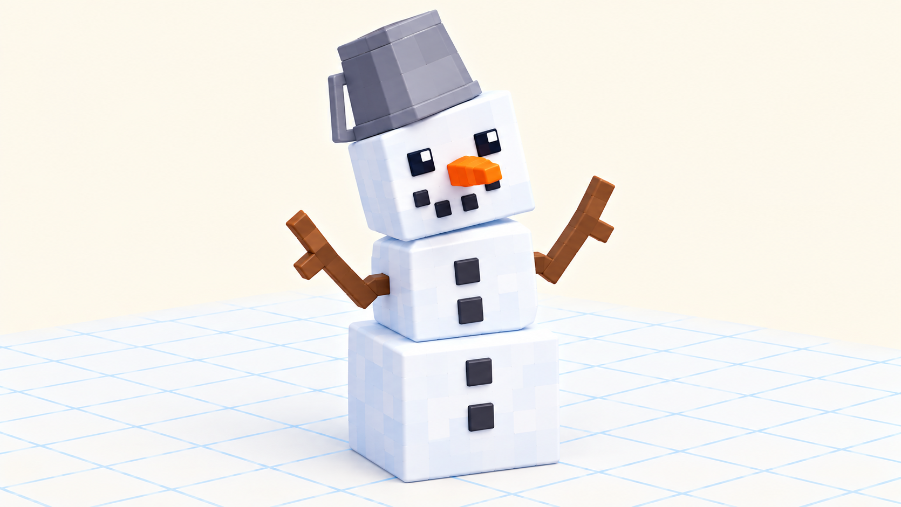

# 🏠 Догоняем урок 4 — «Снеговик из кубиков» (BlockBench)

> 👋 Пропустил первый 3D-урок? Ничего страшного! Сделай это задание дома или с учителем — за один раз (≈1.5 урока) ты научишься крутить камеру и собирать модель из кубиков, как весь класс. 🤖

---

## 📺 Что мы делали на уроке (прочитай ОБЯЗАТЕЛЬНО — тут главные кнопки)
Это был **первый раз в программе BlockBench** — в ней лепят 3D-модели из кубиков, как из LEGO. Мы научились:

**🎥 Крутить камеру (это важнее всего!):**
- **правая кнопка мыши (зажать и водить)** — облететь модель вокруг;
- **колёсико мыши** — приблизить/отдалить;
- **левая кнопка** — просто **выбрать** кубик.

**🧊 Собирать из кубиков:**
- **Add Cube (Добавить куб)** — появляется новый кубик;
- **W** — **двигать** (появляются 3 стрелки, тянешь за цветную);
- **S** — **размер** (растянуть/сжать);
- **E** — **повернуть** (наклонить);
- **Ctrl+Z** — **отмена**.

**⚠️ Главная ловушка урока — НЕ сжимай кубик размером до 0!** Если тянуть стрелку размера до нуля, кубик станет плоским и **обратно стрелкой не растянется** (ноль не тянется). Спасение: нажми **Ctrl+Z** или **впиши число** в окошко **Size (Размер)** на панели справа. Там же есть **Position (Положение)** — можно двигать не мышкой, а точными цифрами.

На уроке класс собирал **героя и меч**. А ты соберёшь **снеговика** — другой предмет, но теми же кнопками. ⛄

---

## 🎯 Твоё задание — СНЕГОВИК ⛄
Снеговик — это три кубика-кома друг на друге плюс мелкие детали. Отлично тренирует **Add Cube, W, S, E** и камеру.

*Три кубика стопкой: большой → средний → голова. Нос-морковка повёрнут клавишей E, руки-палочки наклонены.*

### 🖥 Часть А. Создаём проект
1. Открой BlockBench → **New (Новый)** → **Generic Model** → имя `snegovik` → **Confirm**.
2. **Покрути камеру правой кнопкой** — привыкни к объёму.

### ⛄ Часть Б. Три кома (стопкой)
1. **Add Cube** → **S** — сделай **крупный** куб. Это **нижний ком** (снеговик на нём стоит).
2. **Add Cube** → **S** поменьше → **W** подними **наверх** первого (тяни за 🟢 зелёную стрелку) → **средний ком**.
3. **Add Cube** → **S** ещё меньше → **W** наверх → **голова**.
> ⚠️ Если куб вдруг стал плоским (сжал до 0) — **Ctrl+Z** или впиши число в **Size** справа!

### 😊 Часть В. Лицо и детали
1. 🥕 **Нос-морковка:** **Add Cube** маленький → **S** сделай тонким и длинным → **W** поставь на голову спереди → **E** наклони чуть вниз.
2. 👀 **Глаза и пуговицы:** несколько маленьких тёмных кубиков (**Add Cube** → **W**).
3. 🪣 **Ведро на голову:** короткий куб сверху.

### 💪 Часть Г. Руки-палочки
1. **Add Cube** → **S** — тонкий длинный куб = **рука**. **W** приставь к боку. **E** наклони вверх.
2. Сделай **вторую руку** с другого бока так же.

### 💾 Часть Д. Сохраняем
**File → Save** → назови «мой снеговик». Покрути камерой со всех сторон — настоящий 3D!

---

## 🎯 А попробуй (если осталось время)
- Сделай снеговику **шарф** (плоский длинный куб на шее).
- Добавь **метлу** рядом (длинный куб + кисточка).
- Поставь снеговику **второго друга-снеговичка** поменьше.

## ✅ Теперь ты знаешь то же, что класс
- [ ] Покрутил камеру **правой кнопкой**, приближал колёсиком.
- [ ] Ставил кубики **Add Cube**, двигал **W**, менял размер **S**, крутил **E**.
- [ ] Не испугался «ловушки нуля» — знаешь, как вернуть размер.
- [ ] Сохранил проект.

🎉 Готово — ты освоил BlockBench, как весь класс! За работу — **+2 ⭐**.
