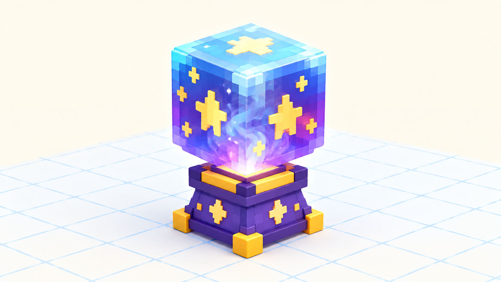

# 🏠 Догоняем урок 5 — «Волшебный стеклянный шар» (BlockBench)

> 👋 Пропустил урок про раскрашивание? Сделай это задание дома или с учителем — за один раз (≈1.5 урока) ты научишься красить 3D-модель и делать стекло, как весь класс. 🤖

---

## 📺 Что мы делали на уроке (прочитай, чтобы понять)
На этом уроке мы **раскрашивали** 3D-модель. Главное:
- вверху справа есть вкладка **Paint (Рисование)** — переключаешься в неё, чтобы красить;
- в окошке **Textures** жмёшь **+ (Create Texture)** → **16×16** → **Confirm** — это «холст» модели;
- **🪣 Заливка (Paint Bucket)** — красит **целую грань** одним кликом (большие части);
- **🖌 Кисть (Paint Brush)** — рисует **мелкие детали** (глаза, узор);
- **☀️ свет-тень:** верхнюю грань делаем чуть **светлее**, боковую — чуть **темнее** → модель становится **объёмной**;
- **💎 стекло:** ползунок **Opacity (Прозрачность)** убавляем — деталь становится «стеклянной», сквозь неё видно.

Красим **левой кнопкой** по грани, а камеру по-прежнему крутим **правой кнопкой**, чтобы достать все 6 сторон.

На уроке класс раскрашивал **своего героя**. А ты раскрасишь **волшебный шар** — на нём отлично видно и свет-тень, и стекло. 🔮

---

## 🎯 Твоё задание — ВОЛШЕБНЫЙ ШАР 🔮
Собери один кубик-шар и раскрась его всеми способами урока. Это не герой — простой предмет, зато вся покраска как на ладони.

*Яркий цвет, узор из звёздочек Кистью, светлый верх и тёмный бок для объёма, и прозрачное стекло.*

### 🧊 Часть А. Быстрый шар
1. **Add Cube** — один кубик (можно чуть сгладить углы позже). Это наш **шар**.
2. Поставь снизу тонкий куб = **подставка** (по желанию).

### 🎨 Часть Б. Включаем покраску
1. Вверху справа — вкладка **Paint (Рисование)**.
2. В **Textures** нажми **+ (Create Texture)** → **16×16** → **Confirm**.
3. Выбери яркий **цвет** в палитре.

### 🪣 Часть В. Заливка — основной цвет
1. 🪣 Возьми **Заливку (Paint Bucket)**.
2. Кликай по каждой грани. **Поворачивай камеру правой кнопкой** и закрась все 6 сторон одним цветом.

### 🖌 Часть Г. Кисть — узор
1. 🖌 Возьми **Кисть (Paint Brush)**, размер поменьше.
2. Нарисуй на шаре **узор**: звёздочки ✨, спиральку или точки — как на волшебном шаре гадалки.

### ☀️ Часть Д. Свет-тень — объём
1. **Верхнюю** грань закрась цветом чуть **светлее**.
2. **Нижнюю/боковую** — чуть **темнее**.
3. Покрути камеру — шар стал круглым и объёмным!

### 💎 Часть Е. Стекло (Opacity)
1. Выбери грани шара и **убавь ползунок Opacity** примерно до половины.
2. Крутани камеру — шар стал **прозрачным, стеклянным**! Внутри будто туман.

### 💾 Часть Ж. Сохраняем
**File → Save** → назови «волшебный шар».

---

## 🎯 А попробуй (если осталось время)
- Положи **внутрь** шара маленький цветной кубик — сквозь стекло его будет видно.
- Сделай **два** шара разных цветов.
- Раскрась **подставку** под шаром другим цветом (дизайн-код).

## ✅ Теперь ты знаешь то же, что класс
- [ ] Включил **Paint**, создал текстуру 16×16.
- [ ] Залил модель **Заливкой** (все 6 сторон) и нарисовал узор **Кистью**.
- [ ] Навёл **свет-тень** (светлый верх, тёмный бок).
- [ ] Сделал **стекло** ползунком **Opacity**; сохранил проект.

🎉 Готово — ты умеешь раскрашивать 3D, как весь класс! За работу — **+2 ⭐**.
