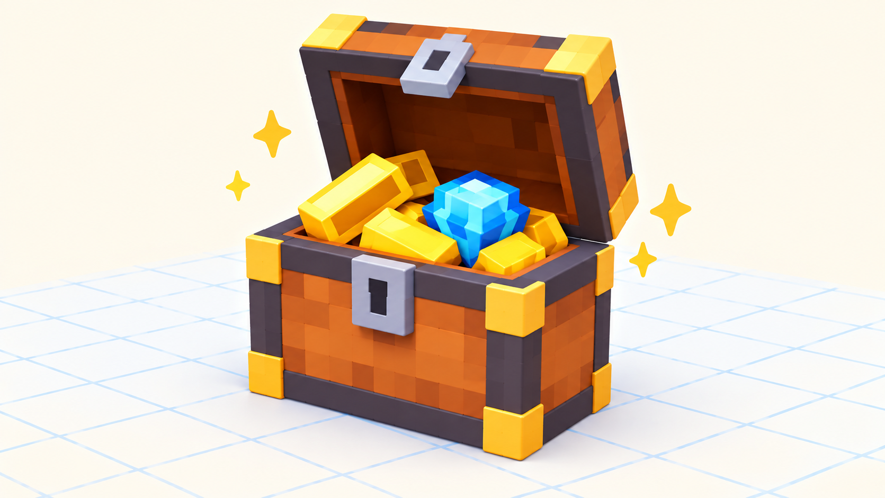

# 🏠 Догоняем урок 6 — «Ноутбук, который открывается» (BlockBench)

> 👋 Пропустил урок про папки и петли? Сделай это задание дома или с учителем — за один раз (≈1.5 урока) ты научишься складывать детали в папки и делать подвижную петлю, как весь класс. 🤖

---

## 📺 Что мы делали на уроке (прочитай, чтобы понять)
На этом уроке мы узнали, как сделать модель **живой и аккуратной**:
- когда деталей много, они **разъезжаются**. Чтобы двигать их вместе, мы складываем их в **папки** — в списке **Outliner** (справа). Жмём иконку папки → **Group**, даём имя (2 клика по названию), и **перетаскиваем** детали внутрь. Можно сделать **папку в папке**;
- **двигаешь папку (W) — едут все детали внутри** сразу;
- **Duplicate (Ctrl+D)** — быстрая **копия** детали (для одинаковых);
- **🔩 Pivot Tool (клавиша P)** — ставит **точку-петлю (шарнир)**. Если перетащить точку к краю и повернуть деталь (**E**), она открывается как на петле — не из центра, а от края.

На уроке класс делал **сундук** с крышкой на петле. В практике был **дракончик** с открывающейся пастью. А ты сделаешь **ноутбук**, который открывается, — тот же секрет (папки + петля), но совсем другой предмет! 💻

*У сундука крышка открывается на петле сзади. У ноутбука так же откидывается экран.*

---

## 🎯 Твоё задание — НОУТБУК 💻
Ноутбук = нижняя часть (клавиатура) + экран, который откидывается на петле. Идеально тренирует **папки** и **Pivot**.

### 🧊 Часть А. Собери две части
1. **Add Cube** → **S** — плоский широкий куб = **основание** (там клавиатура).
2. **Add Cube** → **S** такой же плоский → **W** поставь **сзади, стоймя** = **экран**.

### 📁 Часть Б. Разложи по папкам (Outliner справа)
1. Иконка папки → **Group** → 2 клика → назови **NOTEBOOK** → Enter.
2. Сделай внутри две папки: **BASE** (основание) и **LID** (экран).
3. Перетащи основание в **BASE**, экран — в **LID**.
> ✅ Выбери **NOTEBOOK**, нажми **W** — весь ноутбук едет целиком!

### ⌨️ Часть В. Клавиши через Duplicate
1. **Add Cube** маленький плоский = одна **клавиша** на основании.
2. **Ctrl+D** несколько раз → расставь клавиши рядами. Все клади в папку **BASE**.

### 🔩 Часть Г. Петля — экран откидывается (Pivot, P)
1. Выбери папку **LID** → **E** и попробуй повернуть. Экран крутится из центра? Исправим!
2. Возьми **Pivot Tool** (клавиша **P**) — появились точки-петля.
3. **Перетащи точку к нижнему заднему ребру экрана** (там, где он соединяется с основанием).
4. Снова **E** — экран **откидывается назад и закрывается**, как настоящий ноутбук! 💻✨

### 💾 Часть Д. Сохраняем
**File → Save** → назови «мой ноутбук». Открой-закрой экран — работает как настоящий!

---

## 🎯 А попробуй (если осталось время)
- Нарисуй на экране (вкладка Paint) **картинку рабочего стола**.
- Сделай рядом **компьютерную мышку** из маленького куба.
- Не хочешь ноутбук? Сделай **книжку**, **телефон-раскладушку** или **почтовый ящик с дверцей** — тот же секрет петли!

## ✅ Теперь ты знаешь то же, что класс
- [ ] Сложил детали в **папки** (NOTEBOOK → BASE, LID), двигал всё целиком.
- [ ] Наделал клавиш через **Duplicate (Ctrl+D)**.
- [ ] Поставил **Pivot** к заднему ребру — экран откидывается на петле.
- [ ] Сохранил проект.

🎉 Готово — ты освоил папки и петли, как весь класс! За работу — **+2 ⭐**.
