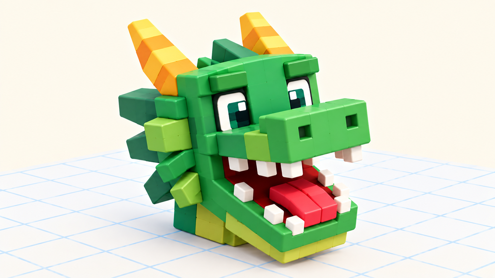

# 🖐 Практика урока 6 — «Дракончик, который открывает пасть» (BlockBench)

> На уроке Бип собрал **сундук** с крышкой на петле. А ты примени тот же секрет (**папки + петля**) на новом герое — собери **дракончика, у которого открывается пасть!** 🐉 За работу — **+2 ⭐**. Не спешим, «рука в руке» кому трудно.

*Наша цель: голова дракона, у которой нижняя челюсть откидывается на петле — внутри зубы и язычок.*

> 🎥 Камера — **правая кнопка мыши**. Инструменты — **жми кнопки-значки:** **Move** (двигать), **Resize** (размер), **Rotate** (повернуть), **Pivot** (петля). Клавиши **W/S/E/P** — то же самое, но только на **английской раскладке (ENG)**. Отмена — **Ctrl+Z**.
> ⚠️ **Не сжимай куб размером до 0!** Стал плоским — не тяни стрелку (ноль не растёт), а нажми **Ctrl+Z** или впиши число в окошко **Size** справа (см. урок 4).
> 💡 Секрет тот же, что у сундука: крышка = челюсть, петля = сзади. Поменяли только «одёжку»!

---

## 🐉 Часть А. Собери голову и челюсть
1. **Add Cube** → **S** — большой куб = **голова** дракона.
2. **Add Cube** → **S** сделай пониже = **нижняя челюсть**, **W** поставь её спереди-снизу головы (как подбородок).

## 📁 Часть Б. Сложи в папки (Outliner справа)
1. Иконка папки → **Group** → **2 клика** → назови **DRAGON** → Enter.
2. **Перетащи** голову на папку **DRAGON**.
3. Создай **папку в папке** — **JAW** (челюсть) → положи туда куб-челюсть.
4. Дерево: **DRAGON → голова, и DRAGON → JAW → челюсть**.
> ✅ Выбери **DRAGON**, нажми **W** — вся голова едет вместе!

## 🔩 Часть В. Петля — пасть открывается (Pivot, P)
1. Выбери папку **JAW** → **E** и поверни. Челюсть крутится из центра? Исправим!
2. Возьми **Pivot Tool** (клавиша **P**). Появились точки-петля.
3. **Перетащи точку к заднему ребру челюсти** (где у дракона «шарнир» рта).
4. Снова **E** — челюсть **опускается вниз**, пасть открывается! 🐉🔥

## 😁 Часть Г. Зубы, язык, глаза
1. 🦷 **Зубы:** маленький белый куб → **Duplicate** (Ctrl+D) несколько раз → расставь по краю челюсти. **Важно:** клади зубы в папку **JAW**, чтобы они открывались вместе с челюстью!
2. 👅 **Язык:** красный плоский куб внутри пасти (тоже в JAW).
3. 👀 **Глаза и рожки:** на голову (в папку DRAGON) — два глаза и два рожка-куба.
4. 🔥 По желанию — оранжевый куб-огонёк у пасти, можно «стеклянный» (Opacity).

## 💾 Часть Д. Сохраняем
**File → Save** → назови «мой дракончик». Открой-закрой пасть — работает как настоящая!

## ⌨️ Часть Е. Тренажёр печати (в конце урока)
Открой ⌨️ [тренажёр.html](тренажёр.html): три режима, уровень 6. За участие — **+1 ⭐**.

## 🎯 А попробуй (кто быстро справился)
- Сделай дракону **крылья** (два плоских куба по бокам, каждое — в свою папку с петлёй у спины).
- Добавь **длинный хвост** из нескольких кубиков.
- Раскрась дракона (зелёный, красный — какой захочешь) со свет-тенью.
- Не хочешь дракона? Сделай **почтовый ящик с дверцей** или **пасть крокодила** — тот же секрет петли!
- Помоги соседу поставить Pivot челюсти (+1 ⭐ 🤝).

## ✅ Готово, если
- [ ] Сложил голову и челюсть в папки (DRAGON → JAW), голова едет целиком.
- [ ] Поставил Pivot к заднему ребру — пасть открывается вниз.
- [ ] Добавил зубы/язык в папку челюсти; сохранил проект.
