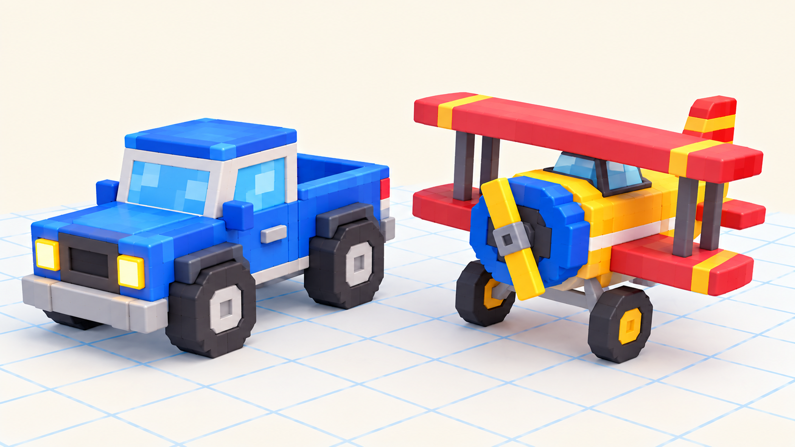

# 🖐 Практика урока 7 — «Мой транспорт» (BlockBench)

> Выбери, что строить: **машинку** 🚗 или **самолёт Пина** ✈️. За работу — **+2 ⭐**. Главный секрет сегодня — **Duplicate** (одинаковые детали за секунду) и **винт на Pivot** (крутится).

*Два проекта на выбор: машинка с колёсами или круглый самолёт Пина (биплан) с винтом.*

> 🎥 Камера — **правая кнопка**. Инструменты: **W** двигать, **S** размер, **E** повернуть, **P** петля, **Ctrl+D** копия. Отмена — **Ctrl+Z**.

---

## 🔁 Сначала освой Duplicate (главный секрет)
1. Сделай один кубик (**Add Cube**, **S**).
2. Нажми **Ctrl+D** (или ПКМ → **Duplicate**) — появилась точная копия.
3. **W** — отодвинь копию. Две одинаковые детали готовы! Так делаем колёса и крылья.

---

## 🚗 Вариант А — Машинка
1. 🟦 **Корпус:** **Add Cube** → **S** растяни **вдоль** (длинный, невысокий). Папка **CAR** → положи корпус.
2. 🔲 **Кабина:** куб поменьше сверху, ближе к задней части. В папку CAR.
3. ⚫ **Колёса:** тёмный куб у низа спереди → **Ctrl+D ×4** → расставь по углам (папка **WHEELS** внутри CAR).
4. 💡 **Фары:** два жёлтых кубика спереди.
5. 🔩 **Колесо крутится (по желанию):** папка колеса → **Pivot (P) в центр** → **E**.

## ✈️ Вариант Б — Самолёт Пина (биплан)
1. 🟣 **Корпус:** куб → **S** сделай **пухлым, толстеньким** (как Пин), спереди чуть сузь. Папка **PLANE**.
2. ➖ **Крылья (2 этажа):** плоский широкий куб = нижнее крыло → **Ctrl+D** → на другой бок. Ещё раз скопируй пару и подними по **Y** — верхние крылья. Тонкие кубики-распорки между ними.
3. ➕ **Хвост:** кубики сверху и сбоку сзади.
4. ✖️ **Винт:** узкий вертикальный куб (лопасти) + куб-носик спереди. Папка **PROP**.
5. 🔩 **Винт крутится:** папка **PROP** → **Pivot (P) в ЦЕНТР винта** → **E** — вертится как пропеллер! 🌀

## 💾 Сохраняем
**File → Save** → назови проект. Завтра транспорт поедет/полетит!

## ⌨️ Тренажёр печати (в конце урока)
Открой ⌨️ [тренажёр.html](тренажёр.html): три режима, уровень 7. За участие — **+1 ⭐**.

## 🎯 А попробуй (кто быстро справился)
- **Скругли углы** корпуса: тонкий куб на угол → Pivot в центр → **E на 45°**.
- **Раскрась** транспорт (вкладка Paint, свет-тень из ур.5).
- Машинке — **прицеп** или мигалку; самолёту — **второго пилота** Бипа в кабине.
- Сделай винт/все колёса крутящимися (Pivot в центр каждого).
- Помоги соседу с Duplicate или Pivot винта (+1 ⭐ 🤝).

## ✅ Готово, если
- [ ] Сделал длинный корпус и одинаковые детали через Duplicate.
- [ ] Собрал транспорт в папках (CAR/WHEELS или PLANE/PROP).
- [ ] Поставил винт или колесо на Pivot в центр; сохранил проект.
