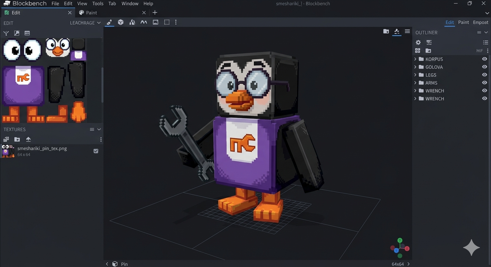

# 🖐 Практика урока 7 — «Собери пингвина Пина» (BlockBench)

> На уроке Бип строил **транспорт** (машинку / самолёт Пина). А ты в практике собери **самого Пина** — пингвина-изобретателя из «Смешариков»! 🐧 Те же секреты (длинный/пухлый корпус, **Duplicate** для одинаковых лап, **папки**), но новый герой — не повтор урока. За работу — **+2 ⭐**.

*Наша цель: кубический Пин — чёрное тело, фиолетовый фартук, большие очки, оранжевый клюв и лапки, а в руке — гаечный ключ. Справа видно папки: KORPUS, GOLOVA, LEGS, ARMS, WRENCH.*

> 🎥 Камера — **правая кнопка**. Инструменты — **жми кнопки-значки:** **Move** (двигать), **Resize** (размер), **Rotate** (повернуть), **Duplicate** (Ctrl+D — копия). Клавиши **W/S/E** — то же, но только на **английской раскладке (ENG)**. Отмена — **Ctrl+Z**.
> ⚠️ **Не уменьшай куб стрелкой до 0!** Если стал плоским — впиши размер в окошке справа (панель Element) или Ctrl+Z (см. урок 4).

---

## 🐧 Часть А. Тело и голова
1. ⬛ **Add Cube** → **S** — чёрный куб-**тело** (пухлое, как у пингвина). Папка **KORPUS**.
2. ⬛ **Add Cube** → **W** вверх — чёрный куб-**голова**. Папка **GOLOVA**.
3. 🟪 **Фартук:** плоский фиолетовый куб спереди тела, на нём белое пятнышко (значок).

## 👀 Часть Б. Лицо
1. 🟠 **Клюв:** оранжевый куб спереди головы.
2. ⚪ **Глаза:** два белых куба. Сделай один → **Ctrl+D** → второй рядом (симметрия!).
3. 👓 **Очки (по желанию):** тонкие кубики-колечки вокруг глаз.

## 🦵 Часть В. Лапки и ножки (Duplicate — симметрия!)
1. ⬛ **Крылья-ласты:** чёрный плоский куб сбоку → **Ctrl+D** → на другой бок (папка **ARMS**).
2. 🟠 **Ножки:** оранжевый куб снизу → **Ctrl+D** → вторая ножка (папка **LEGS**).

## 🔧 Часть Г. Гаечный ключ (по желанию)
Пин — изобретатель! Сделай **ключ**: длинный серый куб + кубик-головка сверху. Вложи его в лапку (папка **WRENCH**). Можно поставить Pivot, чтобы Пин им махал (из ур.6).

## 💾 Часть Д. Сохраняем
**File → Save** → назови «мой Пин». Готово — теперь у Пина есть и самолёт (с урока), и он сам!

## ⌨️ Часть Е. Тренажёр печати (в конце урока)
Открой ⌨️ [тренажёр.html](тренажёр.html): три режима, уровень 7. За участие — **+1 ⭐**.

## 🎯 А попробуй (кто быстро справился)
- Раскрась Пина (вкладка Paint): чёрный, фиолетовый фартук, оранжевые клюв и лапки.
- Посади Пина **в его самолётик** с урока!
- Сделай другого смешарика (Крош — заяц, Нюша — свинка) — те же кубики.
- Поставь Пину **Pivot** в плечо и помаши ключом (повтор ур.6).
- Помоги соседу с Duplicate лапок (+1 ⭐ 🤝).

## ✅ Готово, если
- [ ] Собрал Пина: тело, голова, клюв, глаза, лапки (через Duplicate).
- [ ] Разложил детали по папкам (KORPUS/GOLOVA/ARMS/LEGS).
- [ ] Сохранил проект.
