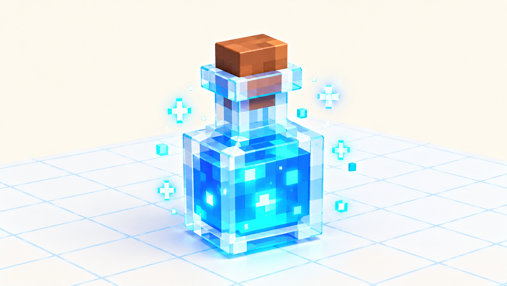

# 🖐 Практика урока 8 — «Волшебный предмет» (BlockBench)

> Придумай предмет с ИИ и слепи его! Зелье, ключ, амулет — на выбор. За работу — **+2 ⭐**. Новый секрет — **стекло (Opacity)**.

*Наша цель: стеклянная бутылочка, сквозь которую сияет зелье.*

> 🎥 Камера — **правая кнопка**. Инструменты: **W/S/E**, **Ctrl+D** копия. Красим во вкладке **Paint**.

---

## 🤖 Часть А. Придумай с ИИ (и попроси помощника!)
1. Скажи вслух три вещи: **что** (зелье), **какое** (голубое, светится), **для чего** (даёт скорость).
2. 🗣 Трудно подобрать слова? **Попроси ИИ-помощника:** «**Алиса, помоги описать волшебное зелье для картинки**» — она подскажет слова, а ты выбери, что нравится, и добавь своё. (Алису включает учитель.)
3. Учитель введёт ваше описание в ИИ-сервис и покажет идею. Теперь лепим!

## 🧪 Часть Б. Зелье (рекомендую — на нём пробуем стекло)
1. 🍾 **Бутылочка:** **Add Cube** → **S** широкий куб (пузатая часть). Сверху ещё куб поуже — **горлышко**. Папка **POTION**.
2. 🟦 **Жидкость:** куб поменьше **внутри** бутылочки (W — задвинь внутрь), залей ярким цветом.
3. 🔘 **Пробка:** маленький коричневый куб сверху.
4. ✨ **Искры:** пара белых кубиков рядом (по желанию).
5. 🌟 **Свет-тень:** верх жидкости закрась **светлее**, низ — **темнее** — зелье будто светится изнутри!
> 💡 **Подсказка:** кубик сжался до 0 и стал плоским? **Ctrl+Z** или впиши число в **Size** справа (ноль стрелкой не растянуть).

## 🗝️ Или другой предмет
- **Ключ:** длинный куб-стержень + кубики-бородка снизу + колечко сверху (куб, **E** 45°).
- **Амулет:** самоцвет (куб → **E** 45° = ромб) + цепочка из мелких кубиков.
- **Монетка:** плоский золотой куб, узор **Кистью**.

## ✨ Часть В. Стекло (Opacity) — главный секрет
1. Перейди в режим **Paint**.
2. Выбери **стенки бутылочки** (НЕ жидкость!).
3. Убавь ползунок **Opacity (Прозрачность)** примерно до половины.
4. Крутани камеру — сквозь стекло видно зелье! ✨

## 💎 Часть Г. Второй стеклянный предмет + полочка (новое!)
Одно зелье — хорошо, а целый **набор зельевара** — ещё интереснее! Сделай второй предмет и поставь оба на полочку.
1. ❄️ **Ледяной кристалл:** **Add Cube** → **E** поверни на **45°** = ромб-кристалл. Залей голубым.
2. ✨ **Сделай его стеклянным:** в режиме **Paint** выбери кристалл → убавь **Opacity** — получился лёд/хрусталь! (тот же секрет, но на другой форме).
3. 🪵 **Полочка:** **Add Cube** → **S** плоский длинный куб = подставка. Поставь на неё **зелье и кристалл** рядом.
4. 🏷️ **По желанию:** Кистью нарисуй на бутылочке **этикетку** (значок-капелька).
> 💡 **Подсказка:** можно сделать второй предмет другим — **амулет-ромб**, **пузырёк поменьше** или **стеклянный шарик**. Главное — потренируй **Opacity** ещё раз.

## 💾 Часть Д. Сохраняем
**File → Save** → назови «набор зельевара». Положим его в игру героя!

## ⌨️ Часть Е. Тренажёр печати (в конце урока)
Открой ⌨️ [тренажёр.html](тренажёр.html): три режима, уровень 8. За участие — **+1 ⭐**.

## 🎯 А попробуй (кто быстро справился)
- Наведи **свет-тень** на жидкость (светлый верх), чтобы «булькала».
- Сделай **второй предмет** (ключ или амулет).
- Добавь зелью **этикетку** (Кистью нарисуй значок).
- Сделай стеклянным **кристалл** или окошко.
- Помоги соседу с Opacity (+1 ⭐ 🤝).

## ✅ Готово, если
- [ ] Придумал описание для ИИ (что+какой+для чего).
- [ ] Слепил предмет из кубиков.
- [ ] Сделал стекло (Opacity) хотя бы на одной детали; сохранил проект.
