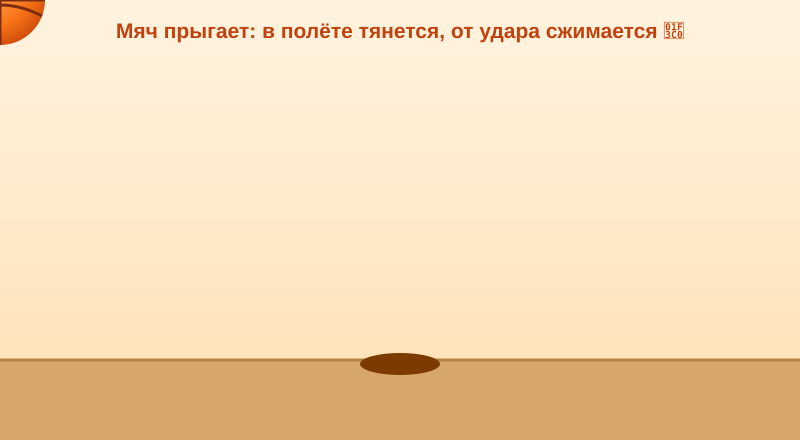

# 🖐 Практика урока 9 — «Живой шлагбаум + баскетбольный мяч» (BlockBench)

> Сегодня две работы: **Часть 1** — оживи **шлагбаум**, который собрал на уроке: он будет **открываться и закрываться сам!** 🚧 (а кто хочет — ещё и робота с рукой или винт самолёта). **Часть 2** — сделай **прыгающий баскетбольный мяч** и забрось его **в корзину**! 🏀 За Часть 1 — **+2 ⭐**, за баскетбол — **+2 ⭐**. Анимация — новое и волшебное, идём по шагам, не спешим.

> 🖱 **Инструменты включаем кнопками-значками** (работают всегда)! Клавиши (W, S, E, P, I) — только на **английской раскладке (ENG)**; если не работают — переключи язык (**Alt+Shift**) или жми кнопки.
> ⚙️ **Правило трёх шагов для каждого кадра:** 1) поставь **ползунок** на нужный момент → 2) **измени** деталь (поверни/подвинь/сожми) кнопкой-инструментом → 3) **ключ запишется сам** (или нажми ромбик **◆**).

---

# ЧАСТЬ 1. Оживи шлагбаум 🚧🎬

## 🔧 Шаг А. Возьми шлагбаум и проверь точку-скелет
1. У тебя уже есть **шлагбаум** с урока (папки **SHLAGBAUM → BAR**, точка-скелет у стойки). Делаешь другую модель — открой её.
2. Нажми вкладку **Edit**, выбери папку **BAR** (перекладину) и чуть подними её кнопкой **Rotate** *(E на ENG)*.
3. 👀 Перекладина поднимается **от стойки** — отлично! Если **улетает в сторону** — точка-скелет (Pivot) стоит не у стойки.
> 💡 **Подсказка:** возьми инструмент **Pivot** *(P)* и поставь точку: у **перекладины — к стойке**, у руки робота — **в плечо**, у винта — **в центр**. Потом **Ctrl+Z** верни деталь на место.

## 🎬 Шаг Б. Включи режим анимации
1. Вверху справа нажми **Animate**. 👀 Внизу появился **таймлайн** (полоса времени).
2. Слева нажми **+ Create Animation** → имя `move` → **Enter**.
3. Включи **Loop** 🔁 (чтобы повторялось).
> 💡 **Подсказка:** если таймлайна не видно — потяни нижний край окна вверх, он прячется внизу.

## 🔑 Шаг В. Собери анимацию — шлагбаум открывается (три ключа)
> ⚠️ **Как записать ключ:** проще всего — **поверни перекладину** (кнопкой **Rotate**), и ключ-ромбик 🔶 **появится сам!** А когда позу не меняем (кадр 0) — нажми ромбик **◆** у строчки Rotation справа. Клавиша **I** тоже ставит ключ, **но только на английской раскладке (ENG)** — если не работает, переключи язык или пользуйся поворотом/◆.

1. ⏱ **Ползунок — в начало (0).** В Outliner выбери папку **BAR** (перекладина лежит — закрыто). Нажми ромбик **◆** у Rotation. 👀 Появился **ромбик** 🔶.
2. ⏩ **Ползунок — на 10.** Кнопкой **Rotate** подними перекладину **вверх** (открыто). Ключ запишется **сам**. 🔶
3. ⏪ **Ползунок — на 20.** Опусти перекладину **вниз**, точно как в кадре 0 (закрыто). Ключ запишется **сам**. 🔶
4. ▶️ Нажми **Play** — шлагбаум **открывается и закрывается сам!** 🎉
> 💡 **Ничего не двигается?** Проверь: выбрана папка **BAR**, стоят **три ромбика** 🔶, включён **Loop**.
> 🤖🛩 **Робот/винт** делают так же: рука — вверх и вниз (Pivot в плечо); винт — кадр 10 пол-оборота, кадр 20 полный круг (Pivot в центр).
> 🔁 **Плавно без рывка:** последний кадр (20) сделай **точно как первый** (0).

## 💾 Шаг Г. Сохрани
**File → Save**. Твоя модель ожила! (По желанию — **Export → GIF**, показать дома.)

---

# ЧАСТЬ 2. 🏀 Баскетбольный мяч: прыжок и бросок

> Здесь мы двигаем и **сжимаем** мяч — он будет прыгать, как живой, а потом залетит в корзину. Это и есть секрет «сжатие-растяжение» с урока!

## 🏀 Шаг 1. Слепи мяч и пол
1. **Add Cube** → это **мяч** (можно оставить кубиком — так даже видно, как он сжимается).
2. (по желанию) Перейди в **Paint** → залей **оранжевым**, Кистью нарисуй чёрные полоски.
3. **Add Cube** → **S** сделай широкий плоский куб внизу = **пол** (чтобы видеть, где мяч ударяется).
> 💡 **Подсказка:** мяч подними повыше кнопкой **Move** (🟢 зелёная стрелка), чтобы ему было куда падать.

## ⬆️⬇️ Шаг 2. Прыжок с отскоком (анимация `bounce`)

*К этому идём: в воздухе мяч вытянут, у пола — сплющен, потом снова вверх.*

1. **Animate** → **+ Create Animation** → имя `bounce` → включи **Loop** 🔁.
2. ⏱ **Кадр 0** — мяч **вверху**. Выбери мяч → поставь ключ **◆**. 🔶
3. ⏩ **Кадр 8** — ползунок на 8. Опусти мяч **вниз** (кнопка **Move**), к самому полу. Тут же **сплющи** его (кнопка **Resize** — ниже и чуть шире, как блинчик). Ключ запишется **сам**. 🔶
4. ⏪ **Кадр 16** — ползунок на 16. Подними мяч **вверх** и верни **обычную форму** (как в кадре 0). Ключ запишется **сам**. 🔶
5. ▶️ **Play** — мяч **прыгает, как настоящий!** 🏀
> 💡 **Подсказка (сжатие):** сплющивай мяч **только у пола** (кадр 8). В воздухе (кадры 0 и 16) он **круглый/обычный** — тогда прыжок «живой».
> 💡 **Подсказка (плавно):** кадр 16 сделай таким же, как кадр 0 — петля без рывка.
> 🧲 **Хочешь, чтобы мяч сжимался ТОЛЬКО у пола, а не всю дорогу?** Добавь **держащий кадр** (с урока): на кадре **6** поставь ключ **◆**, **ничего не сжимая** (мяч ещё круглый). Тогда до 6-го кадра он обычный, а сплющивается только с 6 по 8.

## 🥅 Шаг 3. Бросок в корзину (анимация `throw`)

*Мяч летит по дуге вверх, потом вниз — прямо в кольцо.*

1. 🥅 **Сделай корзину:** из 4 тонких кубиков сложи **кольцо** (квадрат-рамку) сбоку повыше. По желанию — задняя дощечка-щит (плоский куб) и «сетка» из тонких кубиков снизу.
2. Создай новую анимацию: **+ Create Animation** → имя `throw`. (Loop можно **выключить** — бросок делается один раз.)
3. ⏱ **Кадр 0** — мяч **внизу слева** (в «руках»). Выбери мяч → ключ **◆**. 🔶
4. 🔼 **Кадр 10** — ползунок на 10. Передвинь мяч (**Move**) высоко вверх и **ближе к кольцу** (это **верх дуги**). Ключ сам. 🔶
5. 🔽 **Кадр 16** — ползунок на 16. Опусти мяч **точно в кольцо** (сверху вниз). Ключ сам. 🔶
6. ✅ **Кадр 20** — ползунок на 20. Опусти мяч **чуть ниже кольца** (пролетел сквозь сетку). Ключ сам. 🔶
7. ▶️ **Play** — мяч **летит по дуге и залетает в корзину!** Свиш! 🎉
> 💡 **Подсказка (дуга):** секрет дуги — средний кадр (10) **самый высокий**. Поставил низ → верх → в кольцо → вниз — и компьютер нарисовал красивую дугу сам.
> 💡 **Подсказка:** если мяч летит «сквозь» кольцо мимо — подвинь кадр 16 так, чтобы мяч был ровно над центром кольца.

## 💾 Шаг 4. Сохрани баскетбол
**File → Save** → назови «баскетбол». Переключай анимации `bounce` и `throw` в окошке Animations и любуйся! 🏀

---

## ⌨️ Тренажёр печати (в конце урока)
Открой ⌨️ [тренажёр.html](тренажёр.html): три режима, уровень 9. За участие — **+1 ⭐**.

## 🎯 А попробуй (кто быстро справился)
- Сделай мячу **две подпрыжки подряд** (добавь ещё кадры: вниз-вверх-вниз-вверх).
- Ускорь или замедли прыжок: раздвинь или сдвинь кадры по таймлайну.
- Добавь **второй мяч**, который прыгает **не в такт** первому (сдвинь его кадры).
- Оживи **две детали** модели сразу (винт крутится И крылья качаются).
- **Export → GIF** и покажи соседу свой баскетбол.
- Помоги соседу поставить ключевой кадр (+1 ⭐ 🤝).

## ✅ Готово, если
- [ ] Включил **Animate**, создал анимацию с **Loop**, поставил ключи **I** — модель двигается на **Play**.
- [ ] Сделал **плавную петлю** (последний кадр = первый).
- [ ] 🏀 Мяч **прыгает со сжатием** у пола (bounce) и **залетает в корзину по дуге** (throw).
- [ ] Сохранил оба проекта.
