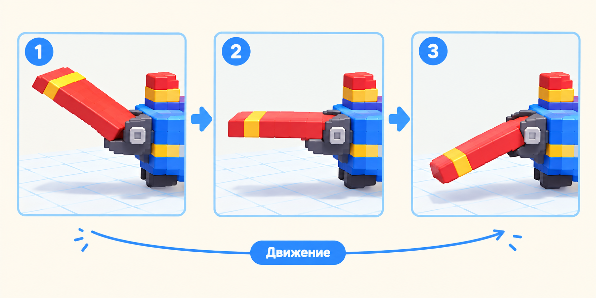

# 🖐 Практика урока 9 — «Оживи свою модель» (BlockBench)

> Возьми модель с прошлых уроков и **оживи** её: винт закрутится, крышка откроется, рука помашет! За работу — **+2 ⭐**. Анимация — новое и волшебное, не спешим.

*Секрет: ставим кадр «вверх» и кадр «вниз» — компьютер дорисует махание сам.*

> 🎥 Камера — **правая кнопка**. Главное сегодня: вкладка **Animate**, ключ **I**, **Loop**, **Play**.

---

## 🔧 Часть А. Проверь модель
1. Открой свою модель (самолёт / сундук / дракон / робот).
2. Выбери подвижную часть (винт / крышку / руку) → **E** и чуть поверни.
3. Деталь отлетает? Вернись в **Edit** и поправь **Pivot** (винт — центр, крышка — сзади).

## 🎬 Часть Б. Включи анимацию
1. Вверху нажми вкладку **Animate**.
2. **+ Create Animation** → назови `move`.
3. Включи **Loop** (цикл) — чтобы повторялось.

## 🔑 Часть В. Поставь кадры (винт для примера)
1. ⏱ **Кадр 0:** выбери папку винта (PROP) → поставь ключ (**I**). Это начало.
2. ⏩ **Кадр 10:** передвинь ползунок на 10 → поверни винт (**E**) наполовину.
3. ⏪ **Кадр 20:** передвинь на 20 → доверни до полного круга (или верни как кадр 0).
4. ▶️ Нажми **Play** — винт крутится сам! 🎉

> 🔁 **Плавная петля:** сделай последний кадр **как первый** — тогда анимация повторяется без рывка.

## 🧰🐉🤖 Что ещё оживить
- **Крышка сундука:** кадр 0 закрыта → кадр 10 открыта (E) → кадр 20 закрыта.
- **Пасть дракона:** закрыта → открыта → закрыта.
- **Рука робота:** вниз → вверх → вниз (машет).

## 💾 Часть Г. Сохраняем
**File → Save**. По желанию — **Export → GIF**, чтобы показать дома!

## ⌨️ Часть Д. Тренажёр печати (в конце урока)
Открой ⌨️ [тренажёр.html](тренажёр.html): три режима, уровень 9. За участие — **+1 ⭐**.

## 🎯 А попробуй (кто быстро справился)
- Добавь **вторую анимацию** (например, крылья качаются, пока винт крутится).
- Сделай движение **быстрее или медленнее** (меняй кадры местами по времени).
- Оживи сразу **две детали** модели.
- **Export GIF** и покажи соседу.
- Помоги соседу поставить ключевой кадр (+1 ⭐ 🤝).

## ✅ Готово, если
- [ ] Включил режим Animate, создал анимацию с Loop.
- [ ] Поставил ключевые кадры и на Play деталь двигается.
- [ ] Сделал плавную петлю; сохранил проект.
