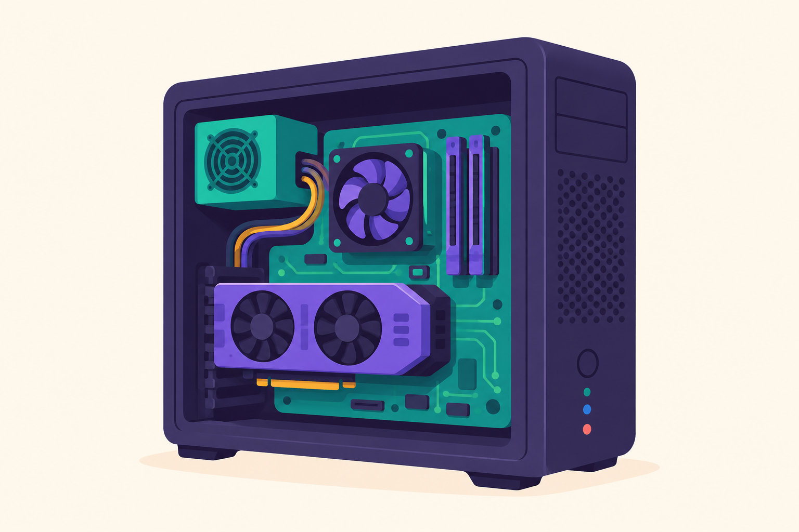

# Урок 1 — Компьютер с нуля: устройство, безопасность и работа в системе

**Модуль 1 «Цифровой старт» | Большой вводный урок из трёх блоков (≈8 ак.ч.)**

> ⏱ **Формат.** Это единый вводный урок-«фундамент» из трёх блоков. Проходим по мере сил, разбивая на встречи:
> - 🅰️ **Блок A — Устройство компьютера** (железо, характеристики своего ПК);
> - 🅱️ **Блок B — Интернет и безопасность** (как работает сеть, пароли, мошенники);
> - 🗂️ **Блок C — Работа в системе** (ОС, файлы и папки, горячие клавиши).
>
> **Как делить на встречи:** формат **4 ак.ч.** — за 2 встречи (1-я: A+B, 2-я: C + большая викторина); формат **2 ак.ч.** — за 3–4 встречи, по блоку за раз, викторина в конце.
>
> 🔁 В начале каждой встречи — [разминка/повтор](повторение.md) (5 мин).
> 👨‍🏫 Учителю: сценарий с хронометражом на оба формата — в [преподавателю.md](преподавателю.md).
> 🖼 Все картинки и где их взять — в [изображения.md](изображения.md).

---

## 🎯 Цель урока

К концу урока каждый ученик:

**🅰️ Про устройство компьютера:**
- Понимает, **из каких главных частей состоит компьютер** и за что каждая отвечает;
- Может объяснить **«путь данных»** — что происходит внутри, когда ты нажимаешь клавишу или запускаешь игру;
- **Прямо на своём компьютере** узнаёт его характеристики через Диспетчер задач;
- *(для 9–11 кл.)* понимает, что такое **бит, байт, ГГц, ядра**, и умеет читать характеристики ПК как «меню в магазине».

**🅱️ Про безопасность в интернете:**
- Понимает **в общих чертах, как работает интернет** и как умно искать информацию;
- Умеет придумать **надёжный пароль** и знает, какие данные **нельзя** выкладывать в сеть;
- **Распознаёт мошенников и фишинг** — «разводы» в письмах, играх и мессенджерах;
- *(для 9–11 кл.)* знает про **двухфакторную защиту, https, цифровой след и дипфейки**.

**🗂️ Про работу в системе:**
- Понимает, что такое **операционная система** и зачем она нужна;
- Умеет **наводить порядок в файлах и папках**, понимает расширения (.jpg, .mp3, .docx);
- Знает **горячие клавиши** и работает быстрее «мышки»;
- *(для 9–11 кл.)* умеет искать файлы с фильтрами, показывать расширения, работать с архивами.

> 💬 **Главная мысль урока:** компьютер — не магия, а команда «работников». Интернет — огромный город, где здорово, но нужны правила. А операционная система и файлы — это твой рабочий стол, на котором важно навести порядок. Разберёмся со всем этим — и ты будешь чувствовать себя за компьютером как профи.

---

# 🅰️ БЛОК A — Устройство компьютера: «Что внутри коробки?»

## Часть 1 — Компьютер как команда работников (15 минут)

Представь **офис** или **кухню ресторана**. Там много людей, и каждый делает своё:
кто-то думает и раздаёт задания, кто-то держит бумаги под рукой, кто-то бегает на склад, кто-то рисует афиши.

Внутри компьютера — **то же самое**. Только «работники» — это железки. Вот наша команда:

| «Работник» | Железка | Что делает | Аналогия |
|-----------|---------|-----------|----------|
| 🧠 **Директор** | Процессор (CPU) | думает, считает, командует | мозг / шеф-повар |
| 🖐 **Рабочий стол** | Оперативная память (RAM) | держит под рукой то, с чем работаем **прямо сейчас** | стол, на который выложили нужные вещи |
| 📦 **Склад** | Накопитель (SSD / HDD) | хранит всё **навсегда**: игры, фото, программы | шкаф / кладовка |
| 🎨 **Художник** | Видеокарта (GPU) | рисует картинку, тянет игры и графику | иллюстратор в команде |
| 🕸 **Нервная система** | Материнская плата | соединяет всех, передаёт сигналы | дороги между кабинетами |
| ❤️ **Сердце** | Блок питания (БП) | даёт электричество всем | розетка + сердце |
| 🌬 **Кондиционер** | Кулеры и радиаторы | охлаждают, чтобы не перегрелось | вентилятор в жаркой кухне |
| 🏠 **Здание** | Корпус | держит всё вместе и защищает | стены офиса |

*Заглянем внутрь системного блока. Найди на картинке каждого «работника» из таблицы. ([источник в изображения.md](изображения.md))*

> 🎮 **Интерактив «Кто за это отвечает?» (2 мин).** Учитель называет ситуацию — класс хором отвечает, какой «работник» главный:
> - «Игра тормозит и мылит картинку» → 🎨 видеокарта
> - «Открыл 40 вкладок — всё зависло» → 🖐 оперативная память
> - «Не хватает места для фото» → 📦 накопитель
> - «Долго считает / архивирует» → 🧠 процессор

---

## Часть 2 — Знакомимся с каждым «работником» подробно (25 минут)

### 🧠 Процессор (CPU) — «мозг»

Главная думающая деталь. Всё, что происходит, проходит через него: посчитать, сравнить, принять решение — миллиарды раз в секунду.

- **Ядра** — это как несколько поваров на одной кухне. 1 ядро = 1 повар. 8 ядер = 8 поваров, работают параллельно → успевают больше.
- **Частота (ГГц)** — насколько быстро «думает» каждый повар. 3 ГГц = **3 миллиарда** операций в секунду. 🤯

> 💡 **Фишка для запоминания:** ядра — это *сколько* поваров, частота — *как быстро* каждый работает. Хороший процессор — это когда и поваров много, и каждый шустрый.

### 🖐 Оперативная память (RAM) — «рабочий стол»

Сюда компьютер выкладывает то, с чем работает **прямо сейчас**: открытую игру, вкладки браузера, документ.

- Чем больше стол (больше ГБ RAM) — тем больше дел одновременно без тормозов.
- ⚠️ **Важно:** когда выключаешь компьютер, стол **сметается начисто**. Всё, что не сохранил на «склад», — пропадает! Вот почему говорят «сохраняйся почаще».

> 🎮 **Мини-опыт (устно):** «Почему несохранённый документ пропадает при выключении света?» → потому что он был только на *рабочем столе* (RAM), а не на *складе* (накопителе).

### 📦 Накопитель (SSD / HDD) — «склад»

Здесь всё хранится **навсегда** (пока сам не удалишь): операционная система, игры, музыка, фото.

| | HDD (жёсткий диск) | SSD (твердотельный) |
|--|--------------------|---------------------|
| Как устроен | крутящийся блин + головка (как виниловая пластинка) | микросхемы памяти, без движущихся частей |
| Скорость | медленнее | **очень быстро** |
| Цена за ГБ | дешевле | дороже |
| Шум/тряска | шуршит, боится ударов | тихий, надёжнее |

> 💡 **Фишка:** если компьютер долго включается — скорее всего, там старый HDD. Замена на SSD «оживляет» даже старый ПК сильнее, чем любая другая деталь.

### 🎨 Видеокарта (GPU) — «художник»

Отвечает за всё, что ты **видишь**: рабочий стол, видео, а особенно — **игры и 3D-графику**. У неё внутри свой мини-процессор и своя память.

- Слабая встроенная графика — потянет ютуб и учёбу.
- Мощная отдельная видеокарта — тянет тяжёлые игры, монтаж видео, 3D, нейросети.

### 🕸 Материнская плата, ❤️ блок питания, 🌬 охлаждение

- **Материнская плата** — большая плата, куда **втыкается всё остальное**. Это «дороги», по которым бегают сигналы между деталями.
- **Блок питания** — превращает ток из розетки в «правильное» питание для деталей. Слабый БП = компьютер выключается под нагрузкой.
- **Охлаждение** — детали греются. Кулеры (вентиляторы) и радиаторы сбрасывают тепло. Перегрев → компьютер тормозит специально, чтобы не сгореть.

> 💡 **Фишка:** если ноутбук вдруг сильно шумит и тормозит в игре — скорее всего, забились пылью вентиляторы и он перегревается.

---

## Часть 3 — Ввод и вывод: как мы «говорим» с компьютером (10 минут)

Компьютер сам по себе — в коробке. Чтобы с ним общаться, нужны **устройства ввода** (мы → компьютеру) и **вывода** (компьютер → нам).

| Ввод (мы говорим ПК) ⌨️ | Вывод (ПК отвечает нам) 🖥 |
|--------------------------|----------------------------|
| Клавиатура, мышь | Монитор |
| Микрофон, камера | Колонки, наушники |
| Сканер, геймпад | Принтер |
| Сенсорный экран | Сенсорный экран |

> 🎮 **Игра «Ввод или вывод?» (3 мин).** Учитель показывает/называет устройство — дети показывают: рука **вверх** = вывод, **вниз** = ввод. Хитрые случаи: сенсорный экран (**и то, и другое!**), наушники с микрофоном (**оба!**), МФУ.

### 🚀 Путешествие данных: что происходит, когда ты нажимаешь клавишу «А»

Разберём по шагам — это «оживляет» весь урок:

1. Ты **нажал «А»** на клавиатуре → это **ввод**.
2. Сигнал по «дорогам» **материнской платы** летит к **процессору** 🧠.
3. Процессор понимает: «нужна буква А» — и кладёт её на **рабочий стол (RAM)** 🖐.
4. **Видеокарта** 🎨 рисует букву «А» как картинку из точек.
5. Картинка уходит на **монитор** 🖥 — это **вывод**. Ты видишь «А».

**И всё это — за тысячные доли секунды!** ⚡ Каждый раз, когда ты печатаешь, вся команда срабатывает мгновенно.

> 🎬 **Интерактив (по желанию):** разыграйте это **живьём**. Раздайте роли (5 учеников: Клавиатура, Материнка, Процессор, Память, Видеокарта, Монитор) и «передайте букву» по цепочке. Смешно и запоминается навсегда.

---

## Часть 4 — 🔬 ПРАКТИКА: узнаём характеристики СВОЕГО компьютера (15 минут)

Хватит теории — заглянем внутрь **своего** компьютера прямо сейчас! Никакой отвёртки не нужно.

### Способ 1 — Диспетчер задач (видно всё в реальном времени)

1. Нажми одновременно **`Ctrl` + `Shift` + `Esc`** — откроется **Диспетчер задач**.
2. Перейди на вкладку **«Производительность»** (Performance).
3. Слева — все наши «работники»! Кликай по очереди:
   - **ЦП (CPU)** — модель процессора, сколько ядер, текущая загрузка;
   - **Память (Memory)** — сколько всего ГБ RAM и сколько занято сейчас;
   - **Диск** — твой накопитель (тип SSD/HDD и загрузка);
   - **Графический процессор (GPU)** — твоя видеокарта.

> 🎮 **Опыт вживую:** пока смотришь на график ЦП — открой пару вкладок или запусти программу. Увидишь, как **загрузка скачет вверх**! Компьютер реально «думает» у тебя на глазах.

### Способ 2 — Свойства системы (краткая «визитка» ПК)

- Нажми **`Win` + `Pause/Break`**, ИЛИ: правой кнопкой по **«Этот компьютер»** → **«Свойства»**.
- Увидишь процессор и объём оперативной памяти одной строкой.

> 📝 **Задание на месте:** запиши характеристики своего ПК — они понадобятся для «Паспорта компьютера» в [практике](практика.md).

---

## 🎓 Часть 5 — Углублённо для 9–11 классов (10–15 минут)

> Эту часть даём **старшим группам**. Младшим (5–7 кл.) вместо неё — больше игр и онлайн-конструктор ПК из [практики](практика.md).

### Всё внутри — это нули и единицы (биты и байты)

Компьютер не знает букв и картинок. Он знает только два состояния: **есть ток / нет тока** → **1 / 0**. Это **бит**.

- **8 бит = 1 байт.** Одним байтом можно закодировать один символ, например букву «А».
- Дальше — привычная лесенка: **1024 байта = 1 КБ → 1024 КБ = 1 МБ → 1024 МБ = 1 ГБ → 1024 ГБ = 1 ТБ.**

> 🎮 **Интерактив «Двоичные пальцы»:** на одной руке 5 пальцев = 5 бит. Пальцы — это степени двойки: 1, 2, 4, 8, 16. Подними нужные — сложи их — и покажешь числа **от 0 до 31 на одной руке!** (Например, число 21 = 16+4+1 → подняты большой, средний и мизинец... проверьте сами.) Кто быстрее покажет «13»?

### Как читать характеристики ПК как меню в магазине

Возьмём реальную строчку из магазина и «переведём»:

> *«Intel Core i5-12400F, 6 ядер, 2.5–4.4 ГГц / 16 ГБ DDR4 / SSD 512 ГБ / RTX 4060 8 ГБ»*

| Что написано | Перевод на человеческий |
|--------------|--------------------------|
| Core i5, 6 ядер | средний процессор, 6 «поваров» |
| 2.5–4.4 ГГц | обычно думает на 2.5, в игре разгоняется до 4.4 |
| 16 ГБ DDR4 | большой «рабочий стол» — хватит на много задач |
| SSD 512 ГБ | быстрый склад на 512 ГБ (≈ несколько игр + всё нужное) |
| RTX 4060 8 ГБ | хорошая игровая видеокарта |

### Разрядность 32 vs 64 бит (коротко)

64-битная система умеет использовать **много** оперативной памяти (гигабайты), 32-битная — упирается в ~4 ГБ. Сегодня почти везде 64 бита — вот почему память измеряют в ГБ.

> 💡 **Дискуссия для старших:** «На что потратить деньги, если ПК тормозит: добавить RAM, поставить SSD или сменить видеокарту?» — **ответ зависит от задачи** (учёба/игры/монтаж). Это отличный мостик к практике «Собери ПК мечты».

---

# 🅱️ БЛОК B — Интернет и безопасность в сети

> 📌 В формате 2 ак.ч. это **вторая встреча**. Начни с быстрого повтора Блока A (1–2 вопроса), а затем переходи сюда.
> Компьютер мы уже изучили. Теперь он выходит в **интернет** — огромный мир, где здорово, но нужно знать правила, как в большом городе.

## Часть 6 — Как работает интернет (аналогия «почта») (10 минут)

**Интернет** — это миллионы компьютеров по всему миру, соединённых вместе. Сайты (ВКонтакте, YouTube, игры) живут на **серверах** — мощных компьютерах, которые включены всегда.

Что происходит, когда ты открываешь сайт:

1. Ты вводишь **адрес сайта (URL)**, например `youtube.com` — это как **адрес дома** на конверте.
2. Твой запрос летит через провайдера к нужному **серверу**.
3. Сервер **присылает страницу обратно** — как ответное письмо.
4. Данные летят не целиком, а маленькими **«пакетами»**, которые собираются у тебя на экране.

| Интернет | Обычная почта |
|----------|---------------|
| Адрес сайта (URL) | адрес на конверте |
| Сервер | дом, куда идёт письмо |
| Пакеты данных | письмо, разрезанное на кусочки |
| Провайдер / Wi-Fi | почтальоны и дороги |

> 🎮 **Интерактив «Передай пакет» (3 мин).** Один ученик — «сервер» в углу класса. Другой — «браузер». «Браузер» пишет на бумажке запрос («хочу видео с котиками»), передаёт по цепочке одноклассников-«роутеров» к «серверу». «Сервер» рвёт лист-«ответ» на 3 части (пакеты) и отправляет обратно по цепочке — «браузер» складывает. Наглядно и весело.

> 💡 **Фишка:** адрес сайта — как домашний адрес. Всегда смотри, **к кому** ты пришёл: `sberbank.ru` и `sberbank-bonus.xyz` — это **разные** адреса, и второй может быть ловушкой.

---

## Часть 7 — Умный поиск: находим и проверяем (5 минут)

- Ищи **ключевыми словами**, а не целым предложением: не «почему небо голубое расскажи подробно», а **«почему небо голубое»**.
- **Не верь первому же результату.** Загляни в 2–3 источника — правда ли это?
- Реклама и «джинса» маскируются под ответы — учись отличать.

> 🎓 **Для 9–11 — операторы поиска:** `"точная фраза"` в кавычках, `site:ru.wikipedia.org` — искать на одном сайте, `космос -фильм` — минус убирает лишнее. Проверка фактов = минимум два независимых источника.

---

## Часть 8 — Цифровая безопасность: главные правила (25 минут)

### 🔑 Надёжный пароль

| ❌ Плохие пароли | ✅ Хорошие пароли |
|------------------|-------------------|
| `12345`, `qwerty` | длинные — **12+ символов** |
| дата рождения, имя | **фраза** из 3–4 несвязанных слов |
| `password` | + цифра и знак: `СинийТигрПрыгает7!` |
| один на все сайты | **разные** для важных сайтов |

> 💡 **Фишка:** длина важнее «сложности». Длинная фраза `корова-луна-велосипед` надёжнее короткого `P@s1`, а запомнить её проще. Придумай смешную фразу — её труднее взломать и легче помнить.

> 🎮 **Пароль-челлендж (3 мин):** каждый придумывает свою фразу-пароль из 3 несвязанных слов + число. Проверяем длину (должно быть 12+). **Вслух пароли не называем!** — только показываем длину.

### 🙈 Личные данные — что НЕЛЬЗЯ выкладывать

Домашний адрес, номер телефона, номер и адрес школы, геолокацию в реальном времени, фото документов, пароли и коды.

> **Золотое правило:** интернет — как большая площадь. **Не публикуй то, что не крикнул бы вслух незнакомцу на улице.**

### 🎣 Мошенники и фишинг

**Фишинг** — поддельные сообщения, чтобы выманить твои данные, деньги или аккаунт. Признаки развода:

- 🎁 «Вы **выиграли** приз/скины! Введите данные, чтобы получить»;
- 🚨 «Ваш аккаунт **заблокирован**, срочно войдите вот тут» (ссылка странная);
- ⏰ Торопят: «только сейчас», «осталось 2 минуты»;
- 🔗 Просят **пароль, код из SMS или данные карты**;
- 🕹 В играх: «подарю редкий скин — просто введи логин и пароль на этом сайте».

**Что делать:** не переходить по ссылке, ничего не вводить, проверить адрес сайта, **спросить взрослого**. Настоящие банки и игры **никогда** не просят пароль или код.

> 🎮 **Интерактив «Фишинг-детектив» (5 мин).** Учитель показывает сообщения по очереди — класс голосует: **развод 🚨 или нормально ✅**? Разбор — в [практике](практика.md) есть готовые карточки.

### 👤 Незнакомцы в сети

- Не встречайся с интернет-знакомыми в реальной жизни без взрослых.
- Если кто-то **пугает, шантажирует, просит секреты или фото** — это тревожный сигнал. **Сразу расскажи взрослому**, которому доверяешь. Это не «ябедничество» — это защита себя.

---

## Часть 9 — 🎓 Углублённо для 9–11 классов (10 минут)

> Младшим (5–7) вместо этого — ещё раунд «Фишинг-детектив» и пароль-челлендж.

- **Двухфакторная защита (2FA):** вход = пароль **+** одноразовый код из приложения/SMS. Даже если пароль украли — без второго кода не войдут. Включи её на почте и в соцсетях.
- **https и замочек 🔒:** замочек в адресной строке = соединение **зашифровано**. Если его нет (просто `http`) — **не вводи** пароли и карты. ⚠️ Но замочек ≠ «сайт честный»: у фишинга тоже бывает замочек. Смотри и на **адрес**.
- **Цифровой след:** всё, что попало в сеть, остаётся навсегда — скриншоты, кэш, репосты. Подумай **до** публикации: «захочу ли я, чтобы это увидели через 10 лет?».
- **Дипфейки и ИИ-подделки:** фото, видео и даже голос сегодня легко подделать нейросетью. **Не верь всему** на слово — проверяй источник, ищи оригинал.
- **Публичный Wi-Fi:** в открытых сетях (кафе, ТЦ) не вводи пароли и данные карт — их могут перехватить.

> 🤖 **ИИ-вставка (тема курса):** нейросети умеют создавать очень убедительные фейковые фото и тексты. Это делает критическое мышление **главным навыком**: всегда спрашивай «кто это сказал и можно ли проверить?». Мы вернёмся к ИИ во многих модулях курса.

---

# 🗂️ БЛОК C — Работа в системе: ОС, файлы и горячие клавиши

> 📌 В формате 2 ак.ч. это **третья встреча**. Начни с короткого повтора Блоков A и B.
> Мы знаем, из чего сделан компьютер и как безопасно ходить в интернет. Теперь научимся **уверенно работать внутри системы** — как настоящий пользователь.

## Часть 10 — Операционная система: кто главный на компьютере (8 минут)

**Операционная система (ОС)** — это самая главная программа, «начальник» компьютера. Она управляет всем железом и запускает остальные программы. Без ОС компьютер — просто куча деталей, которые не знают, что делать.

- **Аналогия:** ОС — как **администратор здания** или **дирижёр оркестра**. Ты просишь ОС («открой игру»), а она командует железом.
- Что мы видим на экране: **Рабочий стол**, кнопка **Пуск**, **Панель задач** внизу, **окна** программ.
- Бывают разные ОС: **Windows** (у нас в классе), **macOS** (на технике Apple), **Linux**, а на телефонах — **Android** и **iOS**.

> 🎮 **Интерактив «Кто здесь ОС?» (2 мин).** Учитель называет устройство — дети отвечают, какая ОС: айфон (iOS), телефон Samsung (Android), макбук (macOS), наш класс (Windows), игровая приставка (своя ОС). Вывод: ОС есть **везде**, даже в телевизоре и банкомате.

---

## Часть 11 — Файлы и папки: наводим порядок (15 минут)

**Файл** — это отдельный «предмет»: документ, картинка, песня, игра. **Папка** — коробка, куда мы складываем файлы. Папки вкладываются друг в друга — получается **«дерево»**.

**Аналогия:** шкаф 🗄 → полки → коробки → вещи. Чем лучше разложено, тем быстрее находишь.

### Расширение файла — «фамилия» после точки

| Расширение | Что за файл |
|-----------|-------------|
| `.jpg` `.png` | картинка 🖼 |
| `.mp3` | звук 🎵 |
| `.mp4` | видео 🎬 |
| `.docx` | документ Word 📄 |
| `.exe` | программа ⚙️ |

По расширению компьютер понимает, **какой программой** открыть файл.

- **Путь к файлу** — это его «адрес»: `C:\Users\Аня\Загрузки\кот.jpg` — как «город → улица → дом → квартира».
- **Называй файлы понятно:** `доклад_космос.docx`, а не `Новый документ (3)`. Через месяц скажешь себе спасибо.

> 💡 **Фишка:** не сваливай всё на Рабочий стол — заведи папки «Учёба», «Игры», «Фото». Рабочий стол — это не свалка, а витрина.

> 🎓 **Для 9–11:** включи показ расширений (Проводник → **Вид → Расширения имён файлов**), загляни в **скрытые файлы**, попробуй **поиск с фильтрами** (по типу/дате), и **архивы ZIP** — как сжать папку и распаковать.

> 🎮 **Квест «Найди файл»** — в [практике](практика.md): по подсказкам-«адресам» отыскать спрятанные файлы. Кто быстрее?

---

## Часть 12 — Горячие клавиши: скорость профи (12 минут)

Мышка — это медленно. Профи работают **клавишами**. Вот золотой набор, который экономит часы:

| Клавиши | Что делает |
|---------|-----------|
| `Ctrl + C` / `Ctrl + V` | копировать / вставить |
| `Ctrl + X` | вырезать |
| `Ctrl + Z` / `Ctrl + Y` | отменить / вернуть |
| `Ctrl + S` | сохранить (жми почаще!) |
| `Ctrl + A` | выделить всё |
| `Ctrl + F` | найти на странице |
| `Alt + Tab` | переключиться между окнами |
| `Win + D` | свернуть всё → рабочий стол |
| `Win + Shift + S` | скриншот выделенной области |
| `Ctrl + Shift + Esc` | Диспетчер задач |

> 💡 **Фишка:** `Ctrl + Z` — это **машина времени**. Ошибся, удалил, испортил — жми, и станет как было. Работает почти везде: в Word, Photoshop, папках.

> 🎮 **Гонка хоткеев** — в [практике](практика.md): учитель называет действие, кто первым нажал верное сочетание — балл команде.

---

## 🏁 Итог урока (5–7 минут)

Мы прошли три больших блока и получили настоящий фундамент:

**🅰️ Устройство компьютера:**
- ✅ Компьютер — **команда работников**: процессор думает 🧠, память держит под рукой 🖐, накопитель хранит 📦, видеокарта рисует 🎨.
- ✅ Есть **ввод и вывод**; **путь данных**: нажатие → процессор → память → видеокарта → монитор.

**🅱️ Интернет и безопасность:**
- ✅ Интернет работает как **почта**: запрос → сервер → ответ пакетами.
- ✅ **Надёжный пароль** — длинная фраза; **личные данные не публикуем**; умеем **распознавать фишинг**.

**🗂️ Работа в системе:**
- ✅ **ОС** — главный «начальник» компьютера; **файлы и папки** держим в порядке, понимаем расширения.
- ✅ Знаем **горячие клавиши** и работаем быстро, а `Ctrl+Z` спасает от ошибок.

> 🎤 **Блиц «по цепочке»:** каждый называет **одно** из трёх — деталь ПК, правило безопасности **или** горячую клавишу. Повторяться нельзя!

### 🎮 Викторина-закрепление «Компьютер с нуля»

Открой файл **[викторина.html](викторина.html)** (двойной клик — откроется в браузере, интернет не нужен). Вопросы по **всем трём блокам** — железо, безопасность и работа в системе, — а ещё **смешные вопросы и вопросы «на подумать»**, чтобы было весело.

**Как играть в классе:**
- 🖥 **На проекторе всем классом** — читаем вопрос, класс кричит номер ответа, кликаем. Считаем очки.
- 👥 **Командами** — делимся на 2–3 команды, за правильный ответ балл, кто больше.
- 💻 **Каждый за своим ПК** — проходят сами, сравнивают результат.

> 💡 Отвечать можно клавишами `1`–`4`, переход — `Enter`. Внизу каждого вопроса — короткое объяснение, так викторина ещё и учит.

➡️ **Домашняя/самостоятельная работа** — «Паспорт компьютера», «Собери ПК мечты», «Фишинг-детектив», пароль-крепость, «Наведи порядок в папках» и гонка хоткеев: открывай [практику](практика.md).
🧰 **Полезные трюки урока** (характеристики ПК + проверка ссылки на развод + быстрый скриншот) — в [лайфхак.md](лайфхак.md).

---

## 🔗 Материалы и ссылки к уроку

**🅰️ Устройство ПК — показать / поиграть:**
- 🎮 **Сборка ПК (симулятор):** бесплатный онлайн-конструктор [PCPartPicker](https://pcpartpicker.com/list/) (собрать сборку в браузере, цены реальные) или [PC Building Simulator](https://store.steampowered.com/app/621060/).
- 🎬 **Видео «Как устроен компьютер»** (рус.): поиск на YouTube — *«Как устроен компьютер за 10 минут»*.
- 🖼 **Свободные фото железа:** [Wikimedia — Computer hardware](https://commons.wikimedia.org/wiki/Category:Computer_hardware).

**🅱️ Интернет и безопасность — показать / изучить:**
- 🕵️ **Тренажёр «Распознай фишинг»** (Google, с примерами писем): [phishingquiz.withgoogle.com](https://phishingquiz.withgoogle.com/).
- 🔐 **Проверка надёжности пароля** (наглядно, как быстро взломают): [security.org/how-secure-is-my-password](https://www.security.org/how-secure-is-my-password/).
- 📚 **Правила безопасности детям** (рус.): материалы проекта **«Урок цифры»** [урокцифры.рф](https://урокцифры.рф) и **Лаборатории Касперского** «Основы кибербезопасности».
- 🎬 **Видео о безопасности в сети** (рус.): поиск на YouTube — *«Безопасность в интернете для детей»*.

**🗂️ Работа в системе — потренироваться:**
- ⌨️ **Тренажёр слепой печати и клавиш** (рус.): [nabiraem.ru](https://www.nabiraem.ru/) или [«Клавогонки»](https://klavogonki.ru/) — соревнование на скорость печати, отлично заходит детям.
- 🖼 **Шпаргалка горячих клавиш Windows** — раздать/повесить: список из Части 12 (можно распечатать как памятку).
- 📁 Заготовить заранее папку-«свалку» с разными файлами для практики (см. [преподавателю.md](преподавателю.md)).

**Скачать / установить заранее не нужно** — урок работает на любом Windows-ПК. Для практики и тренажёров достаточно браузера с интернетом.
