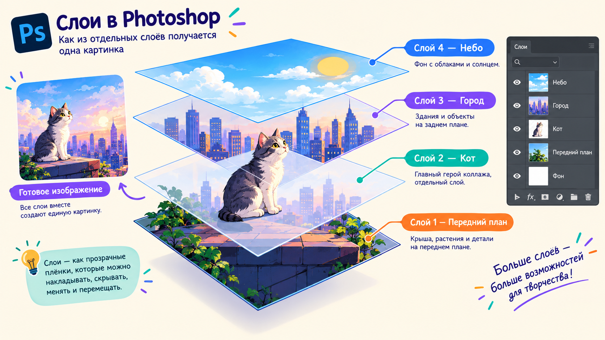
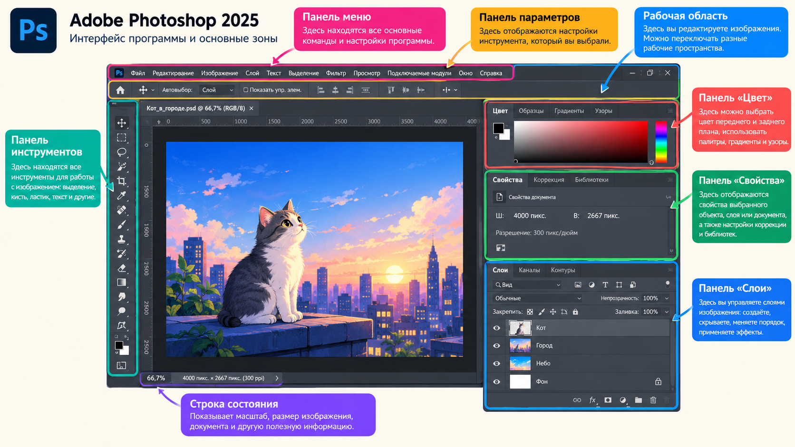
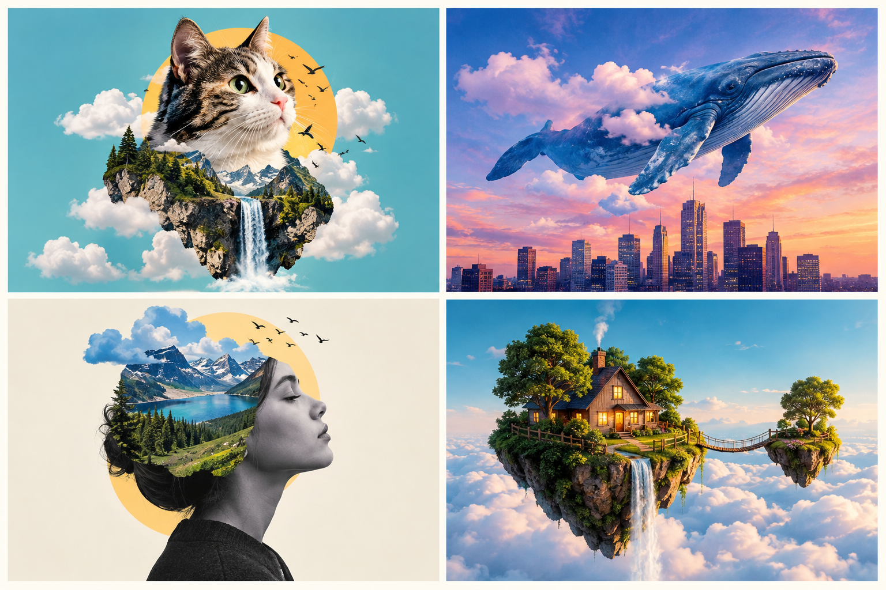

# Урок 1 — Интерфейс, слои и первый коллаж «Гигантский кот в городе»

**Модуль 2 · Фотомагия в Photoshop · Урок 1 из 12 | 2 ак.ч. (1,5 часа)**

> 🔁 В начале — [разминка](повторение.md) (5 мин).
> 👨‍🏫 Сценарий с хронометражом — в [преподавателю.md](преподавателю.md).
> 🖼 Референсы, исходники и картинки — в [изображения.md](изображения.md).
> 📥 **Скачать исходники до урока** — ссылки в конце («Материалы»).

> 🧭 **Как читать этот урок.** Мы идём **одним сквозным примером** — собираем коллаж **«Гигантский кот в городе»**. Каждый шаг расписан: что нажать, что при этом появится на экране и какой должен быть результат. Ты повторяешь на своём примере (кот, акула, кит — что выбрал).

---

## 🎯 Цель урока

К концу урока каждый ученик:
- Понимает **главную тайну Photoshop — слои** (и почему без них никак);
- Ориентируется в интерфейсе: инструменты, холст, панель слоёв, параметры;
- Умеет **добавлять картинки, двигать, масштабировать и вращать** (Free Transform);
- Собирает свой **сюрреалистичный коллаж** по референсу;
- **Правильно сохраняет** работу: рабочий `.psd` (со слоями) и готовый `.png`/`.jpg`.

> 💬 **Главная мысль:** Photoshop — это не «кнопка сделать красиво». Это **стопка прозрачных плёнок (слоёв)**, которые ты складываешь в одну картинку. Понял слои — понял Photoshop.

---

## Часть 1 — Главная тайна Photoshop: СЛОИ (12 минут)

### Что вообще такое Photoshop

Photoshop работает с **растровыми картинками** — то есть с фотографиями, которые состоят из миллионов крошечных цветных точек-**пикселей**. Если сильно приблизить любое фото, ты увидишь эти квадратики. Photoshop умеет переставлять, красить и склеивать пиксели так, что из нескольких фото получается одно новое изображение. Именно так делают афиши фильмов, обложки, мемы и рекламу.

### Слои — стопка прозрачных плёнок

Представь **стопку прозрачных плёнок** (или стёкол), лежащих друг на друге. На каждой нарисовано что-то своё. Смотришь сверху — видишь **единую картинку**.

Разберём на нашем примере — коллаж «Гигантский кот в городе». Он состоит из **трёх плёнок-слоёв**:

| Слой (плёнка) | Что на нём нарисовано | Где в стопке |
|---------------|------------------------|--------------|
| 🐱 **Кот** | вырезанный кот, вокруг — прозрачность | **сверху** |
| 🌑 **Тень** | мягкое тёмное пятно под котом | посередине |
| 🏙 **Город** | фотография улицы (фон) | **снизу** |

Смотрим на стопку сверху — и видим кота, который стоит на улице и отбрасывает тень. Хотя на самом деле это **три отдельные картинки**, лежащие друг на друге.

*Три слоя коллажа как прозрачные плёнки. Верхний (кот) перекрывает нижний (город). ([источник в изображения.md](изображения.md))*

### Почему слои — это супер-сила (с примерами)

- **Каждый слой двигается отдельно.** Двигаешь кота — город стоит на месте. Как будто передвинул верхнюю плёнку, не трогая нижние.
- **Порядок решает, что впереди.** Если слой «Город» поставить **выше** кота — кот **спрячется** за домами. Поменял местами плёнки — изменилась сцена.
- **Прозрачность (Непрозрачность).** Уменьшил непрозрачность слоя «Кот» до 50% — кот станет **полупрозрачным, как призрак**, сквозь него будет видно город.
- **Ничего не теряется.** Слой можно **спрятать** (глазик 👁), а потом вернуть; удалить и отменить удаление. Работаешь смело — всё обратимо.

> 🎮 **Живой интерактив «Слои руками» (3 мин).** Возьми 3 прозрачные плёнки (или кальки): на первой нарисовано небо, на второй — дом, на третьей — человечек. Складывай их по-разному:
> - человечек сверху → «стоит перед домом»;
> - дом сверху → «человечек за домом, выглядывает».
> Класс видит вживую: **порядок плёнок = порядок слоёв**. Это ровно то, что делает Photoshop, только с фотографиями.

### Анатомия панели «Слои» (запомни — это твоё главное окно)

Панель со слоями обычно **справа снизу**. Разберём её по деталям на нашем примере:

| Элемент | Как выглядит | Что делает |
|---------|--------------|-----------|
| 👁 **Глазик** | глаз слева от слоя | вкл/выкл видимость слоя. Спрятал кота — остался только город |
| 🖼 **Миниатюра** | маленькая картинка слоя | показывает, что на слое (шахматка = прозрачность) |
| 🔤 **Имя слоя** | текст «Слой 1» | двойной клик → переименовать. Называй «кот», «город», «тень» |
| 🔵 **Подсветка** | синяя подсветка строки | это **активный** слой — все действия идут по нему! |
| **Непрозрачность** | поле «Непрозрачность 100%» сверху панели | делает слой прозрачнее |
| 🔒 **Замок** | замочек на слое «Фон» | заблокированный слой (обычно исходное фото). Двойной клик снимает замок |
| ➕ / 🗑 | значки внизу панели | создать новый слой / удалить слой |

> ⚠️ **Запомни намертво:** всё, что ты делаешь (двигаешь, красишь, стираешь), происходит **на активном (подсвеченном) слое**. 90% ошибок новичков — «я работаю не на том слое». Прежде чем что-то делать — **посмотри, какой слой подсвечен синим**.

---

## Часть 2 — Экскурсия по интерфейсу (10 минут)

Не будем учить все 70 инструментов. Разберём **4 зоны экрана** и то, что реально нужно сегодня.

*Четыре зоны: инструменты слева, параметры сверху, холст в центре, слои справа. ([источник в изображения.md](изображения.md))*

### 🧰 Зона 1 — Панель инструментов (слева)

Узкая полоска с иконками. Вот те, что понадобятся в первых уроках (в скобках — горячая клавиша):

| Иконка | Инструмент | Зачем |
|--------|-----------|-------|
| ➕ стрелка | **Перемещение** (`V`) | двигать слои по холсту — наш главный инструмент сегодня |
| ⬚ пунктир | **Прямоугольное выделение** (`M`) | выделить кусок |
| 🪄 | **Быстрое выделение / Выделение объекта** (`W`) | обвести объект, чтобы вырезать |
| ✂️ рамка | **Рамка/Кадрирование** (`C`) | обрезать картинку |
| 🖌 | **Кисть** (`B`) | рисовать (сегодня — тень) |
| 🩹 | **Восстанавливающая кисть** (`J`) | ретушь (позже) |
| 🔤 | **Текст** (`T`) | подписи (позже) |
| ✋ | **Рука** (`H` или зажать `Пробел`) | двигать холст, когда приблизил |
| 🔍 | **Масштаб** (`Z`) | приближать/отдалять |

> 💡 **Фишка про маленький треугольник.** У некоторых иконок в углу — **маленький треугольник ◣**. Это значит, что там **спрятана группа инструментов**. Нажми и подержи иконку — выпадет список. Например, под «Быстрым выделением» прячется «Выделение объекта» и «Волшебная палочка».

### ⚙️ Зона 2 — Панель параметров (сверху)

Длинная полоса под меню. Она **меняется в зависимости от выбранного инструмента**.
- Выбрал **Кисть** — сверху появятся размер кисти, жёсткость, непрозрачность.
- Выбрал **Перемещение** — появятся галочки «Автовыбор» и кнопки выравнивания.

> Пример: возьми Кисть (`B`) — увидь наверху «Размер: 30 пикс». Возьми Перемещение (`V`) — эти настройки исчезнут, появятся другие. Панель параметров всегда «про текущий инструмент».

### 🖼 Зона 3 — Холст (центр)

Сама картинка. Тут собираем коллаж. Управление обзором:

| Действие | Как |
|----------|-----|
| Приблизить | `Ctrl` + `+` |
| Отдалить | `Ctrl` + `−` |
| Показать всю картинку целиком | `Ctrl` + `0` (ноль) |
| 100% (реальный размер) | `Ctrl` + `1` |
| Подвигать холст (когда приближено) | зажми **`Пробел`** и тащи мышкой |

> 💡 Приближение **не меняет** саму картинку — это как поднести лупу. Меняются только пиксели при редактировании, а не масштаб просмотра.

### 📚 Зона 4 — Панель слоёв (справа снизу)

Наши «плёнки». Мы разобрали её выше — это **самое важное окно**.

> 💡 **Если что-то пропало или всё «съехало»:** панель слоёв вернёт `F7` (или **Окно → Слои**). А если интерфейс совсем перекосило — **Окно → Рабочая среда → Основная рабочая среда**, затем **Окно → Рабочая среда → Сбросить «Основная рабочая среда»**. Станет как «с завода».

### ⌨️ Золотые клавиши урока (запиши на доску)

`V` — Перемещение · `Ctrl+T` — Трансформация · `Ctrl+Z` — Отмена · `Ctrl+J` — Дубликат слоя · `Ctrl+S` — Сохранить · `Пробел` — подвигать холст.

---

## Часть 3 — Выбираем идею коллажа (5 минут)

Мы соединим **фон + один-два объекта** в **нереальную, но смешную или красивую** сцену. Секрет вау-эффекта — **несоответствие**: объект не там или не того размера, где мы привыкли его видеть.

Выбери идею по референсу (или придумай свою):

| Идея | Фон | Объект | В чём «фишка» |
|------|-----|--------|---------------|
| 🐱 **Гигантский котёнок в городе** ← *наш пример* | улица с домами | кот | кот размером с дом |
| 🦈 **Акула в городской луже** | двор после дождя / лужа | акула | плавник торчит из лужи |
| 🐋 **Кит плывёт по небу** | город снизу, небо сверху | кит | кит парит вместо облака |
| 🚀 **Ракета с балкона** | двор / балкон | ракета + дым | запуск во дворе |

*Разбери с классом: где здесь фон, где объект, за счёт чего сцена «нереальна». Придумай свою в таком духе. ([источник в изображения.md](изображения.md))*

> 🎯 **Разбор референса (важно!).** Прежде чем открыть Photoshop, посмотри на пример и **проговори вслух**: «Тут фон — улица. Объект — кот, он огромный. Тень падает влево, значит солнце справа». Такой разбор учит **видеть коллаж как слои** ещё до работы.

---

## Часть 4 — Собираем коллаж пошагово (25 минут)

Дальше — наш сквозной пример. Повторяй с любым своим объектом.

### Шаг 1. Открываем фон

**Файл → Открыть** → выбери фон (у нас — фото улицы `город.jpg`).

**Что произойдёт:** картинка откроется на холсте, а в панели слоёв появится **один слой с замочком 🔒 и именем «Фон»**. Замок означает «это исходное фото, оно защищено от случайных изменений».

> 💡 Хочешь чистый холст нужного размера? **Файл → Создать** → задай, например, **Ширина 1920, Высота 1080 пикс** (стандарт для экрана), Разрешение 72. Это как взять чистый лист бумаги.

**Ожидаемый результат:** на экране улица, в слоях — «Фон».

### Шаг 2. Добавляем объект (кота) новым слоем

**Файл → Поместить встроенные…** → выбери картинку кота (`кот.png`).

**Что произойдёт:** кот появится **поверх** фона **новым слоем**, уже внутри **рамки трансформации** (прямоугольник с квадратиками-маркерами по углам). Программа сразу предлагает подогнать размер.

> 🧩 **Для 5–7 классов:** бери кота в формате **PNG с прозрачным фоном** — вокруг него сразу «пусто» (шахматка), вырезать не надо. Ссылки — в «Материалах».
> 🎓 **Для 9–11 классов:** можешь взять обычное фото кота на фоне и **вырезать его сам** — смотри блок «Вырезаем объект» ниже.

**Ожидаемый результат:** в слоях теперь два слоя — «Фон» снизу, «кот» сверху.

### Шаг 3. Размер, поворот, место — Free Transform (`Ctrl+T`)

Если рамка уже есть (после «Поместить») — работаем в ней. Если пропала — нажми **`Ctrl+T`**, рамка вернётся.

- **Размер:** тяни за **угловой** маркер. В новых версиях пропорции сохраняются сами (кот не «расплющится»). Если вдруг плющится — держи `Shift`.
- **Поворот:** отведи мышку чуть **за угол наружу** — курсор станет дугой ↻, тяни — кот повернётся.
- **Позиция:** схвати **внутри** рамки и перетащи кота на место (на уровень улицы).
- **Применить:** нажми **`Enter`**. Отменить трансформацию — **`Esc`**.

**Наш пример с цифрами:** увеличь кота так, чтобы он был **высотой примерно в 2–3 этажа дома**. Поставь его лапами на тротуар. Именно огромный размер создаёт эффект «Годзилла-кот».

> ⚠️ **Частая ошибка:** забыл нажать `Enter` — рамка «висит», и ничего больше не работает. Всегда **завершай трансформацию `Enter`**.

> 💡 **Фишка масштаба:** маленькие детали фона (машины, люди, окна) рядом с гигантским котом — это и есть «линейка», по которой зритель понимает: кот НЕВЕРОЯТНО большой. Чем мельче фон рядом — тем больше кажется объект.

### Шаг 4. Порядок слоёв — кто впереди

Сейчас кот **перед** всеми домами. Хочешь, чтобы он выглядывал **из-за** здания?

В **панели слоёв** просто **перетащи** слой мышкой вверх или вниз. Кто выше в списке — тот впереди на картинке.

> 🎮 **Мини-эксперимент (30 сек):** перетащи слой «кот» **под** слой «Фон». Кот исчез! (Он спрятался за фоном.) Верни обратно наверх (`Ctrl+Z` или перетащи). Теперь ты **прочувствовал**, что такое порядок слоёв.

### Шаг 5. Делаем стаю — дубликат слоя (`Ctrl+J`)

Хочешь **двух котов** или стаю птиц в небе? Выдели слой «кот» → нажми **`Ctrl+J`** (создастся копия «кот копия») → `Ctrl+T` → уменьши и сдвинь копию подальше, будто второй кот вдали.

> 💡 Объекты **вдали** делай **меньше и выше** на картинке — так работает перспектива, сцена выглядит глубокой.

**Ожидаемый результат к концу Части 4:** гигантский кот стоит на улице, по желанию — второй котёнок вдалеке. Пока выглядит немного «наклеенным» — сейчас исправим.

---

## Часть 5 — Магия реализма: тень (12 минут)

Почему коллаж выглядит «наклеенным стикером»? Потому что у объекта **нет тени**, а в реальном мире тень есть у всего. Добавим её — и кот «встанет» на асфальт.

### Сначала — определи, откуда свет

Посмотри на фон: куда падают тени от машин, столбов, людей? 
- Если тени на фоне падают **влево** — значит солнце **справа**, и тень кота тоже должна лечь **влево**.
- Это самое важное правило: **все тени в сцене смотрят в одну сторону.**

> Пример «плохо/хорошо»: если тени домов идут вправо, а ты положил тень кота влево — мозг зрителя сразу почувствует подвох, коллаж будет выглядеть фальшиво. Согласовал направление — стало правдоподобно.

### Рисуем тень по шагам

1. Встань на слой «кот», создай **новый слой** (значок ➕ внизу панели) и **перетащи его ПОД слой «кот»** (тень должна быть за котом, но над городом). Переименуй в «тень».
2. Возьми **Кисть** (`B`). В панели параметров сверху поставь: **Жёсткость 0%** (мягкие края), **Размер** побольше (например, 150–250 пикс — регулируется клавишами `[` меньше и `]` больше), **Цвет — чёрный**.
3. Проведи кистью по асфальту **у лап кота**, в ту сторону, куда падает свет — получится тёмное пятно-«лужа».
4. В панели слоёв убавь **Непрозрачность** слоя «тень» до **~40–60%** — настоящая тень не бывает угольно-чёрной.

> 💡 **Фишка «мягкость».** Тень ближе к лапам — темнее и чётче, а дальше — светлее и размытее. Можно провести кистью гуще у лап и легонько дальше. Так тень выглядит естественно.

> 🤖 **ИИ-вставка (заглянем вперёд).** Если на фоне торчит лишний предмет (провод, мусорка) и мешает — его можно убрать за секунду: выдели его прямоугольным выделением (`M`) → **Редактирование → Генеративная заливка** → оставь поле запроса пустым → **Создать**. Photoshop «дорисует» фон на месте предмета. Подробно — в уроке 9, а сегодня учитель может просто показать это как «магию».

**Ожидаемый результат:** кот теперь отбрасывает мягкую тень и выглядит стоящим на улице, а не приклеенным.

---

## 🎓 Вырезаем объект сам — для 9–11 классов (10 минут)

Если у тебя не PNG, а обычное фото кота на фоне — отделим кота от его фона.

1. Встань на слой с фото кота. Возьми **«Выделение объекта»** (группа инструмента `W` — нажми и подержи иконку «Быстрого выделения», выбери «Выделение объекта»).
2. Наведи курсор на кота — Photoshop подсветит его. **Кликни** — вокруг кота побегут «муравьи» (пунктир выделения).
3. Нажми сверху **«Выделение и маска…»**. Откроется отдельная комната-редактор:
   - слева возьми **«Уточнить края»** (кисточка) и проведи по краю **шерсти/волос** — программа аккуратно подхватит пушистые края;
   - справа в «Вывод» выбери **«Новый слой со слоем-маской»** → **ОК**.
4. Готово: кот теперь на **прозрачном фоне** (в слоях у него появится чёрно-белая **маска**). Ставь его в коллаж как обычно.

> 💡 **Что такое слой-маска.** Это чёрно-белая «трафаретка» рядом со слоем: **белое — видно, чёрное — спрятано** (не удалено!). Ошибся, отрезал лишнее — закрась это место на маске белым, и кусок вернётся. Никаких безвозвратных потерь. Подробно разберём в **уроке 2**.

---

## Часть 6 — Сохраняем правильно (5 минут)

Тут новички теряют работы. Запомни: сохранений **два разных**, и нужны **оба**.

| Формат | Что это | Когда | Как сделать |
|--------|---------|-------|-------------|
| **`.PSD`** | рабочий файл **со всеми слоями** | всегда, чтобы дорабатывать | **Файл → Сохранить как** → тип **Photoshop (*.PSD)** |
| **`.PNG` / `.JPG`** | готовая **склеенная** картинка | чтобы отправить/показать/распечатать | **Файл → Экспортировать → Быстрый экспорт в PNG** |

**Аналогия:** PSD — это как **проект дома со всеми чертежами** (можно перестроить любую комнату). PNG — это **фотография готового дома** (красиво, но стену уже не подвинешь).

> ⚠️ **Правило урока:** сохрани **и PSD, и PNG** в свою папку. Назови понятно: `кот_город.psd` и `кот_город.png`. Потеряешь PSD — не сможешь ничего исправить, придётся всё собирать заново.

> 💡 **Отмена и история.** `Ctrl+Z` — шаг назад. А целый список твоих действий — **Окно → История**: кликни на любой прошлый шаг и «перепрыгни» на него. Удобно, если понял, что ошибся 5 действий назад.

---

## 🏁 Итог урока (5 минут)

Сегодня ты освоил **самое главное в Photoshop**:

- ✅ **Слои** — это стопка прозрачных плёнок; каждый двигается отдельно, порядок и непрозрачность решают всё; активный слой подсвечен синим.
- ✅ Разобрал **4 зоны интерфейса** и золотые клавиши (`V`, `Ctrl+T`, `Ctrl+J`, `Ctrl+Z`, `Ctrl+S`).
- ✅ Собрал **сюрреалистичный коллаж**: открыл фон → поместил объект → `Ctrl+T` (размер/поворот) → порядок слоёв → дубликаты → **тень для реализма**.
- ✅ Сохранил **PSD** (рабочий, со слоями) и **PNG** (готовый).

> 🎤 **Блиц:** каждый одним словом/фразой — что делает `Ctrl+T`? `Ctrl+J`? где живут слои? как понять, какой слой активен? в каком формате остаются слои?

### 🎮 Викторина-закрепление

Открой **[викторина.html](викторина.html)** — вопросы про слои, инструменты и сохранение + смешные и «на подумать». Играем на проекторе, командами или каждый сам.

➡️ **Самостоятельная работа** (свой коллаж + мини-галерея класса) — в [практике](практика.md).
🧰 **Трюк урока** (автовыбор слоя и копии «на лету») — в [лайфхак.md](лайфхак.md).

---

## 🔗 Материалы и ссылки к уроку

**📥 Скачать бесплатные исходники (фоны и объекты):**
- 🖼 **Бесплатные фото без ограничений:** [Pexels](https://www.pexels.com/ru-ru/), [Pixabay](https://pixabay.com/ru/), [Unsplash](https://unsplash.com/) — ищи `city street`, `beach`, `sky`, `cat`, `shark`, `whale`.
- ✂️ **PNG с прозрачным фоном** (для младших, не нужно вырезать): [PNGImg](https://pngimg.com/), [CleanPNG](https://www.cleanpng.com/) — ищи `cat png`, `shark png`.
- 🪄 **Убрать фон с любого фото за 5 сек:** [remove.bg](https://www.remove.bg/) — загрузи фото объекта, скачай PNG без фона.

**🎬 Вдохновение (референсы коллажей):**
- Поиск в браузере (раздел «Картинки»): *surreal photo manipulation*, *giant cat in city photoshop*, *funny photoshop collage*.
- YouTube (рус.): *«сюрреалистический коллаж в фотошопе для начинающих»*.

**⚙️ Подготовка учителю:** заранее скачай в общую папку 3–4 фона и 5–6 объектов (часть — PNG для младших). Точный список и промпты — в [изображения.md](изображения.md).
