# 🌊 Мини-проект «Отражение в воде» (к уроку 5)

**Фотомагия в Photoshop · доп-проект к Уроку 5 · 🎓 продвинутый, ~30–40 минут**

> 🧭 Этот проект — отдельная подробная инструкция (чтобы не раздувать основной урок). Берём обычное фото (замок, здание, дерево) и делаем так, будто оно **отражается в воде с настоящей рябью**. Главный новый приём — **Карта смещения** (Фильтр «Смещение»): им делают реалистичную рябь, ткань, искажения.
> ⚠️ Всё вручную, без ИИ. Инструкция подробная; идём строго по шагам.

---

## 🎬 Что сделаем и что получим

Из обычного снимка замка получим **кадр, где замок стоит у воды и красиво отражается**, а по воде идёт **живая рябь**. Это эффект с открыток и обоев.

**В итоге:** фото с зеркальным отражением + реалистичная рябь + киношная тонировка.

**📂 Материалы** (в папке [`материалы/`](материалы/)):
- `original.jpg` — исходное фото (замок);
- `Итог.psd` — готовый результат (посмотреть/сравнить);
- `Канал воды.psd` — **готовая карта ряби** (если не хочешь делать её сам в Части B — возьмёшь этот файл в Части C).

**Новые приёмы:** 🆕 **Карта смещения** (Фильтр → Искажение → Смещение) · работа с **каналами** (Тиснение) · Размытие в движении · Перспектива.

---

## Часть A — Зеркальное отражение (10 минут)

### Шаг 1. Открой фото и добавь места для воды

1. **`Файл → Открыть`** → `original.jpg`. В панели слоёв дважды кликни по слою **«Фон»** (по замочку 🔒) → `ОК` — разблокировал.
2. **`Изображение → Размер холста`** → **увеличь Высоту в 2 раза**, а «Расположение» укажи **вверх** (чтобы пустое место добавилось **снизу** — туда ляжет вода).

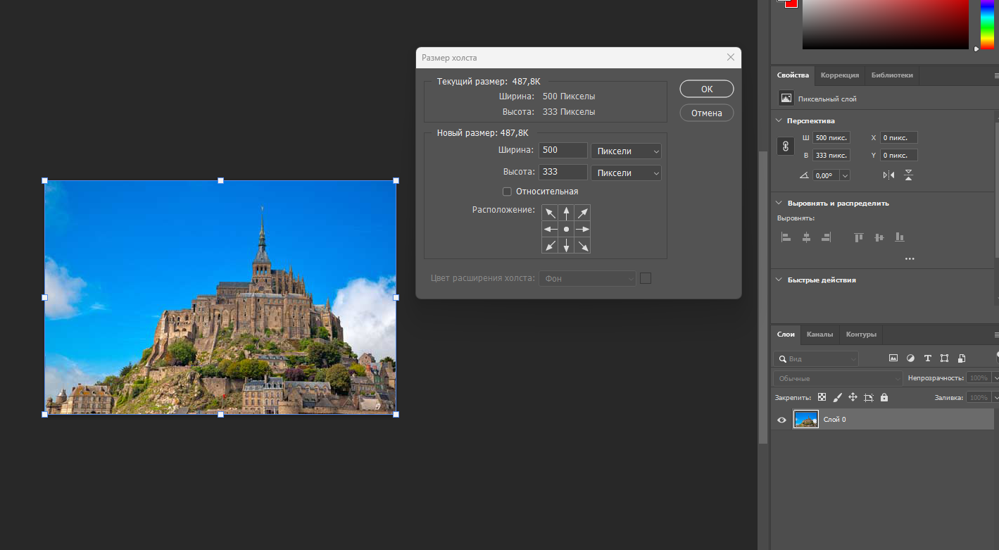

**👀 Результат:** над фото появилась пустая (прозрачная) нижняя половина.

### Шаг 2. Сделай зеркальное отражение

1. Продублируй слой с фото — **`Ctrl+J`**.
2. **`Редактирование → Трансформирование → Отразить по вертикали`**.
3. Инструментом **Перемещение** (`V`) сдвинь перевёрнутую копию **вниз**, встык к оригиналу. Назови слой **«Отражение»**.

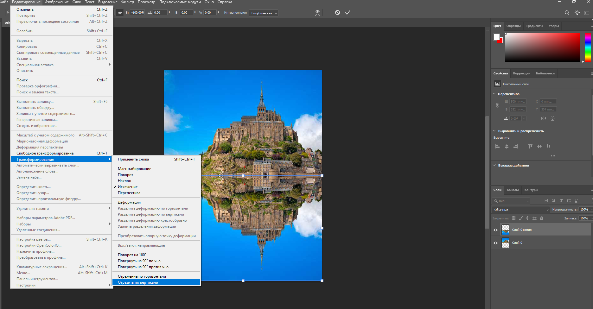

**👀 Результат:** снизу — зеркальная копия замка. Пока слишком чёткая — дальше «утопим» её в воде.

### Шаг 3. Слой воды + маска-градиент

1. **Под** слоем «Отражение» создай **новый слой** (⬜), назови **«Вода»**, залей **синим** (`G` — Заливка; цвет выбери на вкус).
2. К слою **«Отражение»** добавь **маску** ▢ (внизу панели слоёв).
3. Возьми **Градиент** (`G`), тип **линейный**, от **чёрного к белому**. Кликни по маске и протяни градиент по отражению — оно **плавно растворится** книзу «в воде».

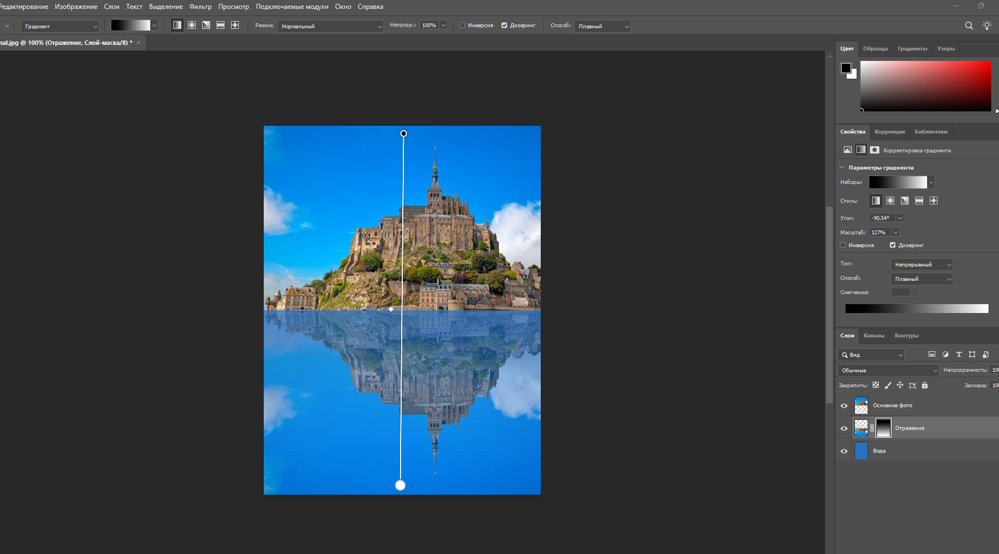

> 💡 Чёрное на маске прячет — поэтому нижняя часть отражения тает. Это то, что мы умеем с урока 5.

### Шаг 4. Выдели видимую часть отражения

Зажми **`Ctrl`** и кликни по **миниатюре маски** слоя «Отражение» — появится выделение видимой части (пригодится дальше).

### Шаг 5. Лёгкое размытие в движении

1. В панели слоёв переключись с маски на **саму картинку** отражения (клик по миниатюре слоя).
2. **`Фильтр → Размытие → Размытие в движении`**: **Угол 90°**, **Смещение 10 px**. `ОК`.

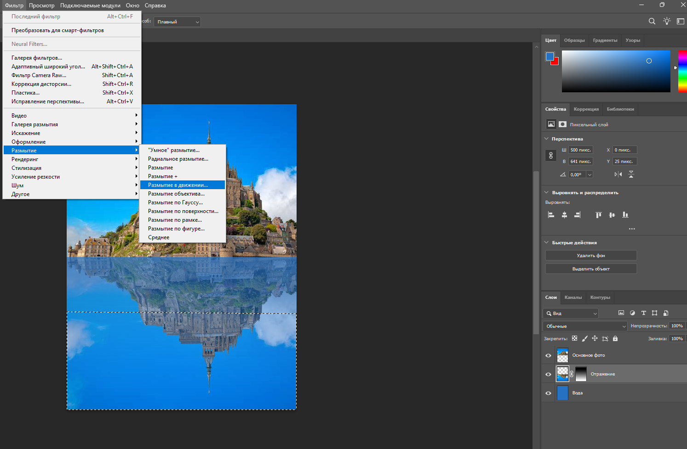

**👀 Результат:** отражение чуть «поплыло» по вертикали — уже похоже на воду. `Ctrl+D` — снять выделение.

---

## Часть B — Делаем карту ряби (12 минут)

Рябь мы создадим **отдельной чёрно-белой картинкой-«картой»** — по ней фильтр «Смещение» будет искажать воду. *(Не хочешь возиться — пропусти Часть B и в Части C возьми готовый файл [`материалы/Канал воды.psd`](материалы/Канал%20воды.psd).)*

### Шаг 6. Новый документ + Шум

1. **`Файл → Создать`** → **1000 × 2000 px**, RGB.
2. **`Фильтр → Шум → Добавить шум`**: **Эффект** на максимум, галочка **«Монохромный»**. `ОК`.

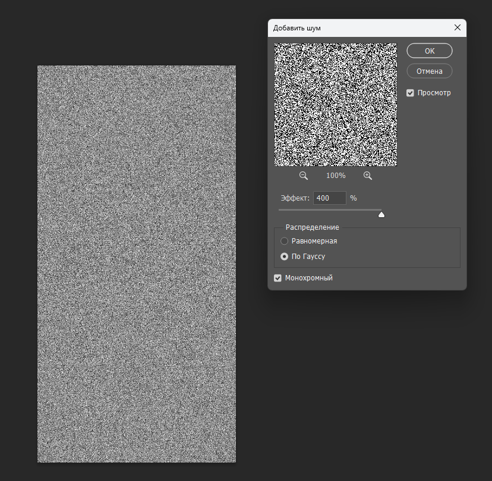

### Шаг 7. Размытие по Гауссу

**`Фильтр → Размытие → Размытие по Гауссу`** → **Радиус 2 px**. `ОК`.

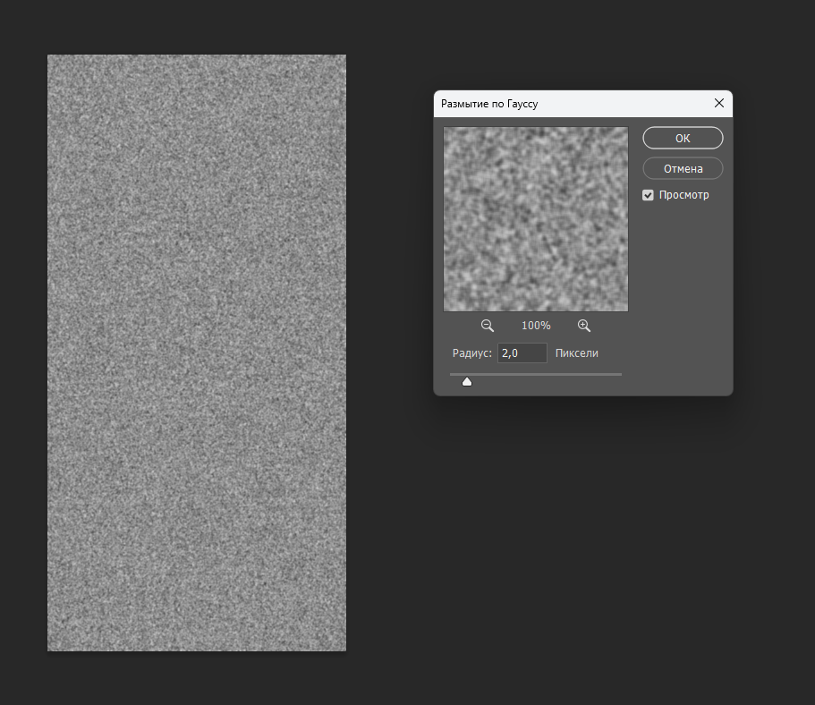

### Шаг 8. Тиснение по каналам

1. Открой вкладку **«Каналы»** (рядом со «Слоями»). Выбери **Красный** канал.
2. **`Фильтр → Стилизация → Тиснение`**: **Угол 180°**, **Высота 1**, **Эффект** на максимум. `ОК`.

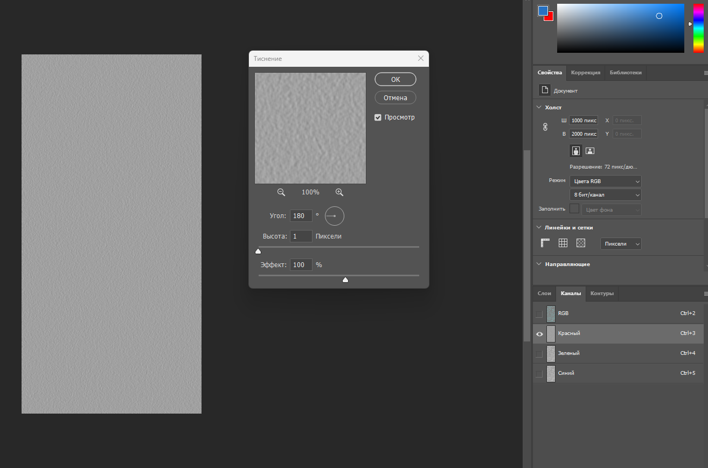

3. Выбери **Зелёный** канал → тот же **Тиснение**, но **Угол 90°**. `ОК`.

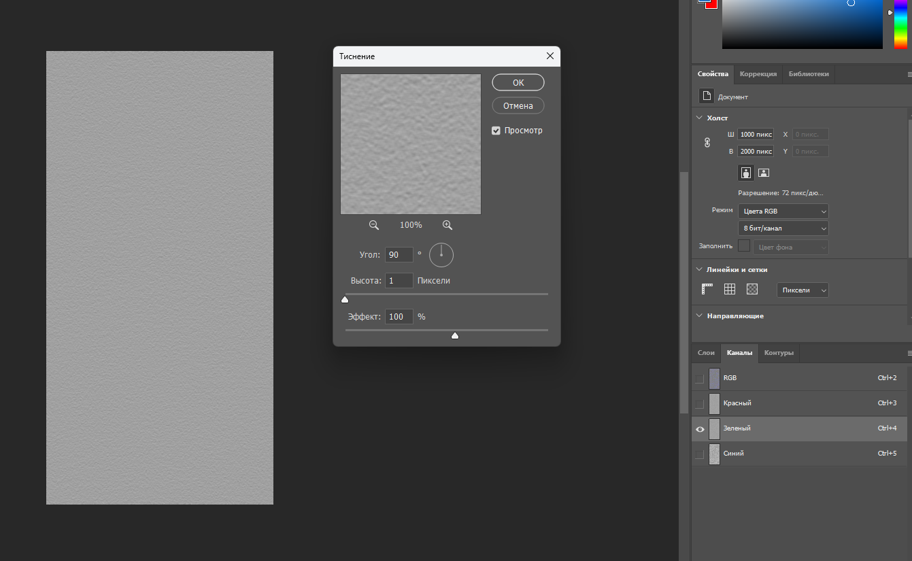

> 💡 Разные углы на каналах дают «перекрёстную» рябь — как реальные волны.

### Шаг 9. Перспектива и квадрат

1. Вернись: включи **RGB** (верхний канал), перейди на вкладку **«Слои»**, разблокируй фон (клик по 🔒, если есть).

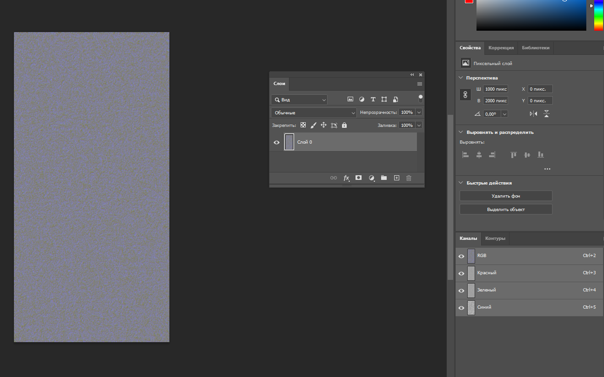

2. **`Редактирование → Трансформирование → Перспектива`** — потяни **нижние углы в стороны** (рябь «уходит к горизонту»). `Enter`.

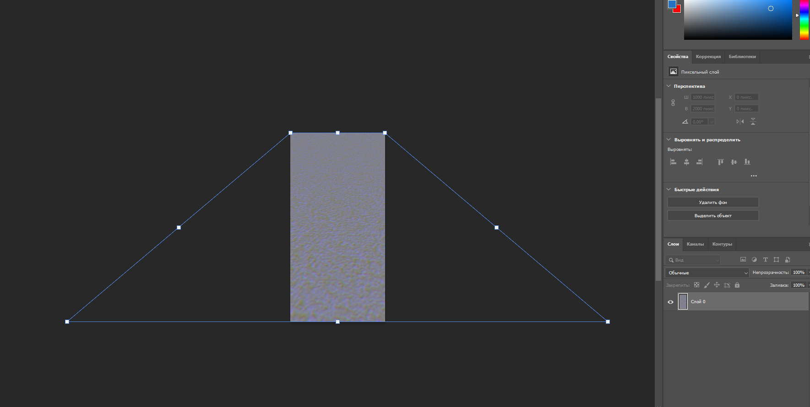

3. **`Изображение → Размер изображения`** → **сними галочку пропорций** и поставь **Высоту 1000 px** (получится квадрат 1000×1000).

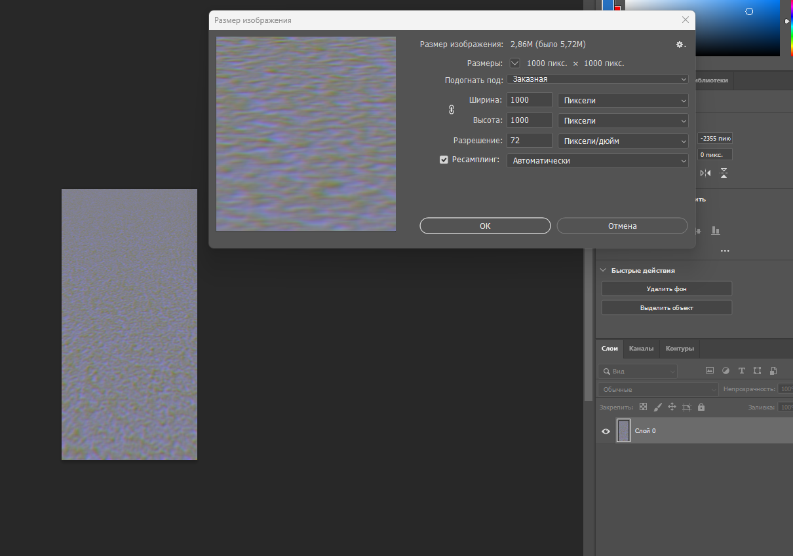

### Шаг 10. Сохрани карту

**`Файл → Сохранить как…`** → формат **PSD** → назови `карта-воды.psd`. **Закрой** этот документ.

---

## Часть C — 🆕 Рябь на воде: фильтр «Смещение» (8 минут)

Вернись к основной работе (замок с отражением).

### Шаг 11. Выдели воду

Зажми **`Ctrl`** и кликни по **миниатюре слоя «Отражение»** — выделится область воды.

### Шаг 12. Применяем «Смещение»

1. **`Фильтр → Искажение → Смещение`**: **Масштаб по горизонтали 30**, **по вертикали 60**, отметь **«Растянуть»** и **«Повторить граничные пикселы»**. `ОК`.
2. Откроется окно выбора файла — выбери **`карта-воды.psd`** (или [`материалы/Канал воды.psd`](материалы/Канал%20воды.psd)).

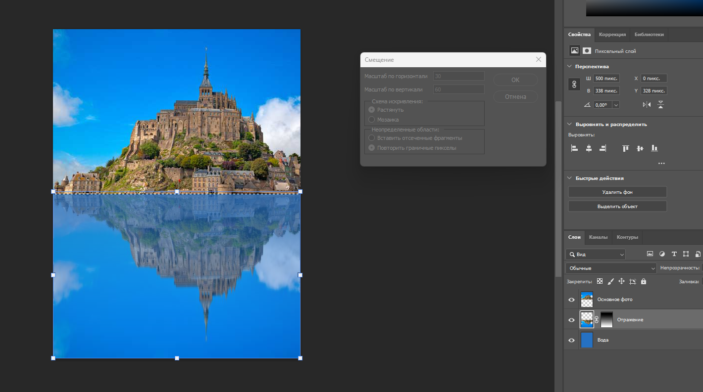

**👀 Результат:** по отражению пошла **настоящая рябь**! Карта-картинка «толкнула» пиксели воды в стороны.

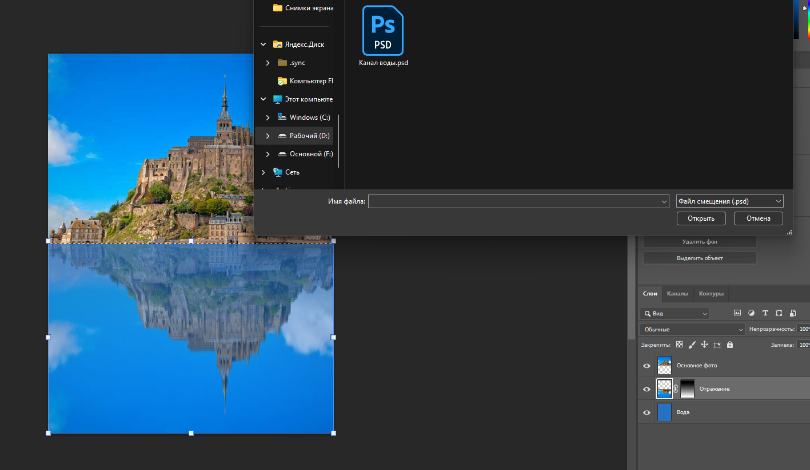

> 💡 Рябь слабовата/сильновата? Отмени (`Ctrl+Z`) и повтори «Смещение» с другими числами — результат зависит от размера фото.

---

## Часть D — Доводка «под кино» (8 минут)

### Шаг 13. Тень на линии воды

1. Новый слой. Инструментом **Прямоугольное выделение** (`M`) выдели **узкую полоску** там, где вода касается земли, залей **чёрным** (`Shift+F5` → Чёрный). `Ctrl+D`.

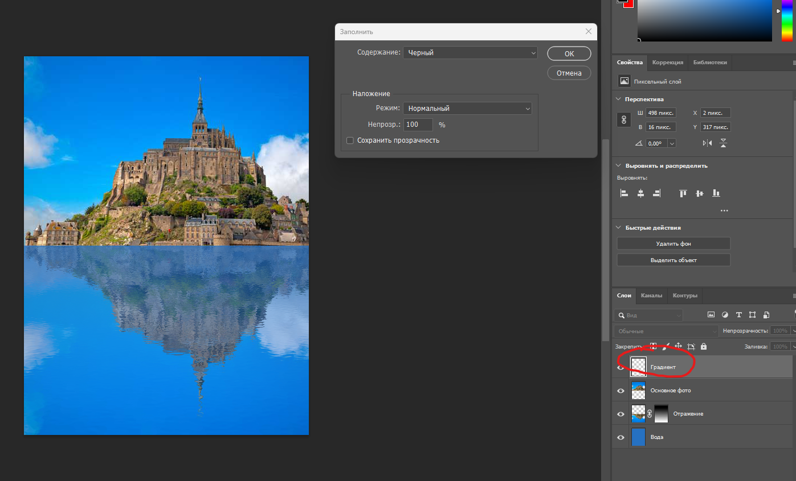

2. **`Фильтр → Размытие → Размытие по Гауссу`** → **20 px**.

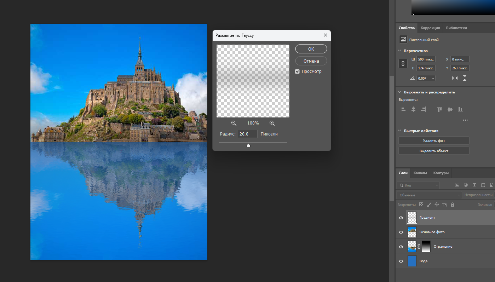

3. Режим слоя — **«Мягкий свет»**, непрозрачность **80%**.

### Шаг 14. Корректирующие слои (единый тон)

- **◐ → Цветовой тон/Насыщенность** → **Насыщенность −30** (чуть приглушить).

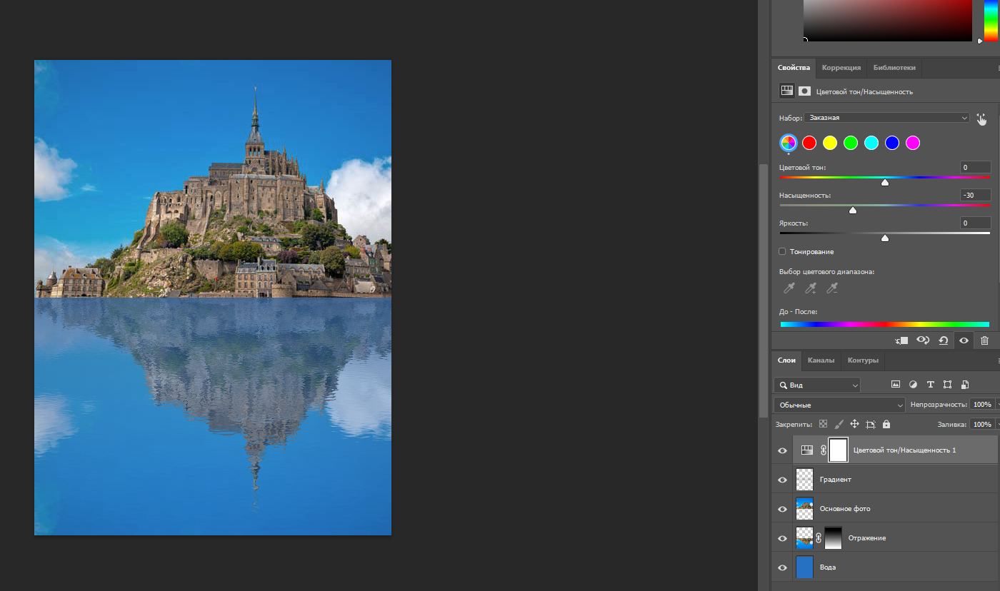

- **◐ → Чёрно-белое** → пресет **«Зелёный фильтр»** → режим слоя **«Перекрытие»**, непрозрачность **30%**.

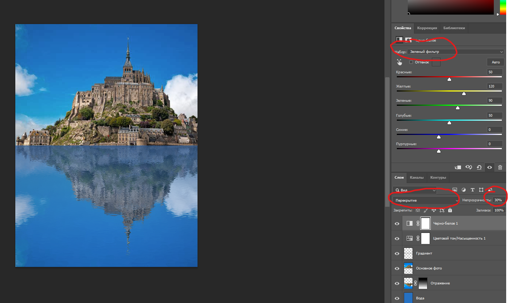

- **◐ → Градиент** (заливка) → от **прозрачного к чёрному**, стиль **Радиальный**, Масштаб **150%** → режим **«Мягкий свет»**, непрозрачность **30%** (лёгкая виньетка).

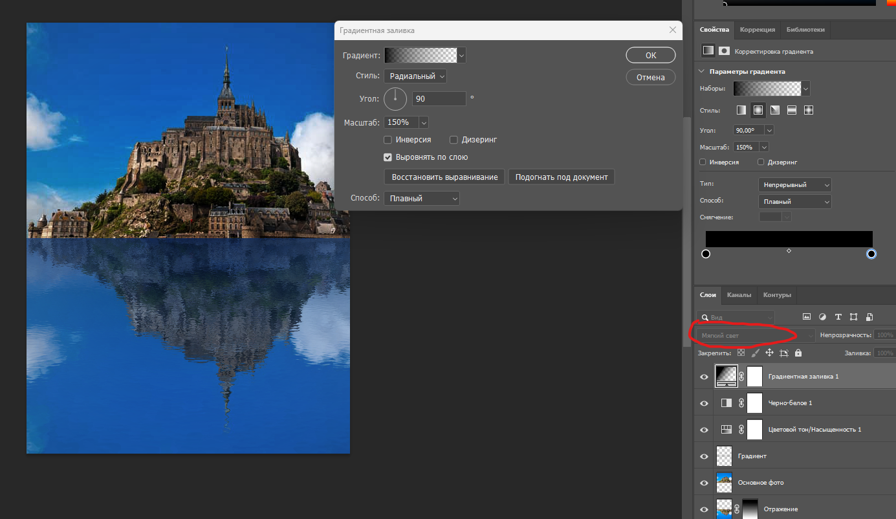

**🎉 Готово!** Замок отражается в воде с живой рябью и киношным тоном. Сравни с [`материалы/Итог.psd`](материалы/Итог.psd).

---

## ✅ Что освоили

- 🆕 **Карта смещения** (Фильтр → Искажение → Смещение) — реалистичная рябь воды.
- Зеркальное отражение (дубликат + Отразить по вертикали) + растворение маской-градиентом.
- Работа с **каналами** (Тиснение по Красному/Зелёному) — создание текстуры.
- Размытие в движении, Перспектива, корректирующие слои для настроения.

> 🎓 Это продвинутый проект — отлично для 9–11 классов и всех, кому понравилась вода. Самый «магический» момент — фильтр «Смещение».

➡️ Вернуться к [основному уроку 5](../theory.md).
