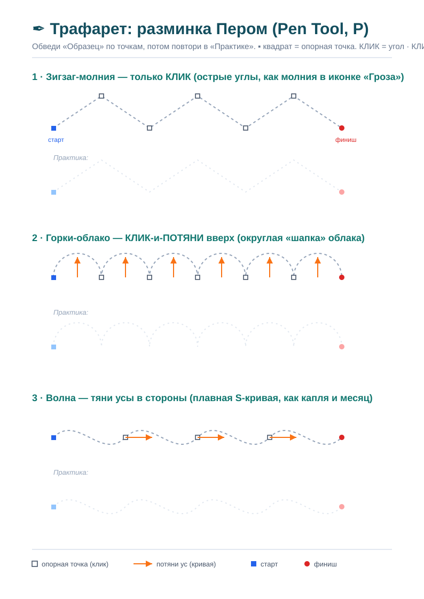
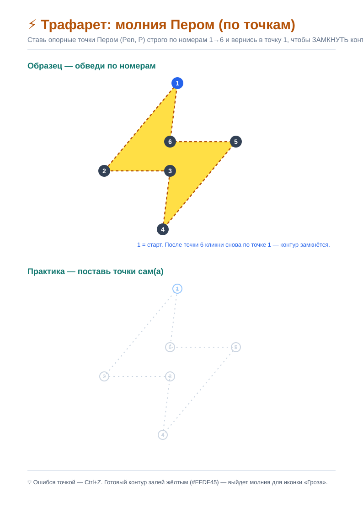
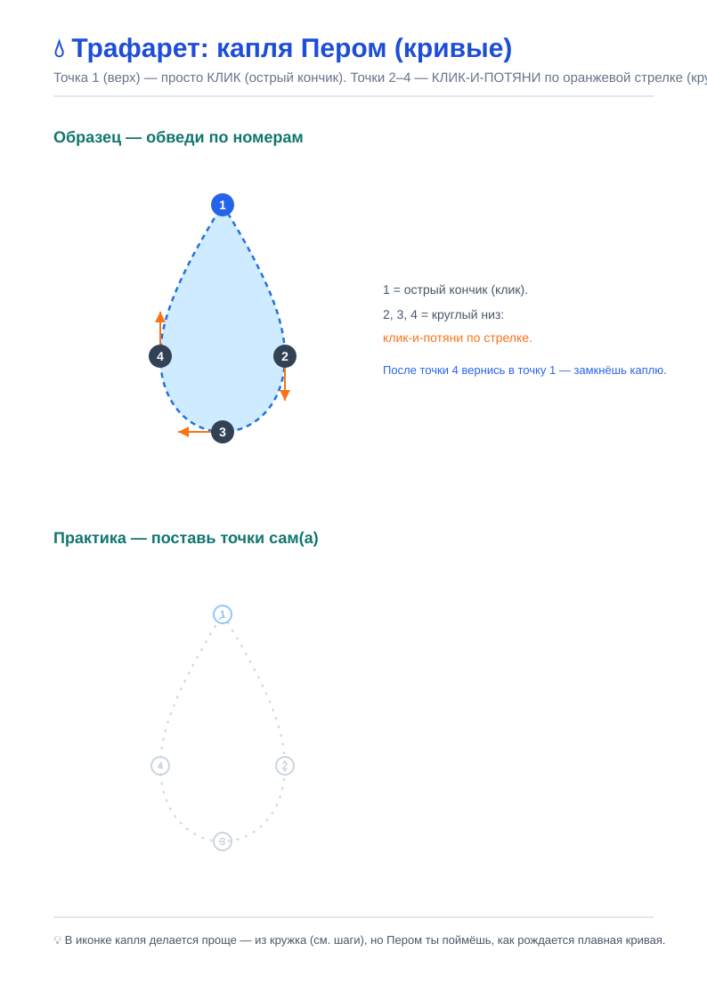

# Самостоятельная работа — Фотомагия в Photoshop, Урок 6

> 🎯 Сегодня ты — дизайнер в **иконочной студии «ПИКСЕЛЬ»**. Студии заказывают **наборы значков** для приложений, сайтов и презентаций. Фигуры и Перо — не цель, а **твой инструмент**: цель — набор, который **узнают с первого взгляда**.

> Делаем по порядку: сначала **разминка Пером на трафаретах**, потом **собираем набор погоды по шагам**, а дальше — **свои иконки**.

---

## ✒️ Шаг 1. Разминка Пером на трафаретах

Перо — новый инструмент, и руку к нему надо приучить. Возьми по очереди **три трафарета** из папки [`трафареты/`](трафареты/): **распечатай** и обведи карандашом прямо по бумаге (сверху «Образец» с точками, снизу «Практика» — повторяешь сам). Потом те же движения повтори Пером (`P`) в Photoshop.

### Трафарет 1 — углы и кривые
📄 Файл: [`трафарет-разминка-пера.svg`](трафареты/трафарет-разминка-пера.svg)

**Что делать:** обведи три ряда —
1. **Зубцы** — только **клики** (острые углы).
2. **Горки-облако** — **клик-и-потяни вверх** (округлые кривые). Оранжевые стрелки показывают, куда тянуть «ус».
3. **Волна** — тяни «усы» **в стороны** (плавная S-кривая).

### Трафарет 2 — молния
📄 Файл: [`трафарет-молния.svg`](трафареты/трафарет-молния.svg)

**Что делать:** ставь точки **строго по номерам 1→6** (все — просто **клики**, углы острые), затем **кликни снова по точке 1** — контур **замкнётся**. Это молния для иконки «Гроза» — потом её заливаешь жёлтым `#FFDF45`.

### Трафарет 3 — капля
📄 Файл: [`трафарет-капля.svg`](трафареты/трафарет-капля.svg)

**Что делать:** точка **1** (верх) — просто **клик** (острый кончик); точки **2, 3, 4** (низ) — **клик-и-потяни по оранжевой стрелке** (круглый низ); вернись в точку 1 и **замкни**. Так чувствуешь, как «усы» делают плавный изгиб.

**🏁 Готово, если:** на бумаге линии легли по образцу, а в Photoshop Пером получилась хотя бы **молния** (замкнутый контур с острыми углами).

> 💡 Ошибся точкой — `Ctrl+Z`. Форма «поехала» — белой **Стрелкой** (`A`) подвинь точку или потяни за «ус».

---

## 🎨 Шаг 2. Основное задание — набор иконок погоды

Теперь соберём **эталонный набор из 8 иконок погоды** — по подробной пошаговой инструкции.

### ➡️ Открой файл [**шаги-рисуем-иконки.md**](шаги-рисуем-иконки.md) и делай шаг за шагом.

Там **каждый шаг с картинкой** и современными инструментами. Коротко маршрут:
1. **Открой** файл-инструкцию, рядом открой Photoshop.
2. **Создай** документ 600×600, включи сетку, залей фон бирюзой.
3. **Собери по очереди** 8 иконок: облако (из кругов → Объединить) → солнце → облако+солнце → дождь (капля из кружка) → снег (снежинка) → гроза (**молния Пером**) → луна (**Вычесть фигуру**) → луна со звёздами.
4. **Сохрани** `.psd` (со слоями) и `.png` (весь набор; можно каждую иконку отдельно).

**🏁 Готово, если:** получился аккуратный набор из 8 иконок в едином стиле, сохранён в PSD + PNG. Ты применил(а) фигуры, Объединить/Вычесть, стили слоя и Перо.

> 🧩 **Для 5–7:** это задание — обязательное и главное. Если устал(а) — хватит первых 4–5 иконок (до снега).

---

## 🥇 Шаг 3. Заказ студии — «Свой набор иконок»

Клиент заказал студии **набор из 4–6 значков на свою тему** (не погода!). Сначала бриф, потом рисуем — теми же приёмами, что отработал(а) на погоде.

**🎨 Бриф (1 минута):**
- **Для кого набор?** 😀 мессенджер (эмоции) · 🍔 доставка еды · ⚽ спорт · 🎵 музыка · 🚗 такси · 💬 соцсеть (лайк, сердце, колокольчик).
- **Где будут стоять?** кнопки приложения / меню сайта / стикеры.

**🛠 Собери набор:**
- [ ] значки — **векторными фигурами** (`U`) и/или **Пером** (`P`), не кистью;
- [ ] где нужно — **Объединить** (сложная форма) и/или **Вычесть** (дырка/вырез);
- [ ] ровно по **сетке**, **одинакового размера**;
- [ ] **единый стиль слоя** на всех (скопируй-вклей стиль);
- [ ] сохранено **PSD + PNG**, набор назван.

**🏁 Готово, если:** набор смотрится как **один комплект** (один размер и стиль) и по каждому значку сразу понятно, что он значит.

---

## 🥈 Шаг 4. Заказ — «Экран приложения» (комбо, уроки 5 + 6)

Клиент хочет увидеть, **как иконки живут на экране**:
1. Нарисуй **карточку** — Прямоугольник (`U`) со скруглением (Свойства → Радиус угла) и лёгкой тенью.
2. Положи на неё **свою иконку** (из Шага 3 или погодную).
3. Добавь **текст** (`T`) — подпись/число («+18°», «Лайк», «Новое»).
4. Сделай **2–3 карточки в ряд** — выйдет «экран приложения».

**🏁 Готово, если:** похоже на **настоящий экран телефона** — карточки, иконки и текст в одном стиле.

---

## 🎯 А попробуй! (мини-миссии с инструкцией)

**✒️ «Значок Пером».** Нарисуй **Пером** (`P`) один значок, который не собрать из кругов: 🏠домик · ✈️самолётик · ✔️галочку · 📍пин. Клик = угол, клик-потяни = кривая, по первой точке — замкнуть.

**🟦 «Иконка приложения».** Скруглённый квадрат (`U` + большой радиус в Свойствах) = плитка → сверху простой символ (камера, конверт, сердце) → градиент на плитке.

**⭐ «Избранное и настройки».** Многоугольник (`U`) → «Звезда» 5 лучей = ★; шестерёнка (многоугольник 8 сторон + круг-вырез через **Вычесть**) = ⚙️.

**🌈 «Сочный градиент».** Двойной клик по слою-фигуре → «Наложение градиента» → 2 цвета → объём.

**🧱 «Пиксель-арт».** Открой доп-задание «Пиксель арт» ([ДОП-ЗАДАНИЯ-рисование.md](../ДОП-ЗАДАНИЯ-рисование.md)) → сердечко/гриб по клеткам «Карандашом».

---

## 📋 Что проверяем (по делу, не по галочкам)

- [ ] Разминка Пером: обведён хотя бы один трафарет + молния Пером в Photoshop;
- [ ] Набор погоды собран по шагам (PSD + PNG);
- [ ] Свой набор 4–6 значков **в едином стиле**, фигурами/Пером, ровно по сетке;
- [ ] есть Объединить и/или Вычесть; сохранено PSD + PNG.

## 🧩 Для 5–7 классов
- Главное — разминка Пером (трафарет) + набор погоды по шагам (можно короче). Свой набор — **3 простых значка**.

## 🎓 Для 9–11 классов
- В Шаге 3 сделай **8 значков** + «экран приложения» (Шаг 4) с градиентами.
- Нарисуй **Пером** значок сложной формы (самолёт, птица, логотип) — не из готовых фигур.

## 🖼 Галерея «Иконки студии ПИКСЕЛЬ»
Сдай PNG — соберём каталог наборов. Номинации: **поставлю в своё приложение** · **самый красивый набор** · **самая хитрая форма (Перо/Вычесть)** · **лучший экран приложения**.

## Что сдать
- `погода_*.psd/.png` (Шаг 2) + `иконки_*.psd/.png` (Шаг 3) + `экран_*.png` (Шаг 4). Бонусы — по желанию.
