# 🎨 Совместная практика: рисуем набор иконок погоды — по шагам

**Модуль 2 · Урок 6 · Пошаговый мастер-класс** (делаем всем классом вместе с учителем)

> 🧭 **Что это за файл.** Здесь — **полная пошаговая сборка** набора из 8 иконок погоды: ☁️ Облачно · ☀️ Солнечно · ⛅ Облачно с солнцем · 🌧 Дождь · ❄️ Снег · ⛈ Гроза · 🌙 Ночь · 🌙✨ Ночь со звёздами. Каждый шаг — с картинкой-подсказкой. Инструменты те же, что в [теории](theory.md): **векторные фигуры**, **Объединить/Вычесть**, **сетка**, **стили слоя** и новый для нас инструмент **Перо**.
>
> ⚙️ **Если твоя версия Photoshop новее** — некоторые инструменты называются чуть иначе. Везде, где так, стоит значок 🆕 и написано, **как это теперь**.

---

## 🎨 Палитра цветов (держи рядом)

| Где | Цвет |
|-----|------|
| Фон | `#02C0D1` |
| Облако — обводка | `#648992` |
| Солнце | `#FCD524` · обводка `#EBAF0D` · свечение `#FFC604` |
| Капля дождя | `#57DAFF` · обводка `#2172DB` |
| Снежинка | `#FFFFFF` · обводка `#4CA0E0` |
| Молния | `#FFDF45` · обводка `#AF9101` |
| Луна, звёзды | `#FFFFFF` (стиль копируем с облака) |

---

## Подготовка — холст и сетка

### Шаг 1. Новый документ + сетка
1. **`Файл → Создать`** (`Ctrl+N`): ширина **600**, высота **600** px, разрешение **72**, фон **Белый**. ОК.
2. Включи сетку: **`Просмотр → Показать → Сетку`**. И привязку: **`Просмотр → Привязать к → Линиям сетки`** *(привязка «притягивает» края фигур к клеткам — всё встаёт ровно).*
3. Настрой клетку: **`Редактирование → Установки → Направляющие, сетка и фрагменты`** (`Ctrl+K`) → **«Линия через каждые: 5 пикселов»**, **«Внутреннее деление: 1»**. ОК. *(1 клетка = 5 px — по ней удобно отмерять размеры фигур.)*

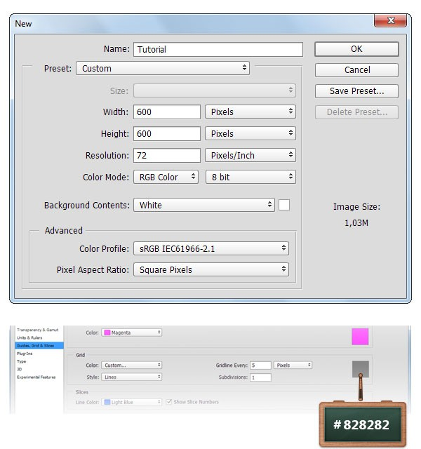

### Шаг 2. Заливаем фон
1. Цвет переднего плана — **`#02C0D1`** (клик по верхнему квадрату цвета → введи код → ОК).
2. Возьми **«Заливка»** (`G`) и кликни по холсту. *(🆕 «Заливка» спрятана в одной группе с «Градиентом» — нажми и подержи значок градиента. Ещё быстрее — `Alt+Backspace`: заливает цветом переднего плана.)*

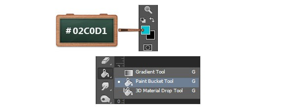

---

## ☁️ Иконка 1 — «Облачно» (базовая форма)

Облако — основа **половины** иконок. Соберём его из **кругов + прямоугольника** и склеим в одну фигуру.

### Шаг 3. Четыре круга
1. Цвет переднего плана — **белый** `#FFFFFF`. Возьми **«Эллипс»** (`U`).
2. 🆕 **Как задать точный размер.** Проще всего — **один раз кликни по холсту** инструментом «Эллипс»: откроется окошко «Создать эллипс» — впиши ширину и высоту, ОК. *(Или тяни мышкой с зажатым `Shift` — выйдет ровный круг — и смотри размер в панели **«Свойства»**.)*
3. Нарисуй по очереди **4 круга** и расставь их «шапкой» облака:
   - круг **30×30 px**,
   - ещё **30×30 px** рядом,
   - **35×35 px** сверху по центру,
   - **20×20 px** маленький.

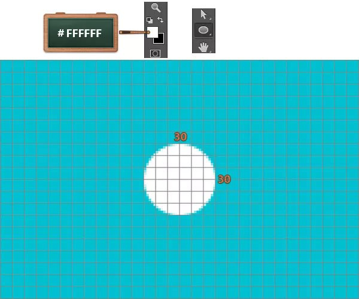
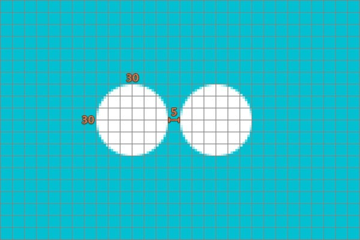
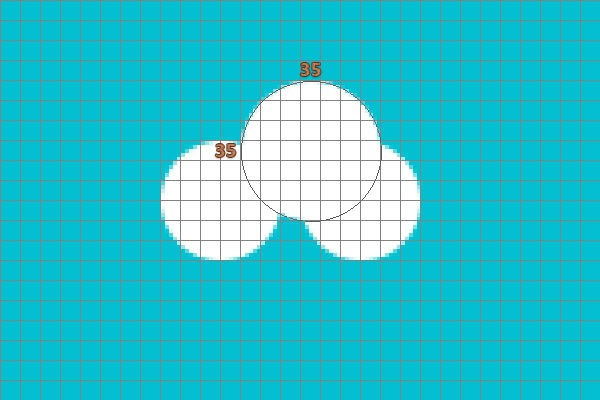
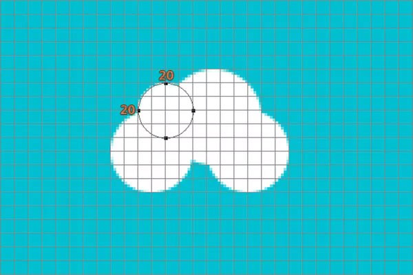

### Шаг 4. Низ облака + склейка
1. Возьми **«Прямоугольник»** (`U`) → нарисуй **15×35 px** и поставь так, чтобы он ровно соединил круги снизу (ровное «дно» облака).
2. В **панели слоёв** выдели **все** слои-фигуры облака (клик по верхнему, `Shift`+клик по нижнему).
3. 🆕 **Правый клик по выделенным слоям → «Объединить фигуры»** *(в старых версиях — «Объединить слои»; по-английски Merge Shapes)*. Все кусочки станут **одной фигурой-облаком**.

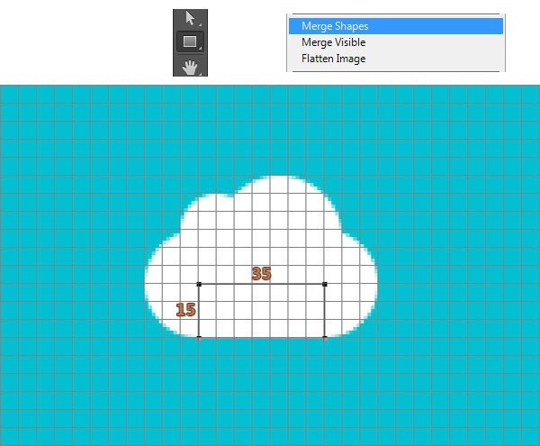

### Шаг 5. Имя слоя и стиль (объём)
1. Двойной клик по названию слоя → переименуй в **«Облачно»**.
2. Двойной клик по слою (по пустому месту справа от имени) → откроется окно **«Стиль слоя»**. Включи и настрой (как на скринах):
   - **Обводка:** размер 1 px, положение «Снаружи», непрозр. **30%**, цвет **`#648992`**;
   - **Внутреннее свечение:** режим «Мягкий свет», непрозр. 70%, цвет **`#FFFFFF`**, источник «На краях», размер 5 px;
   - **Наложение градиента:** непрозр. 35%, линейный, 90°, переход от **`#648992`** (прозрачного) к **`#FFFFFF`**;
   - **Тень:** цвет `#000000`, непрозр. 35%, угол 90°, смещение 1 px, размер 3 px.
3. ОК. Передвинь иконку «Облачно» в **левый верхний угол** холста.

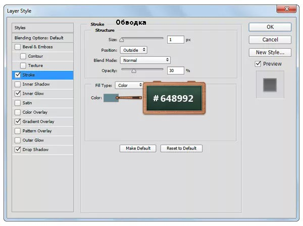

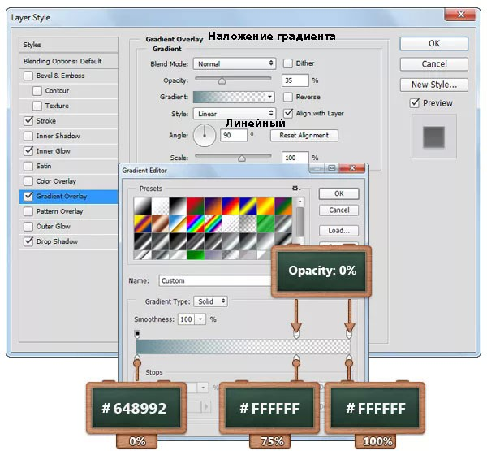

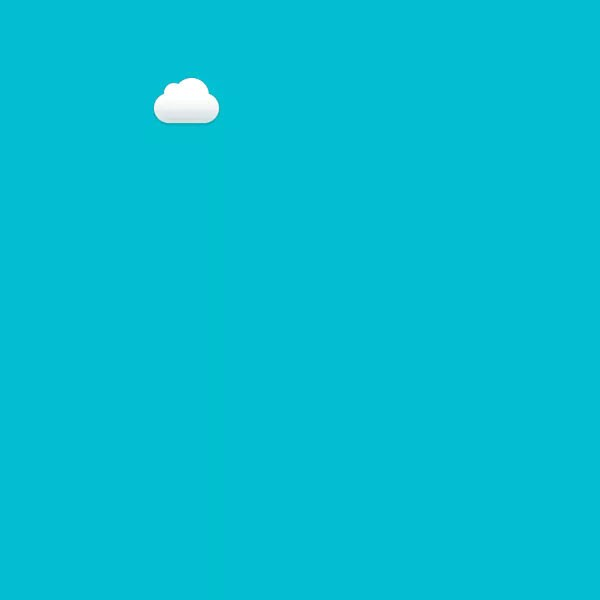

> 💡 **Проверка силы вектора:** `Ctrl+T` → потяни угол с `Shift` — облако меняется в размере **без потери чёткости**. `Esc` — отменить.

---

## ☀️ Иконка 2 — «Солнечно»

### Шаг 6. Круг-солнце
Цвет переднего плана — **`#FCD524`**. **«Эллипс»** (`U`) → круг **35×35 px**.

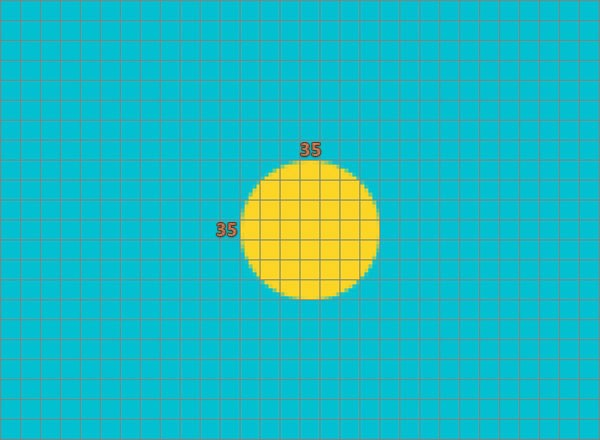

### Шаг 7. Имя и стиль солнца
Назови слой **«Солнечно»**. Двойной клик по слою → применяй стили (как на скринах):
- **Тиснение:** стиль «Внутренний скос», метод «Плавное», глубина 100%, размер 4 px, угол 90°, высота 30°, подсветка «Перекрытие» `#FFFFFF` 65%, тень «Умножение» `#000000` 0%;
- **Обводка:** 1 px снаружи, цвет **`#EBAF0D`**;
- **Внутреннее свечение:** режим «Перекрытие», 50%, `#FFFFFF`, размер 5 px;
- **Наложение градиента:** «Мягкий свет», 85%, от прозрачного `#000000`;
- **Внешнее свечение:** 85%, цвет **`#FFC604`**, размер 15 px *(это и даёт «сияние» вокруг солнца)*;
- **Тень:** `#000000` 40%, угол 90°, смещение 2 px, размер 3 px.

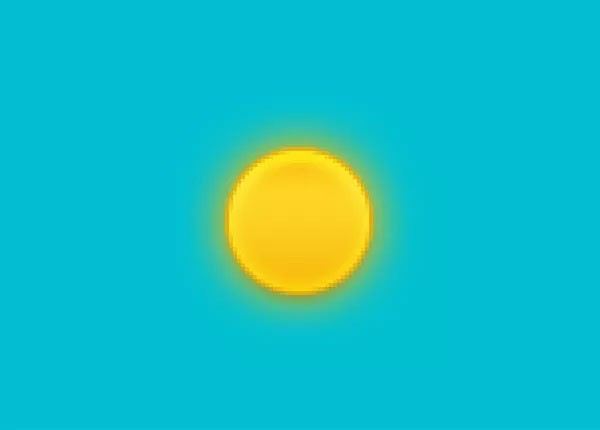
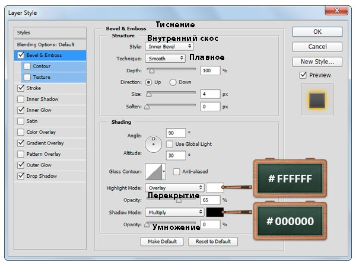
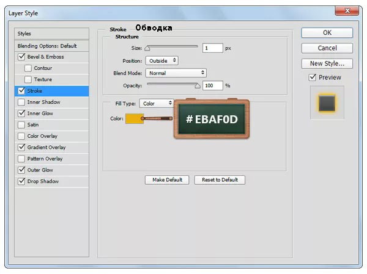
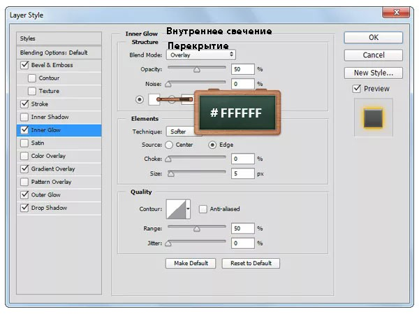
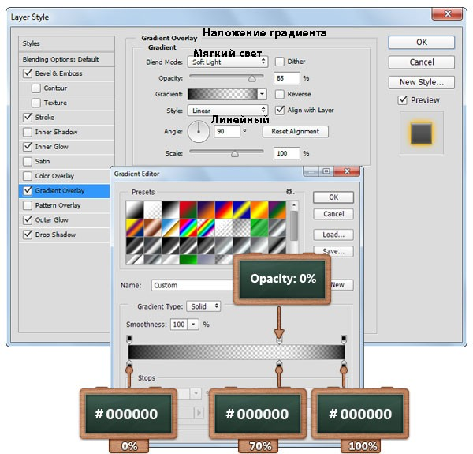
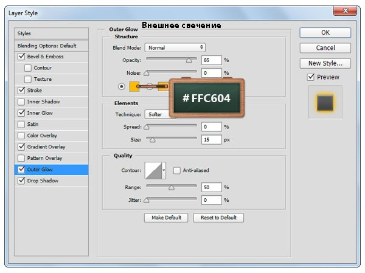
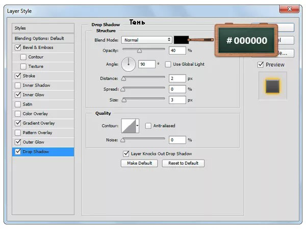

### Шаг 8. Поставь солнце
Убедись, что активен слой «Солнечно», и поставь солнце **справа вверху** (рядом с облаком).

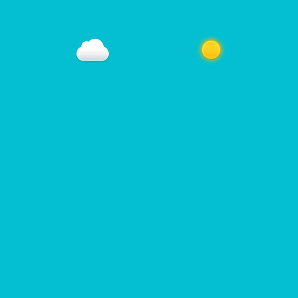

---

## ⛅ Иконка 3 — «Облачно с солнцем»

### Шаг 9. Дубликат облака и солнца
1. Выдели слои **«Облачно»** и **«Солнечно»** → **`Ctrl+J`** (дубликаты).
2. В панели слоёв проверь: дубликат «Солнечно» должен быть **ниже** дубликата «Облачно».
3. Поставь их так, чтобы **солнце выглядывало из-за облака**.

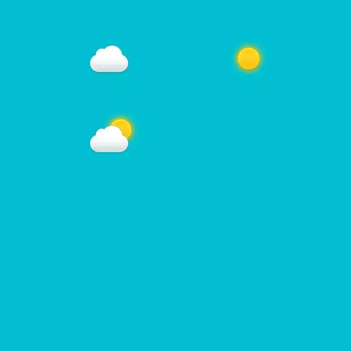

---

## 🌧 Иконка 4 — «Дождь»

### Шаг 10. Ещё одно облако
Сделай ещё **дубликат «Облачно»** (`Ctrl+J`), назови **«Пасмурно. Дождь»**, поставь на свободное место.

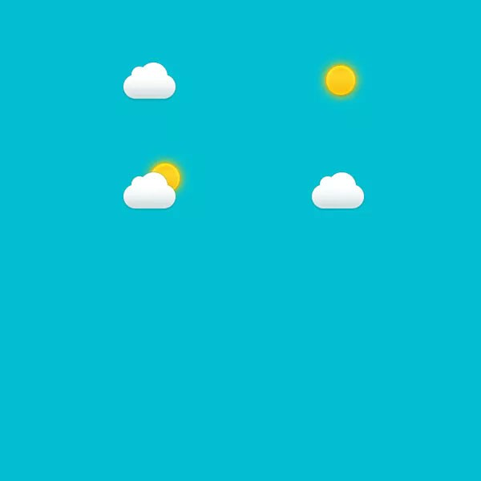

### Шаг 11. Мелкая сетка + заготовка капли
1. Для мелких деталей поставь клетку **1 px**: `Редактирование → Установки → Направляющие, сетка и фрагменты` → «Линия через каждые: **1**».
2. Цвет — **`#57DAFF`**. **«Эллипс»** (`U`) → крошечный круг **4×4 px** под облаком.

### Шаг 12. Круг → капля (белая Стрелка)
1. 🆕 Возьми **белую «Стрелку»** (`A`) — это **«Выделение узла»** (Direct Selection): она двигает **отдельные точки** фигуры, а не весь слой.
2. Кликни по **верхней точке** кружка и **дважды нажми клавишу ↑** — верх вытянется, кружок станет **каплей**.
3. Переименуй слой в **«Капля дождя»**.

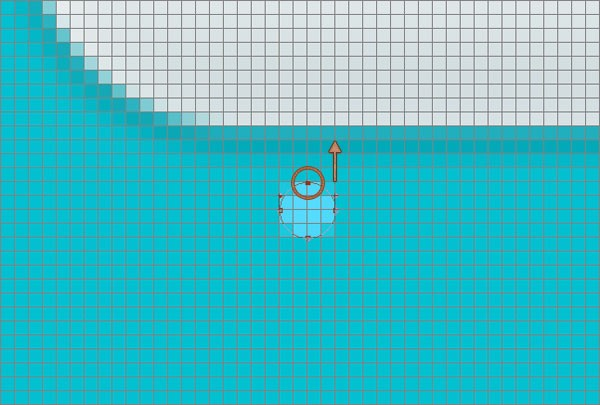
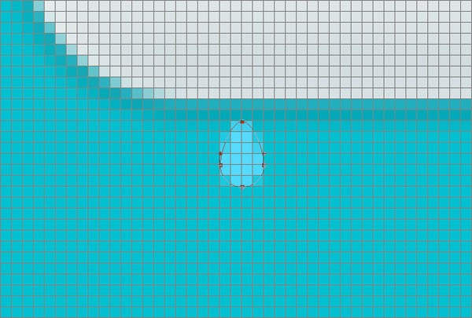

### Шаг 13. Размножь капли
Продублируй «Каплю дождя» (`Ctrl+J`) несколько раз и расставь капли **в два ряда** под облаком (сетка подскажет ровный шаг).

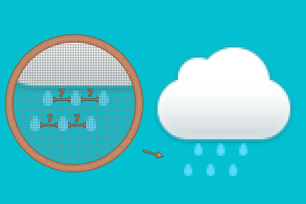

### Шаг 14. Стиль капли + копирование на все
1. Выбери слой «Капля дождя», двойной клик → применяй стили (как на скринах):
   - **Тиснение:** внутренний скос, плавное, глубина 100%, размер 0, угол 120° (галочка «Глобальное освещение»), подсветка «Перекрытие» `#FFFFFF` 75%;
   - **Обводка:** 1 px снаружи, **`#2172DB`**;
   - **Внутреннее свечение:** «Мягкий свет», 60%, `#FFFFFF`, размер 5 px;
   - **Наложение градиента:** «Мягкий свет», 90%, от прозрачного `#000000`;
   - **Тень:** `#000000` 50%, угол 120°, смещение 2 px, размер 4 px.
2. 🔑 **Скопируй стиль на все капли:** ПКМ по слою «Капля дождя» → **«Скопировать стиль слоя»** → выдели **все** слои-капли → ПКМ → **«Вклеить стиль слоя»**.

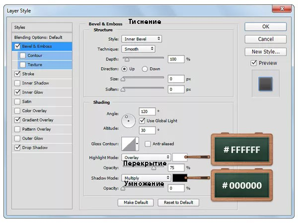
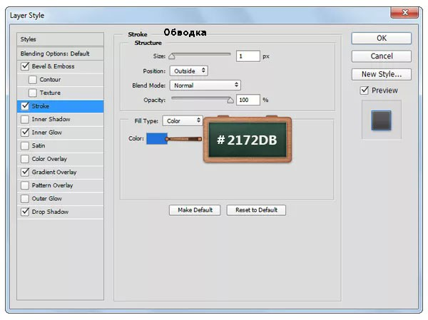
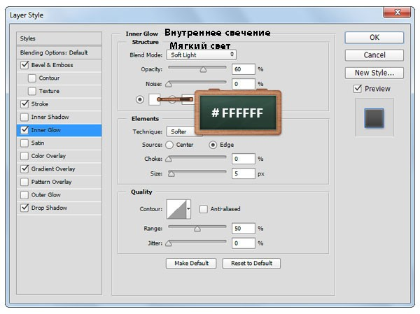
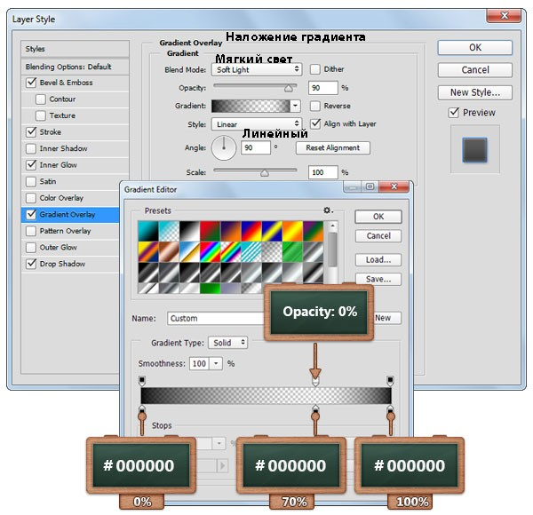
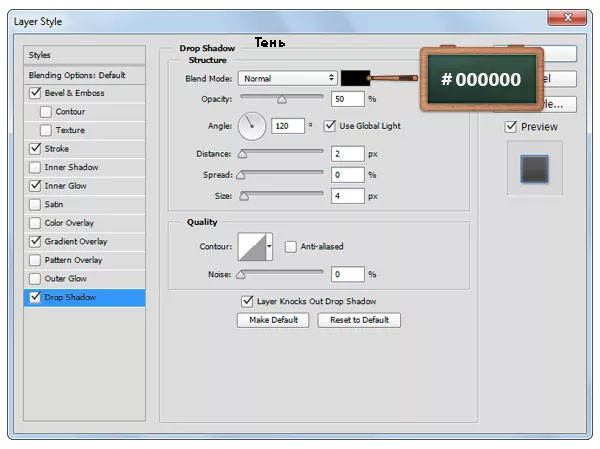

---

## ❄️ Иконка 5 — «Снег»

### Шаг 15. Облако для снега
Дубликат «Облачно» (`Ctrl+J`) → назови **«Снег»**, поставь на место.

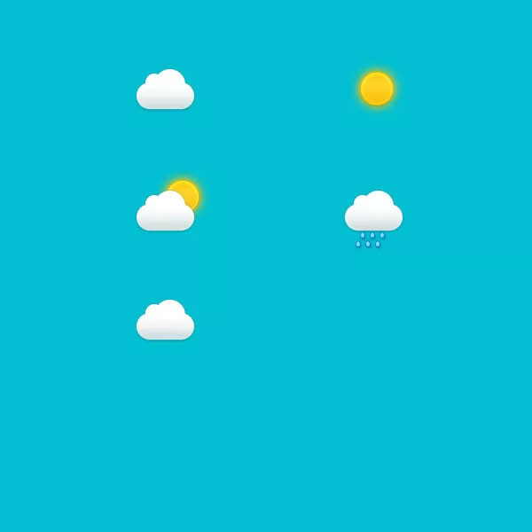

### Шаг 16. Центр снежинки
Цвет — **`#FFFFFF`**. **«Эллипс»** (`U`) → круг **5×5 px** под облаком (серединка снежинки).

### Шаг 17. 🆕 Лучик снежинки (важная замена инструмента!)
Раньше тут брали «Прямоугольник со скруглёнными углами». **В новых версиях Photoshop отдельного такого инструмента нет** — скругление теперь настраивается у обычного прямоугольника:
1. Возьми **«Прямоугольник»** (`U`).
2. Нарисуй узкую палочку **1×3 px**.
3. 🆕 В панели **«Свойства»** (или на верхней панели) найди поле **«Радиус угла»** и поставь **1 px** — уголки чуть скруглятся.
4. Продублируй палочку (`Ctrl+J`) и поставь рядом второй лучик.

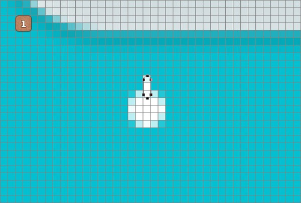
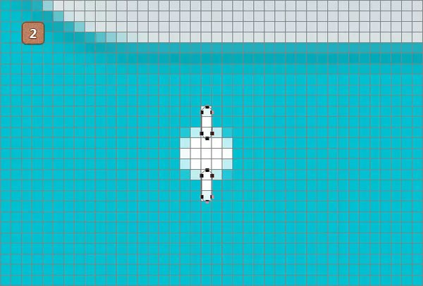

### Шаг 18. Собираем 6 лучей поворотом
1. Выдели обе палочки → ПКМ → **«Объединить фигуры»**.
2. Продублируй получившуюся фигуру (`Ctrl+J`) → **`Ctrl+T`** → поверни на **45°** (держи `Shift` — повернёт ровно) → `Enter`.
3. Повтори дубль-поворот ещё раз — получится **снежинка-звёздочка** из лучей.

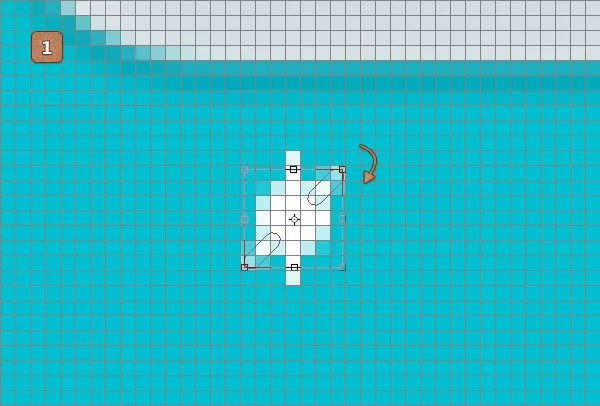
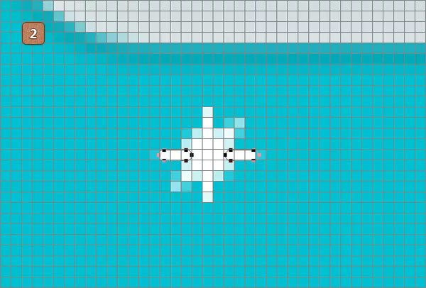
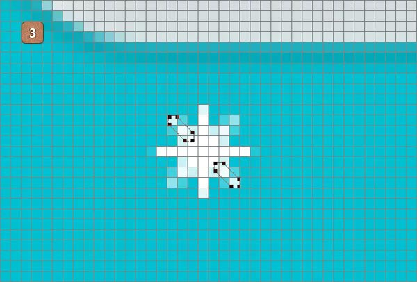

### Шаг 19. Склей снежинку и добавь стиль
1. Выдели все лучи + центр → **«Объединить фигуры»**.
2. Применяй стили (как на скринах): **Обводка** `#4CA0E0` (35%), **Внутреннее свечение** «Перекрытие» 70% `#FFFFFF`, **Наложение градиента** от `#4CA0E0` к `#FFFFFF`, **Тень** `#000000` 35%.

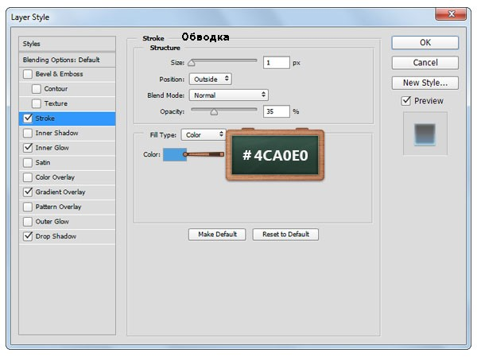
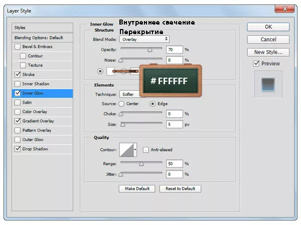
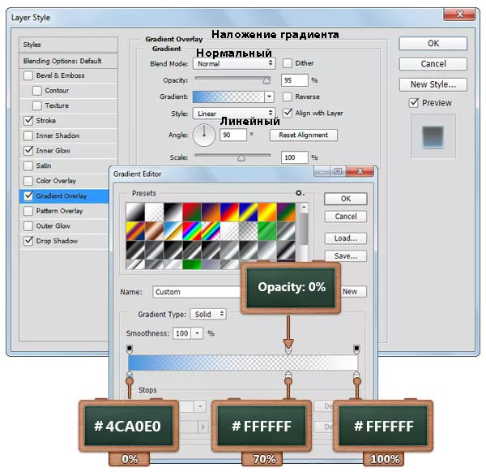
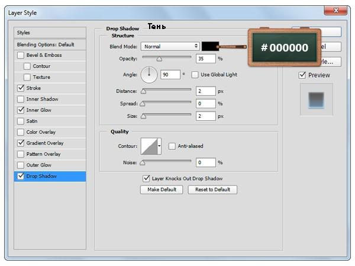

### Шаг 20. Вторая снежинка
Продублируй снежинку (`Ctrl+J`) и поставь рядом — под облаком **две снежинки**.

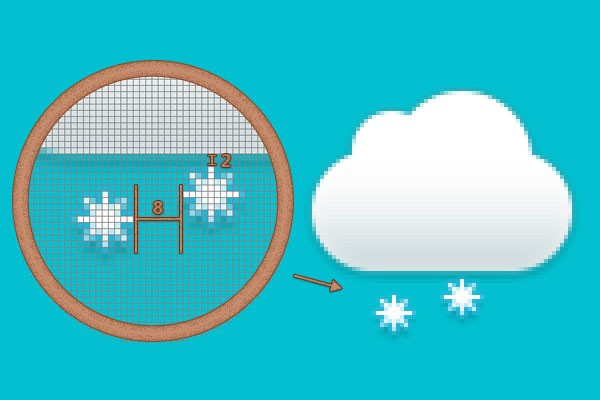

---

## ⛈ Иконка 6 — «Гроза» (здесь — новый инструмент Перо!)

### Шаг 21. Облако для грозы
Ещё дубликат «Облачно» (`Ctrl+J`) → назови **«Пасмурно. Гроза»**, поставь на место.

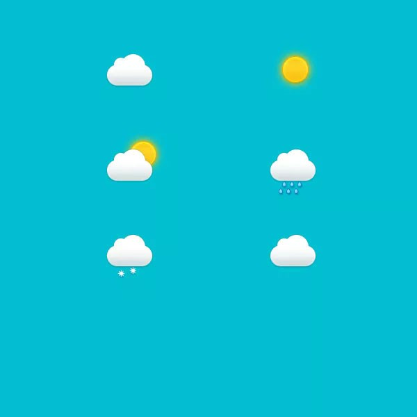

### Шаг 22. Две капли
Перейди на слой «Капля дождя», продублируй его **дважды** и поставь **две капли** под грозовым облаком (по краям — посередине будет молния).

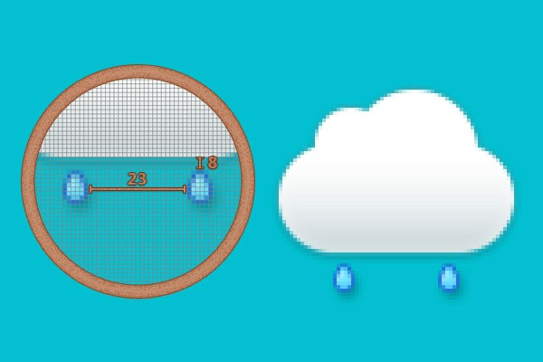

### Шаг 23. ⚡ Молния — рисуем Пером (`P`)
Вот ради чего мы учили **Перо**: острую угловатую молнию удобнее всего построить **по точкам**.
1. Цвет — **`#FFDF45`**. Возьми **«Перо»** (`P`), режим вверху — **«Фигура»**.
2. Ставь точки-клики **строго по порядку** зигзагом (сетка помогает попадать в углы). Дойдя до конца — **кликни снова по первой точке**, чтобы **замкнуть** контур.

> ✏️ **Потренируйся сначала на трафарете** [`трафареты/трафарет-молния.svg`](трафареты/трафарет-молния.svg) — распечатай и обведи молнию по номерам. А разминка для руки — [`трафареты/трафарет-разминка-пера.svg`](трафареты/трафарет-разминка-пера.svg).

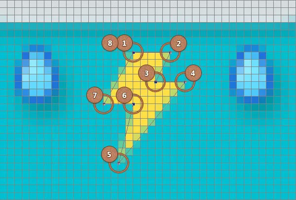

### Шаг 24. Стиль молнии
Применяй стили (как на скринах): **Тиснение** (угол 120°), **Обводка** `#AF9101`, **Внутреннее свечение** «Мягкий свет» 50%, **Наложение градиента** «Перекрытие» от прозрачного `#000000`, **Тень** `#000000` 50%.

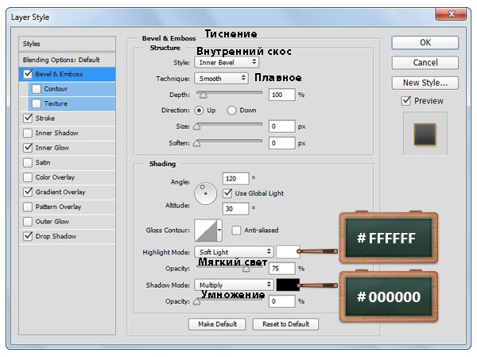
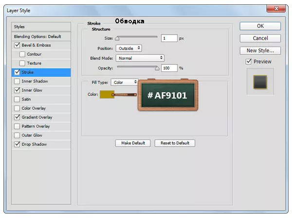
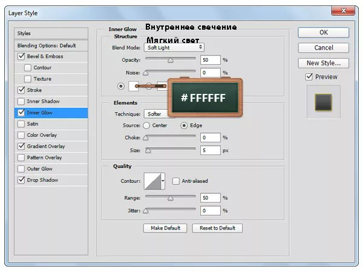
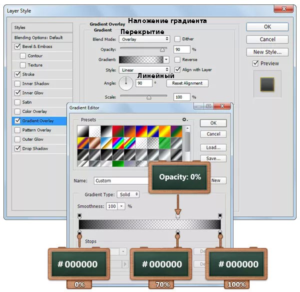
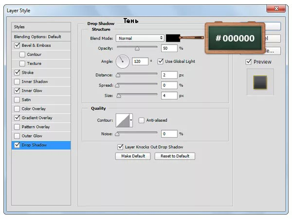

---

## 🌙 Иконка 7 — «Ночь» (луна = Вычесть фигуру)

### Шаг 25. Два круга
Цвет — **`#FFFFFF`**. **«Эллипс»** (`U`) → нарисуй круг **36×36 px**, затем круг **30×30 px**, сместив его вбок (он «откусит» месяц).

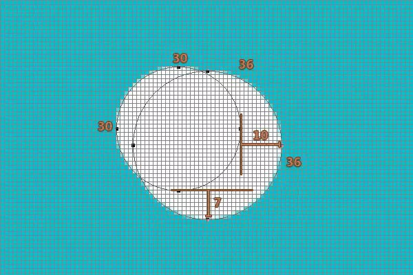

### Шаг 26. 🆕 Вычитаем — получаем месяц
1. Выдели оба круга → **«Объединить фигуры»** (чтобы оказались в одном слое-фигуре).
2. Возьми **чёрную «Выделение контура»** (`A`) → кликни **по меньшему кругу**.
3. 🆕 На верхней панели открой **«Операции с контуром»** (значок перекрывающихся квадратиков) → **«Вычесть переднюю фигуру»**. Маленький круг «прорежет» большой — выйдет **полумесяц** 🌙.

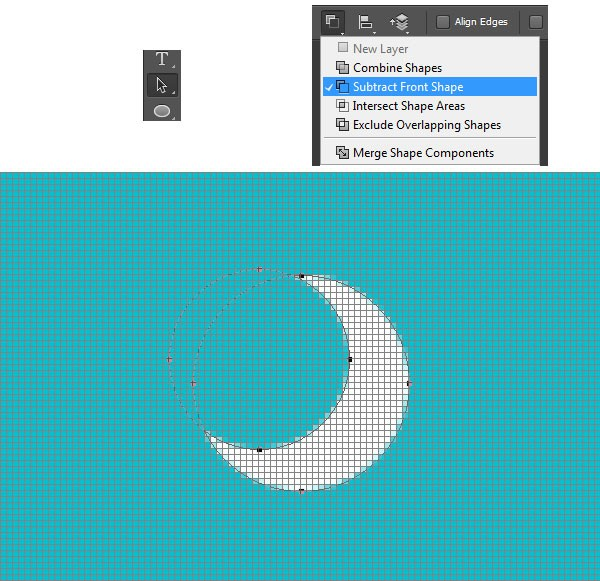

### Шаг 27. Стиль луны (копируем с облака)
ПКМ по слою **«Облачно»** → «Скопировать стиль слоя». Перейди на слой с луной → ПКМ → **«Вклеить стиль слоя»**.

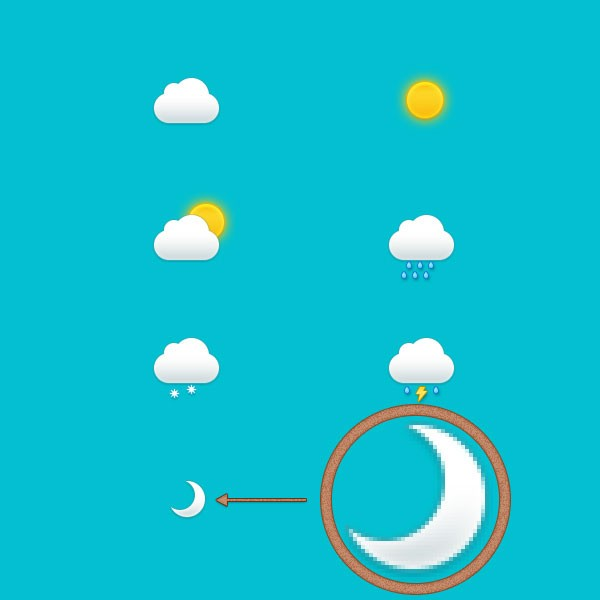

### Шаг 28. Поставь луну
Продублируй луну (`Ctrl+J`) — одна останется иконкой «Ночь», со второй сделаем «Ночь со звёздами». Расставь по местам.

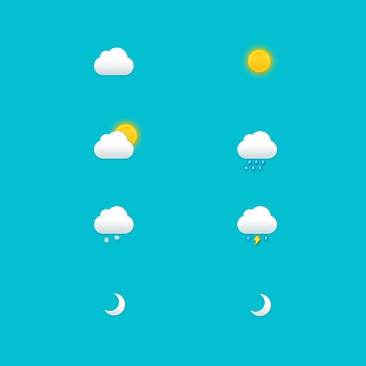

---

## 🌙✨ Иконка 8 — «Ночь со звёздами»

### Шаг 29. Звёзды Многоугольником
1. Возьми **«Многоугольник»** (`U`).
2. 🆕 **Как сделать звезду.** Кликни один раз по холсту — откроется окошко настроек: **число сторон 5**, включи **«Звезда»**, параметр **«Глубина лучей (Indent Sides By) 60%»**. *(В самых новых версиях диалога нет — те же настройки в панели **«Свойства»**: «Стороны» = 5, ползунок **«Соотношение сторон звезды» ≈ 40%**.)*
3. Нарисуй **3 звёздочки** разного размера (например, 11×12, 16×16 и 7×8 px) рядом с луной.
4. Скопируй стиль с луны и **вклей** на звёзды.

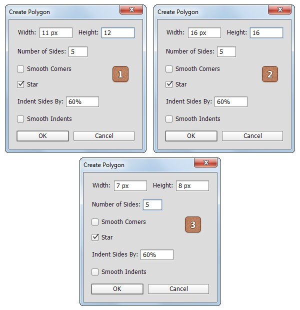
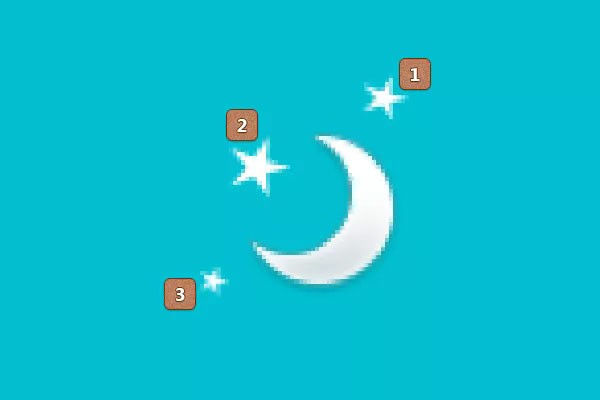

---

## 🏁 Итог — набор готов!

Получился аккуратный набор из **8 иконок погоды** в едином стиле. Сохрани:
- **`.PSD`** — `Файл → Сохранить как…` (все фигуры и стили останутся редактируемыми);
- **`.PNG`** — `Файл → Экспортировать → Быстрый экспорт в PNG`. Нужна **каждая иконка отдельно с прозрачным фоном**? Скрой слой-фон (глаз 👁) и экспортируй по одной, или `Файл → Экспортировать → Слои в файлы`.

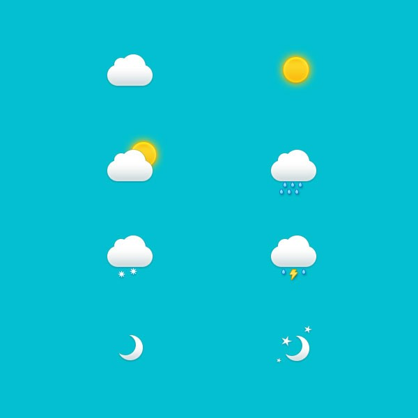

> 🔥 **Собери «виджет погоды»:** нарисуй карточку (Прямоугольник со скруглением) и положи на неё иконку + текст «+18°, солнечно». Готово — как в телефоне!

---

➡️ Дальше — **свой** набор иконок на другую тему: [практика.md](практика.md).
📄 Источник (оригинал со скринами) — [`материалы/Рисуем иконки погоды.docx`](материалы/Рисуем%20иконки%20погоды.docx).
