# 🕶️ Доп-проект «Эффектная обработка портрета» (к уроку 7)

**Фотомагия в Photoshop · доп-проект к Уроку 7 · 🎓 продвинутый, ~45–60 минут**

> 🧭 Это отдельный большой мастер-класс (чтобы не раздувать основной урок). Берём обычное фото парня у стены и превращаем его в **киношный глянцевый постер**: вырезаем модель, ставим на туманный лес, лечим и разглаживаем кожу, **перерисовываем линзы очков Пером**, добавляем свет, сплит-тонирование и финальную обработку в Camera Raw.
> ⚠️ Всё вручную, по шагам. Проект **собирает вместе почти всё, что ты уже умеешь** (маски, Перо из урока 6, коррекции, ретушь) и добавляет приёмы профи.
> 🆕 Исходный урок был написан для **старой версии Photoshop** — здесь все инструменты названы **по-современному**, а где в оригинале было написано «сделай как на картинке» — выписаны **точные настройки**.

---

## 🎬 Что сделаем и что получим

Из обычного снимка (парень в костюме у светлой стены) получим **стильный портрет-постер**: модель стоит в туманном лесу, кожа чистая и гладкая, линзы очков с градиентом, слева падает мягкий розовый свет, по углам — свечение, цвет — тёплый «янтарный» кино-грейд.

| Было | Станет |
|------|--------|
| 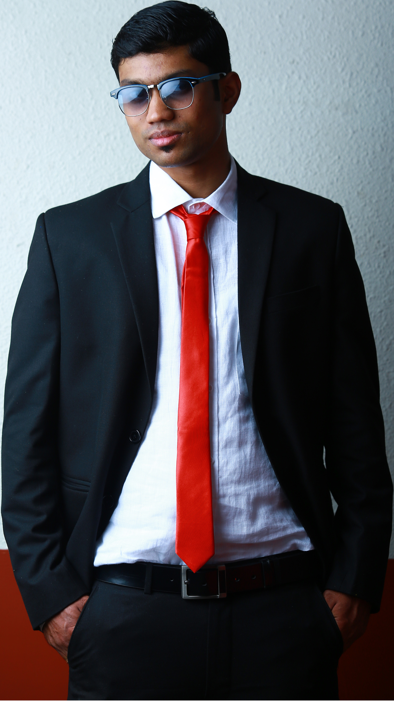 | 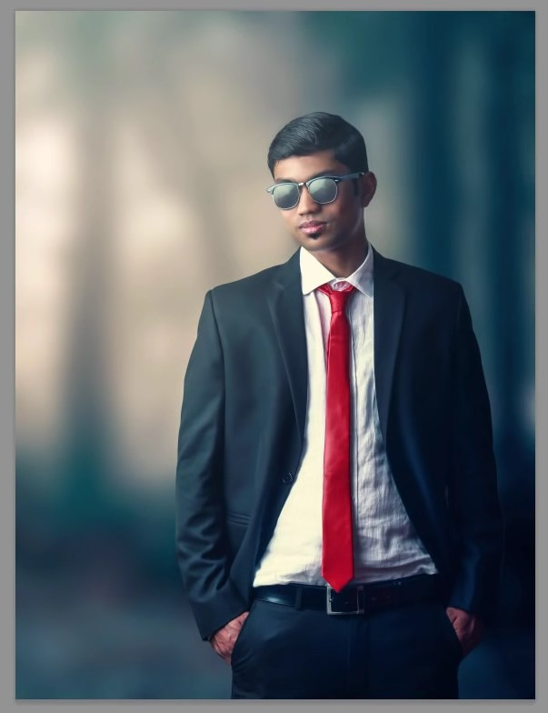 |

**Путь, который пройдём:**

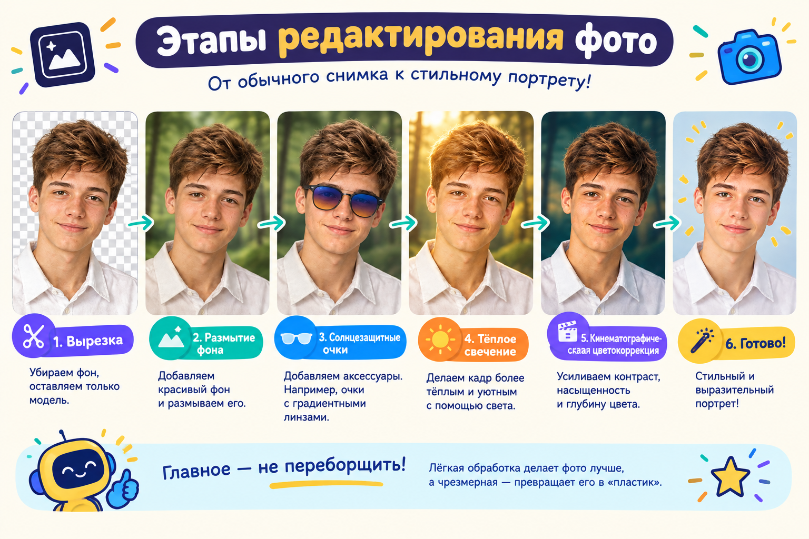

**📂 Материалы** (в папке [`материалы/`](материалы/)):
- `модель-исходник.jpg` — парень у стены (с него вырезаем модель);
- `фон-лес.jpg` — туманный лес (новый фон);
- `скриншоты-оригинал/` — все экраны оригинального урока (для учителя).

**🆕 Новые профи-приёмы этого проекта:**
- 🆕 **Микс-кисть** (Mixer Brush) — «живое» разглаживание кожи, как мазки художника;
- 🆕 **Перекрытие градиентом** в стиле слоя — рисуем блик на линзах очков;
- 🆕 **Поиск цвета** (Color Lookup) + 3D LUT — кино-грейд одним слоем;
- 🆕 **Сплит-тонирование Кривыми** — тени в холод, света в тепло;
- 🆕 **Dodge & Burn на сером слое** — лепим объём светом;
- 🆕 **Camera Raw как фильтр** — финальная «вкусная» доводка.

> 🔗 **Перо (Pen)** мы подробно разобрали в [уроке 6](../../урок-06-рисуем-иконки/theory.md). Здесь оно пригодится, чтобы обвести линзы очков — так что это ещё и тренировка Пера на «боевой» задаче.

---

## 🧭 Как читать

Шагов много, но каждый короткий. Делай строго по порядку: сохраняй почаще (`Ctrl+S`), не бойся откатывать (`Ctrl+Z`). Все **точные числа уже выписаны** — просто вводи их. Если устал — проекту можно сделать паузу: сохрани `.psd` со слоями и продолжи позже.

---

## Шаг 1. Вырезаем модель и ставим на новый фон

1. Открой `модель-исходник.jpg`.
2. Возьми **Перо** (`P`) и аккуратно обведи фигуру парня по контуру (замкни контур, вернувшись в первую точку — курсор покажет кружок ○).
3. Правый клик по контуру → **«Выделить область…»** (в старых версиях — *Make Selection / Образовать выделение*). **Растушёвка (Feather): 1 px** → `ОК`.
4. Нажми кнопку **маски** ▢ внизу панели слоёв — фон исчезнет, останется вырезанная модель. Если где-то остались кусочки стены — подкрась **чёрной кистью по маске**.

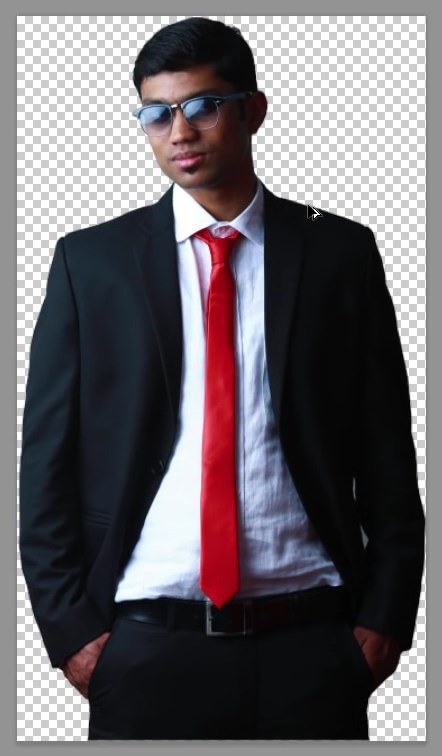

5. 🆕 **Уточняем край.** Раньше для этого была кнопка *Refine Edge (Уточнить край)* — **сейчас это «Выделение и маска…»** (`Выделение → Выделение и маска…`, или кнопка в панели параметров, когда активно выделение). Выстави такие значения в разделе **«Глобальное уточнение»**:
   - **Сгладить: 4**
   - **Растушёвка: 3 px**
   - **Контраст: 37 %**
   - **Сместить край: −18 %**
   - **Вывод в: Слой-маска** → `ОК`.

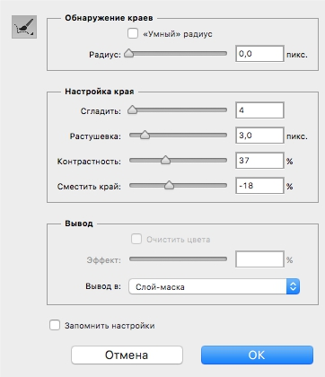

6. Тёмный ореол по краю модели уберём **стилем слоя**. Дважды кликни по слою → **Стиль слоя → Внутренняя тень** (Inner Shadow):
   - Режим наложения: **Умножение**, цвет **чёрный**;
   - **Непрозрачность: 78 %**; **Угол: 63°** (Глобальное освещение вкл);
   - **Смещение: 3 px**; **Стягивание: 0**; **Размер: 3 px** → `ОК`.

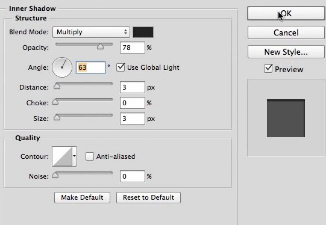

7. Переименуй слой в **`Model`**.

> 👀 **Результат:** модель чисто вырезана, край аккуратный, тёмной каймы нет.

---

## Шаг 2. Размываем фон

1. Перетащи `фон-лес.jpg` в документ (или `Файл → Поместить встроенные`), положи этот слой **под** `Model`.
2. **Фильтр → Размытие → Размытие по Гауссу** → **Радиус: 106 px** → `ОК`.

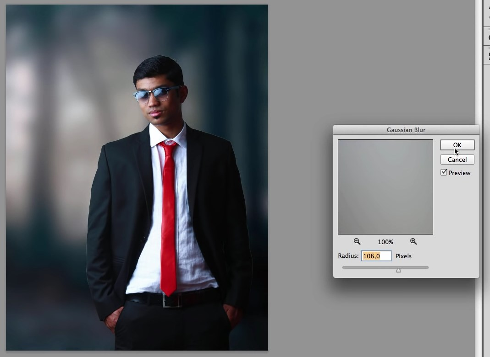

> 👀 **Результат:** лес превратился в мягкое размытое марево — модель «выходит вперёд», как на портрете с хорошим объективом. ⚠️ Если видно отдельные веточки — радиус мал, добавь.

---

## Шаг 3. Чистим и разглаживаем кожу

Работаем **неразрушающе**, на отдельных слоях-обтравках (чтобы в любой момент откатить).

### 3.1. Убираем дефекты
1. Создай новый слой (`Ctrl+Shift+N`), назови **`fix`**.
2. Сделай его **обтравочной маской** к `Model`: наведи курсор на границу между слоями с зажатым `Alt` и кликни (или `Ctrl+Alt+G`). Теперь `fix` действует только на модель.
3. Возьми **Точечную восстанавливающую кисть** (`J`), вверху в панели параметров включи **«Образец всех слоёв»**.
4. Кликай по прыщикам, точкам, лишним волоскам на лице — они исчезают.

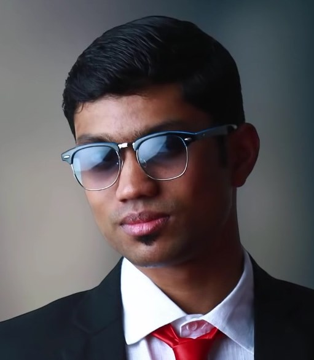

### 3.2. 🆕 Разглаживаем кожу Микс-кистью
1. Новый слой (`Ctrl+Shift+N`), назови **`soft`**, тоже сделай обтравочной маской (к `fix`).
2. Возьми 🆕 **Микс-кисть** (Mixer Brush) — она в группе с обычной Кистью (`B`), значок кисти с каплей. Это «живая» кисть: она **смешивает и размазывает** цвета, как настоящая кисть художника. Настройки сверху:
   - **Влажность (Wet): 10 %**
   - **Загрузка (Load): 18 %**
   - **Смешивание (Mix): 29 %**
   - **Нажим (Flow): 20 %**
   - галочка **«Образец всех слоёв»** вкл.

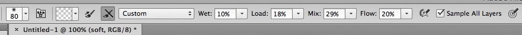

3. Мягко веди кистью по щекам, лбу, подбородку, шее — кожа **разглаживается, но остаётся «живой»** (не пластиковой). ⚠️ **Не заезжай** на глаза, брови, губы, контур лица и волосы — они должны остаться резкими.

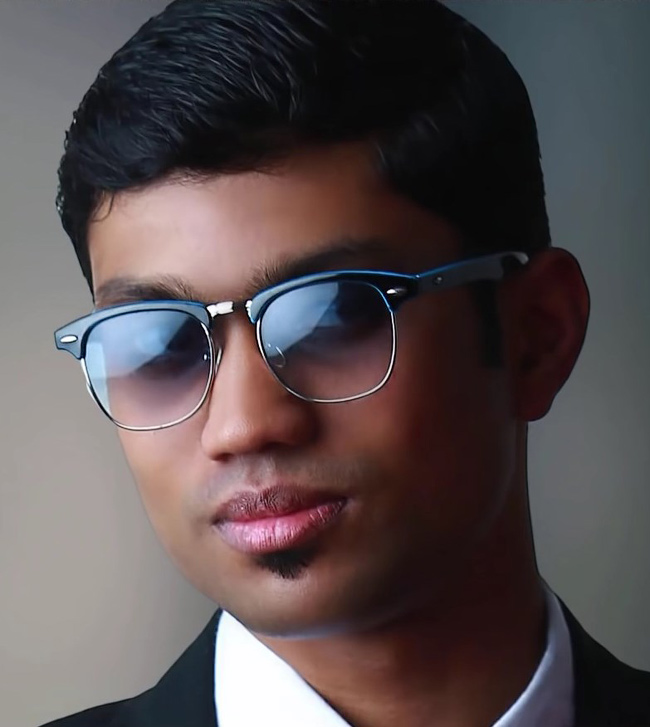

> 👀 **Результат:** кожа ровная и мягкая, но с текстурой — не «замыленная».

---

## Шаг 4. Перерисовываем линзы очков Пером 🖊️

Это самый «ювелирный» шаг — и лучшая тренировка **Пера из урока 6**.

1. Новый слой (`Ctrl+Shift+N`), назови **`R`** (правая линза).
2. Возьми **Перо** (`P`). Вверху в панели параметров переключи режим с **«Контур»** на 🆕 **«Фигура»** — теперь контур сразу заливается цветом.
3. Обведи Пером **правую (от нас) линзу** очков. Чтобы видеть линзу сквозь заливку, временно убавь **Заливку (Fill)** слоя до **64 %**.

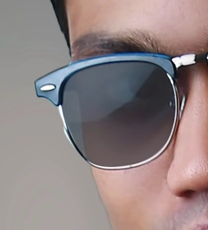

4. Так же сделай **левую линзу** на новом слое **`L`** (Непрозрачность тоже ~64 %).
5. 🆕 Теперь дадим линзам стеклянный блик. Дважды кликни по слою `R` → **Стиль слоя → Перекрытие градиентом** (Gradient Overlay):
   - Режим: **Перекрытие**; **Непрозрачность: 70 %**;
   - **Градиент: от `#2f2368` к `#ffffff`** (тёмно-фиолетовый → белый);
   - Стиль: **Линейный**; **Угол: 108°**; Масштаб: 100 % → `ОК`.

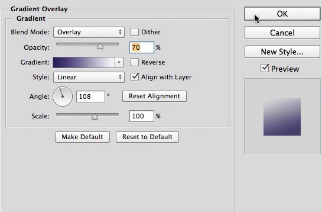

6. Перенеси этот стиль на вторую линзу: в панели слоёв **зажми `Alt` и перетащи значок `fx`** со слоя `R` на слой `L`.
7. Выдели оба слоя (`R` и `L`) и сгруппируй (`Ctrl+G`), назови группу **`Glasses`**.
8. Добавь поверх группы корректирующий слой **Цветовой тон/Насыщенность**, сделай его **обтравочной маской к группе** и сдвинь **Цветовой тон до −37** (линзы станут холоднее, в синеву).

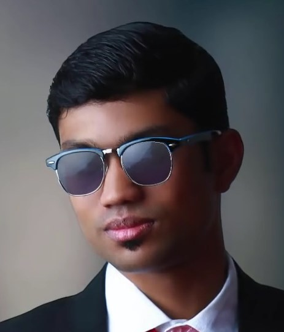

> 👀 **Результат:** плоские линзы превратились в **стеклянные очки с бликом**. ⚠️ Если контур «поехал» — белой **Стрелкой** (`A`) подвинь опорные точки или потяни за «усы» (как в уроке 6).

---

## Шаг 5. Добавляем тень от очков

1. Создай новый слой **под** группой `Glasses`, назови **`Glass Shadow`**.
2. **`Ctrl`+клик по миниатюре слоя `L`** — вокруг линзы появится выделение.
3. **Выделение → Модификация → Расширить → 5 px** (выделение станет чуть больше).
4. **Выделение → Инверсия** (`Shift+Ctrl+I`).
   > 🆕 В оригинальном уроке тут была опечатка (`Alt+Ctrl+I` — это «Размер изображения»!). Правильное сочетание для инверсии — **`Shift+Ctrl+I`**.
5. Возьми **Кисть** (`B`) с **низкой жёсткостью**, **Непрозрачность и Нажим — по 50 %** (в оригинале их по ошибке назвали «растушёвкой»), и мягко оставь **тень по контуру оправы**.
6. Повтори для правой линзы. Лишние мазки убери **Ластиком** (`E`). Если тень слишком тёмная — **Размытие по Гауссу 3 px**. Перетащи слой в группу `Glasses`.

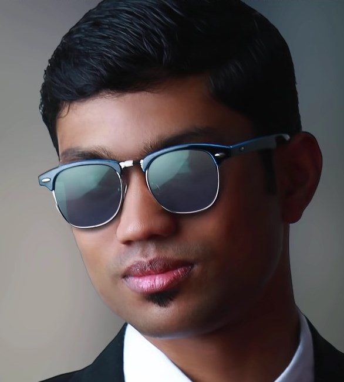

---

## Шаг 6. Мягкий розовый свет слева

1. Поверх всех слоёв создай корректирующий слой **Градиент** (заливка): градиент **от белого к прозрачному**.
2. Режим наложения слоя — **Мягкий свет**, **Непрозрачность: 30 %**. Сдвинь градиент так, чтобы свет падал слева на модель.

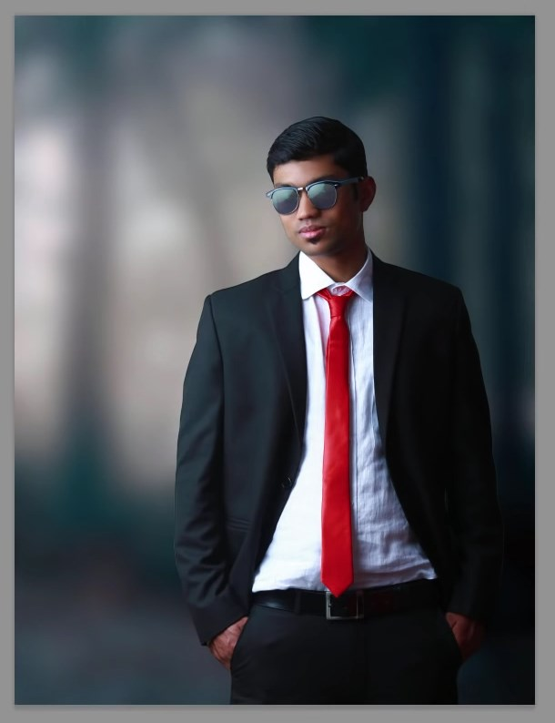

> 👀 **Результат:** слева по модели пошёл нежный световой градиент — кадр стал «атмосфернее».

---

## Шаг 7. 🆕 Кино-грейд: Поиск цвета (Color Lookup)

1. Создай корректирующий слой 🆕 **Поиск цвета** (Color Lookup).
2. В списке **«3D LUT File»** выбери **`Edgy Amber 3DL`** (тёплый янтарный пресет).
3. Убавь **Непрозрачность слоя до 15 %** — чтобы эффект был лёгким.

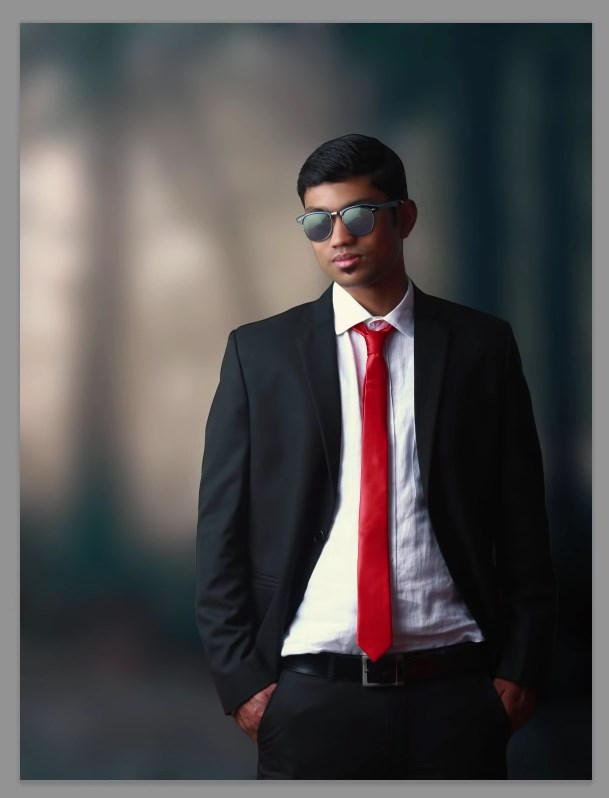

> 💡 **LUT** — это готовая «таблица цвета», как фильтр в кино. Одним слоем задаёт всему кадру настроение.

---

## Шаг 8. 🆕 Сплит-тонирование Кривыми

Сделаем тени чуть холоднее, а света теплее — классический киношный приём.

1. Создай корректирующий слой **Кривые** (Curves).
2. Вверху переключись на **Синий канал**.
3. Поставь **две точки**:
   - **нижнюю** (тени): **Вход 0 → Выход 15** (подними) — тени уходят в сине-голубой;
   - **верхнюю** (света): **Вход 255 → Выход 240** (опусти) — света уходят в тёплый жёлтый.

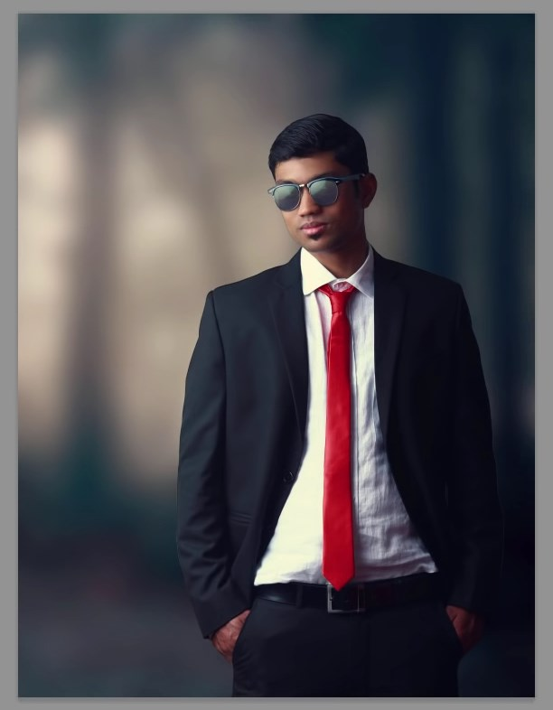

> 💡 Больше синего в тенях + меньше синего в светах = **холодные тени и тёплые света**. Это и есть сплит-тонирование.

---

## Шаг 9. Свечение в углу

Два способа — выбери любой.

**Способ А (корректирующий слой):** создай слой **Градиент** с цветом **от `#f6dfb2` к прозрачному**, стиль **Радиальный**, Угол 90°. Сдвинь свечение в **левый верхний угол**.

**Способ Б (своя кисть):** создай новый слой с режимом **Экран** (Screen). Возьми **Кисть** (`B`) с **огромным радиусом (3500–4000 px)**, цвет **`#90856b`**, сделай **один клик** в верхнем левом углу, затем **Свободным трансформированием** (`Ctrl+T`) растяни свечение. Назови слой **`Soft Glow`**.

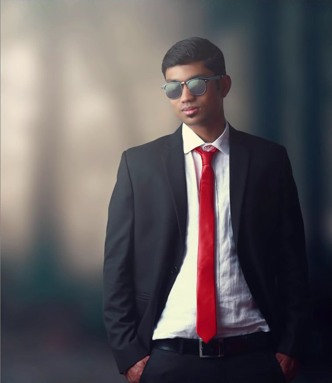

---

## Шаг 10. Цветовой баланс

Создай корректирующий слой **Цветовой баланс** (Color Balance) и выставь по тонам (галочка **«Сохранять свечение»** вкл для теней и средних тонов):

| Тон | Голубой–Красный | Пурпурный–Зелёный | Жёлтый–Синий |
|-----|:---:|:---:|:---:|
| **Тени** | −7 | +6 | +37 |
| **Средние тона** | −2 | +4 | +1 |
| **Света** | +9 | −2 | −19 |

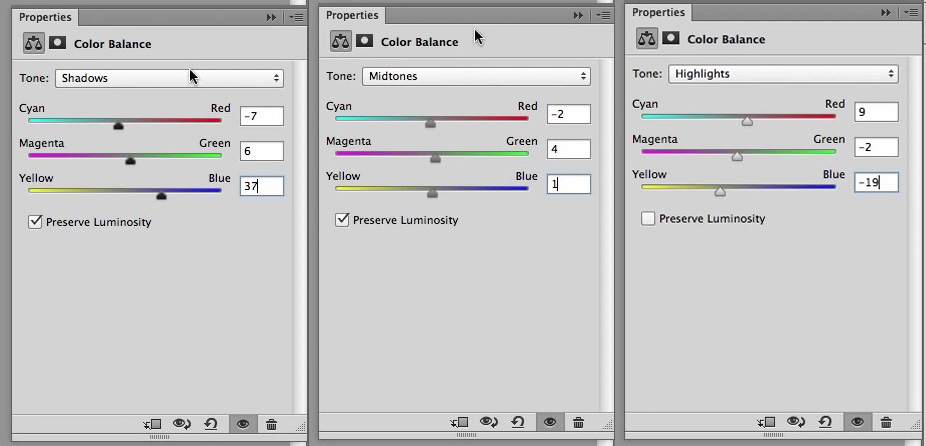

> 👀 Тени ушли в сине-зелёный, света — в тёплый. Картинка «собралась» по цвету.

---

## Шаг 11. 🆕 Объём светом — Dodge & Burn

1. Новый слой (`Ctrl+Shift+N`). **Редактирование → Выполнить заливку → Содержимое: «50 % серого»** → `ОК`. Режим наложения слоя — **Перекрытие** (серый станет невидимым, но на нём можно «рисовать свет»).
2. Возьми **Осветлитель** (`O`), **Экспозиция: 20 %**, и мягко пройди по **светлым участкам**: контур лацканов пиджака, складки рукавов, ремень, подбородок, блики на очках, светлые места губ, бровей, лица, шеи и волос (не забудь пробор).

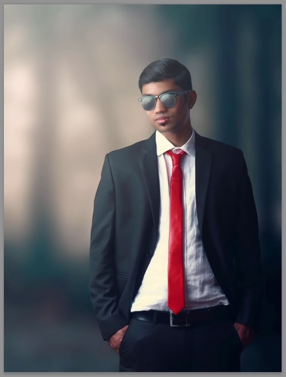

> ⚠️ **Заехал Осветлителем на фон?** Возьми **Кисть** серого цвета **`#808080`** и закрась лишний осветлённый кусочек прямо на этом сером слое — свет исчезнет.

---

## Шаг 12. 🆕 Финальная доводка в Camera Raw

1. **Объедини всё видимое в новый слой:** `Alt+Shift+Ctrl+E` — получится «отпечаток» всей картинки одним слоем поверх остальных.
2. **Фильтр → Camera Raw…** (`Shift+Ctrl+A`). Выставь настройки:

**Основное (Basic):**
- **Температура: −5**, **Оттенок: −8** (чуть холоднее);
- Экспозиция 0, Контраст 0, Света 0, **Тени: +19**, Белые 0, Чёрные 0;
- **Чёткость (Clarity): +48** (резкость деталей), **Сочность (Vibrance): +14**, Насыщенность 0.

**Кривая тона (параметрическая):**
- Света **+3**, Светлые тона **+2**, Тёмные тона **−2**, Тени **+8**.

**Раздельное тонирование** (🆕 в новых версиях называется **«Цветокоррекция» / Color Grading** с цветовыми кругами):
- **Света:** Тон **48**, Насыщенность **11**; **Баланс: +13**;
- **Тени:** Тон **227**, Насыщенность **13**.
  > 🆕 В круге «Цветокоррекции» это значит: **тени** увести в **синий** (≈227°), **света** — в **тёплый янтарный** (≈48°).

→ `ОК`.

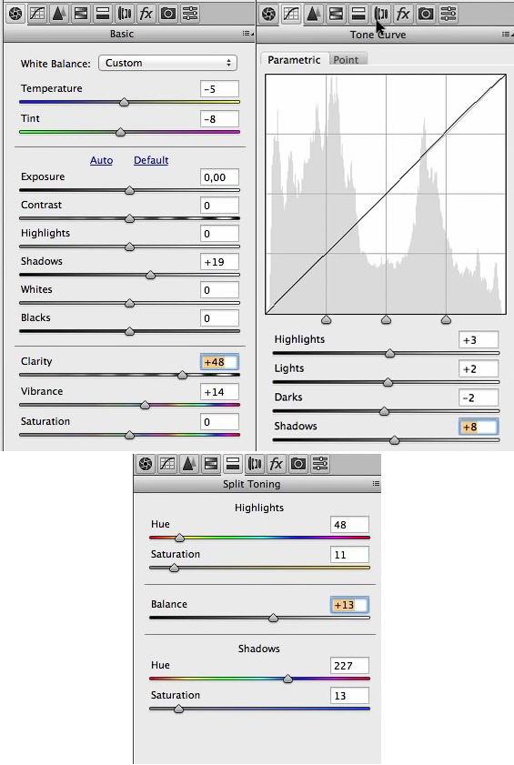

**🎉 Готово!** Обычное фото превратилось в стильный постер.

---

## ✅ Что освоили (новые профи-приёмы)

- 🆕 **Микс-кисть** — художественное разглаживание кожи;
- **Перо + Перекрытие градиентом** — перерисовали линзы очков со стеклянным бликом;
- 🆕 **Поиск цвета (3D LUT)** — кино-грейд одним слоем;
- 🆕 **Сплит-тонирование Кривыми** — холодные тени / тёплые света;
- 🆕 **Dodge & Burn на сером слое** — объём светом;
- 🆕 **Camera Raw как фильтр** — финальная доводка (чёткость, тон, цветокоррекция);
- собрали всё вместе с масками, обтравочными масками и коррекциями.

> 🎓 Это проект уровня 9–11 классов и всех, кто хочет «как в рекламе». Самый красивый момент — когда плоские линзы оживают градиентом, а Camera Raw в конце «склеивает» всю картинку.

➡️ Вернуться к [основному уроку 7](../theory.md).
