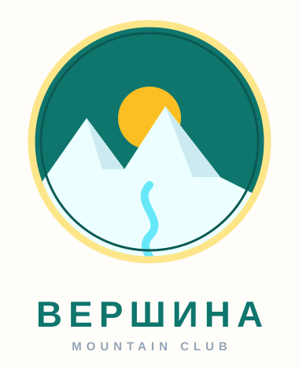

# Урок 2 — Перо и кривые Безье: логотип-знак ⛰️✒️

**Модуль 3 · Векторная графика · Урок 2 из 13 | 2 ак.ч. (1,5 часа)**

> 🔁 В начале — [разминка/повтор](повторение.md) (5 мин).
> 👨‍🏫 Сценарий с хронометражом — в [преподавателю.md](преподавателю.md).
> 🖼 Референсы логотипов и что показать — в [изображения.md](изображения.md) и в конце («Материалы»).
> ⚠️ Всё делаем **вручную**, без ИИ (никакого «текст → вектор», рисуем пером сами).

> 🧭 **Как читать урок.** В прошлый раз мы собирали иконки из **готовых фигур**. Но нужную форму не всегда найдёшь среди прямоугольников и кругов — например, извилистую реку или острые пики гор. Тогда берут **Перо** и рисуют форму **точка за точкой** по кривым Безье. Идём одним сквозным примером — рисуем **логотип-эмблему клуба «ВЕРШИНА»**: круглый значок с горами, солнцем и изгибом-рекой. Перо — самый капризный инструмент вектора, поэтому сначала его **приручим** на простом, а потом сделаем логотип. Каждый шаг расписан: что нажать, где кнопка, что появится, зачем и типичная ошибка.

---

## 🎬 Что мы сделаем сегодня и что получим

**Задача:** нарисовать **логотип-знак** — круглую эмблему в стиле «горного клуба»: острые **горы** (прямые отрезки пера), **солнце** за ними и плавный **изгиб реки** (кривая Безье), всё в аккуратном **круглом бейдже** с обводкой-кольцом.

**В итоге у тебя получится:** настоящий **вектор-логотип** ⛰️, который не размажется на любом размере — годится и на аватарку, и на футболку, и на баннер. Экспорт в **SVG/PNG**.

**Главный навык урока:** **Перо (Pen) и кривые Безье** — как ставить **опорные точки**, тянуть **направляющие-усы** для плавных изгибов, замыкать контур и править точки. Это — «супер-сила» вектора: пером можно нарисовать **любую** форму.

> 💡 Секрет пера: **клик** — острый угол (прямой отрезок), **клик-и-потяни** — плавный изгиб (появляются «усы»-направляющие). Всё перо — это два этих движения.

**🖼 Вот что должно получиться:**

---

## 🎯 Цель урока

К концу урока каждый ученик:
- Понимает, **что такое опорная точка** и **направляющие (усы)** кривой Безье;
- Рисует **Пером** прямые отрезки (клик) и **плавные кривые** (клик-потяни);
- **Замыкает** контур и **правит** точки (двигает, превращает угол↔сглаживание);
- Комбинирует перо с фигурами и **обводкой** (кольцо бейджа);
- Собирает **цельный логотип** и **экспортирует** его;
- Понимает **как правильно / как НЕ надо** (мало точек, ровные усы);
- *(9–11)* делает знак в двух версиях (цветной и одноцветный «штамп»).

---

## 🧭 Где что находится (перо в Figma)

- **«Перо» (Pen)** — вверху по центру, иконка перьевого наконечника, клавиша **`P`**.
- Рисуешь — кликаешь по холсту, ставя **точки**; между ними тянется контур.
- **Замкнуть контур** — кликнуть по **самой первой точке** (у курсора появится кружок ○).
- **Закончить/выйти** — `Enter` или `Esc`.
- **Править точки** — двойной клик по фигуре → **режим редактирования вектора** (точки станут видны). Тяни точки, тяни усы.
- **Согнуть отрезок / поменять угол↔кривую** — инструмент **«Изгиб» (Bend)** рядом с пером, либо в режиме правки навести на точку и потянуть.
- **Заливка/обводка** — справа в панели свойств (блоки Fill и Stroke), там же **толщина обводки**.

> 💡 Пока рисуешь пером — **не паникуй от «резинки»**: линия тянется за курсором, это нормально. Точка ставится только по клику.

---

## Часть 1 — 🎮 Приручаем Перо (10 минут)

Сначала — тренировка на черновике (отдельный фрейм «черновик»), чтобы рука привыкла.

> 🖨 **Трафарет для разминки** (распечатать или подложить под артборд): [трафарет-разминка-пера.svg](../урок-06-ai-перо-логотип-маскот/трафареты/трафарет-разминка-пера.svg) — зубцы (клик), горки и волна (клик-и-потяни) с отметками точек и стрелками усов. Обведи по образцу, потом повтори в «Практике».

### Упражнение 1. Прямые отрезки (треугольник)

1. Возьми **«Перо»** (`P`).
2. Кликни в трёх местах — получатся три точки, соединённые **прямыми**.
3. Кликни снова по **первой** точке (появится ○) — контур **замкнётся** в треугольник. `Enter`.

**👀 Вывод:** просто **клик** = острый угол и прямой отрезок.

### Упражнение 2. Плавная кривая (волна)

1. `P`. Кликни первую точку.
2. Для второй точки **кликни И, не отпуская, потяни** вбок — появятся **«усы» (направляющие)**, а отрезок **выгнется дугой**. Отпусти.
3. Поставь так 3–4 точки, каждый раз **чуть протягивая** — выйдет **волна** 〰️.

**👀 Вывод:** **клик-и-потяни** = плавный изгиб. Чем длиннее тянешь ус — тем круче дуга.

> 💡 **Усы (направляющие)** — это «рычаги» кривой. Они задают, **куда** и **насколько сильно** изгибается линия у точки. Короткий ус — мягкий поворот, длинный — крутая дуга.

⚠️ **Типичная ошибка:** ставить очень **много** точек, пытаясь «дорисовать» изгиб отрезками. Правильно — **мало точек, но с усами**. Плавную дугу делают 2 точки, а не 10.

---

## Часть 2 — Основа бейджа (6 минут)

Работаем во фрейме **«логотип»** (создай фрейм `F`, размер **400 × 400**).

1. **«Эллипс»** (`O`), с `Shift` — ровный круг **320 × 320** по центру. Залей тёмно-бирюзовым **#0F766E**. Это «небо» бейджа.
2. **Кольцо-обводка:** копия круга (`Ctrl+C`/`Ctrl+V`), чуть больше (**340 × 340**), убери заливку, включи **Обводку (Stroke)** золотую **#FDE68A**, толщина **8**. Выровняй по центру. Это рамка бейджа.
3. **Солнце:** маленький круг **120 × 120** амбер **#FBBF24**, помести в **верхней части** внутри бейджа (позже горы его частично закроют).

**👀 Что видишь:** бирюзовый круг с золотым кольцом и солнышком вверху. Основа готова.

---

## Часть 3 — ⛰️ Горы Пером (прямые отрезки) (14 минут)

Горы — это ломаная линия из **острых углов**, значит рисуем **кликами** (без протяжки).

1. Возьми **«Перо»** (`P`).
2. Начни **слева от круга**, на уровне середины. Кликай, рисуя **зубцы**: вниз-вверх-вниз, делая 2–3 **пика** (острые вершины) — как силуэт горной гряды. Дойди до **правого края** круга.
3. Дальше кликни **вниз к правому низу** круга, потом по **нижней дуге** обратно к старту и замкни контур (клик по первой точке ○). `Enter`.
4. Залей горы почти-белым **#ECFEFF**.

**👀 Что произойдёт:** внутри круга появятся **белые горы**, перекрывающие низ солнца — классический пейзаж-бейдж.

5. **Обрезка по кругу:** горы могут вылезти за круг. Выдели горы **и** круг-«небо» → **«Булевы группы» → «Пересечение выделения» (Intersect)** — останется только часть гор **внутри круга**. (🧩 младшим: просто двигай/масштабируй горы, чтобы не торчали.)

> 💡 **Intersect (Пересечение)** оставляет только **общую** часть — удобно «вписать» рисунок ровно в круг бейджа.

⚠️ **Типичная ошибка:** пытаться сделать острый пик горы **протяжкой** — получится «холмик». Для острых вершин — только **клик** (без усов).

---

## Часть 4 — 🌊 Река Пером (кривая Безье) (12 минут)

Теперь — плавная линия. Добавим извилистую **реку/дорогу** от подножия гор вниз.

1. **«Перо»** (`P`). Поставь первую точку у центра, ниже гор.
2. Веди вниз, ставя точки **клик-и-потяни**, чтобы линия **извивалась** змейкой (2–3 изгиба).
3. Не замыкай — это **открытая линия**. `Enter`.
4. Убери заливку, включи **Обводку** голубую **#67E8F9**, толщина **10**, **скруглённые концы** (в настройках обводки — «Round»).

**👀 Что видишь:** от гор вниз бежит плавная голубая река. Кривые = усы, помнишь?

5. **Правка:** двойной клик по реке → режим точек. Не нравится изгиб — **потяни точку** или её **ус**. Можно добавить/удалить точку.

> 💡 Если река «дёргается» углами — значит точки **угловые**. Наведи на точку инструментом **«Изгиб» (Bend)** и потяни — угол станет **плавным** (появятся усы). Так превращают угол в кривую.

---

## Часть 5 — Собираем логотип и текст (8 минут)

1. **Порядок слоёв** (панель слева): кольцо и «небо» — снизу, солнце — выше, горы — над солнцем, река — сверху. Проверь, чтобы всё читалось.
2. **Название:** «Текст» (`T`) → под бейджем впиши **ВЕРШИНА** жирным, вразрядку (широко). Цвет — тёмно-бирюзовый или золотой.
3. **Слоган-дуга** *(по желанию, 🎓):* мелкий текст «MOUNTAIN CLUB · EST. 2026» — можно пустить по дуге (текст по контуру, урок Illustrator) или просто прямой строкой.
4. Сгруппируй всё (`Ctrl+G`), назови группу **«лого ВЕРШИНА»**.

**Ожидаемый результат:** цельная эмблема ⛰️ — бейдж с горами, солнцем, рекой и названием.

---

## ✅ Как правильно / ❌ Как НЕ надо (перо и кривые)

| ❌ Как НЕ надо | ✅ Как правильно |
|----------------|------------------|
| 20 точек, чтобы «сгладить» дугу | **Мало точек** + усы: дуга = 2 точки |
| Острый пик горы делать протяжкой | Острый угол = **клик** (без усов) |
| Плавную реку — короткими отрезками | Плавно = **клик-и-потяни** (кривая Безье) |
| Забыть замкнуть контур горы | Замкнуть кликом по **первой** точке (○) |
| Логотип из тонких деталей на 5000×5000 | Проверить, что читается и **маленьким** (аватарка) |
| Экспорт в JPG | **SVG** (вектор) + **PNG** (прозрачность) |

> ⚠️ Главная ошибка новичка — **боязнь пера и куча лишних точек**. Правило пера: **минимум точек, максимум усов**. Плавность даёт не количество точек, а длина направляющих.

---

## Часть 6 — Экспорт (5 минут)

1. Выдели **фрейм «логотип»** (или группу лого).
2. Справа внизу **«Экспорт (Export)»** → **+** → выбери:
   - **SVG** — настоящий вектор (для сайта, футболки, Illustrator).
   - **PNG ×2** — картинка с прозрачным фоном (аватарка, чат).
3. **«Export …»** → папка.

**Проверка:** открой SVG в браузере и увеличь — идеально чёткий. Уменьши до размера аватарки — **всё ещё читается**? Значит логотип рабочий.

---

## 🎓 Часть 7 — Для 9–11: глубже (8 минут)

- **Одноцветная версия («штамп»):** сделай копию лого целиком в **одном цвете** (силуэт). Настоящий логотип обязан работать и в один цвет (печать, гравировка).
- **Чистка узлов:** зайди в правку и **удали лишние точки** (чем меньше — тем «чище» кривая).
- **Симметрия:** нарисуй половину знака пером, отрази копию — идеально ровный симметричный логотип.
- **Сетка/направляющие:** включи сетку (`Shift+G`) — точки встанут ровнее.
- **Свой знак без гор:** лиса, кораблик, кофе-чашка, молния — тем же пером.

---

## 🧩 Для 5–7 классов (проще)

- Реку можно **пропустить** — хватит гор + солнца в бейдже.
- Горы — из **треугольников** (инструмент фигуры), если перо пока трудно; перо тренируем на волне-черновике.
- Цвета берём готовые (учитель даёт палитру), текст — просто прямой строкой.

---

## 🏁 Итог урока (5 минут)

Сегодня освоили **супер-силу вектора — Перо**:

- ✅ **Опорные точки:** клик = угол, клик-и-потяни = кривая.
- ✅ **Усы (направляющие)** задают форму изгиба (длиннее — круче).
- ✅ **Замыкание** контура и **правка** точек (угол↔кривая через «Изгиб»).
- ✅ **Пересечение (Intersect)** — вписать рисунок в круг бейджа.
- ✅ **Обводка** (кольцо, река) + порядок слоёв + текст = цельный логотип.
- ✅ **Экспорт** SVG/PNG; проверка «читается ли маленьким».

> 🏆 Пером можно нарисовать что угодно! Дальше — **цвет, стили и компоненты** (урок 3): сделаем карточку/бейдж и научимся переиспользовать элементы.

> 🎤 **Блиц:** клик или протяжка для острого угла? что такое усы? как замкнуть контур? как превратить угол в кривую? почему логотип проверяют маленьким?

### 🎮 Викторина-закрепление

Открой **[викторина.html](викторина.html)** — вопросы про опорные точки, кривые Безье, замыкание контура и логотипы + смешные и «на подумать».

➡️ **Самостоятельная работа** (свой логотип другой темы + комбо) — в [практике](практика.md).
🧰 **Трюки урока** (перо без страха, чистые кривые) — в [лайфхак.md](лайфхак.md).

---

## 🔗 Материалы и ссылки к уроку

**🧰 Инструмент:** [Figma](https://www.figma.com/) — бесплатно, в браузере.

**📥 Референсы (для вдохновения, НЕ копировать):**
- 🏔 **Эмблемы/бейджи:** поиск в браузере — *vintage badge logo*, *mountain emblem logo*, *outdoor badge*.
- ✒️ **Тренажёр пера:** [The Bézier Game](https://bezier.method.ac/) — весёлая игра, чтобы «прокачать» перо.
- 🅰️ **Шрифты:** [Google Fonts](https://fonts.google.com/) — жирные «Oswald», «Bebas Neue» для названия.

**🎬 Вдохновение:** YouTube (рус.): *«перо в Figma»*, *«кривые Безье для начинающих»*, *«логотип-бейдж»*.

**⚙️ Учителю:** дать поиграть в The Bézier Game 3–4 мин перед логотипом; приготовить палитру и 2–3 референса бейджей. Список — в [изображения.md](изображения.md).
