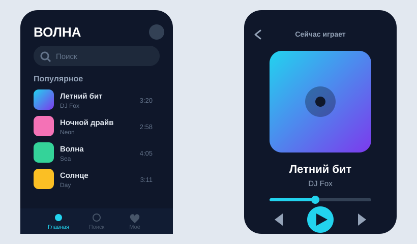

# Урок 4 — Автолейаут и прототип: экран приложения, который «работает» 📱👆

**Модуль 3 · Векторная графика · Урок 4 из 13 (финал блока Figma) | 2 ак.ч. (1,5 часа)**

> 🔁 В начале — [разминка/повтор](повторение.md) (5 мин).
> 👨‍🏫 Сценарий с хронометражом — в [преподавателю.md](преподавателю.md).
> 🖼 Референсы приложений и что показать — в [изображения.md](изображения.md) и в конце («Материалы»).
> ⚠️ Всё делаем **вручную**, без ИИ (никакой генерации экранов — собираем сами).

> 🧭 **Как читать урок.** Это **последний урок Figma** — соберём всё вместе и сделаем **настоящий макет приложения**, который можно **потыкать пальцем**, как на телефоне. Идём одним сквозным примером — дизайним музыкальное приложение **«ВОЛНА»**: главный экран со списком треков и нижним меню + экран плеера, и **связываем их прототипом** (нажал на трек → открылся плеер). Новая суперсила — **Автолейаут (Auto layout)**: элементы сами выравниваются и расставляются с равными отступами. Каждый шаг расписан: что нажать, где кнопка, что появится, зачем и типичная ошибка.

---

## 🎬 Что мы сделаем сегодня и что получим

**Задача:** нарисовать **два экрана** мобильного приложения «ВОЛНА» — **Главный** (шапка, поиск, список треков, нижнее меню) и **Плеер** (обложка, название, кнопка Play). Собрать список на **автолейауте** (сам расставляет строки), а потом **связать экраны**: тап по треку открывает плеер. Запустить **прототип** и потыкать, как настоящее приложение.

**В итоге у тебя получится:** **кликабельный прототип приложения** 📱 — открываешь режим просмотра, жмёшь на трек, листаешь между экранами. Это то, что дизайнеры показывают заказчикам ещё **до программистов**.

**Главный навык урока:** **Автолейаут** (авто-расстановка и отступы) + **Прототип** (связи между экранами, режим просмотра). Так делают интерфейсы приложений и сайтов по всему миру.

> 💡 Секрет автолейаута: не двигай элементы вручную по пикселям. Скажи Figma «расставь их в столбик с отступом 12» — и она **сама** держит ровные промежутки, даже когда добавляешь/убираешь элементы.

**🖼 Вот что должно получиться:**

---

## 🎯 Цель урока

К концу урока каждый ученик:
- Создаёт **экран-фрейм** телефона (390 × 844) и раскладывает блоки;
- Применяет **Автолейаут** (направление, отступы, промежутки, выравнивание);
- Понимает **Hug / Fill / Fixed** (как элемент подстраивает размер);
- Строит **список** (строка-компонент × N) и **нижнее меню** на автолейауте;
- Делает **кликабельный прототип**: связь «по тапу → перейти на экран»;
- Запускает **режим просмотра** и проверяет переходы;
- Понимает **как правильно / как НЕ надо**;
- *(9–11)* добавляет анимацию перехода и 3-й экран.

---

## 🧭 Где что находится (автолейаут и прототип)

- **Автолейаут** — выдели объекты → клавиши **`Shift+A`** (или в панели справа блок **«Auto layout»** → **+**). Появятся настройки: **направление** (↓/→), **промежуток (gap)**, **отступы (padding)**, **выравнивание** (сетка 3×3).
- **Размер элемента:** в автолейауте у ширины/высоты есть режимы **Hug** (по содержимому), **Fill** (растянуть на контейнер), **Fixed** (фиксированный).
- **Прототип** — вкладка **«Prototype»** справа вверху (рядом с «Design»). В ней у выделенного объекта появляется **синий узелок ○** на краю — тянешь стрелку к другому экрану.
- **Режим просмотра (Play)** — кнопка **▶** справа вверху окна. Откроется прототип — кликай.
- **Экраны (Frames)** — каждый экран это отдельный фрейм; удобно назвать «Главный», «Плеер».

> 💡 Автолейаут — это «умная группа»: она сама держит отступы и выравнивание. Добавил строку — остальные подвинулись сами.

---

## Часть 1 — 🎮 Приручаем Автолейаут (10 минут)

Тренируемся на простом — соберём **кнопку** и **строку**.

### Кнопка на автолейауте

1. «Текст» (`T`) → напиши **Play**. 
2. Выдели текст → **`Shift+A`** — вокруг появится рамка-контейнер.
3. Справа настрой **отступы (padding)**: 16 по бокам, 12 сверху/снизу. Залей контейнер цветом — получилась **кнопка**, которая **сама по размеру текста** (Hug).
4. Поменяй текст на **Слушать** — кнопка **растянулась сама**! Вот она, магия: не надо подгонять фон вручную.

### Строка списка

1. Слева — маленький круг (обложка **48×48**), рядом текст «Название трека», справа — «3:20».
2. Выдели все три → **`Shift+A`** (направление **горизонтальное →**), промежуток **12**, выравнивание по центру.
3. Между названием и временем поставь распор: у текста-названия ширину — **Fill** (растянуть) → время «уедет» вправо. Аккуратная строка!

**👀 Вывод:** автолейаут сам держит отступы и выравнивание. Меняешь содержимое — всё подстраивается.

> ⚠️ **Типичная ошибка:** расставлять элементы «на глаз» пробелами и линейкой. Автолейаут делает это **точно и сам**.

---

## Часть 2 — Экран «Главный» (16 минут)

1. **Фрейм телефона:** «Фрейм» (`F`) → справа выбери пресет **iPhone 14 (390 × 844)** (или задай вручную). Назови фрейм **«Главный»**. Залей тёмным **#0F172A**.
2. **Шапка:** вверху крупный текст **ВОЛНА** (белый, жирный) + иконка профиля справа. Оберни в горизонтальный автолейаут с распором (Fill).
3. **Поиск:** прямоугольник со скруглением 16, тёмно-серый **#1E293B**, внутри иконка лупы + текст «Поиск». Автолейаут (padding).
4. **Заголовок:** «Популярное» (белый, поменьше).
5. **Список треков:**
   - Сделай **строку трека** (из Части 1) → преврати в **компонент** (`Ctrl+Alt+K`, как в уроке 3).
   - Поставь **5–6 копий** строки. Выдели их все → **`Shift+A`** (направление **вертикальное ↓**), промежуток **12**. Получился ровный **список**.
   - В копиях поменяй названия («Летний бит», «Ночной драйв», …) и время — override, связь цела.
6. **Нижнее меню (навбар):** внизу экрана — 3 иконки (🏠 Главная · 🔍 Поиск · ❤️ Моё) с подписями. Выдели → **`Shift+A`** (горизонтально, равные промежутки: выравнивание «Space between»). Подложи тёмную плашку.

**👀 Что видишь:** законченный главный экран приложения — шапка, поиск, аккуратный список, меню внизу. 📱

> 💡 **Список на автолейауте = живой.** Добавишь трек — весь список сам сдвинется, отступы останутся ровными. Никогда не двигай строки вручную.

---

## Часть 3 — Экран «Плеер» (10 минут)

1. Скопируй фрейм «Главный» рядом (`Ctrl+C`/`Ctrl+V`), очисти содержимое, назови **«Плеер»**.
2. **Стрелка «назад» ‹** вверху слева.
3. **Обложка:** большой квадрат со скруглением (**300 × 300**), градиент (как в уроке 3) — «арт альбома».
4. **Название трека** (крупно) + исполнитель (серым) под обложкой.
5. **Полоса прогресса:** тонкий прямоугольник-дорожка + кружок-бегунок.
6. **Кнопки управления:** ⏮ ▶ ⏭ в ряд (горизонтальный автолейаут), центральная **Play** — большая круглая, акцентный цвет **#22D3EE**.

**Ожидаемый результат:** экран плеера с обложкой и кнопкой Play. 🎵

---

## Часть 4 — 👆 Прототип: оживляем экраны (12 минут)

Свяжем экраны, чтобы приложение «работало».

### Шаг 1. Переход «трек → плеер»

1. Переключись на вкладку **«Prototype»** (справа вверху).
2. Выдели **первую строку трека** на Главном. На её краю появится **синий кружок ○** — **потяни стрелку** от него на фрейм **«Плеер»**.
3. В окошке связи выбери: **«On tap» (по тапу)** → **«Navigate to» (перейти к)** → Плеер. Анимация — **«Move in»** (выезжает) или «Instant».

### Шаг 2. Кнопка «назад»

1. Выдели стрелку **‹** на Плеере → потяни связь на фрейм **«Главный»** → «On tap → Navigate to → Главный», анимация **«Move out»**.

### Шаг 3. Запуск

1. Нажми **▶ (Play)** справа вверху окна — откроется **режим просмотра**.
2. **Кликни по треку** — открылся плеер! Нажми **‹** — вернулся на главный. **Работает, как настоящее приложение!** 🎉

**Ожидаемый результат:** кликабельный прототип из 2 экранов с переходами туда-обратно.

> 💡 Прототип — это **не программа**, а «интерактивная картинка». Но заказчику/другу можно дать ссылку — и он потыкает приложение ещё до того, как его напишут программисты.

---

## ✅ Как правильно / ❌ Как НЕ надо (макет и прототип)

| ❌ Как НЕ надо | ✅ Как правильно |
|----------------|------------------|
| Расставлять элементы пробелами/на глаз | **Автолейаут**: направление, gap, padding |
| Двигать строки списка вручную по одной | Список — **вертикальный автолейаут** (сам держит отступы) |
| Копировать строки как группы | Строка — **компонент** (урок 3), правим мастер |
| Рисовать «экран» без рамки-фрейма | Каждый экран — **фрейм телефона** (390×844) |
| Показать статичную картинку | Связать **прототипом** и дать потыкать |
| Время/детали «уезжают» криво | Ширина **Fill** для распора, выравнивание по центру |

> ⚠️ Главная ошибка новичка — **не использовать автолейаут** и мучиться с ровными отступами вручную. Автолейаут экономит кучу времени и всегда ровный.

---

## Часть 5 — Поделиться прототипом (5 минут)

1. **Ссылка:** кнопка **«Share»** вверху справа → «Copy link» — можно отправить, кто угодно **потыкает прототип в браузере** (без установки).
2. **Картинки экранов:** выдели фреймы «Главный»/«Плеер» → «Экспорт» → **PNG ×2** — для портфолио/презентации.

**Ожидаемый результат:** ссылка на живой прототип + PNG экранов.

> 💡 Ссылка на прототип — сильный пункт в портфолио: «вот моё приложение, потыкай сам».

---

## 🎓 Часть 6 — Для 9–11: глубже (8 минут)

- **3-й экран** (Поиск или Профиль) + переход из нижнего меню.
- **Smart Animate:** одинаковые элементы на двух экранах Figma **плавно анимирует** между ними (обложка «вырастает» из строки в плеер) — вау-эффект.
- **Оверлей:** всплывающее окошко (меню/попап) поверх экрана — «Open overlay».
- **Состояния кнопки:** варианты-компонента (обычная/нажатая) + interaction «While pressing».
- **Сетки (Layout grid):** включи колоночную сетку 4 колонки — выравнивай по ней.

---

## 🧩 Для 5–7 классов (проще)

- Хватит **1 экрана** + простой переход на 2-й (например, «старт → главный»).
- Список — **3 строки**. Автолейаут — только для списка (остальное можно вручную).
- Иконки меню — **эмодзи**.

---

## 🏁 Итог урока (5 минут) — и финал блока Figma

Сегодня собрали **работающий макет приложения**:

- ✅ **Автолейаут:** сам расставляет и держит отступы (gap, padding, направление).
- ✅ **Hug / Fill / Fixed:** элементы подстраивают размер.
- ✅ **Список** из компонента-строки + **навбар** на автолейауте.
- ✅ **Прототип:** связи «по тапу → перейти», режим просмотра, кнопка «назад».
- ✅ **Поделиться** ссылкой + экспорт экранов.

> 🏆 **Ты прошёл Figma!** За 4 урока — от иконок до кликабельного приложения. Дальше — **Illustrator** (уроки 5–12): там богатая иллюстрация — глянцевые объекты, персонажи, поп-арт, сцены. Начнём с флэт-иконок еды и **Обработки контуров (Pathfinder)**.

> 🎤 **Блиц:** что делает автолейаут? чем Hug отличается от Fill? как связать два экрана? как запустить прототип? почему список делают автолейаутом?

### 🎮 Викторина-закрепление

Открой **[викторина.html](викторина.html)** — вопросы про автолейаут, компоненты, прототип и переходы + смешные и «на подумать».

➡️ **Самостоятельная работа** (своё приложение другой темы + комбо) — в [практике](практика.md).
🧰 **Трюки урока** (автолейаут, прототип, Smart Animate) — в [лайфхак.md](лайфхак.md).

---

## 🔗 Материалы и ссылки к уроку

**🧰 Инструмент:** [Figma](https://www.figma.com/) — бесплатно, в браузере. Прототип работает по ссылке без установки.

**📥 Референсы (для вдохновения, НЕ копировать):**
- 📱 **UI приложений:** [Mobbin](https://mobbin.com/), поиск — *music app ui*, *mobile app design*, *app home screen*.
- 🎯 **Иконки для меню:** [Flaticon](https://www.flaticon.com/) или свои из урока 1.
- 🌈 **Палитры:** [Coolors](https://coolors.co/).

**🎬 Вдохновение:** YouTube (рус.): *«автолейаут Figma»*, *«прототип в Figma»*, *«дизайн приложения Figma»*.

**⚙️ Учителю:** заранее собрать макет самому (особенно прототип-связи и Play), приготовить пресет телефона и эмодзи-иконки меню младшим. Список — в [изображения.md](изображения.md).
