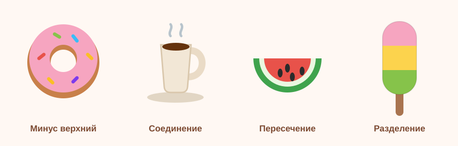

# Урок 5 — Illustrator старт: флэт-иконки и Обработка контуров 🍩☕🍉🍦

**Модуль 3 · Векторная графика · Урок 5 из 13 (старт блока Illustrator) | 2 ак.ч. (1,5 часа)**

> 🔁 В начале — [разминка/повтор](повторение.md) (5 мин).
> 👨‍🏫 Сценарий с хронометражом — в [преподавателю.md](преподавателю.md).
> 🖼 Референсы иконок и что показать — в [изображения.md](изображения.md) и в конце («Материалы»).
> ⚠️ Всё делаем **вручную**, без ИИ (никакого «Текст → вектор», рисуем сами).

> 🧭 **Как читать урок.** Мы освоили Figma (интерфейсы). Теперь — **Adobe Illustrator**, где рождается богатая **иллюстрация**: персонажи, глянец, поп-арт, сцены. Начнём мягко — с интерфейса и **набора флэт-иконок «Перекус»** 🍩☕🍉🍦. Главный герой урока — панель **«Обработка контуров» (Pathfinder)**: она **склеивает, вырезает, пересекает и разрезает** фигуры. Хитрость урока: **каждая иконка учит одной «суперсиле»** Pathfinder. Каждый шаг расписан: что нажать, где кнопка (в актуальном Illustrator, рус. интерфейс), что появится, зачем и типичная ошибка.

---

## 🎬 Что мы сделаем сегодня и что получим

**Задача:** нарисовать **4 флэт-иконки** еды из простых фигур и «Обработки контуров»: 🍩 донат (вырезаем дырку), ☕ кофе (склеиваем чашку с ручкой), 🍉 арбуз (пересечение в дольку), 🍦 мороженое (разрезаем на цветные полосы). Всё — в **едином флэт-стиле**, на монтажных областях, как настоящий набор для приложения.

**В итоге у тебя получится:** аккуратный **набор иконок** 🍩☕🍉🍦 и уверенное владение **Pathfinder** — а это основа почти любой векторной иллюстрации. Экспорт в **SVG/PNG**.

**Главный навык урока:** **«Обработка контуров» (Pathfinder)** — 4 режима: **Соединение** (склеить), **Минус верхний** (вырезать), **Пересечение** (оставить общее), **Разделение** (разрезать на части). Плюс — база Illustrator: документ, монтажные области, заливка/обводка.

> 💡 Секрет Illustrator: сложную форму не рисуют «одним куском». Её **собирают из простых фигур** и обрабатывают Pathfinder-ом — склеивают и режут, как из пластилина.

**🖼 Вот что должно получиться** (каждая иконка — своя операция):

---

## 🧭 Где что находится в Illustrator (запомни — весь блок пригодится)

- **Панель инструментов** — **слева**: «Выделение» (`V`, чёрная стрелка — двигать целиком), «Прямое выделение» (`A`, белая стрелка — тянуть отдельные точки), «Прямоугольник» (`M`), «Скруглённый прямоугольник» (в той же группе), «Эллипс» (`L`), «Перо» (`P`), «Отрезок линии» (`\`).
- **Заливка и обводка** — **внизу панели инструментов** два квадрата (верхний — Заливка, за ним — Обводка). Двойной клик открывает палитру.
- **Панель «Свойства» (Properties)** — **справа**: заливка, обводка, размеры, выравнивание, быстрые действия. *(Если её нет: `Окно → Свойства`.)*
- **Панель «Обработка контуров» (Pathfinder)** — открой: **`Окно → Обработка контуров`** (или `Shift+Ctrl+F9`). Верхний ряд — **Режимы фигур**, нижний — **Обработка контуров**.
- **Монтажные области (артборды)** — «листы» под каждую иконку; инструмент «Монтажная область» (`Shift+O`).
- **Панель «Слои»** — `Окно → Слои` (справа).
- **Строка меню** — сверху (Файл, Правка, Объект, Эффект, Окно…).

> ⚠️ **Важно про старые уроки/переводы.** В интернете «Обработку контуров» иногда зовут «панель Навигатора», кнопки — «Добавить/Вычесть/Разделить». В актуальном Illustrator это: **Обработка контуров** → **Соединение / Минус верхний / Пересечение / Разделение**. И `Command` (Mac) = **`Ctrl`** (Windows).

---

## Часть 1 — Готовим документ (5 минут)

1. **`Файл → Создать`** → профиль **RGB**, единицы — **пиксели**, размер, например, **1200 × 400** (в ряд поместятся 4 иконки). `Создать`.
2. *(полезная настройка)* **`Правка → Настройки → Основные`** → «Шаг клавиш со стрелками» поставь **1 пиксель** — двигать объекты станет точнее.
3. Открой **`Окно → Обработка контуров`** — панель встанет справа. Это наш главный инструмент сегодня.

**👀 Что видишь:** чистый лист и панель Pathfinder с двумя рядами кнопок. Готовы.

> 💡 **Заливка/обводка:** привыкай сразу задавать **заливку** (цвет фигуры) и при желании убирать **обводку** (контур). Для флэт-иконок часто обводка не нужна — только заливка.

---

## Часть 2 — 🍩 Донат: «Минус верхний» (вырезаем дырку) (12 минут)

Первая суперсила — **вырезать одну фигуру из другой**.

1. **«Эллипс»** (`L`), с `Shift` (ровный круг) → нарисуй круг **180 × 180**. Залей розовой глазурью **#F6A5C0**, обводку убери.
2. Ещё круг **80 × 80** — это будущая **дырка**, помести **точно в центр** большого (выдели оба → в «Свойства» выравнивание «По центру» гориз. и верт.).
3. Выдели **оба круга** (`V`, рамкой) → на панели **«Обработка контуров»** нажми **«Минус верхний»** (Minus Front — верхняя фигура «прорезает» нижнюю).

**👀 Что произойдёт:** в центре появится **настоящая дырка** — получилось кольцо доната.

4. **Тесто под глазурью:** копия кольца (`Ctrl+C`, `Ctrl+F` — вставить на передний план), залей коричневым **#C8804A**, чуть увеличь и уведи **назад** (`Ctrl+[`), сдвинь на 4 пикс вниз — выглянет «бочок» теста.
5. **Посыпка:** «Скруглённый прямоугольник» крошечный, разноцветный, накидай 5–6 штук поверх, поверни по-разному.

**Ожидаемый результат:** флэт-донат с дыркой и посыпкой. 🍩

> ⚠️ **Типичная ошибка:** нажать «Минус верхний», когда маленький круг **под** большим. Режет **верхняя** фигура — дырявящий круг должен быть **сверху**.

---

## Часть 3 — ☕ Кофе: «Соединение» (склеиваем) (12 минут)

Вторая суперсила — **слить фигуры в одну**.

1. **Тело чашки:** «Скруглённый прямоугольник» **140 × 150** (чуть сужается книзу — можно потом Прямым выделением `A` поджать нижние точки). Залей белым/кремовым.
2. **Ручка:** сделай кольцо, как у доната: два эллипса (**70 × 70** и **40 × 40**) → «Минус верхний» → колечко. Помести справа на уровне середины чашки.
3. Выдели **тело + ручку** → **«Соединение»** (Unite) на панели «Обработка контуров».

**👀 Что произойдёт:** чашка и ручка **сольются в один силуэт** — как цельная кружка.

4. **Кофе внутри:** сверху узкий эллипс тёмно-коричневый **#66330E** (поверхность напитка).
5. **Пар:** «Перо» (`P`) — 2 волнистые линии вверх, обводка серая, «Круглая заглушка», без заливки (перо/кривые — из урока 2).

**Ожидаемый результат:** флэт-чашка кофе с паром. ☕

> 💡 **Соединение (Unite)** = «сварить в один силуэт». Так собирают тело персонажа, облака, кляксы — всё, что должно стать **одной** фигурой одного цвета.

---

## Часть 4 — 🍉 Арбуз: «Пересечение» (оставляем общее) (10 минут)

Третья суперсила — **оставить только пересечение** двух фигур.

1. Три круга один в другом (выравнивай по центру): **200 × 200** зелёная корка **#3FA34D**; **170 × 170** светлая мякоть-прослойка **#EAF7E1**; **150 × 150** красная мякоть **#E8524A**. Сгруппируй (`Ctrl+G`).
2. **Прямоугольник** (`M`) поверх, закрывающий **нижнюю половину** кругов (граница — по центру кругов).
3. Выдели **группу кругов + прямоугольник**… но Пересечение работает с простыми фигурами — проще так: выдели **прямоугольник и каждый круг по отдельности** и делай Пересечение, **либо** (проще для новичка) выдели прямоугольник + группу и на панели нажми **«Пересечение»** — останется только **нижняя полукруглая долька**.

**👀 Что произойдёт:** от кругов останется **半 = полукруг** — ломтик арбуза. 🍉

4. **Семечки:** маленький тёмный эллипс, скопируй 4–5 раз, разложи по мякоти (`Ctrl+C`/`Ctrl+V`).

**Ожидаемый результат:** долька арбуза с семечками.

> 💡 **Пересечение (Intersect)** оставляет только **общую** зону фигур. Удобно «обрезать» рисунок ровной формой (как мы обрезали горы в круг в уроке 2 — там это звалось Intersect в Figma).

---

## Часть 5 — 🍦 Мороженое: «Разделение» (разрезаем на части) (12 минут)

Четвёртая суперсила — **разрезать фигуру на куски линиями**.

1. **«Скруглённый прямоугольник»** **120 × 200** (вертикальный, верх закруглён сильнее) — тело эскимо. Залей любым цветом.
2. **Две горизонтальные линии** «Отрезок линии» (`\`) поперёк тела — делят его на **три полосы**. Выдели линии, сгруппируй.
3. Выдели **тело + линии** → **«Разделение»** (Divide) на панели «Обработка контуров».
4. Теперь части разрезаны, но сгруппированы: **`Правый клик → Разгруппировать`** (`Shift+Ctrl+G`). Залей полосы: розовая **#F6A5C0**, жёлтая **#FCD34D**, зелёная **#86C34A**.

**👀 Что произойдёт:** одно тело превратилось в **три отдельные цветные полосы** — трёхцветное мороженое.

5. **Палочка:** «Скруглённый прямоугольник» узкий снизу, коричневый **#A9744F**, уведи **назад** (`Ctrl+[`).

**Ожидаемый результат:** полосатое эскимо на палочке. 🍦

> 💡 **Разделение (Divide)** режет фигуру всеми пересекающими линиями/формами на отдельные заливаемые куски. Так делают дольки, сектора, цветные зоны.

---

## Часть 6 — Собираем набор и ровняем (6 минут)

1. Расставь 4 иконки в ряд, каждую — по центру своей зоны.
2. **Единый размер:** выдели все части иконки → в «Свойства»/«Трансформирование» задай высоту **~256 пикс** (эталон), не искажая пропорции. Повтори для каждой (приём из твоего набора-эталона).
3. **Единый стиль:** проверь, что палитра «дружит», обводок нет (или у всех одинаковые), скругления похожие.
4. Назови слои/группы: «донат», «кофе», «арбуз», «мороженое».

> 💡 **Выравнивание и единый размер** превращают 4 случайные картинки в **набор**. Это то, что отличает любителя от профи.

---

## ✅ Как правильно / ❌ Как НЕ надо (Pathfinder)

| ❌ Как НЕ надо | ✅ Как правильно |
|----------------|------------------|
| Рисовать форму «одним куском» пером | Собрать из фигур + **Обработка контуров** |
| «Минус верхний» с дырой **снизу** | Режущая фигура — **сверху** |
| Забыть **разгруппировать** после «Разделения» | После Divide → `Shift+Ctrl+G`, потом красить |
| Иконки разного размера/стиля | **Единый размер** (256) + одна палитра |
| Оставлять лишние обводки вразнобой | Флэт = чистая **заливка**, обводки по стилю |
| Искать «панель Навигатора» | Это **«Обработка контуров»** (Окно → …) |

> ⚠️ Главная ошибка новичка — **путать порядок фигур** перед Pathfinder (кто сверху). Проверяй порядок в панели «Слои»: «Минус верхний» и «Пересечение» зависят от того, какая фигура выше.

---

## Часть 7 — Экспорт набора (5 минут)

1. **`Файл → Экспортировать → Экспортировать как…`** → формат **PNG** (галочка «Использовать монтажные области» — выгрузит каждую иконку) или **SVG** (вектор).
2. Для веба удобнее **`Файл → Экспортировать → Сохранить для Web (старый)…`** → PNG.
3. Сохрани и рабочий файл **`.ai`** (`Файл → Сохранить`).

**Ожидаемый результат:** `донат.png`, `кофе.png`, `арбуз.png`, `мороженое.png` (+ `.ai`).

---

## 🎓 Часть 8 — Для 9–11: глубже (8 минут)

- **5-я иконка** сам (пицца/бургер/газировка) — придумай, какую Pathfinder-операцию используешь.
- **Обрезка/Минус нижний** (нижний ряд панели) — исследуй другие режимы.
- **Составной контур** (`Объект → Составной контур → Создать`, `Ctrl+8`) — альтернатива «Минус верхний» для дырок, **редактируемая**.
- **Пиксельная точность:** включи `Просмотр → Привязка к пикселям`, ровняй по сетке — иконки станут «резче».
- **Тень длинная** (флэт-стиль): под иконкой диагональная тень одного тона.

---

## 🧩 Для 5–7 классов (проще)

- Хватит **2 иконок** (донат + мороженое) — там самые понятные операции («Минус верхний» и «Разделение»).
- Палитру берём готовую (учитель даёт цвета).
- Единый размер — по желанию.

---

## 🏁 Итог урока (5 минут)

Сегодня вошли в **Illustrator** и освоили **Обработку контуров**:

- ✅ **Интерфейс Illustrator:** инструменты слева, «Свойства» справа, панель Pathfinder, монтажные области.
- ✅ **Соединение** — склеить в один силуэт (кофе).
- ✅ **Минус верхний** — вырезать дырку (донат).
- ✅ **Пересечение** — оставить общее (арбуз).
- ✅ **Разделение** — разрезать на цветные части (мороженое).
- ✅ **Набор:** единый размер + палитра + экспорт PNG/SVG.

> 🏆 Ты научился «лепить» из фигур — это фундамент всей вектор-иллюстрации! Дальше — **Перо в Illustrator** (урок 6): нарисуем настоящий **логотип-знак** (Naruto/Марио/Юрский парк) по контуру.

> 🎤 **Блиц:** какая операция вырезает дырку? какая склеивает? какая режет на части? где искать Pathfinder? почему важен порядок фигур?

### 🎮 Викторина-закрепление

Открой **[викторина.html](викторина.html)** — вопросы про интерфейс Illustrator и 4 операции Pathfinder + смешные и «на подумать».

➡️ **Самостоятельная работа** (свой набор иконок другой темы + комбо) — в [практике](практика.md).
🧰 **Трюки урока** (Pathfinder, порядок фигур, единый набор) — в [лайфхак.md](лайфхак.md).

---

## 🔗 Материалы и ссылки к уроку

**🧰 Инструмент:** Adobe Illustrator (по лицензии класса), русский интерфейс.

**📥 Референсы (для вдохновения, НЕ копировать):**
- 🍔 **Флэт-иконки еды:** [Flaticon](https://www.flaticon.com/), [Freepik](https://www.freepik.com/) — `flat food icons`.
- 🌈 **Палитры:** [Coolors](https://coolors.co/).

**🎬 Вдохновение:** YouTube (рус.): *«Обработка контуров Illustrator»*, *«Pathfinder Illustrator для начинающих»*, *«флэт иконки Illustrator»*.

**⚙️ Учителю:** заранее открыть панель Pathfinder, приготовить палитру и 256-эталон; для младших — заготовки цветов. Список — в [изображения.md](изображения.md).
