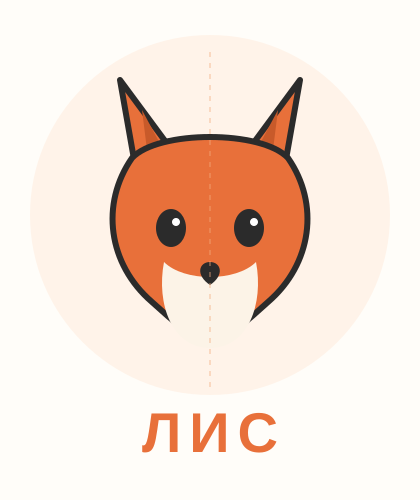

# Урок 6 — Перо и симметрия: логотип-маскот «Лиса» 🦊✒️

**Модуль 3 · Векторная графика · Урок 6 из 13 | 2 ак.ч. (1,5 часа)**

> 🔁 В начале — [разминка/повтор](повторение.md) (5 мин).
> 👨‍🏫 Сценарий с хронометражом — в [преподавателю.md](преподавателю.md).
> 🖼 Референсы маскотов и что показать — в [изображения.md](изображения.md) и в конце («Материалы»).
> ⚠️ Всё делаем **вручную**, без ИИ (рисуем пером и отражаем сами).
> 🎁 Хочешь ещё лого — загляни в [Копилку проектов](../ДОП-ЗАДАНИЯ-illustrator.md) (раздел «логотипы»).
> 🖨 **Трафареты для обводки пером** (распечатать и рисовать поверх): [разминка пера](трафареты/трафарет-разминка-пера.svg) и [трафарет «Лиса»](трафареты/трафарет-лиса.svg) — с точками, где кликать, и стрелками, куда тянуть усы.

> 🧭 **Как читать урок.** В уроке 5 мы «лепили» из фигур. Сегодня — **Перо в Illustrator** и большая хитрость дизайнеров: **симметрия через Отражение**. Рисуешь **половину** мордочки — вторая появляется **идеально ровной сама**. Идём одним сквозным примером — делаем **лого-маскот «Лиса»** 🦊 для канала/бренда. Это несложно и очень «вау». Каждый шаг расписан: что нажать, где кнопка (актуальный Illustrator, рус. интерфейс), что появится, зачем и типичная ошибка.

---

## 🎬 Что мы сделаем сегодня и что получим

**Задача:** нарисовать **пером половину** мордочки лисы, **отразить** её — получить симметричную голову, **склеить** половинки и добавить глаза, нос, ушки и белую мордочку. Выйдет чистый **лого-маскот** — как у игровых команд и блогеров.

**В итоге у тебя получится:** аккуратный **симметричный логотип** 🦊, который читается на любом размере (аватарка, футболка, баннер). Экспорт **SVG/PNG**.

**Главный навык урока:** **Перо в Illustrator** (точки, кривые, инструмент **«Опорная точка»** для угол↔кривая) + **Отражение (симметрия)** — рисуешь половину, получаешь целое. Это фирменный приём ровных логотипов.

> 💡 Секрет ровного маскота: **не рисуй обе стороны руками** — левая никогда не выйдет как правая. Рисуй **половину** и **отражай**. Симметрия = профессионально и быстро.

**🖼 Вот что должно получиться** (пунктир — ось симметрии):

---

## 🎯 Цель урока

К концу урока каждый ученик:
- Уверенно рисует **Пером** в Illustrator (угол — клик, кривая — клик-протяжка);
- Пользуется инструментом **«Опорная точка»** (`Shift+C`) — превращает угол в кривую и обратно;
- Делает **симметрию Отражением** (рисует половину → зеркальная копия);
- **Склеивает** половинки (Обработка контуров → Соединение);
- Добавляет детали (глаза, нос, ушки, мордочка) и **обводку** контура;
- **Экспортирует** логотип и проверяет читаемость маленьким;
- Понимает **как правильно / как НЕ надо**;
- *(9–11)* делает своего маскота и одноцветную версию.

---

## 🧭 Где что находится (перо, опорная точка, отражение)

- **«Перо» (Pen)** — слева, клавиша **`P`**. Клик — угловая точка, клик-протяжка — кривая (усы).
- **«Опорная точка»** — в группе с Пером (зажми иконку Пера — выпадут: Добавить/Удалить точку, **«Опорная точка»**), клавиша **`Shift+C`**. Тянет ус из угла (делает плавным) или кликает по гладкой точке (делает угол).
- **«Отражение» (Reflect)** — слева, в группе с «Поворот», клавиша **`O`**. Зеркалит объект относительно оси.
- **Направляющие (гайды):** включи линейки `Ctrl+R`, вытяни **вертикальную направляющую** на центр — это будет ось симметрии.
- **«Обработка контуров»** — `Окно → Обработка контуров` (склеим половинки: **Соединение**).
- **Заливка/обводка** — внизу панели инструментов.

> ⚠️ **Про старые уроки:** «Отражение» иногда зовут «Зеркало»; «Опорная точка» — «Преобразовать опорную точку». Смысл тот же. `Command` = `Ctrl` на Windows.

---

## Часть 1 — Ось симметрии и заготовка (6 минут)

1. **`Файл → Создать`** → RGB, пиксели, **800 × 800**.
2. **`Ctrl+R`** — линейки. Потяни от левой линейки **вертикальную направляющую** ровно на **центр (x = 400)**. Это **ось**, вокруг которой будем зеркалить.
3. *(удобно)* Найди простой референс мордочки лисы (см. [изображения.md](изображения.md)) — положи на отдельный слой полупрозрачно, чтобы обводить. Можно и без него.

**👀 Что видишь:** пустой квадрат с вертикальной линией по центру. Готовы рисовать половину.

> 💡 Мы рисуем **только правую половину** мордочки. Левую сделает Отражение — точь-в-точь.

---

## Часть 2 — 🦊 Половина мордочки Пером (16 минут)

Голова лисы — это «щёчки-треугольник» с двумя острыми ушами и узким подбородком. Рисуем **правую половину**: от центра-верха до центра-низа.

> 🖨 **Подсказка:** открой [трафарет «Лиса»](трафареты/трафарет-лиса.svg) — там мордочка размечена буквами A→B→…→J (где кликать) и оранжевыми стрелками (где тянуть ус). Можно распечатать и обводить, или подложить полупрозрачным слоем в Illustrator.

1. Возьми **«Перо»** (`P`). Начни в точке **на оси, вверху головы** (между будущими ушами).
2. Кликай, ведя контур по правой стороне:
   - вверх-вправо к **кончику правого уха** (острый угол — **просто клик**);
   - вниз к **впадине между ухом и щекой** (клик);
   - **щека** — здесь нужна дуга: ставь точку **клик-и-протяжкой** (плавный изгиб наружу);
   - вниз к **узкому подбородку на оси** (клик — острый кончик).
3. Дойдя до подбородка **на оси**, веди контур **вверх по самой оси** обратно к старту и **замкни** (клик по первой точке). `Enter`.
4. Залей **оранжевым #E8703A**, обводку убери.

**👀 Что получилось:** правая половина рыжей мордочки с ухом и щекой.

5. **Правка формы:** инструмент **«Опорная точка»** (`Shift+C`) — если щека вышла угловатой, **потяни за точку** — появится плавная дуга. Если ухо слишком «мягкое» — **кликни** по его точке, станет острым. Двигать сами точки — «Прямое выделение» (`A`).

> ⚠️ **Типичная ошибка:** рисовать сразу обе половины. Не надо! Рисуем **одну** — вторую даст зеркало. И следи, чтобы точки на оси лежали **ровно на направляющей**.

---

## Часть 3 — 🪞 Отражение: вторая половина сама (8 минут)

Вот она, магия симметрии.

1. Выдели правую половину (`V`).
2. Возьми **«Отражение»** (`O`).
3. **Зажми `Alt` и кликни ровно по вертикальной направляющей** (на оси). Откроется окно «Отражение».
4. Выбери ось **«Вертикальная»** → нажми **«Копировать»** (не «ОК»!).

**👀 Что произойдёт:** слева появится **зеркальная половина** — точь-в-точь как правая. Мордочка стала **целой и идеально симметричной**! 🦊

5. Выдели **обе половины** → **«Обработка контуров» → «Соединение»** — они сольются в **один силуэт** (шов по центру исчезнет).

**Ожидаемый результат:** цельная симметричная голова лисы одного цвета.

> 💡 **«Копировать» вместо «ОК»** — ключевой момент: «ОК» просто перевернёт оригинал, а «Копировать» создаст **вторую** половину. Запомни!

---

## Часть 4 — Детали мордочки (14 минут)

Теперь оживим лису. Детали тоже делаем **симметрично** (рисуй половину/центр — отражай).

1. **Внутренние ушки:** маленький тёмный треугольник в правом ухе → Отражением скопируй в левое. Цвет тёмно-рыжий **#C85A2A**.
2. **Белая мордочка (щёки/подбородок):** пером нарисуй правую белую «щёку-каплю» в нижней части → отрази влево → Соединение. Цвет **#FCF3E7**. Положи **поверх** оранжевой головы.
3. **Глаза:** два миндалевидных глаза (эллипс, сжать; или пером) — нарисуй один, отрази. Цвет тёмный **#2B2B2B**. Добавь белый блик-точку.
4. **Нос:** маленький треугольник/капля по центру на оси, тёмный. Он **на оси** — отражать не нужно.
5. Проверь **порядок слоёв:** голова снизу, белая мордочка выше, глаза/нос сверху.

**Ожидаемый результат:** узнаваемый лис-маскот с белой мордочкой и глазами. 🦊

> 💡 Всё, что **на оси** (нос, макушка), рисуем один раз. Всё, что **сбоку** (ухо, глаз, щека), — рисуем справа и **отражаем**. Тогда логотип идеально ровный.

---

## Часть 5 — Обводка-контур и имя (6 минут)

1. *(стильно)* Выдели голову → добавь **обводку** тёмную (`#2B2B2B`), толщина **6–10**, угол «скруглённый» — маскот получит «мультяшный» контур.
2. **Имя бренда:** «Текст» (`T`) под лисой — например, **ЛИС** или своё название канала, жирным.
3. Сгруппируй всё (`Ctrl+G`), назови **«лого Лиса»**.

**Ожидаемый результат:** законченный лого-маскот с именем.

---

## ✅ Как правильно / ❌ Как НЕ надо (симметричный маскот)

| ❌ Как НЕ надо | ✅ Как правильно |
|----------------|------------------|
| Рисовать обе стороны руками | Рисуй **половину** → **Отражение → Копировать** |
| Точки на оси «гуляют» | Класть их **ровно на направляющую** |
| В окне Отражения нажать «ОК» | Нажать **«Копировать»** (иначе не будет 2-й половины) |
| Оставить шов по центру | **Соединение** склеивает половинки в один силуэт |
| Острый кончик уха делать протяжкой | Острый угол = **клик**; дуга щеки = протяжка |
| Логотип из мелких деталей | Проверить, что **читается маленьким** (аватарка) |

> ⚠️ Главная ошибка — **нажать «ОК» вместо «Копировать»** при Отражении: оригинал просто перевернётся, второй половины не будет. Только «Копировать»!

---

## Часть 6 — Экспорт (5 минут)

1. **`Файл → Экспортировать → Экспортировать как…`** → **SVG** (вектор) и **PNG** (прозрачный фон, для аватарки).
2. Сохрани рабочий **`.ai`**.
3. **Проверка:** уменьши логотип до размера аватарки — **лиса узнаётся?** Значит, знак рабочий.

**Ожидаемый результат:** `лого-лиса.svg` + `лого-лиса.png` + `.ai`.

---

## 🎓 Часть 7 — Для 9–11: глубже (8 минут)

- **Свой маскот:** кот, медведь, сова, панда, робот — тем же методом (половина + Отражение).
- **Одноцветная версия** (силуэт): логотип должен работать и в один цвет (печать, штамп).
- **Негативное пространство:** спрячь деталь «в вырезе» (например, улыбка из фона) — приём дорогих лого.
- **Идеальные кривые:** почисти лишние точки, ровняй усы; включи `Просмотр → Привязка к точке`.
- **Варианты:** сделай знак в круге-бейдже и просто иконкой.

---

## 🧩 Для 5–7 классов (проще)

- Голову можно собрать **из фигур**: круг + два треугольника-уха (без пера). Главное — попробовать **Отражение** на глазах/ушах.
- Мордочку белую — простым эллипсом.
- Цвета берём готовые (учитель даёт палитру).

---

## 🏁 Итог урока (5 минут)

Сегодня сделали **симметричный лого-маскот**:

- ✅ **Перо в Illustrator:** угол — клик, дуга — протяжка, правка «Опорной точкой».
- ✅ **Ось симметрии** (вертикальная направляющая).
- ✅ **Отражение → Копировать** — вторая половина сама, идеально ровно.
- ✅ **Соединение** склеивает половинки в один силуэт.
- ✅ **Детали** (глаза/нос/ушки) симметрично + обводка-контур.
- ✅ **Экспорт** SVG/PNG, проверка «читается маленьким».

> 🏆 Ты умеешь делать ровные логотипы-маскоты! Дальше — **глянец и объём** (урок 7): нарисуем **сочный апельсин/каплю** с бликами через градиенты и Градиентную сетку.

> 🎤 **Блиц:** зачем рисовать половину? что нажать в окне Отражения? что склеивает половинки? что делает «Опорная точка»? почему логотип проверяют маленьким?

### 🎮 Викторина-закрепление

Открой **[викторина.html](викторина.html)** — вопросы про перо, отражение-симметрию и логотипы + смешные и «на подумать».

➡️ **Самостоятельная работа** (свой маскот другого зверя + комбо) — в [практике](практика.md).
🧰 **Трюки урока** (симметрия, чистое перо, одноцветный лого) — в [лайфхак.md](лайфхак.md).
🎁 **Ещё логотипы** (посложнее: Naruto, Марио, Юрский парк) — в [Копилке проектов](../ДОП-ЗАДАНИЯ-illustrator.md).

---

## 🔗 Материалы и ссылки к уроку

**🧰 Инструмент:** Adobe Illustrator (по лицензии класса), русский интерфейс.

**📥 Референсы (для вдохновения, НЕ копировать):**
- 🦊 **Маскоты/лого зверей:** поиск — *fox mascot logo*, *animal logo flat*, *geometric fox logo*.
- ✒️ **Тренажёр пера:** [The Bézier Game](https://bezier.method.ac/) — размять руку.
- 🅰️ **Шрифты:** [Google Fonts](https://fonts.google.com/) — жирные для имени.

**🎬 Вдохновение:** YouTube (рус.): *«лого маскот Illustrator»*, *«симметрия отражение Illustrator»*, *«перо иллюстратор»*.

**⚙️ Учителю:** заранее приготовить референс лисы (полупрозрачный слой), палитру и показать Отражение → «Копировать» вживую. Список — в [изображения.md](изображения.md).
