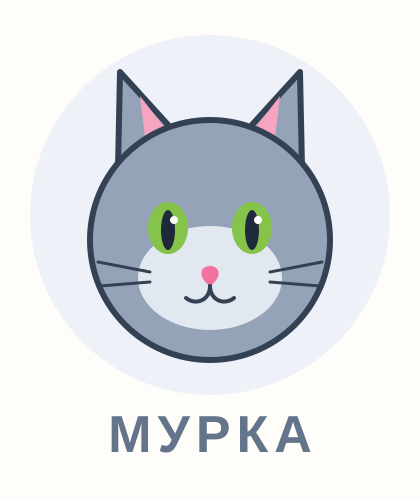

# Самостоятельная работа — Векторная графика, Урок 6

> 🧑‍🎓 Не повторяем «Лису»! Делаешь **своего** маскота другого зверя — через перо и симметрию.

---

## ✅ Задание 1 (для всех) — «Свой маскот-логотип» (новый вызов)

Сделай **лого-маскот** ДРУГОГО героя (не лиса), симметричного, через **Отражение**. Выбери **одного**:

- 🐱 **Кот** (ушки-треугольники, усы);
- 🦉 **Сова** (круглые глаза, ушки-кисточки);
- 🐻 **Медведь / панда** (круглые ушки);
- 🤖 **Робот** (квадратная голова, антенна);
- 🐸 **Лягушка** (глаза-пузыри сверху).

**🖼 Пример результата** (маскот-кот «Мурка» — тоже через симметрию):

**Обязательные условия:**
- [ ] Нарисована **половина** мордочки (пером или из фигур) и **отражена** (Отражение → «Копировать»);
- [ ] Половины **склеены** (Соединение), шва нет;
- [ ] Детали по бокам (глаза/ушки) — тоже **симметрично** (отражением);
- [ ] Логотип **читается маленьким** (проверь на аватарке);
- [ ] Экспорт **SVG + PNG**, сохранён **.ai**.

---

## 🔗 Задание 2 (комбо, уроки 3/5 + 6) — «Маскот в деле»

Свяжи с прошлыми уроками:
1. Помести своего маскота **в бейдж-круг** (как в уроке 2) или **на карточку/аватар** (Figma, урок 3).
2. Добавь имя канала/бренда и подбери единую палитру.

**Результат:** готовый «фирменный» аватар с маскотом.

---

## ⚡ Задание 3 (разминка-челлендж) — симметрия за 5 минут

**За 5 минут:** нарисуй **половину бабочки** (одно крыло пером или из фигур), поставь ось по центру и **отрази → Копировать**. Склей Соединением. Тренируем весь приём симметрии.

---

## 📋 Что проверяем

- [ ] Маскот — **другой зверь** (не урочная лиса);
- [ ] Есть **Отражение → Копировать** + **Соединение**;
- [ ] Детали симметричны, точки на оси ровные;
- [ ] Читается маленьким;
- [ ] Экспорт SVG + PNG + .ai;
- [ ] Сделано **«Комбо»** (маскот в бейдже/на аватаре).

## 🧩 Для 5–7 классов
- Голову собери **из фигур** (круг + треугольники), пером — только если хочется. Главное — попробовать **Отражение** на ушах/глазах.

## 🎓 Для 9–11 классов
- **Одноцветная** версия маскота (силуэт).
- **Негативное пространство** (деталь «в вырезе»).
- Возьми лого посложнее из [Копилки проектов](../ДОП-ЗАДАНИЯ-illustrator.md) (Марио / Юрский парк).

## 🖼 Галерея «Маскоты класса»
Сдай маскота — соберём «команду талисманов». Голосуем: **самый ровный** и **самый харизматичный** маскот.

## Что сдать
- `маскот_*.svg` + `маскот_*.png` + `.ai` (Задание 1) + маскот в бейдже/на аватаре (Задание 2).
