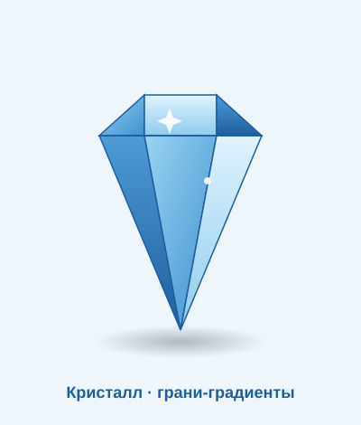

# Самостоятельная работа — Векторная графика, Урок 7

> 🧑‍🎓 Не повторяем каплю и апельсин! Делаешь **свой** глянцевый объект и качаешь градиенты/сетку.

---

## ✅ Задание 1 (для всех) — «Свой глянцевый объект» (новый вызов)

Сделай **объёмный блестящий объект** (ДРУГОЙ, не капля/апельсин). Выбери **один**:

- 💎 **Драгоценный камень** (грани — линейные градиенты, яркий блик);
- 🫧 **Мыльный пузырь** (прозрачные градиенты + радужный отлив + блик-дуга);
- 💡 **Лампочка** (стекло-градиент + свечение + блик);
- 🔮 **Волшебный шар / планета** (радиальный градиент + блик + рефлекс);
- 🍎 **Другой фрукт** (яблоко/вишня) через **Градиентную сетку**.

**🖼 Пример результата** (глянцевый кристалл — грани на линейных градиентах):

**Обязательные условия (чтобы был «вау»-глянец):**
- [ ] Использован **градиент** (радиальный и/или линейный, 3+ остановки);
- [ ] Есть **блик** (через прозрачную остановку — растворяется);
- [ ] **Один источник света** (блик и тень согласованы);
- [ ] Есть **тень под объектом** (мягкая, прозрачная);
- [ ] *(если объёмный шар/фрукт)* попробуй **Градиентную сетку**;
- [ ] Экспорт **PNG** (+ .ai).

---

## 🔗 Задание 2 (комбо, уроки 3/5 + 7) — «Глянцевая кнопка/иконка»

Свяжи с прошлым:
1. Возьми **иконку** (урок 5) или **карточку** (урок 3).
2. Придай ей **глянец**: радиальный градиент на подложке-кнопке + блик сверху + мягкая тень.
3. Получится «сочная» 3D-кнопка приложения.

**Результат:** плоская иконка превратилась в объёмную глянцевую кнопку.

---

## ⚡ Задание 3 (разминка-челлендж) — шар за 5 минут

**За 5 минут:** нарисуй круг → **радиальный градиент** (светлый центр → тёмный край) → «Градиентом» (`G`) уведи блик в верх-лево → добавь маленький белый блик-точку → тень под шаром. Плоский круг стал шаром! Тренируем весь приём объёма.

---

## 📋 Что проверяем

- [ ] Объект — **свой** (не урочные капля/апельсин);
- [ ] Есть **градиент** (3+ остановки) и **растворяющийся блик**;
- [ ] **Один источник света** + **тень** под объектом;
- [ ] Пробовал **Градиентную сетку** (если шар/фрукт);
- [ ] Экспорт PNG + .ai;
- [ ] Сделано **«Комбо»** (глянцевая кнопка/иконка).

## 🧩 Для 5–7 классов
- Достаточно **шара или капли**: радиальный градиент + один белый блик + тень. Сетку — по желанию (только авто «К центру»).

## 🎓 Для 9–11 классов
- **Произвольный градиент (Freeform)** или **много узлов сетки** — тонкие переходы, рефлекс снизу.
- Прозрачный **стеклянный** объект (пузырь/лампа) с двойным бликом.
- Оживи объект (глазки/ротик) — глянцевый персонаж.

## 🖼 Галерея «Витрина глянца»
Сдай объект — соберём «блестящую витрину». Голосуем: **самый реалистичный объём** и **самый сочный блеск**.

## Что сдать
- `глянец_*.png` (+ `.ai`) (Задание 1) + глянцевая кнопка/иконка (Задание 2).
