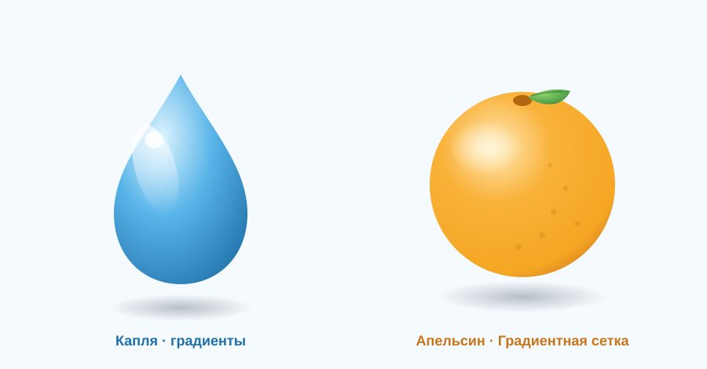

# Урок 7 — Градиенты и Градиентная сетка: глянец и объём 💧🍊

**Модуль 3 · Векторная графика · Урок 7 из 13 | 2 ак.ч. (1,5 часа)**

> 🔁 В начале — [разминка/повтор](повторение.md) (5 мин).
> 👨‍🏫 Сценарий с хронометражом — в [преподавателю.md](преподавателю.md).
> 🖼 Референсы глянцевых объектов и что показать — в [изображения.md](изображения.md) и в конце («Материалы»).
> ⚠️ Всё делаем **вручную**, без ИИ.
> 🎁 Ещё глянцевые проекты — в [Копилке проектов](../ДОП-ЗАДАНИЯ-illustrator.md) (раздел «Глянец и объём»).

> 🧭 **Как читать урок.** До этого наши работы были **плоские** (флэт). Сегодня научимся делать **объём и глянец** — чтобы объект выглядел как настоящий, с бликами и переливами. Два инструмента: **Градиент** (плавный переход цвета) и **Градиентная сетка** (Gradient Mesh) — «супер-градиент», который лепит объём, как из пластилина. Идём двумя проектами: сначала **глянцевая капля воды** 💧 (на градиентах — получится у всех), потом **сочный 3D-апельсин** 🍊 (на сетке). Каждый шаг расписан: что нажать, где кнопка (актуальный Illustrator, рус. интерфейс), что появится, зачем и типичная ошибка.

---

## 🎬 Что мы сделаем сегодня и что получим

**Задача:** превратить плоские фигуры в **объёмные и блестящие**. Сделаем **каплю воды** с бликом и тенью (радиальный градиент + светлые блики), а затем **апельсин**, которому **Градиентная сетка** придаст настоящий 3D-объём (светлый бок, тёмный бок, блик).

**В итоге у тебя получится:** глянцевая **капля** 💧 и сочный объёмный **апельсин** 🍊 — как в рекламе. Экспорт **SVG/PNG**.

**Главный навык урока:** **Градиенты** (линейный/радиальный, много остановок, прозрачные остановки для бликов) + **Градиентная сетка** (сетка цветовых узлов, которой «рисуют» объём). Это то, что превращает плоскую иконку в реалистичный объект.

> 💡 Секрет объёма: **свет с одной стороны — тень с другой**. Радиальный градиент (светлый центр → тёмный край) сам создаёт «шар». А блик (маленькое яркое пятно) добавляет «глянец мокрого».

**🖼 Вот что должно получиться:**

---

## 🧭 Где что находится (градиент и сетка)

- **Панель «Градиент»** — `Окно → Градиент` (`Ctrl+F9`). Там: тип (**Линейный / Радиальный / Произвольный**), **ползунок с остановками** (color stops), у каждой остановки — **цвет**, **позиция**, **непрозрачность**; **угол** и «средняя точка».
- **Инструмент «Градиент»** (`G`) — слева; им **тянут** по объекту, задавая направление и длину перехода.
- **Градиентная сетка:** меню **`Объект → Создать сетку градиента…`** (Create Gradient Mesh). Инструмент **«Сетка»** (`U`) — добавляет узлы сетки.
- **Узлы сетки** красят так: выбери узел «Прямым выделением» (`A`) → задай цвет.
- **Параллельный контур** (для бликов): `Объект → Контур → Создать параллельный контур…` (Offset Path).
- **Прозрачность / режимы наложения** — `Окно → Прозрачность` (Умножение, Экран…).

> ⚠️ **Про старые уроки:** «панель Навигатора» = **«Обработка контуров»**; «Минус спереди» = **«Минус верхний»**; `Command` = **`Ctrl`**. Gradient Mesh иногда зовут «сеткой градиента» — это одно и то же.

---

## Часть 1 — 🎮 Приручаем градиент (10 минут)

Тренируемся на круге: плоский → объёмный.

1. **«Эллипс»** (`L`), с `Shift` → круг **200 × 200**, залей любым цветом.
2. Открой **«Градиент»** (`Ctrl+F9`) → нажми образец градиента → тип **Радиальный**.
3. На ползунке **две остановки**: левую (центр) сделай **светлой**, правую (край) — **тёмной** того же цвета. 👀 Круг стал **шаром**!
4. **Двигаем свет:** возьми «Градиент» (`G`) и кликни-потяни из **верхнего-левого** угла шара — светлое пятно (блик от лампы) уедет туда. Так задаётся направление света.
5. **Добавь остановку:** кликни **под ползунком** посередине — появится третья остановка (промежуточный тон). Плавнее переход.

**👀 Вывод:** радиальный градиент = **объём шара**; направление тянем инструментом «Градиент».

> 💡 **Линейный** градиент — переход по прямой (небо, стекло, металл). **Радиальный** — из центра (шары, блики). **Прозрачная остановка** (непрозрачность 0) — для бликов, которые «растворяются».

---

## Часть 2 — 💧 Глянцевая капля (на градиентах) (18 минут)

### Шаг 1. Форма капли

1. **«Эллипс»** (`L`) → овал **120 × 160**.
2. «Прямое выделение» (`A`) → выбери **верхнюю** точку → **потяни вверх**, вытянув «носик».
3. Точка выделена → вверху на панели нажми **«Преобразовать выделенные опорные точки в углы»** — верх станет **острым**. Готова капля.

### Шаг 2. Тело — радиальный градиент

1. Убери обводку. Залей **радиальным** градиентом из **3 остановок** (вода): светло-голубой **#DCF3FF** → голубой **#58B4E8** → тёмно-синий **#1E6FA8**.
2. «Градиент» (`G`) → потяни свет в **верх-лево** (оттуда «светит»).

### Шаг 3. Блик (прозрачный градиент)

1. Нарисуй **маленький овал** в верхней части капли, залей **белым**.
2. В «Градиент» сделай его **линейным белым** с двумя остановками: верх **непрозрачность 60**, низ **непрозрачность 0** — блик мягко **растворится**. Это «мокрый глянец».
3. *(по желанию)* Второй маленький **круглый белый блик-точка** сверху — самый яркий (непрозрачность 90).

### Шаг 4. Тень

1. Под каплей (и **позади** всех фигур, `Shift+Ctrl+[`) — плоский **эллипс**, залей **радиальным** серым→прозрачным. Это тень на столе.

**Ожидаемый результат:** капля выглядит **объёмной и мокрой**, с бликом и тенью. 💧

> 💡 **Правило глянца:** тёмный низ (тело в тени) + **яркий блик сверху** + мягкая **тень под объектом**. Три вещи — и плоское становится «настоящим».

---

## Часть 3 — 🍊 Сочный апельсин (Градиентная сетка) (16 минут)

Теперь — **новый мощный инструмент**. Градиент даёт «ровный» объём, а **сетка** позволяет **лепить свет и тень в любом месте**.

### Шаг 1. Автосетка

1. **«Эллипс»** → круг **220 × 220**, залей оранжевым **#F5A623**.
2. Меню **`Объект → Создать сетку градиента…`**. Поставь: **Строки 4, Столбцы 4**, «Вид» → **К центру**, «Светлые участки» **60%** → ОК.

**👀 Что произойдёт:** по кругу появится **сетка узлов**, а в центре — светлое пятно. Уже похоже на шар!

### Шаг 2. Лепим объём (красим узлы)

1. Инструмент **«Сетка»** (`U`) или «Прямое выделение» (`A`) — кликни **узел в правом-нижнем** углу шара → задай **тёмно-оранжевый #C8741A** (сторона в тени).
2. Кликни **узел вверху-слева** → **светло-оранжевый #FFD98A** (освещённый бок).
3. **Блик:** кликни самый верх-левый узел → почти белый **#FFF3D6**.

**👀 Что произойдёт:** апельсин стал **объёмным** — свет плавно перетекает в тень. Это и есть магия сетки: цвет «прилипает» к узлам и растекается.

### Шаг 3. Детали апельсина

1. **Кожура-текстура:** мелкие тёмные точки-«поры» по поверхности (крошечные эллипсы, непрозрачность ~30%).
2. **Вмятинка сверху** (где был черенок): маленький тёмный эллипс + «звёздочка» листика.
3. **Листик:** зелёный лист (эллипс → заострить точки `A`), радиальный градиент зелёного, тонкая прожилка.

**Ожидаемый результат:** сочный объёмный апельсин с листиком. 🍊

> 💡 **Сетку не переусложняй:** 4×4 узла хватает. Красишь 3–4 узла (свет/тень/блик) — и объём готов. Больше узлов = больше контроля, но и больше возни.

---

## ✅ Как правильно / ❌ Как НЕ надо (глянец и объём)

| ❌ Как НЕ надо | ✅ Как правильно |
|----------------|------------------|
| Плоская заливка «как настоящее» | **Градиент**: свет с одной стороны, тень с другой |
| Блик — большое белое пятно | Маленький **яркий** блик + мягкий (прозрачная остановка) |
| Свет и блик в разные стороны | **Один источник света** (обычно верх-лево) |
| Объект «висит» без тени | Мягкая **тень под объектом** (радиальная, прозрачная) |
| Сетка 20×20 — не разобраться | Сетка **4×4**, красим 3–4 узла |
| Тянуть градиент наугад | «Градиент» (`G`) — **тянуть от света** |

> ⚠️ Главная ошибка — **свет отовсюду** (блик, светлый бок и тень не согласованы). Реши, **откуда светит лампа**, и держи всё одинаково.

---

## Часть 4 — Экспорт (5 минут)

1. **`Файл → Экспортировать → Экспортировать как…`** → **PNG** (для картинки) и/или **SVG** (вектор).
2. Сохрани **`.ai`**.

> 💡 **Важно про сетку и SVG:** Градиентная сетка в SVG/PNG выглядит отлично, но при экспорте в **очень старые** форматы может «рассыпаться». Для веба — PNG надёжнее; для печати — `.ai`/PDF.

---

## 🎓 Часть 5 — Для 9–11: глубже (8 минут)

- **Произвольный градиент (Freeform)** — расставляй цветные точки где угодно по фигуре (как упрощённая сетка).
- **Больше узлов сетки** — добавь узлы «Сеткой» (`U`) там, где нужен тонкий переход (щёчка блика, рефлекс снизу).
- **Рефлекс** (отражённый свет): чуть светлее у **нижнего** края в тени — объект «оживает».
- **Стекло/пузырь:** прозрачные градиенты + блик-дуга сверху и снизу.
- **Оживи объект:** глазки и ротик (как капля-персонаж из [Копилки](../ДОП-ЗАДАНИЯ-illustrator.md)).

---

## 🧩 Для 5–7 классов (проще)

- Делаем **только каплю** на радиальном градиенте + один белый блик + тень. Этого достаточно для «вау».
- Апельсин — **без ручной сетки**: просто «Создать сетку градиента» с «К центру» (авто-объём), красить узлы по желанию.
- Цвета берём готовые (учитель даёт палитру).

---

## 🏁 Итог урока (5 минут)

Сегодня научили фигуры **светиться и быть объёмными**:

- ✅ **Градиент:** линейный/радиальный, много остановок, **прозрачные** остановки для бликов.
- ✅ **Направление света** — тянем инструментом «Градиент» (`G`).
- ✅ **Глянец:** тёмный низ + яркий блик + мягкая тень.
- ✅ **Градиентная сетка:** авто-объём (К центру) + красим узлы (свет/тень/блик).
- ✅ **Экспорт** PNG/SVG (+ .ai).

> 🏆 Теперь ты умеешь делать реалистичные объёмные объекты! Дальше — **персонаж из фигур** (урок 8): соберём милого маскота (Тоторо/Йети/Миньон) с помощью всего, что уже знаем.

> 🎤 **Блиц:** какой градиент делает шар? как сделать растворяющийся блик? откуда «светит лампа»? что делает Градиентная сетка? зачем тень под объектом?

### 🎮 Викторина-закрепление

Открой **[викторина.html](викторина.html)** — вопросы про градиенты, блики, тень и Градиентную сетку + смешные и «на подумать».

➡️ **Самостоятельная работа** (свой глянцевый объект + комбо) — в [практике](практика.md).
🧰 **Трюки урока** (глянец, свет, сетка) — в [лайфхак.md](лайфхак.md).

---

## 🔗 Материалы и ссылки к уроку

**🧰 Инструмент:** Adobe Illustrator (по лицензии класса), русский интерфейс.

**📥 Референсы (для вдохновения, НЕ копировать):**
- 💧 **Глянцевые объекты:** поиск — *glossy vector icon*, *water drop vector*, *3d fruit vector gradient mesh*.
- 🌈 **Палитры:** [Coolors](https://coolors.co/), [uiGradients](https://uigradients.com/).
- 🎁 **Готовые туториалы** (капля, леденец, звёздочки, очки): [Копилка проектов](../ДОП-ЗАДАНИЯ-illustrator.md).

**🎬 Вдохновение:** YouTube (рус.): *«градиентная сетка Illustrator»*, *«глянцевая иконка Illustrator»*, *«gradient mesh апельсин»*.

**⚙️ Учителю:** заранее показать «плоский круг → шар радиальным градиентом» и авто-сетку на проекторе; приготовить палитру. Список — в [изображения.md](изображения.md).
