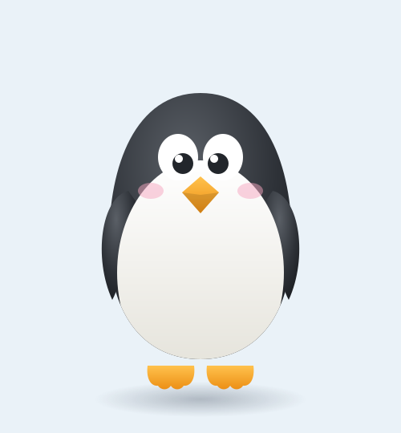

# Урок 8 — Персонаж из фигур: кавайный пингвинёнок 🐧✨

**Модуль 3 · Векторная графика · Урок 8 из 13 | 2 ак.ч. (1,5 часа)**

> 🔁 В начале — [разминка/повтор](повторение.md) (5 мин).
> 👨‍🏫 Сценарий с хронометражом — в [преподавателю.md](преподавателю.md).
> 🖼 Референсы персонажей и что показать — в [изображения.md](изображения.md) и в конце («Материалы»).
> ⚠️ Всё делаем **вручную**, без ИИ.
> 🎁 Ещё персонажи (йети, олень, монстрики) — в [Копилке проектов](../ДОП-ЗАДАНИЯ-illustrator.md) (раздел «Персонажи»).

> 🧭 **Как читать урок.** Сегодня — **свой персонаж-маскот**! Секрет: милого героя **не рисуют «от руки»** — его **собирают из простых фигур** (кругов и овалов). Делаем кавайного **пингвинёнка** 🐧 из одних овалов, а раскрасим градиентами. Каждый шаг расписан **до кнопки**: что нажать, где находится, что появится, зачем и типичная ошибка. Идём по **точным размерам в пикселях** — их удобно вводить, кликнув инструментом один раз (см. ниже).

---

## 🎬 Что мы сделаем сегодня и что получим

**Задача:** собрать **кавайного пингвинёнка** только из **кругов и овалов**: тело-яйцо, белый животик, крылья, лапки, большие глаза и клювик. Раскрасить **градиентами** для объёма и добавить «мимими»: румянец, блики в глазах.

**В итоге у тебя получится:** милейший **персонаж-маскот** 🐧, которого не стыдно в аватарку/стикер. Экспорт **SVG/PNG**.

**Главный навык урока:** **построение персонажа из простых фигур** + **симметрия Отражением** + **обрезка деталей** (Пересечение) + **цвет градиентами**. Так рисуют почти всех мультяшных героев.

> 💡 Секрет кавая: **круглое + большое = милое**. Большая голова, огромные глаза, короткие лапки, мягкие формы. Никаких острых углов.

**🖼 Вот что должно получиться:**

---

## 🧭 Где что находится (базовые приёмы Illustrator — пригодятся весь урок)

Прочитай раз — дальше буду ссылаться коротко.

- **🅰️ Нарисовать фигуру точного размера.** Возьми **«Эллипс»** (панель инструментов **слева**, `L`; если не видно — **зажми** иконку «Прямоугольник» `M`, выпадет группа, там «Эллипс»). **Один клик** по холсту (не тяни!) → откроется окошко **«Эллипс»** с полями **Ширина/Высота** → впиши числа → ОК. Появится ровно такой овал.
- **🎨 Задать цвет заливки (hex).** Внизу панели инструментов — **два квадрата**: верхний **Заливка**, за ним **Обводка**. **Двойной клик** по «Заливке» → палитра **«Палитра цветов»**, внизу поле **`#`** → впиши код (напр. `2E3238`) → ОК.
- **🚫 Убрать обводку.** Кликни квадрат **«Обводка»** (чтобы он был спереди) → внизу нажми значок **«Нет»** (белый квадрат с красной чертой ⃠). Или клавиша **`/`**.
- **↔️ Выровнять по центру.** `Окно → Выравнивание` (`Shift+F7`). Выдели две фигуры → кнопки **«Горизонтальное выравнивание по центру»** и **«Вертикальное…»**. *(включи `Просмотр → Быстрые направляющие` `Ctrl+U` — фигуры будут «прилипать» к центру сами.)*
- **📋 Копия на том же месте:** `Ctrl+C`, затем **`Ctrl+F`** (вставить **впереди**, точно поверх оригинала).
- **🧩 Обработка контуров:** `Окно → Обработка контуров` (`Shift+Ctrl+F9`). Верхний ряд «Режимы фигур»: **1 Соединение**, **2 Минус верхний**, **3 Пересечение**, 4 Исключение.
- **📚 Порядок (кто впереди):** `Ctrl+]` вперёд, `Ctrl+[` назад, `Shift+Ctrl+]` на самый верх, `Shift+Ctrl+[` в самый низ.
- **🪞 Отражение (симметрия):** инструмент **«Отражение»** (`O`, в группе с «Поворот» `R`).

---

## Часть 1 — Тело и животик (16 минут)

### Шаг 1. Тело-яйцо

1. **«Эллипс»** (`L`) → **один клик** по холсту → впиши **Ширина 240, Высота 300** → ОК. 👀 Появился овал.
2. **Цвет:** двойной клик по «Заливке» → впиши `#` **2E3238** (тёмно-серый) → ОК. **Обводку убери** (`/`).
3. **Форма яйца:** возьми **«Прямое выделение»** (`A`, **белая** стрелка) → кликни по **верхней** точке овала (она подсветится) → **дважды нажми `↑`** на клавиатуре штук 20 раз (или тяни вверх), чтобы макушка стала **чуть выше и у́же**. 👀 Овал превратился в «яйцо» — у пингвина голова и тело одно целое.

> ⚠️ **Ошибка:** тянешь «Выделением» (`V`, чёрная стрелка) — двигается **весь** овал. Точку тянет только **белая** стрелка (`A`).

### Шаг 2. Белый животик (обрезаем «Пересечением»)

1. **«Эллипс»** (`L`) → клик → **Ширина 150, Высота 210** → ОК. Залей **#F7F6F1** (почти белый).
2. Поставь животик **по центру тела и пониже** (двигай «Выделением» `V`; по центру поможет `Ctrl+U` + Выравнивание). Часть животика **торчит** за тело — это нормально, сейчас обрежем.
3. **Обрезаем по телу.** Выдели **тело** (`V`) → `Ctrl+C`, `Ctrl+F` (копия точно поверх) → `Shift+Ctrl+]` (копия — на самый верх).
4. Теперь выдели **эту копию тела + животик** (кликни копию, зажми `Shift`, кликни животик).
5. На панели **«Обработка контуров»** нажми **3-ю кнопку верхнего ряда — «Пересечение»**. 👀 От животика останется только та часть, что **была внутри тела** — ровный белый живот без торчащих краёв. 🐧

> 💡 **Почему копия тела:** «Пересечение» оставляет **общую** зону двух фигур. Копия тела работает как «трафарет-нож». Держи ещё одну копию тела в сторонке — пригодится для крыльев.

> ⚠️ **Ошибка:** нажать «Пересечение», выделив животик и **само** тело (не копию) — тогда тело исчезнет. Режем **копией**, оригинал тела не трогаем.

---

## Часть 2 — Крылья и лапки (симметрия) (16 минут)

### Крылья (обрезка + Отражение)

1. **«Эллипс»** (`L`) → клик → **Ширина 55, Высота 150** → ОК. Залей как тело **#2E3238**.
2. **Наклони:** «Выделением» (`V`) выдели крыло, наведи курсор **чуть за угол** рамки — появится **изогнутая стрелка** ↻ — поверни примерно на **−15°** (наклон «к телу»). Поставь крыло на **левый бок**, край заходит на тело.
3. **Обрежь по телу** (как животик): сделай **копию тела** (`Ctrl+C`→`Ctrl+F`→`Shift+Ctrl+]`) → выдели копию + крыло → **«Пересечение»** (3-я кнопка). 👀 Крыло аккуратно «прилегло» к телу.
4. **Второе крыло — Отражением:**
   - Выдели готовое левое крыло (`V`).
   - Возьми **«Отражение»** (`O`).
   - **Зажми `Alt` и кликни точно по вертикальной середине тела** (`Ctrl+U` поможет поймать центр — появится подпись «центр»). Откроется окно **«Отражение»**.
   - Выбери **Ось: Вертикальная**, угол **90°** → нажми **«Копировать»** (не «ОК»!).
   - 👀 Справа появилось **зеркальное** крыло, ровно напротив левого.

> ⚠️ **Ошибка:** нажать **«ОК»** вместо **«Копировать»** — тогда крыло просто перевернётся на месте, второго не будет. Только **«Копировать»**.

### Лапки (Соединение + Отражение)

1. Лапка из **3 овалов-пальчиков:** «Эллипс» → **34 × 16** каждый, оранжевый **#F6A821**. Разложи их **веером** внахлёст (средний прямо, боковые чуть в стороны).
2. Выдели все три (рамкой `V`) → на «Обработке контуров» нажми **1-ю кнопку — «Соединение»**. 👀 Три овала слились в **одну перепончатую лапку**.
3. Поставь лапку **под тело** слева-по центру. **Отрази** её (`O` → `Alt`-клик по центру тела → «Вертикальная» → **«Копировать»**) — вторая лапка справа.
4. Выдели обе лапки → `Ctrl+[` пару раз, чтобы они ушли **за тело** (торчат только «носочки»).

**Ожидаемый результат:** пингвинёнок с симметричными крыльями и лапками.

> 💡 **Симметрия = половина работы.** Парную деталь рисуешь **один раз** и отражаешь — герой выходит идеально ровным.

---

## Часть 3 — Лицо: глаза и клюв (14 минут)

Кавай живёт в глазах — делаем их **большими**.

### Глаза (3 круга + Отражение)

1. **Белок:** «Эллипс» → **50 × 58**, белый **#FFFFFF**.
2. **Зрачок:** «Эллипс» → **26 × 26** (`Shift` при рисовании = ровный круг), тёмный **#22262B**. Положи **поверх** белка и **сдвинь чуть вниз-к центру** — взгляд станет «ошеломлённо-милым».
3. **Блик:** «Эллипс» → **10 × 10**, белый, на зрачок сверху-слева.
4. Выдели все три (рамкой) → **`Ctrl+G`** (сгруппируй в один «глаз»).
5. Поставь глаз на «лицо» **слева от центра** (примерно на уровне верхней трети тела).
6. **Второй глаз — Отражением:** `O` → `Alt`-клик по центру тела → «Вертикальная» → **«Копировать»**. 👀 Два одинаковых глаза, близко посаженные.

> 💡 Группируем глаз **до** отражения — тогда скопируется весь глаз (белок + зрачок + блик) целиком.

### Клюв

1. **«Эллипс»** → **44 × 32**, оранжевый **#F6A821**. Поставь **между глаз, пониже**.
2. **«Прямым выделением»** (`A`) кликни **нижнюю** точку овала → потяни её **вниз** на ~10 пикс. Точка выделена → вверху на **панели управления** нажми **«Преобразовать выделенные опорные точки в углы»** (значок «уголок») → низ клюва станет **острым**. 👀 Получился клювик-ромбик.

### Мимими-детали

1. **Румянец:** «Эллипс» → **32 × 20**, розовый **#F6A5C0**. Поставь под левым глазом. В панели **«Прозрачность»** (`Shift+Ctrl+F10`) поставь **непрозрачность 50%**. **Отрази** на правую щёку (`O` → «Копировать»).

**Ожидаемый результат:** мордочка ожила — большие блестящие глаза, клювик, румянец. 🥰

> ⚠️ **Ошибка:** маленькие глаза-точки — не мило. Кавай = **большие глаза с бликом**, не жалей размера (у нас глаз почти как ⅓ ширины тела).

---

## Часть 4 — Цвет и объём (градиенты) (12 минут)

Оживим героя объёмом (приём из урока 7). Открой панель **«Градиент»** (`Окно → Градиент`, `Ctrl+F9`).

### Тело — радиальный градиент

1. Выдели **тело** (`V`).
2. В панели «Градиент» кликни **миниатюру градиента** (заливка станет градиентной) → в списке **«Тип»** выбери **Радиальный**.
3. На **ползунке градиента** — две **остановки** (квадратики снизу). **Двойной клик** по **левой** → цвет **#4A4E54** (посветлее). Двойной клик по **правой** → **#1C1F23** (потемнее).
4. Возьми инструмент **«Градиент»** (`G`) и **протяни** по телу из **верх-лева вниз-вправо** — светлое пятно (блик от лампы) уедет наверх. 👀 Тело стало **объёмным шаром**.

### Животик, клюв, тень

1. **Животик:** тем же способом — радиальный/линейный **белый → светло-серый** (низ чуть темнее), «пузико» округлится.
2. **Клюв:** линейный **#FFD36A → #EF9A1C** (светлее сверху).
3. **Тень под лапками:** «Эллипс» → **~180 × 30**, залей **радиальным** серым, где **правая** остановка — **непрозрачность 0** (двойной клик по остановке → внизу поле «Непрозрачность» = 0). Уведи тень **в самый низ** (`Shift+Ctrl+[`), под лапки.
4. *(по желанию)* Клюву/глазам — `Эффект → Стилизация → **Тень**`: в окне поставь **Смещение X 0, Y 0**, размытие ~2, непрозрачность ~30% — лёгкая обводка-глубина.

**Ожидаемый результат:** пингвинёнок объёмный, мягкий и «настоящий». ✨

> ⚠️ **Ошибка:** блик тянешь в одну сторону на теле, а тень кладёшь в другую — «свет отовсюду». Реши, **откуда лампа** (у нас верх-лево), и держи это на всех деталях.

---

## ✅ Как правильно / ❌ Как НЕ надо (персонаж из фигур)

| ❌ Как НЕ надо | ✅ Как правильно |
|----------------|------------------|
| Рисовать героя «от руки» пером | Собирать из **кругов и овалов** (точный размер — клик + ввод) |
| Деталь торчит за тело | **Обрезать** копией тела через **«Пересечение»** (3-я кнопка) |
| Левое крыло ≠ правое | **Отражение (`O`) → `Alt`-клик по центру → «Копировать»** |
| Нажать «ОК» вместо «Копировать» | Только **«Копировать»** — иначе не будет второй половины |
| Маленькие глаза-точки | **Большие глаза + блик** (кавай) |
| Плоская заливка | **Радиальный градиент** + тень (объём) |

> ⚠️ Главная ошибка — **мелкие глаза и острые формы**: выходит «злой». Кавай = крупная голова, большие блестящие глаза, скруглённое всё.

---

## Часть 5 — Экспорт (5 минут)

1. **`Файл → Сохранить как`** → формат **Adobe Illustrator (.ai)** — рабочий файл со всеми фигурами.
2. **`Файл → Экспортировать → Экспортировать как…`** → внизу выбери **PNG** (стикер, аватарка — прозрачный фон) → «Экспорт» → в окне «Параметры» разрешение **72–150 ppi** → ОК.
3. Для веба/чёткого вектора — тем же путём выбери **SVG**.

> 💡 Набор эмоций: сделай **копию** всего пингвина, поменяй **только глаза/клюв** (радость, сон, удивление) — получишь стикерпак из одного героя.

---

## 🎓 Часть 6 — Для 9–11: глубже (8 минут)

- **Градиентная сетка** на теле/крыльях (`Объект → Создать сетку градиента`, 4×4) — мягкие переливы (из урока 7).
- **Текстура перьев** на животе: ряд мелких «капель» → скопировать животик и обрезать по нему («Пересечение»).
- **Своя поза/аксессуар:** шарфик, шапочка, кубик льда, рыбка в клюве.
- **Набор эмоций** (стикерпак): радость, грусть, сон, удивление — меняя глаза/бровки.
- **Свой зверь:** тем же методом — котик, сова, лисёнок, монстрик.

---

## 🧩 Для 5–7 классов (проще)

- Делаем в **плоском цвете** (без градиентов) — уже мило.
- Крылья/лапки — **простыми овалами сверху** (без обрезки «Пересечением»): нарисовал овал-крыло и положил на бок.
- Обязательно попробовать **Отражение** для глаз (симметрия) — это легко и «вау».

---

## 🏁 Итог урока (5 минут)

Сегодня собрали **своего персонажа** из простых фигур:

- ✅ **Из кругов и овалов** (точный размер: клик инструментом + ввод Ш×В).
- ✅ **Обрезка** деталей по телу — копия тела + **«Пересечение»**.
- ✅ **Соединение** (3 овала → лапка).
- ✅ **Симметрия** — «Отражение → **Копировать**» (крылья, лапки, глаза).
- ✅ **Объём** — радиальный градиент (тело, животик, клюв) + мягкая тень.

> 🏆 Ты собрал персонажа целиком из фигур — так рисуют почти всех мультгероев! Дальше (урок 9) — **эффекты**: призраки и звёздочки через Зигзаг и Втягивание.

> 🎤 **Блиц:** как нарисовать овал точного размера? как обрезать деталь по телу? какая кнопка «Пересечение»? почему «Копировать», а не «ОК»? чем красили тело?

### 🎮 Викторина-закрепление

Открой **[викторина.html](викторина.html)** — вопросы про построение из фигур, обрезку, симметрию и кавай + смешные и «на подумать».

➡️ **Самостоятельная работа** (свой зверь-маскот + комбо) — в [практике](практика.md).
🧰 **Трюки урока** (фигуры, обрезка, кавай) — в [лайфхак.md](лайфхак.md).

---

## 🔗 Материалы и ссылки к уроку

**🧰 Инструмент:** Adobe Illustrator (по лицензии класса), русский интерфейс.

**📥 Референсы (для вдохновения, НЕ копировать):**
- 🐧 **Кавайные персонажи:** поиск — *cute vector penguin*, *kawaii character flat*, *animal mascot from shapes*.
- 🌈 **Палитры:** [Coolors](https://coolors.co/).
- 🎁 **Готовые туториалы** (пингвин, йети, олень, монстрики): [Копилка проектов](../ДОП-ЗАДАНИЯ-illustrator.md).

**🎬 Вдохновение:** YouTube (рус.): *«персонаж из фигур Illustrator»*, *«кавайный персонаж иллюстратор»*, *«пингвин Illustrator»*.

**⚙️ Учителю:** показать на проекторе «клик → ввод размера», обрезку «Пересечением» и «Отражение → Копировать»; приготовить палитру. Список — в [изображения.md](изображения.md).
